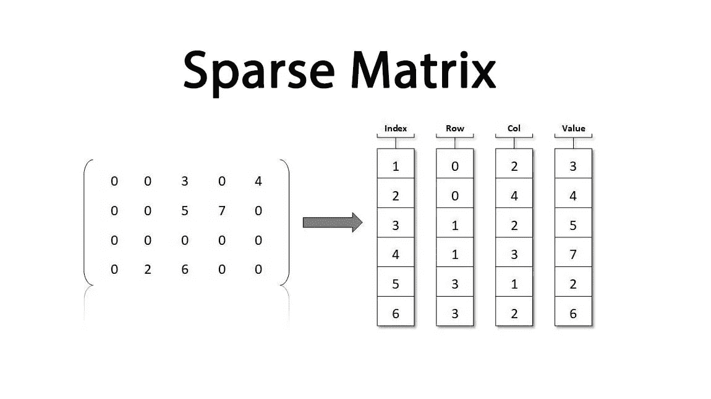
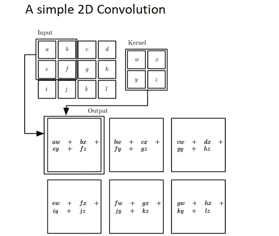
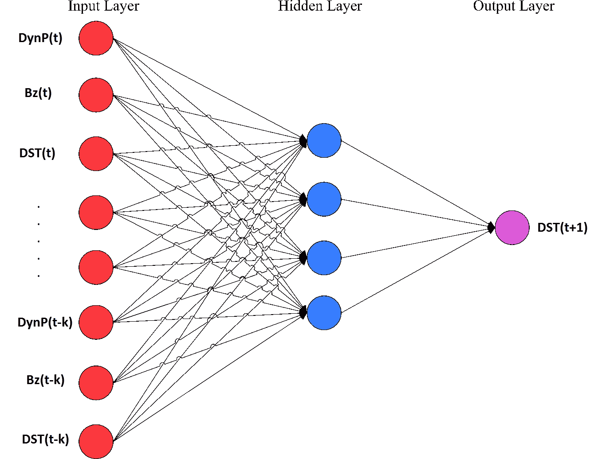
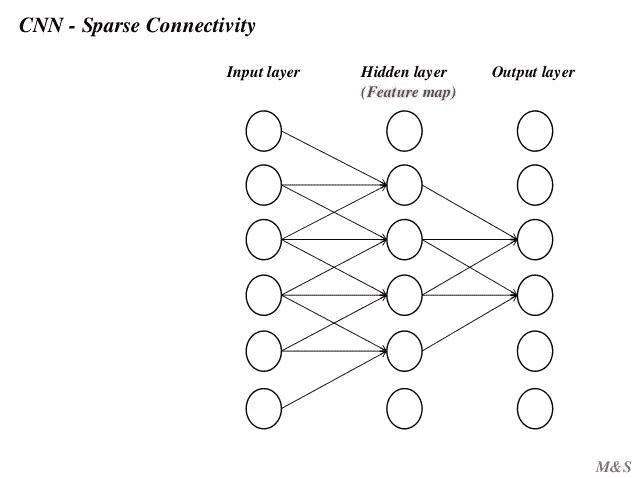
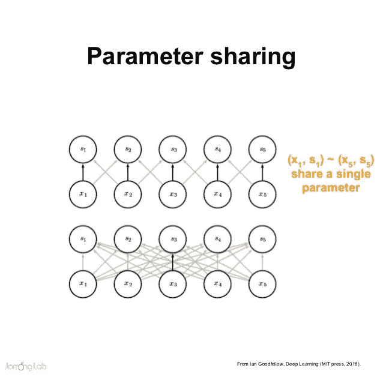

# 卷积网络简介

> 原文：<https://medium.com/nerd-for-tech/convolutional-networks-b54335f4e21f?source=collection_archive---------14----------------------->

## 卷积神经网络或 CNN

卷积网络或卷积神经网络也称为 CNN，是一种特殊类型的神经网络，用于处理具有网格状拓扑结构的数据。例如，图像数据可以表示为 2d 网格像素。

**图像的二维像素表示**

CNN 采用了一种叫做卷积**的数学运算。卷积运算是一种特殊类型的线性运算，卷积网络是简单的神经网络，它在至少一层中使用卷积运算而不是简单的矩阵乘法。**

# 1.卷积运算

**卷积运算**用一个**星号(*)** 表示

在卷积网络术语中，第一个自变量(在本例中为 I)通常称为输入，第二个自变量(在本例中为 K)称为内核，然后我们执行卷积运算(*)，得到的输出由 I *K 给出，有时该输出也称为特征映射。

在机器学习或深度学习应用中，这些输入 I 通常是多维数据数组，而核心 K 通常是多维参数数组。

我们经常一次在一个以上的轴上使用卷积运算，例如，如果我们想使用二维图像 I 作为输入，那么我们可能需要使用二维核 k。

卷积通常对应于一个非常稀疏的矩阵(其元素大部分等于零的矩阵)。这是因为内核通常比输入图像小得多。任何与矩阵乘法一起工作并且不依赖于矩阵结构的特定属性的神经网络算法都应该与卷积一起工作，而不需要对神经网络进行任何进一步的改变。

**稀疏矩阵:**

# **2。CNN 与传统的神经网络有何不同？**

传统的神经网络层使用参数矩阵的矩阵乘法，其中单独的参数描述每个输入和每个输出之间的相互作用，即每个输出单元与每个输入单元相互作用。

一个简单的神经网络:

每个输出都与每个输入相互作用。

然而，卷积网络具有稀疏的相互作用，有时称为稀疏连通性或稀疏权重。

隐藏层中的神经元与更少的输入交互。

## **2.1 使用稀疏连接的好处是什么，或者我们为什么在任何简单的神经网络上使用稀疏连接？**

在处理图像时，输入图像可能有数千或数百万个像素，但我们可以检测到小的、有意义的特征，如核仅占用数十或数百个像素的边缘。这意味着我们需要存储更少的参数，这既降低了模型的内存需求，又提高了其统计效率。这也意味着计算输出需要更少的操作，因此更便宜。这些效率的提高通常是相当大的。如果有 m 个输入和 n 个输出，那么矩阵乘法需要 m×n 个参数，并且实际中使用的算法具有 O(m × n)运行时间(每个例子)。如果我们将每个输出的连接数限制为 k，那么稀疏连接方法只需要 k × n 个参数和 O(k × n)个运行时间。对于许多实际应用，在保持 k 比 m 小几个数量级的同时，有可能在机器学习任务上获得良好的性能。

## 2.2 CNN 中的参数共享

在传统的神经网络中，当计算该层的输出时，权重矩阵的每个元素仅使用一个参数(权重),然而在 CNN 中具有参数共享。参数共享是指在计算图层输出时多次使用相同的参数。

# 3 .共享:

典型的 CNN 由三个阶段组成，在第一阶段，该层并行执行几个卷积以产生一组线性函数。在第二阶段，每个线性激活通过一个非线性函数运行，在第三阶段，我们使用一个汇集**函数。**

汇集函数用附近输出的汇总统计来代替某一位置的网络输出。例如 **maxpooling** 操作报告邻域中的最大数量。

