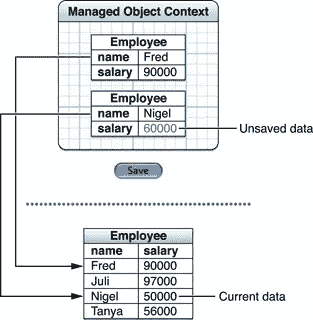

# 💿核心数据—批量插入

> 原文：<https://medium.com/nerd-for-tech/core-data-batch-insertion-ff9d2e2d4fd9?source=collection_archive---------0----------------------->

## 核心数据指南



学分:developer.apple.com

几乎所有项目都需要一次性向数据库中添加大量数据。在我的情况下，它将主要是下载用户数据时，安装在一个新的设备。

我见过一些新开发人员，包括我在内，使用 **for-loop** 从数组中一个接一个地取出对象，然后将它添加到上下文中。


演职员表: [canva](https://www.canva.com)

好吧，我们来看看代码。

***举例:***

```
/// Create Batch Insert Request
      let insertRequest = NSBatchInsertRequest(entity: BookKeeper.entity(), objects: booksArray)
/// Set the Result Type, in our case we need object IDs
       insertRequest.resultType = NSBatchInsertRequestResultType.objectIDs
/// Execute the request using the background context already created.
       let result = try? bgContext().execute(insertRequest) as? NSBatchInsertResult
/// Finally we merge using the objectIDs we got from the results.
            if let objectIDs = result?.result as? [NSManagedObjectID], !objectIDs.isEmpty {
                let save = [NSInsertedObjectsKey: objectIDs]
                NSManagedObjectContext.mergeChanges(fromRemoteContextSave: save, into: [mainContext])
```

## 步骤:

1.  使用我们从 **NSManagedObject** 获得的实体描述和转换为字典的对象数组创建一个 **NSBatchInsertRequest** 。
2.  将结果类型设置为我们创建为 objectIDs 的 **NSBatchInsertRequest**
3.  使用后台上下文执行请求(使用**nsmergebypropertyobjecttrumpergepolicy**创建后台上下文)。
4.  使用**nsmanagedobject . merge changes**和 **changeNotificationData** 将更改合并到数组中的主上下文中。

它可能会与这些信息混淆。请参考下面给出的样本项目。

## 📁**带有批量插入代码的文件**

[](https://github.com/Rajaikumar-iOSDev/BookKeeper/blob/main/BookKeeper/Services/BookKeeperService.swift) [## 主 Rajaikumar 的簿记员/簿记员服务. swift-IOs dev/簿记员

### 核心数据指南:批量插入。通过在…上创建帐户，为 Rajaikumar-iOSDev/BookKeeper 开发做出贡献

github.com](https://github.com/Rajaikumar-iOSDev/BookKeeper/blob/main/BookKeeper/Services/BookKeeperService.swift) 

## 🗄️回购

[](https://github.com/Rajaikumar-iOSDev/BookKeeper) [## GitHub-Rajaikumar-IOs dev/簿记员

github.com](https://github.com/Rajaikumar-iOSDev/BookKeeper) 

## 📰我的其他文章与核心数据相关

1.  [核心数据获取索引，加快搜索速度。](/nerd-for-tech/core-data-fetch-index-for-faster-searches-c3e66a417703)
2.  [核心数据提取请求模板](/nerd-for-tech/coredata-fetch-request-template-e07e94bc013e)