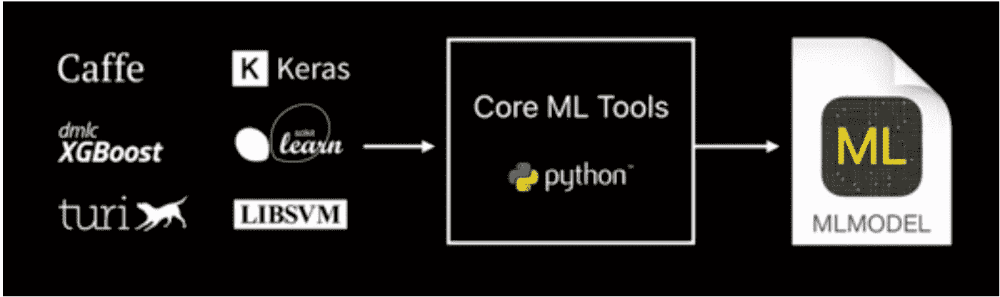
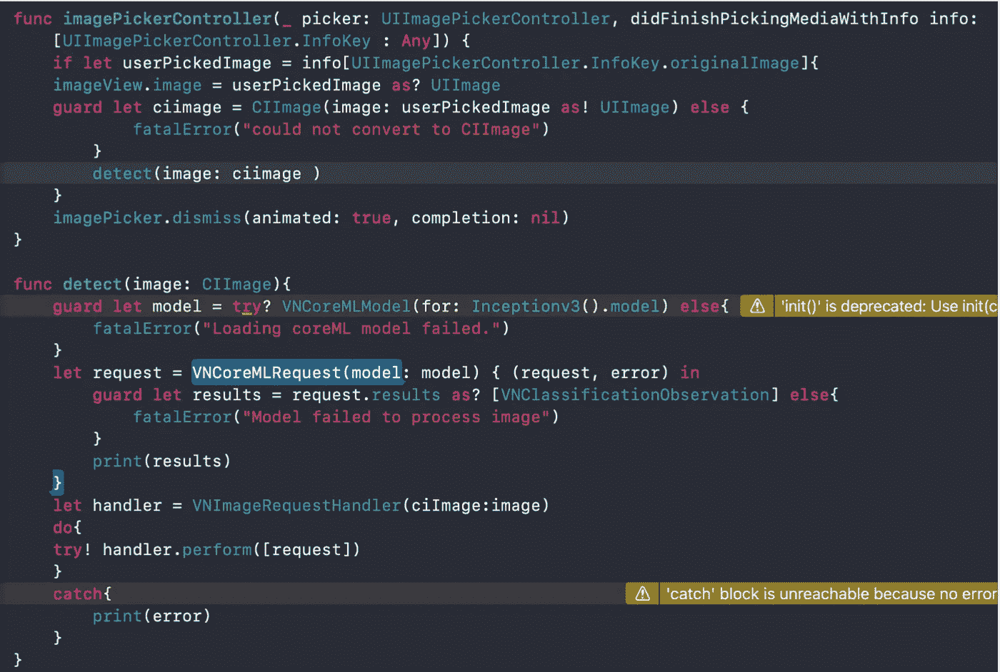

# 核心 ML

> 原文：<https://medium.com/nerd-for-tech/core-ml-e840938a55d9?source=collection_archive---------16----------------------->

CoreML 是苹果几乎全新的机器学习框架，使我们能够让我们的应用程序更加智能。

## 什么是机器学习？

ML 既是一个问题，也是一个解决方案。

> 它只是一个研究领域，允许计算机在没有明确编程的情况下进行学习。
> 
> _ _ 亚瑟·塞缪尔

## 监督学习

这就像电脑有一个老师，以手把手的方式一步一步告诉它什么是对的，什么是错的，还有…

这方面的一个例子是教计算机什么是猫。训练数据总是被清楚地标记，并被馈送到机器学习模型，机器通过这些数据进行学习，并开始能够进行所需的分类。我们可以使用我们的测试数据来幸运地获得想要的输出。分类倾向于处理离散数据。当我们处理连续数据时，我们更可能使用回归。

## 无监督学习

在这里，我们只是给我们的模型提供一大堆数据，让它处理它们，并像聚类一样理解它们。

## 强化学习

它基于奖励机器。

# 核心 ML

Core ML 本质上允许我们做两件事情，使得将机器学习集成到我们的 iOS 项目中变得容易:

1.  加载一个预先训练好的模型(无论是 Caffe 或 torch 或 keras，它都会将其转换成一个. ml 模型文件)
2.  做预测

*仅限于分类&回归。*

*   我们不能使用用户数据在运行中进一步训练我们的模型(没有训练)！
*   它是静态的
*   是**未加密**

用于实现核心 ML 文件(。ml)到我们的 iOS 项目中，我们所要做的就是将它拖放到我们的文件结构中，并确保选中“如果需要，复制项目”复选框。不要忘记导入您需要的框架，如 coreML 和 Vision。

*视觉框架执行面部和面部标志检测、文本检测、条形码识别、图像配准和一般特征跟踪。Vision 还允许使用定制的核心 ML 模型来完成分类或对象检测等任务。*

