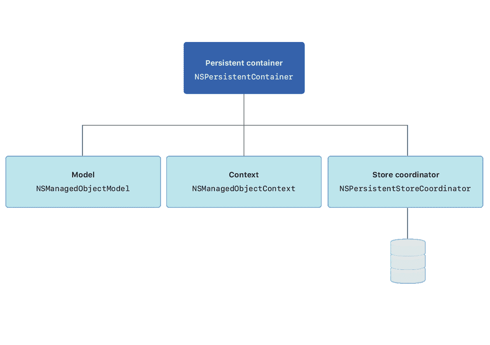
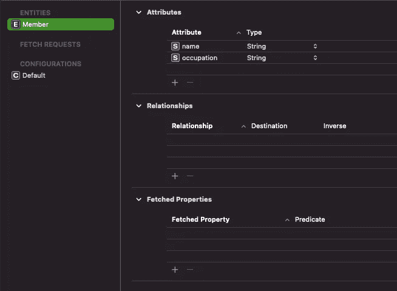
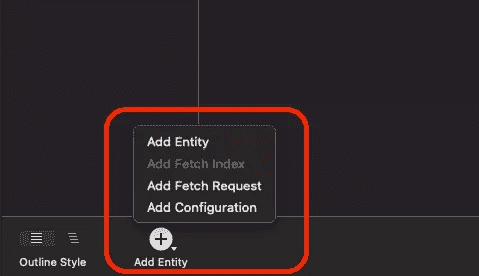
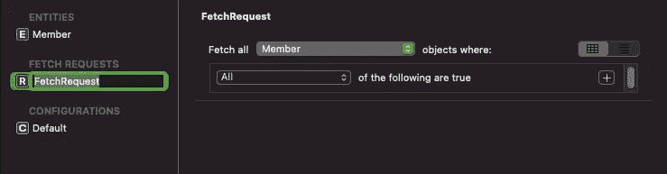
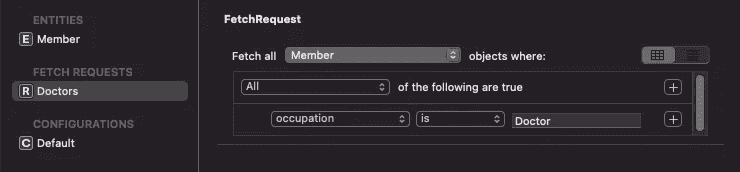
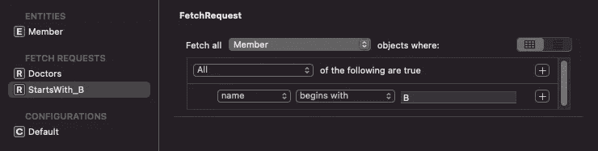
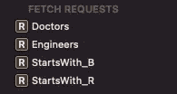
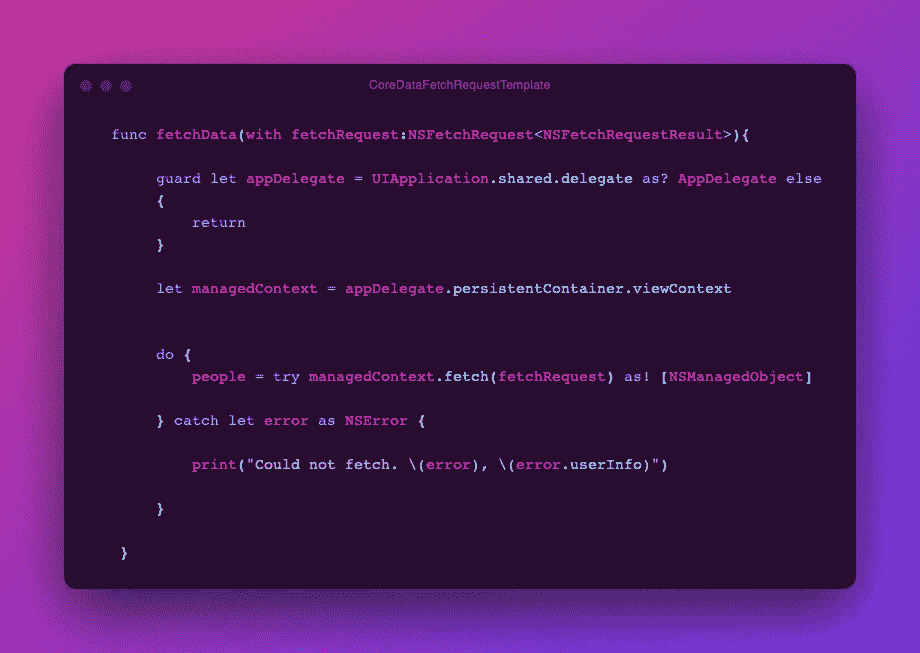
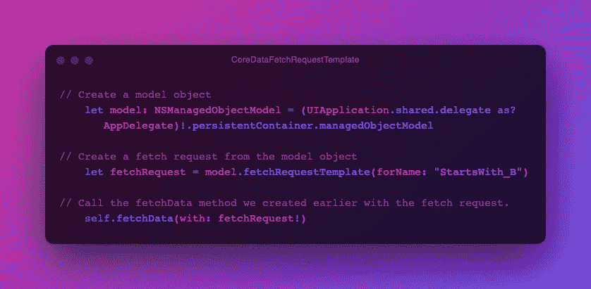
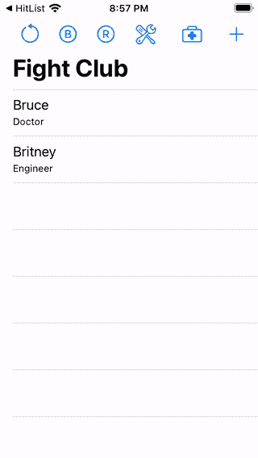

# 核心数据提取请求模板

> 原文：<https://medium.com/nerd-for-tech/coredata-fetch-request-template-e07e94bc013e?source=collection_archive---------3----------------------->

## 核心数据指南

developer.apple.com

获取请求模板是核心数据中最被低估和使用最少的特性之一。它帮助您为实体中的属性设置条件，以便根据您的需要过滤数据。

关于跳草者的演讲到此为止，让我们来看一个例子。

我们有一个为这个教程制作的搏击俱乐部应用程序。

这个应用程序有一个名为成员的实体，它有两个属性名称和职业。

我们将通过长按底部的**添加实体** 按钮来创建一个获取请求。xcdatamodel 文件。

从子菜单中，按下**添加提取请求**选项。

将创建一个获取请求，并对其进行适当的命名。我将把它命名为 Doctors，因为这个 fetch 请求将帮助我筛选职业为 doctor 的成员。按下右边的 **+** 按钮，设置**职业为医生**。

现在让我们创建另一个 fetch 请求来过滤那些名字**以字母 **B** 开头的成员。**

是时候做一个小任务了😁。

memegenerator.net

创建两个获取请求，一个用于获取**职业**是**工程师**的成员，另一个用于获取**姓名**以字母 **R** 开头的成员。

在您的任务之后，您的 Fetch Requests 部分应该看起来像这样。

让我们编写一些代码来使用我们创建的获取请求。首先，我们将创建一个方法，该方法将接受获取请求并将数据提供给一个 **NSManagedObject** array 对象。

雷，所以呢

现在使用 fetch 请求模板并获取所需的数据。

雷，所以呢

# 📺演示

***够了伙计们，我该离开了。***

# 📂示例项目

在这里可以找到完整的源代码。

 [## rajaikumar-IOs dev/coredatafetchtemplate 示例

### 💾演示 CoreData 获取请求模板的示例项目。-Rajaikumar-IOs dev/coredatafetchtemplate 示例

github.com](https://github.com/Rajaikumar-iOSDev/CoreDataFetchTemplateExample) 

# 📰我的其他文章与核心数据相关

1.  [核心数据获取索引，加快搜索速度。](/nerd-for-tech/core-data-fetch-index-for-faster-searches-c3e66a417703)
2.  [核心数据提取请求模板](/nerd-for-tech/coredata-fetch-request-template-e07e94bc013e)