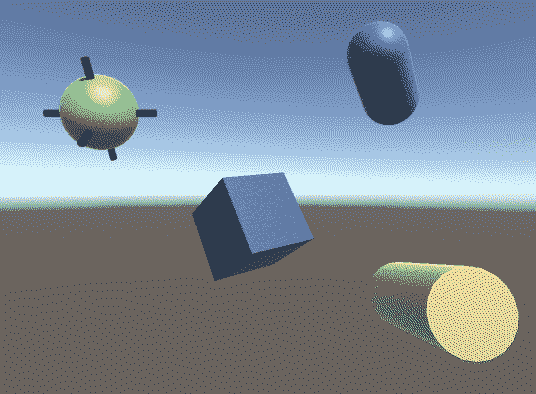
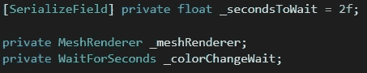
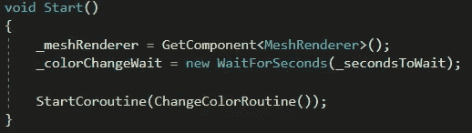
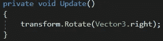
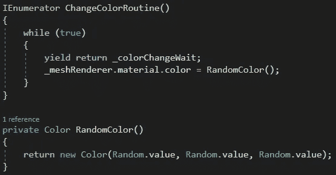

# Unity 中的协程

> 原文：<https://medium.com/nerd-for-tech/coroutines-in-unity-ab056874bff?source=collection_archive---------2----------------------->

**目标:**每两秒钟随机改变物体的颜色。

一个*协程*将允许我们在其他进程运行的同时执行一个进程。*当我们想要延迟一个进程时，协程*也很有用。在我们的示例中，我们将两者都做:在形状旋转时改变颜色，每次改变之间等待 2 秒钟。

我们将从设置等待时间(2 秒)和缓存对象的 *MeshRenderer* 和 *WaitForSeconds* 类的引用开始。

在 *Start* 方法中，我们将获得对象的 *MeshRenderer* 组件，并定义 *WaitForSeconds* 类。然后我们将调用 *ChangeColorRoutine* 协程(稍后会详细介绍)。

即使我们调用了协程，我们的 *Update* 方法将继续运行，导致我们的对象旋转。

当*更新*旋转我们的对象时， *ChangeColorRoutine* 协程会等待两秒钟，然后给我们的 *MeshRenderer* 分配一个随机颜色。由于我们的 *while* 语句总是 *true* ，脚本将持续等待 2 秒钟，然后改变颜色！

