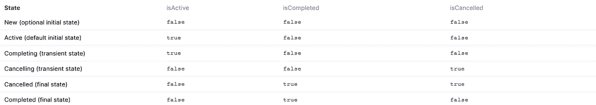
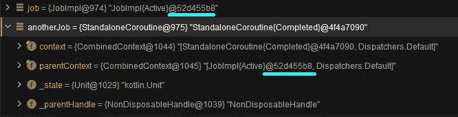

# 协同程序(第二部分)—作业、管理作业、启动和异步

> 原文：<https://medium.com/nerd-for-tech/coroutines-part-ii-job-supervisorjob-launch-and-async-578d3486fa0c?source=collection_archive---------5----------------------->

这是关于协程的 3 部分系列的第 2 篇文章。如果你没有读过第一篇文章，我强烈建议你读一读

[](https://victorbrandalise.com/coroutines-part-i-grasping-the-fundamentals/) [## 协程(第一部分)-掌握基本原则

### 你读了 20 篇文章，看了 6 个视频，问了你的大学，不知何故你还是不明白…

victorbrandalise.com](https://victorbrandalise.com/coroutines-part-i-grasping-the-fundamentals/) 

在学习了基础知识之后，我们终于可以开始在代码中使用协程了。我们将从学习`Job`和`SupervisorJob`开始，然后继续用`launch`和`async`创建协程。


[张秀坤·瓦尼](https://unsplash.com/@dominik_photography?utm_source=unsplash&utm_medium=referral&utm_content=creditCopyText)在 [Unsplash](https://unsplash.com/s/photos/mine?utm_source=unsplash&utm_medium=referral&utm_content=creditCopyText) 上的封面照片

# 职位

对于创建的每个协程，都会返回一个作业实例来唯一标识该协程，并允许您管理其生命周期。如果有必要，您还可以手动创建作业，例如，您可能希望将它交给一个`CoroutineContext`来管理上下文的生命周期。

> 从概念上来说，一个任务是一个可以取消的东西，它有一个生命周期，最终会完成。[…]抛出 CancellationException 的协程被视为正常取消。如果取消原因是不同的异常类型，则作业被视为失败。
> 
> [*科特林文档*](https://kotlin.github.io/kotlinx.coroutines/kotlinx-coroutines-core/kotlinx.coroutines/-job/)

作业具有一组定义状态:新、活动、完成、已完成、取消和已取消。

我们不能访问状态本身，但是我们可以访问作业的属性:isActive、isCancelled 和 isCompleted。



[https://kot Lin . github . io/kot linx . coroutines/kot linx-coroutines-core/kot linx . coroutines/-job/](https://kotlin.github.io/kotlinx.coroutines/kotlinx-coroutines-core/kotlinx.coroutines/-job/)

如果你传入一个特定的`Job`或`SupervisorJob`作为上下文，比如在`launch(SupervisorJob())`中，它不会导致工作在那个`Job`中运行，这只是意味着它将使用那个`Job`作为它将构建的`Job`的父作业。为什么？因为`AbstractCoroutine`实现了`Job`并且所有协程都扩展了`AbstractCoroutine`。



# 父子层次结构

*   当父作业被取消时，子作业也被取消；
*   如果我们取消孩子的工作，父母的工作继续；
*   当父作业抛出异常时，子作业也被取消；
*   当子作业抛出异常时，父作业可能被取消；
*   在所有子进程完成之前，父进程无法完成；

# 主管工作

它类似于常规作业，唯一的例外是其子作业可以彼此独立地失败。

孩子的失败或取消不会导致主管的工作失败或影响其他孩子，因此主管可以创建一个独特的策略来处理其孩子的失败。

一个`SupervisorJob`只有当它是作用域的一部分时才起作用:要么使用`supervisorScope`创建，要么使用`CoroutineScope(SupervisorJob())`创建。将一个`SupervisorJob`作为协程构建器的一个参数传递，并不会达到您想要的取消效果。

下面是他们使用`launch`并排显示的行为:

如您所见，通过使用`SupervisorJob`，一个孩子的失败不会影响到另一个孩子。

下面是他们使用`async`的行为:

这可能不是您所期望的，发生的原因是`launch`传播异常，而`await`抛出异常。我们会在第三部分深入探讨。

# 协同程序构建器

协程生成器是简单的函数，它生成新的协程来执行给定的挂起函数。它们不同于典型的非挂起函数，因为它们不挂起自己，因此充当正常世界和挂起世界之间的链接。

在 runBlocking 上下文中，调用层次结构中的给定挂起函数及其子级将有效地阻塞当前线程，直到它完成执行。这通常在 main()函数中使用，以提供一种顶级协同程序，在这样做和测试时保持 JVM 活动，因为您希望测试执行阻塞，直到所有工作完成。

启动协程有两种主要方式，它们有不同的用途:

# 发动

launch builder 将启动一个新的协程，但不会等待它完成，这意味着它不会将结果返回给调用者。充当普通函数和协程之间的链接。

协程上下文继承自`CoroutineScope`，但是您可以通过传递另一个上下文作为`context`参数来指定更多的元素。记住`CoroutineContext`永远不会被覆盖，而是与现有的相结合。

默认情况下，协程被立即调度执行。您可以通过指定`start`参数来改变这一点。你可以在这里阅读允许值[。](https://kotlin.github.io/kotlinx.coroutines/kotlinx-coroutines-core/kotlinx.coroutines/-coroutine-start/index.html)

如果你看一下返回类型，你可以看到它是一个`Job`。这意味着您可以通过与该作业交互来控制协程的生命周期。调用`job.cancel()`就可以轻松取消。

正如我们前面看到的，`launch`在视图模型上被大量使用，以创建从非挂起代码到挂起代码的桥梁。

我看到人们一开始做错的一件事是在发射块周围增加一个 try catch。即使抛出异常，catch 也不会运行。

你需要记住，当你从一个非挂起函数中启动一个新的协程时，你基本上是在改变你代码中的世界。启动协程的代码和协程现在分开运行。

要解决这个问题，您只需将 try catch 块移动到 launch 块中，或者在您的作用域上下文中添加一个`CoroutineExceptionHandler`。

# 异步ˌ非同步(asynchronous)

async builder 将启动一个新的协程，它允许您通过调用`await`获得返回值。

我说的关于`context`和`start`参数的同样的事情在这里也适用。

`await`在不阻塞线程的情况下等待块完成，并在延迟操作完成时恢复，返回结果或引发相应的异常。你可能认为用一个 try catch 包装`await`可以工作，它确实有点工作，但是不像你预期的那样。你认为下面的代码会输出什么？

输出:

```
Caught exception Exception in thread "DefaultDispatcher-worker-1"
```

第一次看的时候，这看起来很混乱，下面是正在发生的事情:

1.  由`async`启动的协程抛出异常
2.  异常被捕获，并打印“捕获的异常”
3.  协程将异常处理委托给它的父进程
4.  父级被取消，因为它没有异常处理程序

那么，如何正确处理异常呢？您需要用`supervisorScope`包装`await`调用，以防止异常向上传播。

当我们更深入地研究异常处理时，您将理解为什么需要这样做。现在让我们尝试另一件事，如果我们在根作用域上使用`SupervisorJob`，会发生什么？

输出:

```
Caught exception Exception in thread "DefaultDispatcher-worker-1" java.lang.Exception 
Caught exception Exception in thread "DefaultDispatcher-worker-2" java.lang.Exception
```

除了一个例外，它与普通工作非常相似

1.  `async`启动的协程抛出异常
2.  异常被捕获，并打印“捕获的异常”
3.  协程将异常处理委托给它的父进程
4.  父代不会因为是`SupervisorJob`而被取消，只有子代会被取消

# 他们是不同的，但没有那么多

`launch`和嵌套`async`构建器都不会重新抛出发生在它们内部的异常。相反，它们在协程层次结构中向上传播。正如我们之前看到的，子协程总是将异常处理委托给它的父协程。

# 验光仪

`CoroutineScope`大写的 C 和`[coroutineScope](https://kotlin.github.io/kotlinx.coroutines/kotlinx-coroutines-core/kotlinx.coroutines/coroutine-scope.html)`小写的 C 是两回事。这里我们将讨论一个函数调用。

`coroutineScope`创建一个建立新`CoroutineScope`的边界。新范围从外部范围继承了它的`coroutineContext`,但是覆盖了上下文的作业。它还导致当前协同程序挂起，直到所有子协同程序都完成了它们的执行。

当我们需要在一个挂起函数中以结构化的方式启动新的协同程序，而不需要访问外部作用域时，这非常有用。真正酷的是`coroutineScope`将创建一个子范围。因此，如果父作用域被取消，它将把取消传递给所有新的协程。

例如，下面的代码不起作用，因为`async`和`launch`是`CoroutineScope`的扩展

你如何解决这个问题？您可以使用`coroutineScope`在一个挂起函数中创建一个作用域，并且仍然保持结构化并发。

> *该功能是为工作的并行分解而设计的。当这个作用域中的任何子协程失败时，这个作用域也失败，所有其余的子协程都被取消。当您有许多异步块，如果其中任何一个失败，就必须取消这些块时，这是非常有用的。*
> 
> [*科特林文档*](https://kotlin.github.io/kotlinx.coroutines/kotlinx-coroutines-core/kotlinx.coroutines/coroutine-scope.html)

记住，如果不使用`SupervisorJob`，异常也会取消父类的作用域。

# 监督镜

`supervisorScope`的行为定义为:一个子节点的失败不会导致作用域失败，也不会影响它的其他子节点。

那是什么意思？

这段代码输出了什么？通过查看定义，您可能认为它不输出任何内容，因为子节点的失败不应该导致其作用域失败。

以下是输出结果:

```
Exception in thread "main" java.lang.Exception 
Exception in thread "main" java.lang.Exception
```

这很有趣，异常被向上传播，作用域被取消。尽管听起来您可以随心所欲地破坏子协程，但这并不完全正确。异常仍然会向上传播，如果父`supervisorScope`没有一些错误处理机制，它仍然会被取消。

那么，我们怎么解决呢？我们可以简单地给`CoroutineContext`加上一个`CoroutineExceptionHandler`。

关于`supervisorScope`的另一个巧妙的特性是在它内部创建的协程成为顶级协程，允许我们在其中安装一个`CoroutineExceptionHandler`。

这段代码有预期的输出，但没有输出任何内容。

在这篇文章中，我们了解了`Job`和`SupervisorJob`，最重要的是它们是如何工作的。我们还看到了`launch`和`async`可以用来创建协程，并了解了它们之间的区别。既然我们已经了解了协程的基本知识，我们可以继续学习更高级的概念，请继续关注第三部分。

如果您有任何疑问，请随时联系我。下一篇文章再见😉

[](https://victorbrandalise.com/coroutines-part-iii-structured-concurrency-and-cancellation/) [## 协同程序(第三部分)——结构化并发和取消

### 这是关于协程的 3 篇系列文章的第 3 篇，也是最后一篇。如果你没有看过前两篇文章，我…

victorbrandalise.com](https://victorbrandalise.com/coroutines-part-iii-structured-concurrency-and-cancellation/) 

# 资源

你正确地处理了 Kotlin 协程中的异常吗？

[Kotlin 协程作业生命周期](https://marco-cattaneo.medium.com/kotlin-coroutine-job-lifecycle-c1166039d906)

*原载于 2021 年 7 月 29 日*[*【https://victorbrandalise.com】*](https://victorbrandalise.com/coroutines-part-ii-job-supervisorjob-launch-and-async/)*。*