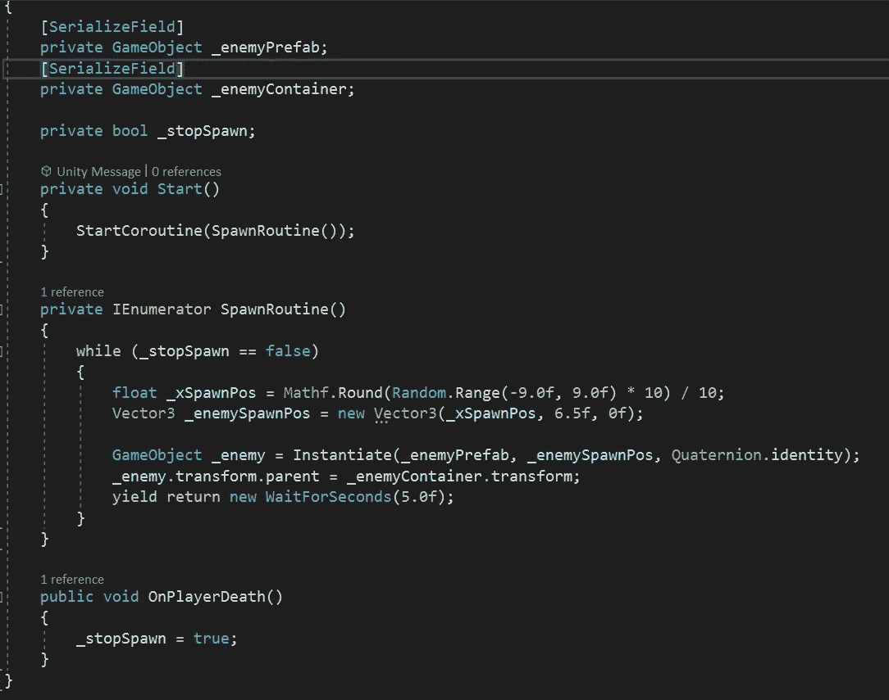
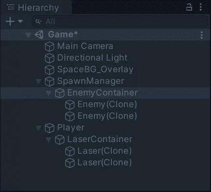

# 统一的协程！

> 原文：<https://medium.com/nerd-for-tech/coroutines-with-unity-7dd9eefdeb2e?source=collection_archive---------2----------------------->

创建一个重复的产卵系统，并保持我们的项目整洁。

在 Unity 中，允许我们运行一个可以暂停执行的函数。简单来说，我们可以停止、开始和等待。

Unity 中的一个**协程**方法需要一个 **IEnumerator** ，它需要包含一个 **yield 返回类型**。最常见的**收益返回类型**是**等待秒。**这允许我们在继续函数之前以秒为单位设置时间量，这与每帧运行我们函数的更新方法相反。一个简单的**协程**可以很好地运行顺序事件，实例化或改变时间线上的某些游戏对象。

**协程**的另一个常见用途是创建一个函数的重复实例。为此，我们需要使用一个 **while 循环。我们可以设置一个函数，当某事为真或假时，在循环中重复它自己。这些循环可能是危险的，因为如果在错误的上下文中使用，它们将无限重复。在一个**协程**中使用它们会安全得多，因为它允许我们在重复之前**放弃一次返回**。**

我们可以分别用 **StopCoroutine** 和 **StartCoroutine** 来停止和启动我们的协同程序，后面跟着我们的协同程序的名称和()来调用括号中的函数。

我们还可以通过创建一个可以在代码的其他地方在真或假之间切换的 bool 来操作我们的 while 循环。

上图乍一看可能有点吓人。它运行一个简单的种子管理器。让我们浏览一遍。

首先我存储一个**游戏对象类型变量**来存储我们的**敌人预置**。

接下来我有另一个**变量**存储一个**空游戏对象**来存放我们所有的衍生对象。(稍后将详细介绍)

随后是一个 **bool 变量 _stopSpawn，**当我们用完 live 的时候，我们将在我们的玩家脚本调用的方法中改变它，游戏结束了！

在我们的 **start** 方法中，我们简单地调用我们的**协程来启动**。

我们的**生成例程协程**由一个 **while 循环**组成，它检查我们创建的 bool。这允许循环在 bool 为 false 时继续运行。在这里，我有类似于我的敌人在上一篇文章中包装的两行代码。我用它来设置一个沿 x 轴的随机产卵位置。

接下来，我将**实例化我的预设，**在我上面设置的位置，并跟随脚本附加到的我的空白产卵管理器游戏对象的旋转。我也将每个实例化的敌人分配给**变量 _ 敌人。**

使用我们刚刚存储的**变量**，下一行将每个敌人的**父游戏对象**指定为我们在脚本开始时指定的**空白敌人容器变量**。

最后，我们**产生了一个新的 5 秒返回时间，**允许一个敌人每 5 秒重生一次，每次都在一个随机的位置，并被保存在一个容器中，以避免我们的等级混乱。

我们的最后一个方法是 **public** ，当我们的生命为 0 并且游戏结束时，我们从我们的玩家脚本中调用它。这只是将我们的 bool 转换为 true，并在游戏结束后阻止敌人重复产卵。

除了把我们的敌人放在一个容器里。我们也可以用我们的激光器做同样的事情。在 Unity 中生成没有混乱的对象对于在运行时和我们的层次结构中更容易地排除故障是必不可少的。

在我们的**玩家类**中，我们可以添加一个**游戏对象变量**来再次存储这个容器。我们的容器仅仅是我们的**玩家游戏对象**中的**空白游戏对象。现在，在我们的 **FireLaser 方法**中，我们简单地将我们的实例化行存储到一个游戏对象变量中，然后访问它的**父对象**，并让它**等于我们的容器的游戏对象**。**

