# 统一的协程！

> 原文：<https://medium.com/nerd-for-tech/coroutines-with-unity-fe650a4892f7?source=collection_archive---------7----------------------->

***什么是协程？***

通常当一个方法被调用时，它会在被调用的帧内完成执行。但是用 C **oroutines** 你可以在很多帧上扩展执行。

简而言之,**协程**是一种特殊的功能，它允许我们在满足特定条件时，通过暂停和恢复执行(从暂停的地方开始)来将游戏逻辑的执行分散到多个帧上。

***如何使用协程？***

就像我说的，协程是一种特殊的函数，它们像普通函数一样被初始化，但是有一个唯一的返回类型，

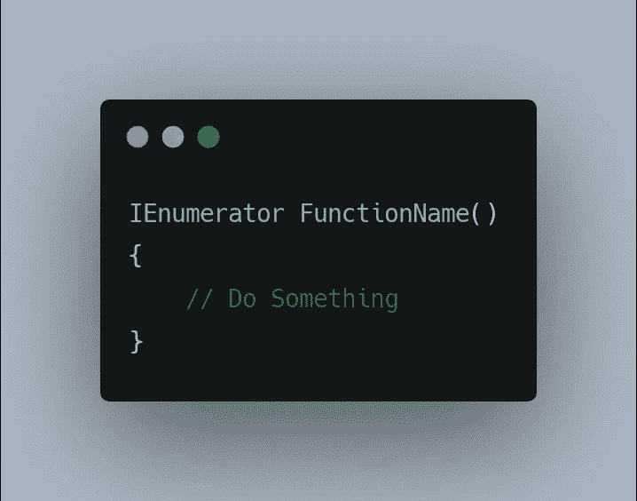

其中 **IEnumerator** 是初始化协程方法所需的类型。这就是 Unity 在多个帧上扩展功能执行的方式。正是这种**类型的**数据让我们可以使用 **yield** 语句。

**Yield** 语句是让我们知道我们的方法是一个迭代器并将运行不止一帧的语句。

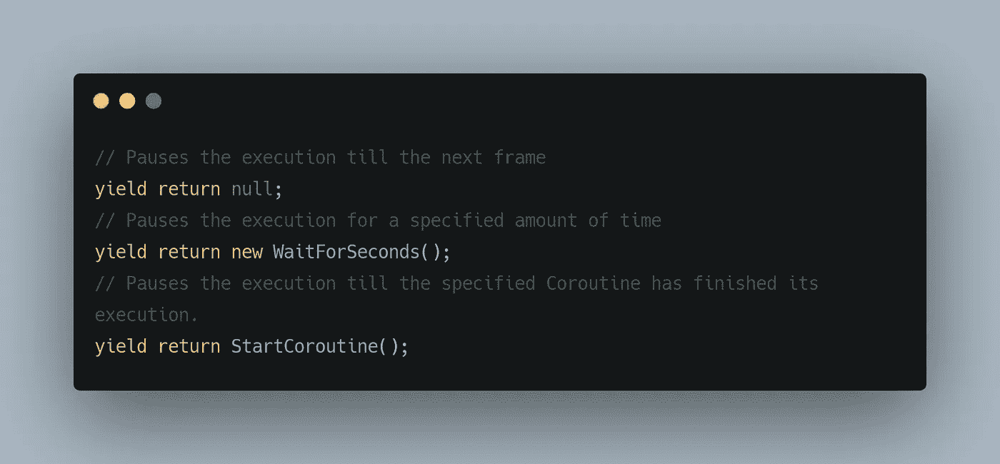

这些是与**产量相关的一些方法。**

为什么我们需要协程？

让我们举一个例子来解释为什么我们需要协程。

首先，让我们创建一个简单的脚本，通过操作对象的变换将对象移动到指定的位置，

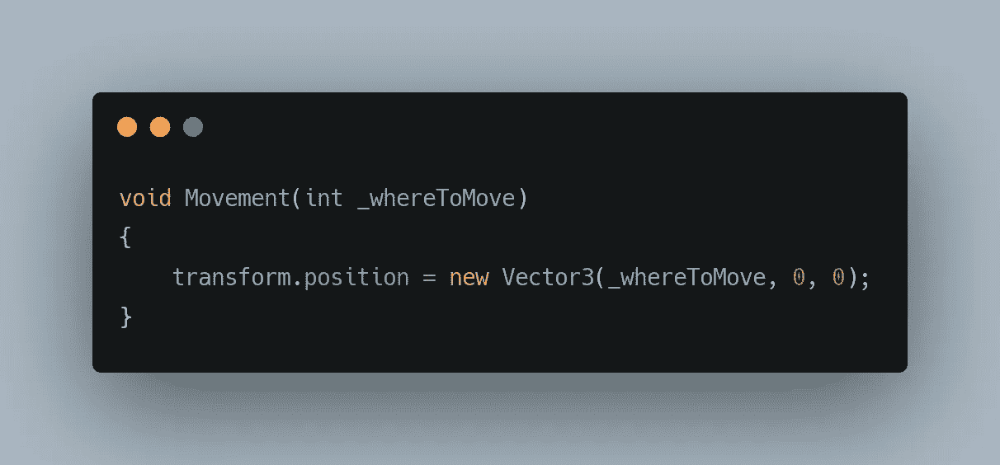

使用上面的方法，让我们用协程和不用协程来移动我们的对象，以观察不同之处，

***不带协程:***

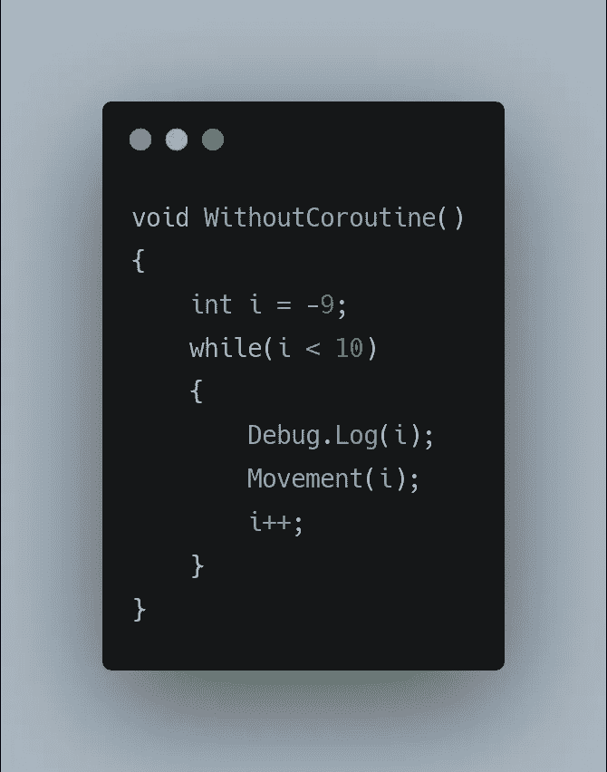

从上面我们可以观察到，我们希望沿着 x 轴移动我们的对象，我们从位置(-9，0，0)开始，一直移动到(9，0，0)。这里"**而** " 循环正在进行检查，以验证我们没有越过(9，0，0)点，当我们越过时，我们退出循环。“ **while** ”循环，只要我们指定的条件保持为真，就在我们的代码块中循环。*注:i++；是 i = i + 1 或 i += 1 的简写。*

有了逻辑编码，让我们在每次点击**空格键**时执行它。这可以通过以下方式完成:

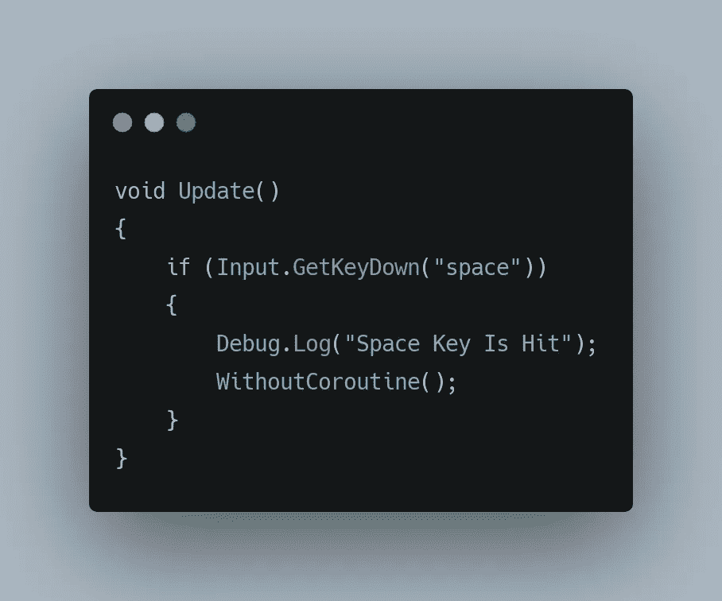

在我给你看结果之前。让我们仔细想想结果会是什么样子。
所以理想的结果是对象将它的**变换**从(-9，0，0)变为(9，0，0)。但是结果不会是这样的，因为每帧调用一次 **Update()** ，**without coro routine()**将在一帧内完成它的执行。让我们的对象从默认位置跳到最终位置。

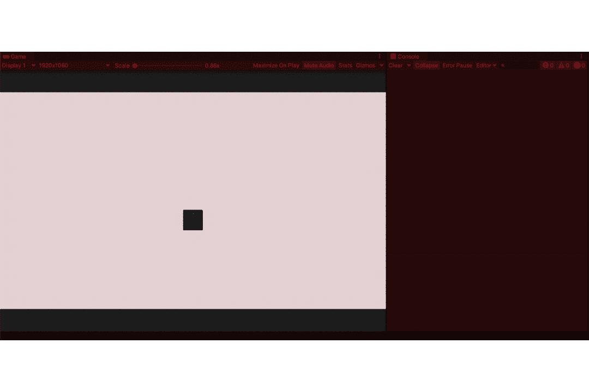

在这里，我们可以观察到，按下空格键的那一刻，我们立即到达最终位置，并且值立即在我们的控制台中实例化。同样，当我们再次按下空格键时，这不会将我们带到初始位置(-9，0，0)，而是我们在最终位置(9，0，0)。这是因为我们的整个逻辑运行在一个框架中。

协程可以在不改变逻辑的情况下解决这个问题。让我们看看使用协程会得到什么。

***同***

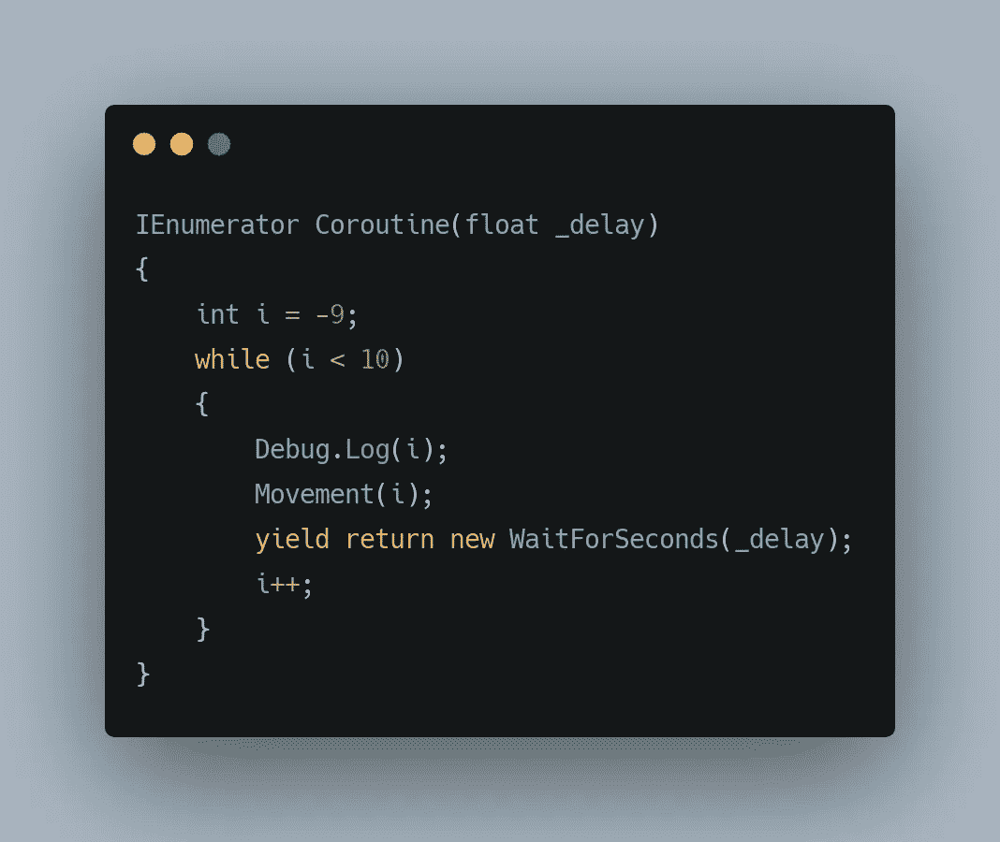

这里，delay 是一个序列化的变量，因此我们可以在编辑器中更改它的值。

我们可以观察到，**协程()**的代码与没有协程()的**代码相同，唯一的区别是**产出**，这里我要求**协程()**暂停指定的“**_ 延迟**”时间段。**

这样我们就初始化了一个协程，但是要调用这个方法，我们需要使用，

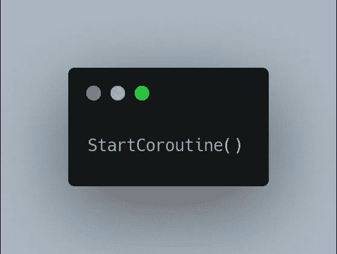

所以我们可以这样做，

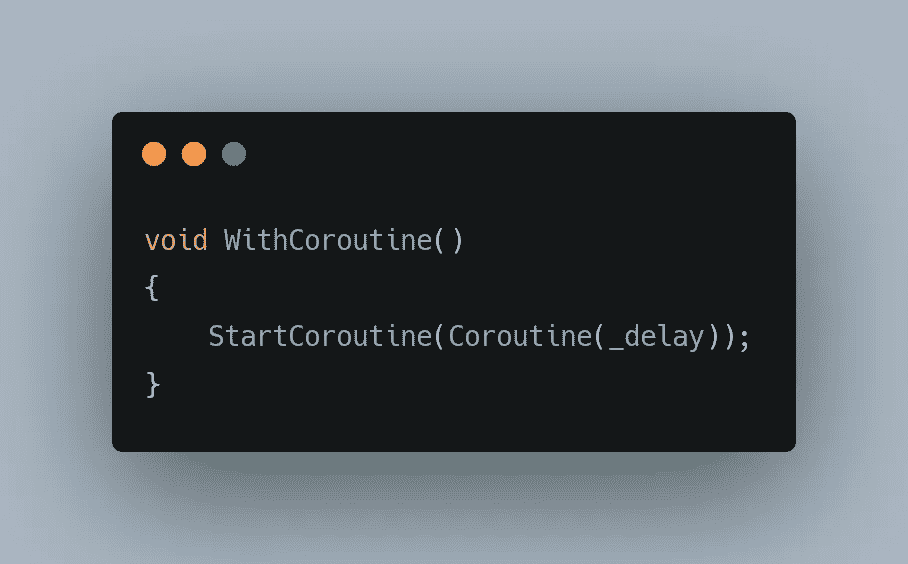

这里延迟设置为 1 秒。

*注意:你可以在你的 Update()中直接调用 StartCoroutine。*

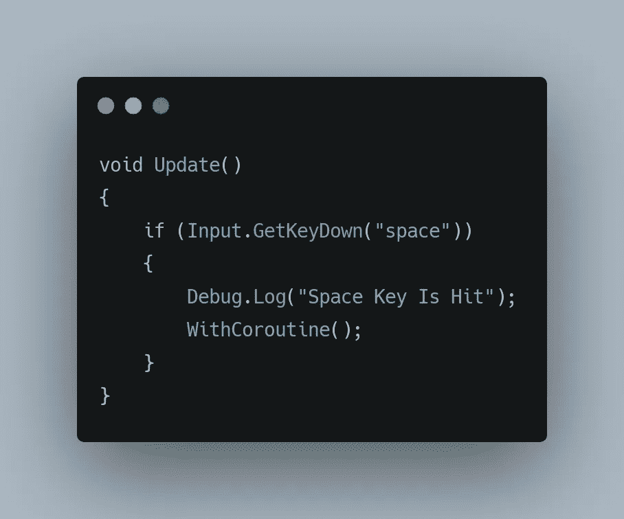

并让结果做解释。

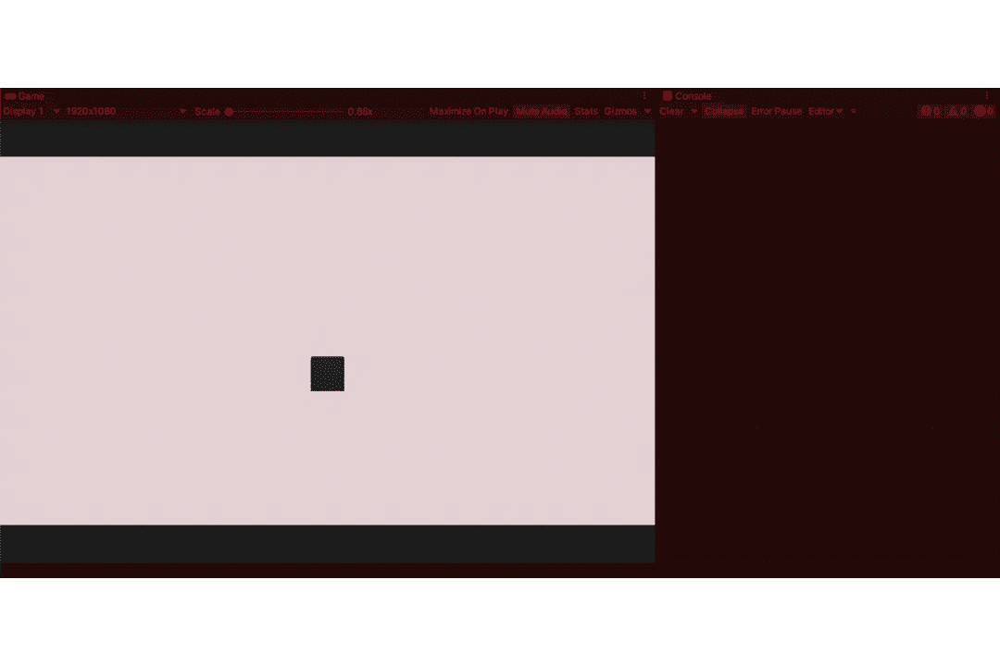

这是原版的加速版。

在这里，我们可以观察控制台中的时间戳，看到我们每秒移动一个单位。这正是我们想要的。但是这种方法有一个问题。**协程**为了更好或更差的运行直到完成，如果我在一个协程运行时按下**空格键**，现在突然我们有两个**协程**同时运行。

这里我们可以看到立方体疯狂地试图完成内存中所有的**协程**。对此的一个解决方案是使用，

这将一个**协程**作为一个参数，我们可以通过执行以下操作来实现它:

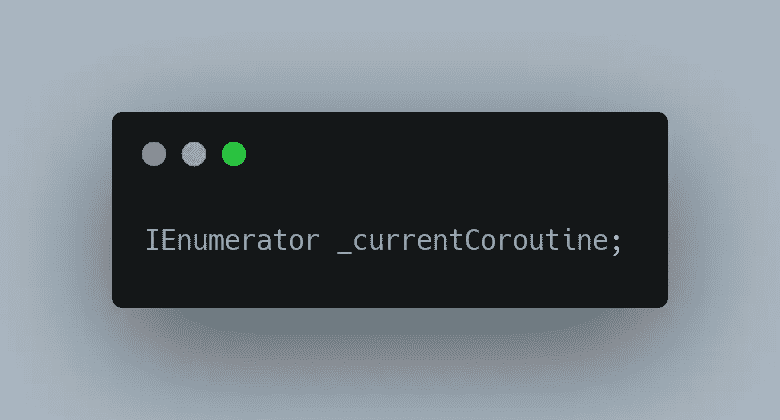

这里我们创建一个变量来存储我们的**协程**(因此有了 **IEnumerator 类型**)。默认情况下， **_currentCoroutine** 变量存储一个空值，除非它用一个值初始化。

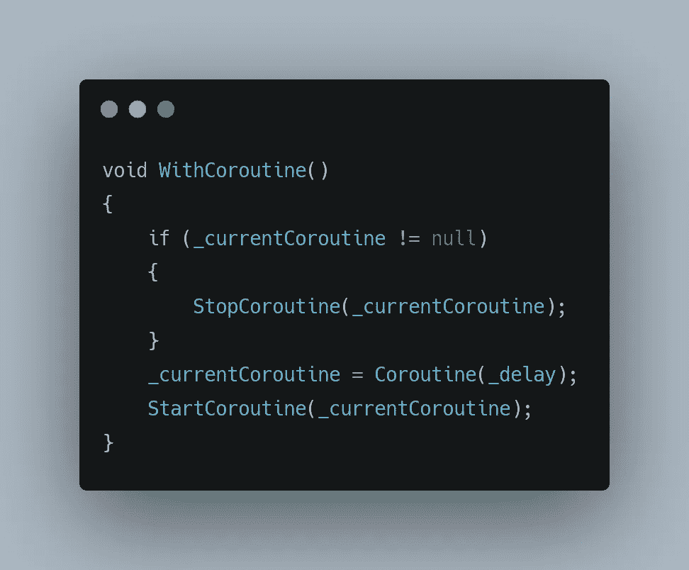

这给了我们下面的结果，我们可以观察到，每当按下**空格键**时，一个新的协程开始执行，如果已经有一个协程在运行，它就停止它并重新初始化一个新的协程。

感谢您的阅读。更多信息请访问协程。