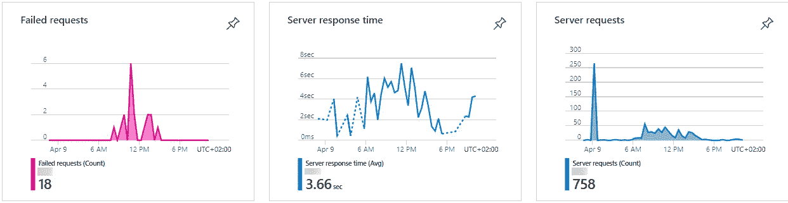
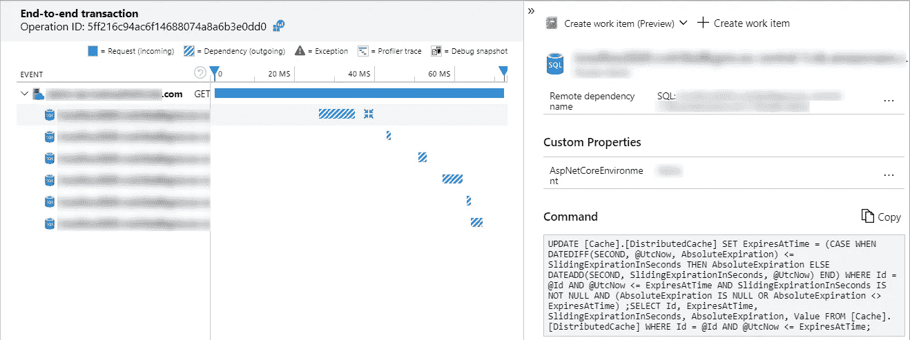
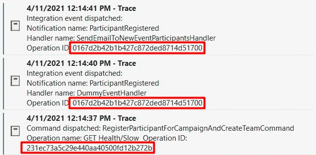
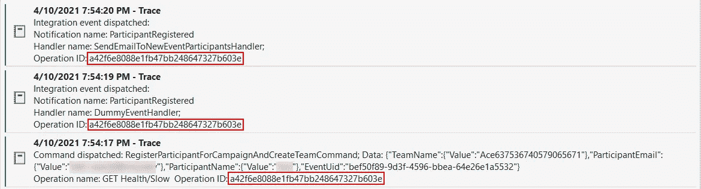
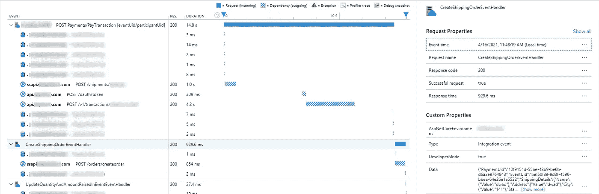

# 在 Application Insights 中将集成事件与触发它们的命令相关联

> 原文：<https://medium.com/nerd-for-tech/correlate-background-jobs-or-integration-events-with-the-initial-command-in-application-insights-2b549e574a51?source=collection_archive---------4----------------------->

## 通过后台作业或集成事件遥测关联扩展应用洞察的分布式跟踪

[Application Insights](https://docs.microsoft.com/en-us/azure/azure-monitor/app/app-insights-overview) 是监控您系统的绝佳工具。配置也非常简单——因为它是微软的产品，你只需要在 Visual Studio 中点击“添加应用洞察”,一切都准备好了。您将开始获得从应用程序异常到主机 CPU 性能的各种日志。



你完全不用定制代码就能得到这个

Application Insights 的一个真正酷的地方是分布式跟踪在默认情况下是启用的。换句话说，一个请求从您的前端开始，执行一个 API 端点，该端点查询数据库，并在返回结果之前调用另一个 HTTP 集成或服务——当您检查日志时，所有这些操作都是相互关联的。



这个贪婪的请求对数据库进行了 6 次查询

不过，有一件事不是开箱即用的，那就是后台作业和集成事件(除非你使用[微软 Azure 服务总线客户端](https://docs.microsoft.com/en-us/azure/azure-monitor/app/custom-operations-tracking#service-bus-queue))。

## 关联后台作业和集成事件

假设我们有一个设置，其中一个命令可以引发一个集成事件:

```
public async Task CommandHandler(Command command)
{
    // business logic code await dbContext.SaveAsync();
    await eventDispatcher.Publish(new MyEvent());
}
```

继续我们的例子，我们有基础设施代码设置，它启动所有的处理程序作为后台作业(例如，我们可以使用 [Hangfire](https://www.hangfire.io/) )。
在监控环境中，当检查日志时，我们希望`MyEvent`的所有处理程序都与初始命令/请求相关联，就像我们在上面看到的数据库查询一样。
但是，如果我们记录命令和事件处理程序，我们会看到:



与应用洞察中的操作相关的`Operation ID`则不同。这意味着它们将在 Application Insights 门户中显示为完全不同的请求，我们将无法知道这些集成事件源自何处。这将使得在查找 bug 时检查我们的日志更加困难。
这是因为后台作业服务在另一个上下文中执行。它也可以是一个消息队列，甚至可以在不同的机器上执行。因此，Application Insights 为这些方法分配了新的操作 ID。

对此的解决方案？*我们需要在转到另一个上下文(后台作业)之前获取操作 ID，在那里传播它，然后在另一个上下文的跟踪客户端中设置它。*让我们看看如何完成这些步骤。

这就是我们从 Application Insights 获取当前操作 ID 的方式，就在我们引发集成事件和切换上下文之前。

基本上我们正在创建一个假的`RequestTelemetry`并用遥测上下文初始化它。我们必须使用`OperationCorrelationTelemetryInitializer`来初始化定制的遥测请求——因为初始化器知道当前的上下文和它需要分配给请求遥测的所有必要的遥测属性，操作 ID 就是其中之一。你可能很想使用`System.Diagnostics.Activity.Current.RootId`作为操作 ID，这可能行得通，但是如果你查看初始化器的[代码](https://github.com/microsoft/ApplicationInsights-dotnet/blob/develop/BASE/src/Microsoft.ApplicationInsights/Extensibility/OperationCorrelationTelemetryInitializer.cs)，你会看到它做了一系列检查来确保正确的属性被初始化。
如果你想知道`telemetryConfiguration`是从哪里来的，你只需通过构造函数注入`TelemetryConfiguration`。

既然我们有了可以关联不同监控事件的操作 ID，我们需要将它传递给另一个后台上下文。我们可以这样做的一个方法是向我们的`MyEvent`对象添加一个包，它将包含操作 ID。

一旦进入后台上下文，并且有了操作 ID，我们需要将操作 ID 传递回 Application Insights tracker，这样它就可以与调用命令相关联。
我们可以在事件处理程序上创建一个简单的装饰器，如下所示:

我们应该总是使用`RequestTelemetry`或`DependencyTelemetry`，并在它们上面设置操作 ID(和任何其他属性)。我们可以设置操作的名称，添加自定义属性如数据等等。我们不应该直接在`TelemetryClient`上设置操作 ID，因为这将使它对所有遥测使用相同的 ID！
为了让事件处理程序中的所有后续遥测数据再次自动关联，比如 HTTP 请求和数据库查询，我们需要用一个启动/停止操作来包装处理程序。
`StartOperation`会对您的请求进行适当的初始化。我们只需要用从事件包中获得的值覆盖操作 ID。一旦我们开始操作，所有后续的监控事件将自动关联到同一个操作 ID。一旦我们呼叫`StopOperation`，所有操作的遥测数据将被发送到应用洞察。



操作 ID 相同，这意味着它们是相关的，可以一起调查

为了让我们看到我们所做工作的最终结果，下面是 Application Insights 现在如何跟踪更复杂的场景:

*   命令查询/写入数据库并调用 3 个 HTTP 依赖项
*   该命令还会引发两个集成事件
*   每个集成事件都会查询数据库
*   其中一个集成事件调用一个 HTTP 依赖项



最上面是初始命令及其依赖项。下面的集成事件具有特定的类型，并且还会跟踪匿名数据。

## 结论

虽然您仍然可以在不关联集成事件的情况下调试大多数问题，但是您可以肯定，有一次您会遇到这样的错误，您会想知道哪个命令引发了集成事件，以及它们的属性是什么。不要让你能预料到这种情况并做好准备的时刻到来。