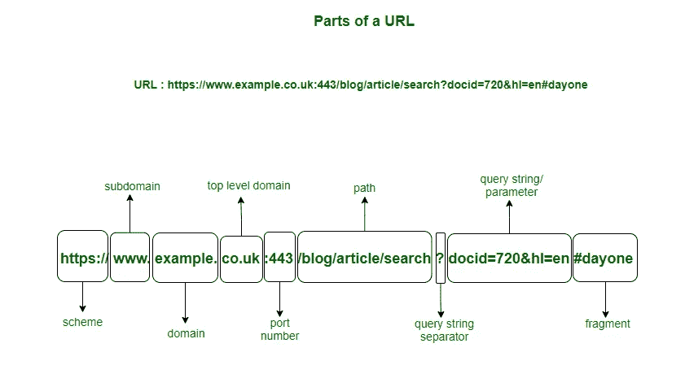
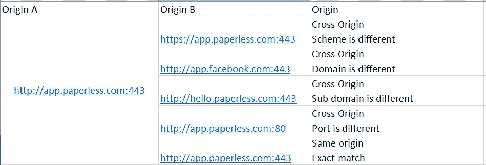
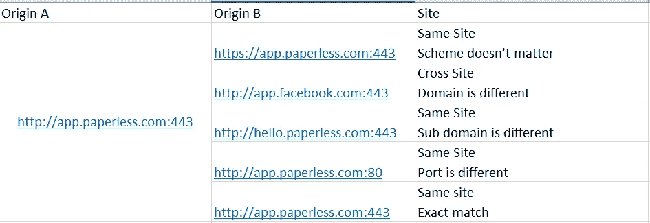

# CORS 解释道

> 原文：<https://medium.com/nerd-for-tech/cors-explained-1ea5a6e45245?source=collection_archive---------0----------------------->

你可以在这里阅读更多关于 HTTP [的内容。](https://www.pansofarjun.com/post/http-a-layman-s-guide-i)

Cross 跨产地资源共享。

让我们来了解一下**产地**和**地点的区别。**

我们来看一个网址:

```
http://app.paperless.com/about
```

这里

*http://* →方案(使用的协议)

*app* →子域

*papers*s->二级域名

*com* →顶级域名

*关于* →子目录

取下面这样的长 URL。(包括端口号和查询字符串)



## 什么是起源？

来源是方案、域和端口的组合。



## 什么是站点？

该网站将顶级域名和其之前的部分域名结合在一起。

在这个例子中，

想想这个，

[https://app.paperless.com:443](https://app.paperless.com:443)

这里的顶级域名是“ *com”在这里，该网站将是 TLD 之前域的一部分。*



**好玩的事实:** **WWW** 也是和上面的' ***app*** '和' ***你好*** '一样的子域。

因此

*   [http://example.com](http://example.com)
*   [http://www.example.com](http://www.example.com)
*   [http://myapp.example.com](http://myapp.example.com)

是不同的起源。

## **与 CORS 相关的 HTTP 头:**

**请求**:

```
origin:http://example.com --> automatically set by the browser
```

**回应**:

```
Access-Control-Allow-Origin: * --> accepts all originsAccess-Control-Allow-Origin: https://app.paperless.com --> allows only this site
```

理解飞行前请求是很重要的。预检请求检查服务器上是否允许请求的 HTTP 方法。

预检请求中使用的 HTTP 方法是**选项**

特定请求不会触发预检请求；这些被称为简单请求。

根据经验，任何不会对服务器数据造成副作用的请求都被称为**‘简单请求’**

**CORS 飞行前:**

```
OPTIONS /doc HTTP/1.1 
Access-Control-Request-Method: POST 
Access-Control-Request-Headers: X-PINGOTHER, Content-Type
```

这将告诉我们，我将使用方法' **Post** '发送一个请求。如果请求被发送，它可能有一些自定义头。Access-Control-Request-Headers 给出了这个自定义头指令 *: X-PINGOTHER，Content-Type。前缀* ***X*** *会告诉它是自定义表头。*

服务器的响应将是

```
Access-Control-Allow-Origin: https://app.paperless.com 
Access-Control-Allow-Methods: POST, GET, OPTIONS 
Access-Control-Allow-Headers: X-PINGOTHER, Content-Type
Access-Control-Max-Age: 86400 --> In seconds (24 hours)--> How long the preflight request can be cached
```

*原载于 2022 年 9 月 25 日 https://www.pansofarjun.com*[](https://www.pansofarjun.com/post/cors-explained)**。**