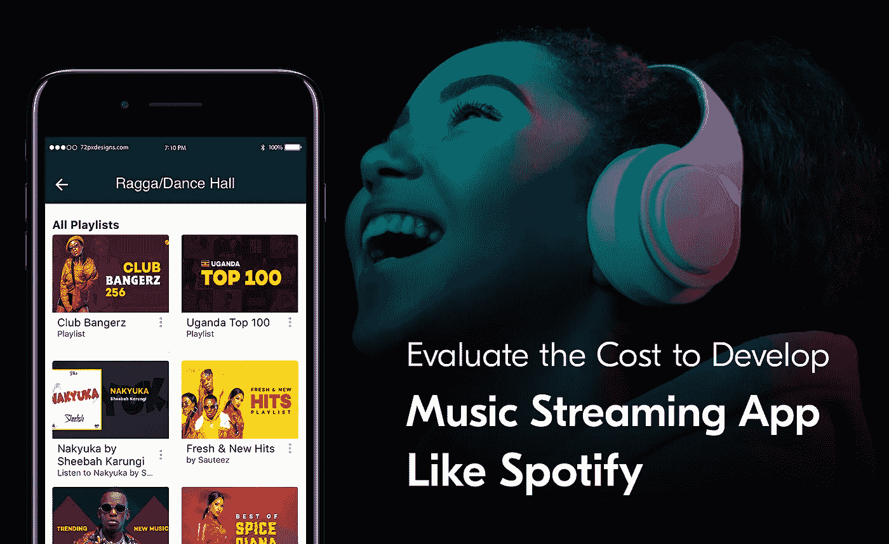
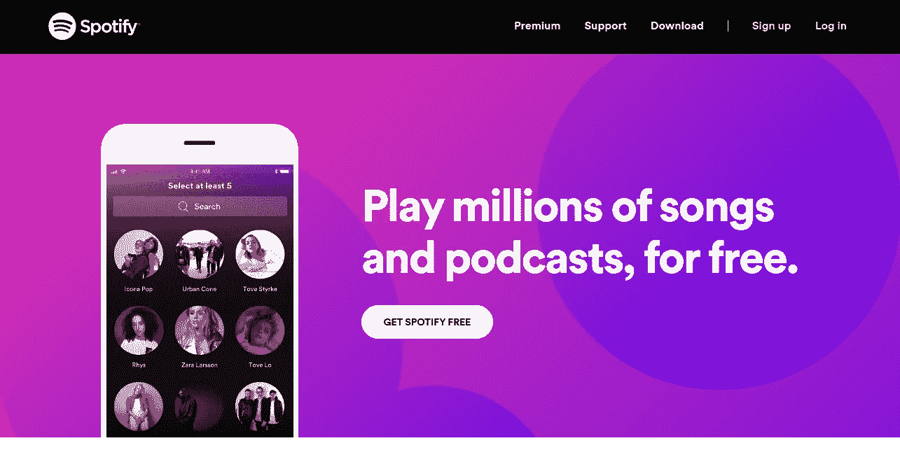
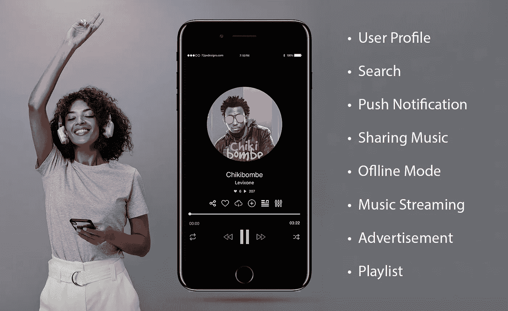
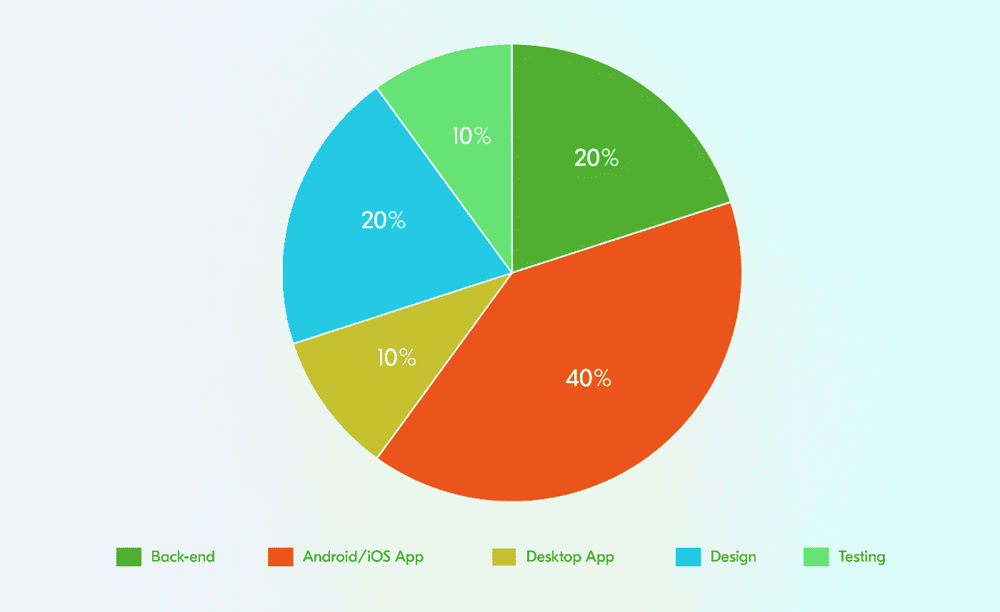

# 评估开发 Spotify 等音乐流媒体应用的成本

> 原文：<https://medium.com/nerd-for-tech/cost-to-develop-music-streaming-app-like-spotify-d42cbae0de4a?source=collection_archive---------8----------------------->

由于移动应用的出现，日常生活发生了巨大的变化。这包括让食物和音乐流等服务变得容易获取。你有没有想过，你会有一个应用程序，使音乐流如此容易执行？没有对吗？但由于 Spotify 的进入，这变得可以实现，音乐流媒体行业已经成为一个盈利市场，其收入到 2025 年 将达到约[**【9.132 亿美元】。**](https://www.statista.com/outlook/dmo/digital-media/digital-music/music-streaming/worldwide)

当你阅读这篇文章时，你会对在线流媒体行业的盈利本质有所了解。这还包括了解 Spotify 等应用的出现，这些应用是人气飙升的原因。因此，你会明白为什么为你的音乐流媒体事业提供一个像 Spotify 这样的应用是个好主意。最后，我们将列出在您着手构建解决方案时会派上用场的步骤，并列出其成本。

因此，没有进一步的告别，让我们开始吧。

> ***盈利性质的音乐流媒体应用***

*   如果你仔细观察应用经济，音乐流媒体应用在促进其增长方面发挥了突出作用。这是由于这些解决方案在平台——iOS 和 Android——上的[全球支出](https://www.data.ai/en/insights/market-data/q1-2018-apps-record-downloads-spend/)极高。对于 iOS 系统，这一比例约为 45%，而对于 Android 系统，这一比例为 120%。
*   到 2025 年 ，音乐流媒体行业的渗透率将达到 [**11.7%。**](https://www.statista.com/outlook/dmo/digital-media/digital-music/music-streaming/worldwide)
*   由于音乐流媒体应用，预计到 2025 年**收入将达到 175 亿美元。**

**这些数字的结果表明，音乐流媒体应用的出现是该行业如此有前途和繁荣的原因，并预计将随着时间的推移而保持下去。**

**今天，访问你的安卓或苹果设备的谷歌 Play 商店或 iOS 应用商店，许多音乐流媒体应用程序允许客户在他们的设备上播放他们喜欢的歌曲。然而，我们将详细讨论的是，音乐流媒体行业成为一个非常有利可图的行业的原因是 Spotify。**

**以下是一些与下面几行中提到的解决方案相关的有吸引力的数字。**

*   **2022 年第一季度全球**用户超过 4.22 亿。****
*   ****[**87%内容**](https://www.thelocal.se/20180302/the-story-of-spotify-swedens-controversial-king-of-music-streaming) 准备流。****

****看着这些数字，你可能会想知道，Spotify 如此受欢迎的原因是什么。这个问题的答案是独特的特性和功能。****

****下面，你会知道音乐流媒体应用程序及其独特的功能。这将有助于你理解为什么新的音乐流媒体公司正在着手建立类似于这个应用程序的解决方案。****

# ****向您介绍 Spotify****

********

****瑞典音频流和媒体服务提供商 Spotify 于 2008 年推出了自己的服务。它目前在全球拥有超过 4.22 亿用户，其中有 1.82 亿用户为优质服务付费。****

****该解决方案有一些非常独特的功能和特性，这是其受欢迎程度飙升的原因。****

****下面列出了其中的一些。****

******Spotify 的独特功能:******

*   ****以随机播放模式播放音乐，每小时最多可跳过六次。****
*   ****Spotify Connect 允许用户在电脑和其他类似平台上播放设备中的音乐。****
*   ****Spotify 根据用户在应用程序上的互动生成每日混音。****

****除了这些独特的功能，Spotify 还允许用户发现新音乐，分享它们，并访问播放列表。这些因素导致新的音乐初创公司建立类似于 Spotify 的解决方案。这是为了让音乐更容易流动，保持用户参与，并确保企业最终能够吸引最大用户使用其服务。****

****它需要坚持几个步骤。当你阅读下面几行时，你会知道在开发过程中应该遵循的技术。这将确保最终解决方案为您的音乐流媒体行业带来最大价值。****

# ****如何搭建音乐流媒体 App？要遵循的步骤****

## ****了解能让你的应用一炮而红的特性****

********

****上图描绘了 Spotify 应用程序中的不同功能。在开始开发阶段之前，请确保您对这些有所了解。这方面的知识将使你能够通过 Spotify 这样的应用程序提供无缝的音乐流媒体服务。****

*******您可以包括的一些功能有-*******

*   ****制作一个播放列表，允许用户在一个地方存储他们喜欢的歌曲。****
*   ****应用内消息，让不同的用户在应用内直接互动。****
*   ****提供音乐推荐，允许用户根据他们与应用程序的交互获得音乐推荐。****
*   ****社交分享允许用户分享歌曲、播放列表等。，直接从 WhatsApp、脸书等各种社交媒体渠道上的应用程序下载。****

****在你的 Spotify 类应用程序中添加这些成分将允许用户继续参与解决方案，并最轻松地使用它。****

## ****注意开发 Spotify 这样的应用程序的不同阶段****

****一旦你知道了让你的应用程序有效运行的特性，下一步就是了解音乐应用程序开发的不同阶段。这将确保该过程尽可能地保持方法论，并且您在开发阶段不会遇到任何障碍。****

*******七个阶段走进音乐 app 开发服务-*******

1.  ****进行强有力的市场调查。****
2.  ****研究后创建一个 MVP，深入了解用户对你的应用的接受程度。****
3.  ****包括 UI/UX 设计，使应用程序易于导航，并保持对客户的吸引力。****
4.  ****准备技术规格，其中包含您将用于构建应用程序的技术堆栈列表。****
5.  ****进入音乐 app 开发阶段。****
6.  ****对应用程序进行测试，以检测漏洞和错误。****
7.  ****发布应用程序并提供音乐应用程序支持。****

****保持对这些阶段的了解将确保音乐流媒体服务通过你的 Spotify 类应用程序无缝连接。****

**** [## 开发 Spotify Clone 应用程序的终极指南

### 计划开发像 Spotify 这样的音乐流媒体应用程序？查看这份关于如何开发像 Spotify 这样的应用程序的完整指南…

www.peppyocean.com](https://www.peppyocean.com/blog/guide-to-develop-an-app-like-spotify-clone-app/?utm_source=Medium&utm_medium=Blog&utm_campaign=PO) 

## 与音乐应用程序开发公司联系

尽管仍然了解不同的开发阶段和功能，但要知道，除非你与值得信赖的音乐应用程序开发公司建立联系，否则你的应用程序创意不会带来最大价值。因此，确保在做任何事情之前，你这样做。在 [**音乐应用程序开发服务**](https://www.xongolab.com/music-app-development/?utm_source=Medium&utm_medium=WL&utm_campaign=XL) 期间采用一些最佳技术和流程——了解您的需求，使用最佳设计，并创建应用程序原型，他们将创建一个解决方案，使音乐流易于执行。其次是确保应用程序允许用户长时间保持参与。

# 评估开发 Spotify 这样的应用程序的成本

找到音乐应用程序开发公司后，下一个重要步骤是评估成本，即开发音乐流媒体应用程序的成本。

要对此进行评估，请注意以下几个方面:

## 基于国家

像西欧和东欧、美国和印度这样的地方被称为 [**移动应用程序开发**](https://www.xongolab.com/mobile-app-development/) 领域的领导者。因此，如果你选择这两个地方中的任何一个，这是你必须承担的总支出。在美国，收费在每小时 120 美元到 250 美元之间。在西欧，费用为 70 至 150 美元。另一方面，在东欧，你每小时要花 50 到 130 美元。在印度，收费将在每小时 20 至 60 美元之间。因此，确保国家的选择是明智的，以保持财政完整。

## 基于发展阶段

通过上图，您可以了解不同发展阶段的百分比。当你开始确定成本时，这些是非常重要的。

下面是跨不同平台的开发成本明细-

*   对于 iOS 应用程序:每小时 60 美元以上
*   Android 应用程序:每小时 70 多美元
*   对于跨平台应用程序:每小时 90 美元以上

## 基于您添加的功能

根据功能，预算会有所不同。这是基于支付的应用商店费用、应用维护费用等等。

**这是费用明细:**

*   拥有基本功能的基本应用——12，000 到 20，000 美元
*   对于具有高级功能的复杂应用程序—15，000 美元到 30，000 美元
*   对于一个高度复杂的应用程序—超过 30，000 美元

所有这些领域将让你节省大量成本，并确保你可以创建一个应用程序，使音乐流无缝通过它。

## 结论

尽管众所周知这是一个充满挑战的市场，但音乐流媒体行业无疑是有利可图的。由于 Spotify 这样的应用程序的出现，这项事业有着光明的未来。

这就是为什么那些在这个有利可图的市场中建立基础的人都在追求建立一个类似的解决方案。因此，除了了解可以评估开发 Spotify 功能等音乐流媒体应用程序的成本的因素之外，还需要了解相关的不同开发阶段，以及获得这些服务的国家。接下来，你还需要联系一家可靠的音乐应用开发公司。在 [**音乐应用程序开发**](https://www.xongolab.com/music-app-development/?utm_source=Medium&utm_medium=WL&utm_campaign=XL) 期间采用最佳实践将帮助您节省资金，并构建一个可实现最大投资回报的解决方案。****