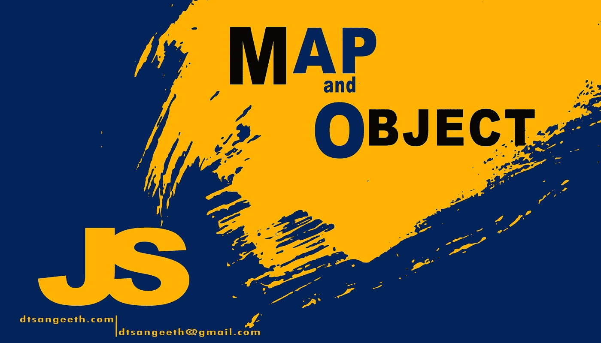

# 使用 JavaScript Map()和 Object()对数组中的重复项进行计数(ES6 新特性)

> 原文：<https://medium.com/nerd-for-tech/count-duplicates-in-array-using-javascript-map-and-object-es6-new-features-a22bd9fd6a16?source=collection_archive---------5----------------------->

[算法和数据结构](https://github.com/sriThariduSangeeth/RAPID-T4-CL-with-Krish)



数据结构和算法

## JavaScript 中如何定义 Map 和 Object？

**什么是地图？**

**Map** 是一种数据结构类型，有助于将数据存储为**键值**对。它有**个唯一键**和一个映射到它的**值。**此外，因为每个存储的关键字都是唯一的，所以在地图上没有重复的关键字。但是值可以重复。**地图**是一个对象的实例。

```
var map = new Map();
console.log(map instanceof Object); //true
```

特殊情况:**映射中的键和值可以是任何数据类型，** *不仅限于*字符串或整数。例如，在 Java 中，当我们定义 HashMap 时，我们必须指定 key 和值中的数据类型。

```
Map<String,String> map = new HashMap<String,String>()
```

但是在这种情况下，当我们用 JavaScript 定义地图时，我们不需要提及数据类型。我在下面提到了如何在 JS 中定义 Map 对象作为例子。

> **let variable _ Map = new Map()；**

```
let sampleMap = new Map();sampleMap.set("key1", 1);sampleMap.set("key2", "value1");sampleMap.set(1, "value2");
```

**什么是对象？**

**对象**遵循与地图相同的概念，即使用**键值** **对**存储数据。**对象**肯定是**而不是**贴图**的一个实例**。*Javascript 中的所有对象都是对象的* ***实例。*** 在对象中也是关键的(“属性”)是**唯一的**和**关联的单个值。**根据 **ES6** 特性当我们给一个现有的属性赋值时。新值将被以前的值覆盖。

```
var obj = new Object();
console.log(obj instanceof Map); //false
```

*   在 Object 中，键的数据类型被限制为整数、字符串和符号。但是在 **Map 中，**可以是**任何数据类型**(一个对象，一个数组等等……)。

```
let obj = {}; //Empty new object
obj[{ "ex": 2 }] = 3; 
***//* This is not aplicable*. In object key-feild only allow*** integer, strings, and symbols***. In Value field any data type will be allow.***let map = new Map(); //Empty new map
map.set({ "ex": 2 }, 3); 
***//* This is aplicable*. In map you can use any data type as key and value***
```

有三种方法可以创建新的空对象:

> 设变量= { }；// ***使用括号*** (1 步)
> 
> var obj = new Object()；***//由构造者*** *(两步)*
> 
> var obj =新对象；//相同的结果
> 
> var obj = object . create(null)；***//通过使用 object . prototype . create****(3 步)*

# 访问元素

**地图:**

*Map.prototype.get(关键)*

```
map.get(*key*)// value
```

**对象:**

*对象。<关键>和*对象【关键】**

```
obj.key //value
obj['*key*'] //value
```

# 添加新元素

**地图:**

*Map.prototype.set()*

```
map.set("key","value"); //{1=>2, 2=>3, "key"=>"value"}
```

> 但是如果你传递一个*现有的键*，它会用新值 ***覆盖*** 映射到那个键的值

**对象:**

*对象。<键> =值*

*对象['key'] =值*

```
obj['grade'] = 'passs'; //{id: 1, gender: "male"}
obj.gender = 'fail';
```

> 两者都可以，如果属性已经存在，那么**将覆盖**现有的映射值。

```
let person = {
name: 'Rayan',
**age: 20,
strength: 100**
}let warrior = {
**age: 36,
strength: 1500**
}*//I am going to assign* ***warrior*** *Object to* ***person*** *Object* let myworrior = Object.assign(person, warrior);
console.log(myworrior);OUTPUT : { name: 'Rayan', **age: 36, strength: 1500** }
// Did you see that, warrior object values overwrite person object values via using same key-feild.
```

# 让我们解决这个问题。

我们必须写一个程序来计算和显示一个句子中每个字母的重复次数。

我们可以使用**贴图**和**对象**来解决这个问题。

```
let word = "These days I am studying";
```

1.  首先，您需要删除空格并将每个字母放入一个新的数组中。

```
const wordArry = Array.from(word.replace(/ /g, ''));
```

2.然后，您可以删除每个重复的字母，并将其放入新的**地图**或**对象**。

> 对象:

```
**Input :** 
wordArray : ['I', 'T', 'a', 'a', 'd','d', 'e', 'e', 'g', 'h','i', 'm', 'n', 's', 's','s', 't', 'u', 'y', 'y']
```

```
***Result will be like this :***
{T: 1,h: 1,e: 2,s: 3,d: 2,a: 2,y: 2,I: 1,m: 1,t: 1,u: 1,i: 1,n: 1,g: 1}
```

> 地图:

```
*//create new Empty Map object* **var mapAllRepition = new Map();***// then, loop* *for i = 0 to* *stringArr.length* *do
// you can access array element using i* **for (let i = 0; i < stringArr.length; i++) {                mapAllRepition.set(****word****Arry[i], (mapAllRepition.get(****word****Arry[i]) || 0) + 1);           
}**//now apply previous same logic when adding element 
// if same element come again and again every time add 1 and increse value using overwite feture in object and map.
```

源代码:

[](https://github.com/sriThariduSangeeth/RAPID-T4-CL-with-Krish) [## sriThariduSangeeth/RAPID-T4-CL-with-Krish

### loop::loop:T4 快速训练任务。:chart _ with _ upward _ trend:-sriThariduSangeeth/RAPID-T4-CL-with-Krish

github.com](https://github.com/sriThariduSangeeth/RAPID-T4-CL-with-Krish)