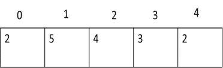
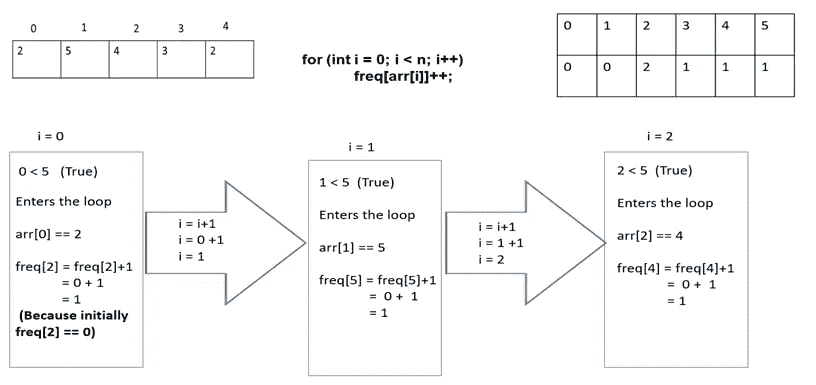
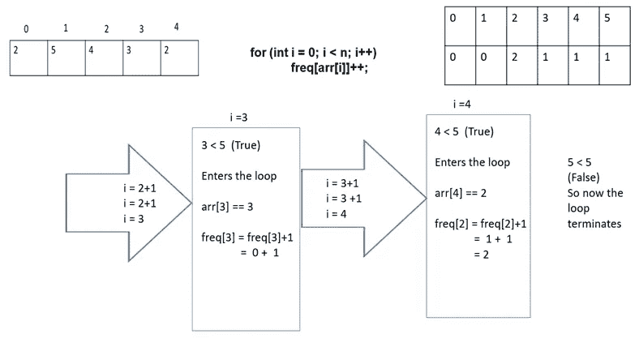

# 数三胞胎:

> 原文：<https://medium.com/nerd-for-tech/count-the-triplets-5e5b4c03d90c?source=collection_archive---------9----------------------->

数组

**问题:**这里他们给了一个 N 个整数的数组 A[ ]。我们必须找出三元组(I，j，k)的个数，其中 I，j 和 k 是指数，并且(1≤i < j < k≤N)使得在集合{Ai，Aj，Ak}中至少有一个数可以写成另外两个数的和。

```
**input** : A[] = {1, 2, 3, 4, 5}
**Output** : 4
The valid triplets are:
(1, 2, 3), (1, 3, 4), (1, 4, 5), (2, 3, 5)
```

基本上，上面的问题陈述意味着，你必须从给定的数组中找出三个元素，使得两个元素相加得到第三个元素。

[](https://practice.geeksforgeeks.org/problems/count-the-triplets4615/1) [## 数三胞胎|练习|极客

### 给定一个不同整数的数组。任务是计算所有的三元组，使得两个元素的和等于…

practice.geeksforgeeks.org](https://practice.geeksforgeeks.org/problems/count-the-triplets4615/1) 

解决方案:

这里我们需要跟踪两个重要的细节:

1.  数组元素的最大值。
2.  创建一个频率表或哈希表，范围从 0 到最大值，并跟踪每个元素的频率(出现的次数)。

以上是需要注意的两个基本步骤。然后，我们需要考虑四种情况来解决这个问题。

# **数组元素的最大值**

这里，我们使用内置的 max 函数来查找给定数组元素的最大值。

**for(int I = 0；I<N；i++)
{
max _ value = max(array[I]，max _ value)；
}**

注意:这里，我们将创建频率表，并通过频率表而不是给定的数组遍历元素。

# **创建频率表**

这里，我们将处理满足三联体条件的四种不同类型的组合。为此，我们将遍历频率表，直到它满足条件并取值。我们不会遍历数组并获取值。

频率表不过是一个数组，甚至可以说是一种数组数据结构，在这种结构中，我们记录一个特定元素在数组中出现的次数，从 0 到数组中出现的最大元素。

例如，假设数组为:



然后频率表存储，


用于创建频率表的代码如下:

**int freq[max _ value+1]= { 0 }；**

这就是我们初始化频率表的方式。我们使用(max_value+1)是因为，计数为 0 也将与它一起被计数。

**for(int I = 0；我<N；i++) // N 表示数组元素的个数
{
freq[array[I]]++；
}**

对我个人来说，这一步有点难以理解，但是当你想象在每一次迭代中发生的过程时，这是非常简单的。



借助上图，你可以理解数组中每个元素的频率是如何统计和存储的。

在下一步之前，我们必须声明并初始化一些变量，比如 ans 为 0，以存储根据案例解决问题的方法。例如，如果它满足情况 1，那么它的计数将被增加。最后，我们必须返回这个值作为最终答案，因为它代表了形成的三元组的总数。

# 案例 1: (0，0，0)

因为 0 + 0 = 0(满足三元组的条件)，所以属于三元组的所有三个数都可以是 0

我们需要找到所有包含频率为零的组合。

数学上，上面的语句表示 ***f(0)C3*** (因为在零频率中，我们只想选择三个一组)

C3 = [f(0)！] / [(f(0)-3)！— 3!]

当你简化上面的步骤时，你会得到下面的等式。

**ans+=(freq[0])*(freq[0]-1)*(freq[0]-2)/6；**

# 情况 2: (0，x，x)

0 + x = x，因此它满足三联体条件。

现在，我们需要找到包含一个 0 和两个 x 的组合。作为一个等式，它如下:

f(x)C2 * f(0)C1(这里，我们将对 x 的每个值使用循环来遍历数组)

**for(int I = 1；I<= max _ value；i++)
{
ans+= freq[0]* freq[I]*(freq[I]-1)/2；
}**

# 案例 3: (x，x，2x)

这里，x+x=2x，因此它满足三联体条件。

所以这里我们需要找到包含两个 x 和一个 2*x 的组合，大概是这样的:

f(x)C2 * f(2x)C1。(这里，我们将进行循环，直到索引值小于 2*x，因为 2*x 也应该在循环内)

**for(int I = 1；2 * I<= max _ value；i++) // 2 次 I 应该也在 max value
{
ans+= freq[I]*(freq[I]-1)/2 * freq[2 * I]里面；
}**

# 情况 4: (x，y，x+y)

这里，前两个值的和等于第三个值，因此它满足三元组条件。

这里，我们需要找到包含一个 x，一个 y 和一个 x+y 的组合，简化的组合如下:

f(x)C1*f(y)C1*f(x+y)C1(这里我们将创建两个循环，其中一个嵌套在另一个中，在第二个循环中，x+y 应该小于 max_value，因为 x+y 也应该出现在循环中)

**for(int I = 1；I<= max _ value；i++)
{
for(int j = I+1；j+I<= max _ value；j++)
{
ans+= freq[I]* freq[j]* freq[I+j]；
}
}**

而我的朋友们，最后一步无非是在使用上述步骤得出解决方案后返回答案。如果它满足一个特定的情况，那么它的计数将被增加，并返回适当的解决方案。

我希望你们发现这篇文章是有用和有帮助的，如果你们能给我宝贵的反馈，我会非常感激。干杯！