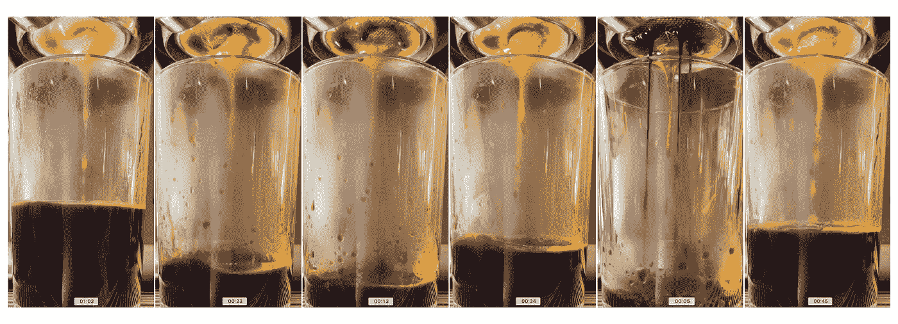
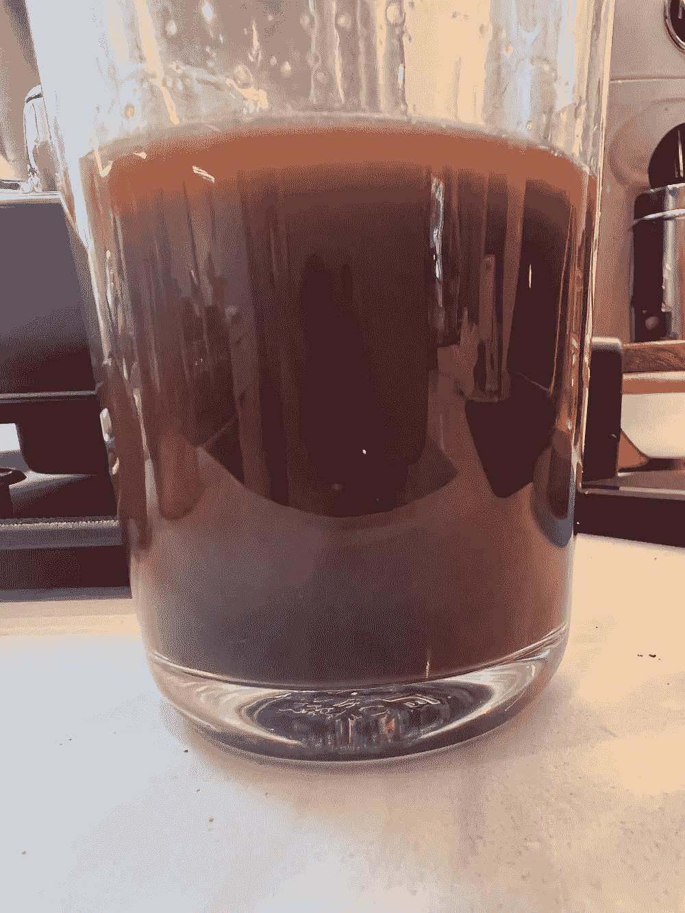
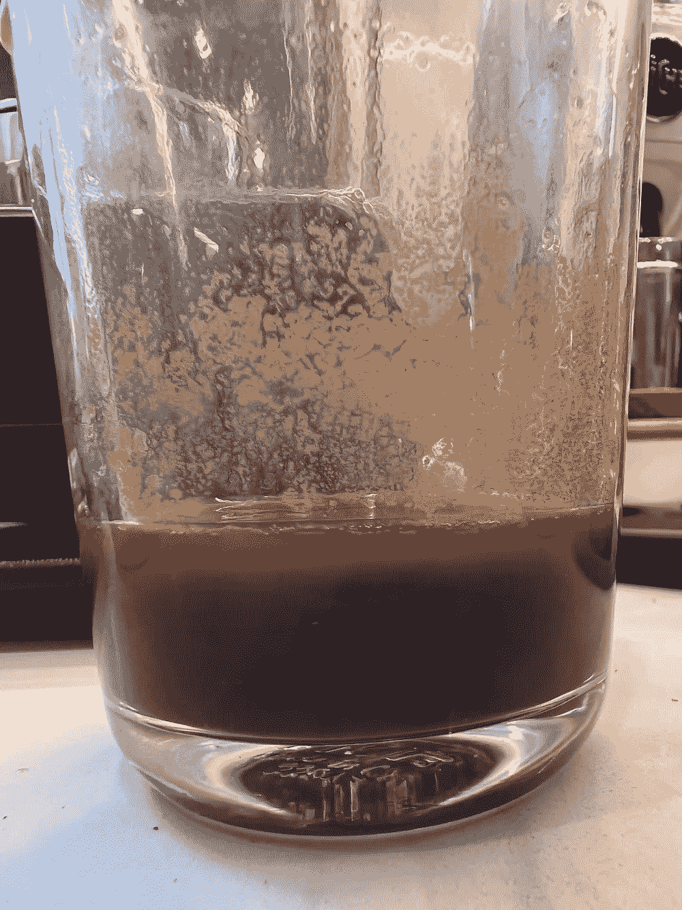
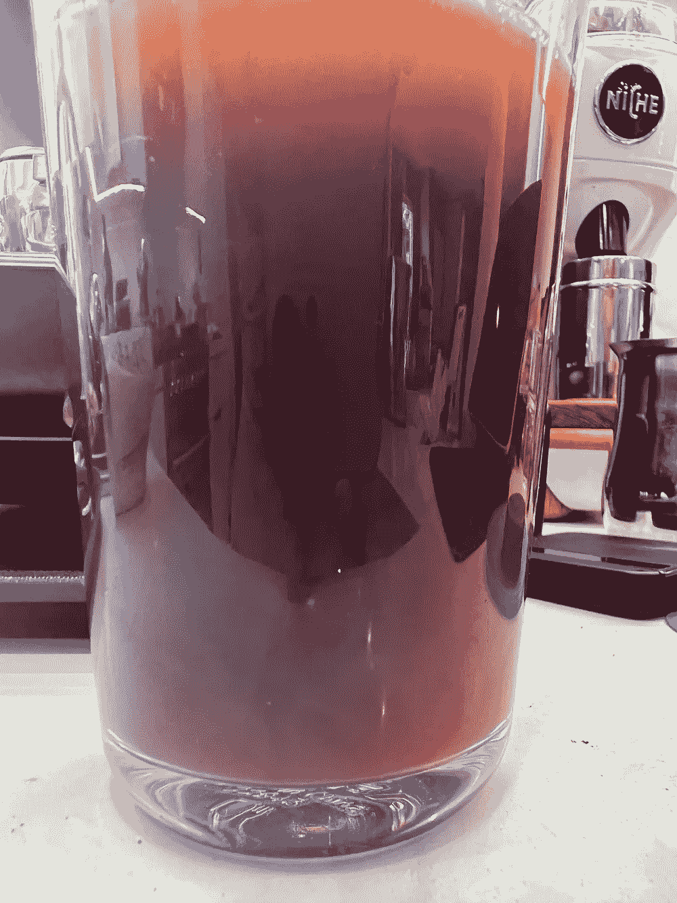
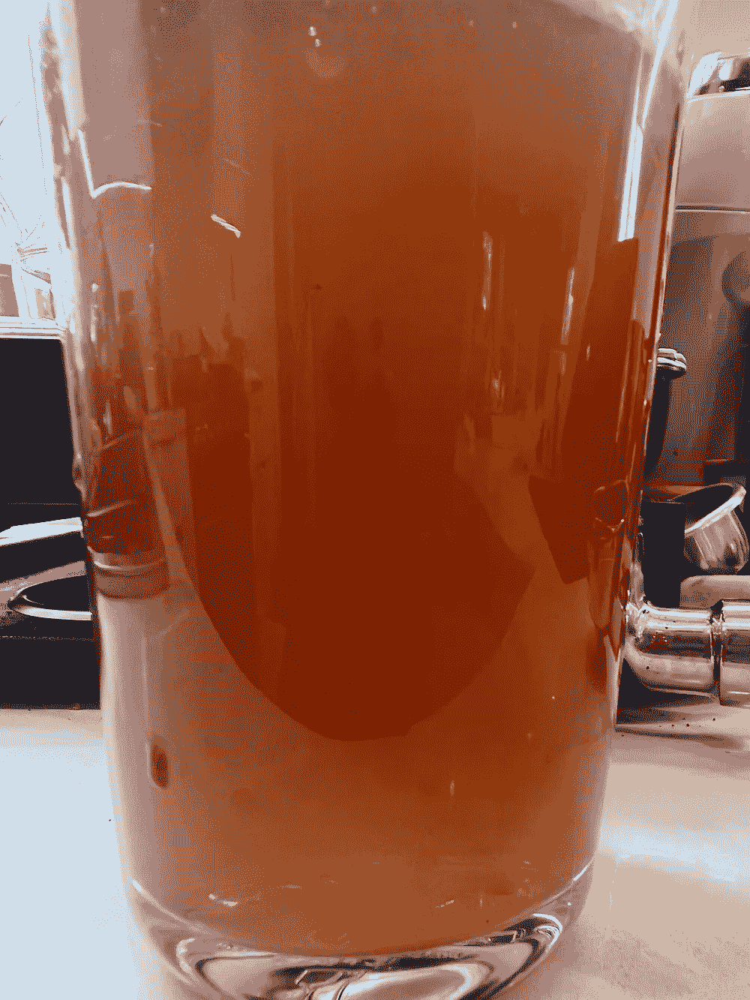
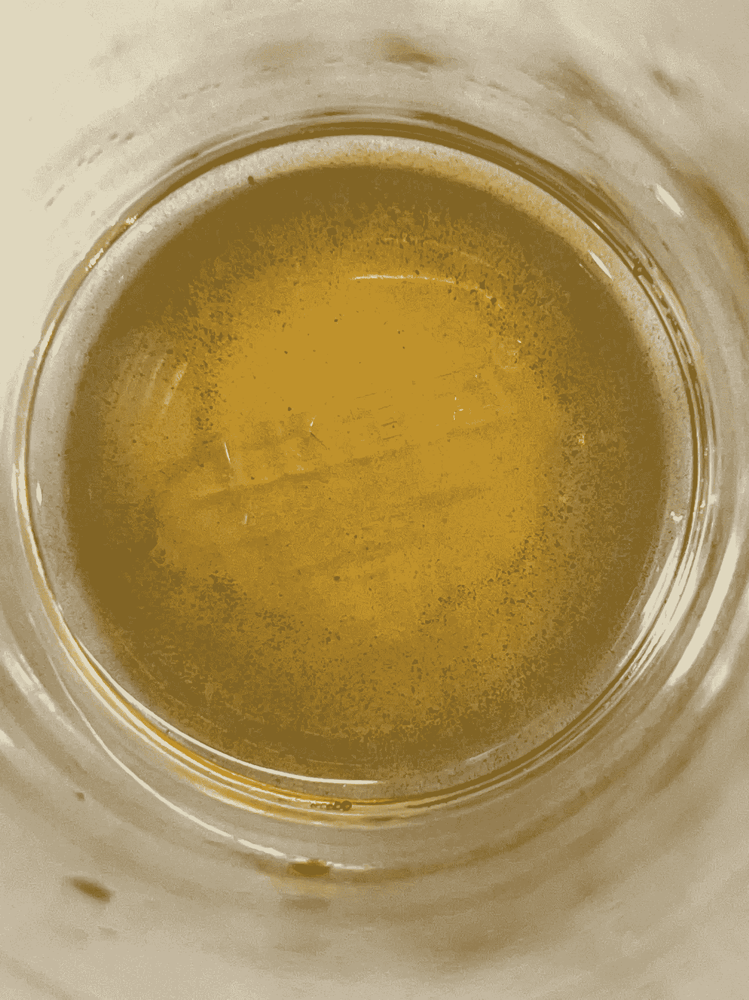

# 数一杯浓缩咖啡中的粉末

> 原文：<https://medium.com/nerd-for-tech/counting-fines-in-a-cup-of-espresso-f3e2ea11d20b?source=collection_archive---------4----------------------->

## 咖啡数据科学

## 试图测量小东西

当讨论咖啡和微粒迁移理论时，人们通常会谈到杯子里的咖啡渣数量。我想测量这个变量，最近一个关于[强制微粒迁移](https://youtu.be/67FnyGrlP2c)的实验让我觉得我可以测量它。

所以首先，我拉了一个镜头，一个长镜头。我的大部分镜头都很短，但我想最大限度地让杯子里有多少地面。我以 3:1 的比分结束了比赛。

然后我让弹丸冷却下来，颗粒会沉淀在底部。之后，我用一个火鸡涂油器小心翼翼地去除上面的水。

然后我把水放回杯子里。能够看到咖啡渣的诀窍是从液体咖啡中分离出颜色。我重复这个过程一次，得到一个足够浅颜色的液体。

稀释溶液的第 1 轮和第 2 轮

然后我可以看到底部的颗粒。肯定有一些，但数量少于 0.01 克。我有一个视频显示粒子在溶液中旋转。

 [## 分离浓缩咖啡中的咖啡粉末

### 编辑描述

youtube.com](https://youtube.com/shorts/K9Y6CvYgvuc) 

这是杯子底部的图像。

在一杯浓缩咖啡的过程中，咖啡渣确实会留在杯子里，但数量并不可观。我确信一些可能仍然悬浮在液体咖啡中，需要做更多的研究和实验来证明它们显著影响味道。这个实验很容易复制。

如果你愿意，可以在[推特](https://mobile.twitter.com/espressofun?source=post_page---------------------------)、 [YouTube](https://m.youtube.com/channel/UClgcmAtBMTmVVGANjtntXTw?source=post_page---------------------------) 和 [Instagram](https://www.instagram.com/espressofun/) 上关注我，我会在那里发布不同机器上的浓缩咖啡照片和浓缩咖啡相关的视频。你也可以在 [LinkedIn](https://www.linkedin.com/in/dr-robert-mckeon-aloe-01581595) 上找到我。也可以在[中](https://towardsdatascience.com/@rmckeon/follow)关注我，在[订阅](https://rmckeon.medium.com/subscribe)。

# [我的进一步阅读](https://rmckeon.medium.com/story-collection-splash-page-e15025710347):

[我未来的书](https://www.kickstarter.com/projects/espressofun/engineering-better-espresso-data-driven-coffee)

[我的链接](https://rmckeon.medium.com/my-links-5de9eb69c26b?source=your_stories_page----------------------------------------)

[浓缩咖啡系列文章](https://rmckeon.medium.com/a-collection-of-espresso-articles-de8a3abf9917?postPublishedType=repub)

[工作和学校故事集](https://rmckeon.medium.com/a-collection-of-work-and-school-stories-6b7ca5a58318?source=your_stories_page-------------------------------------)