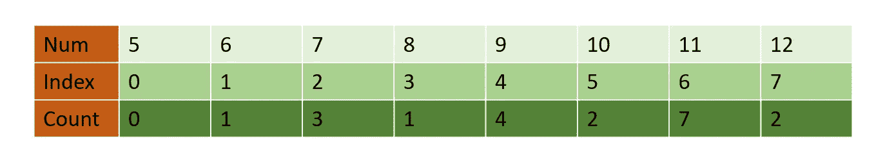
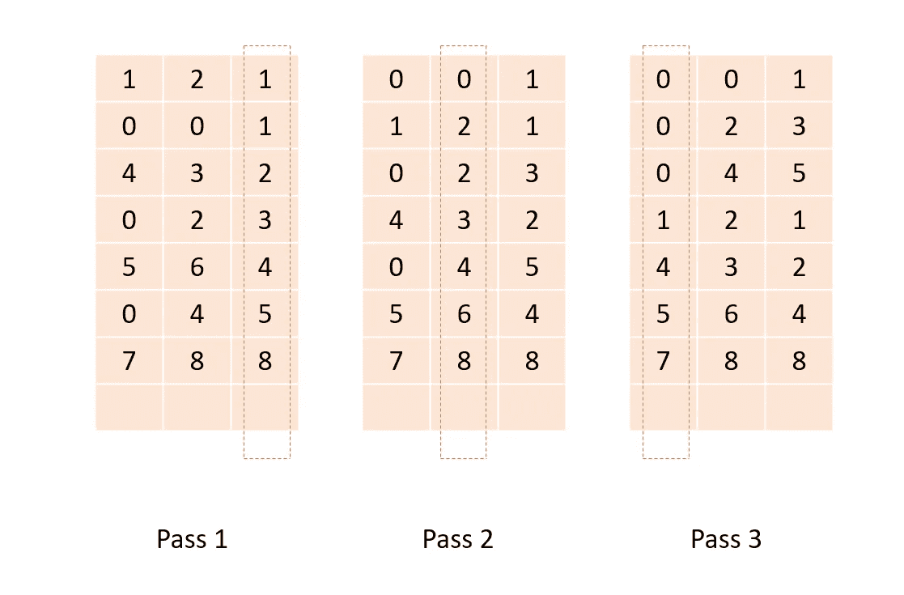

# 计数排序和基数排序

> 原文：<https://medium.com/nerd-for-tech/counting-sort-radix-sort-ccd9f77a00a2?source=collection_archive---------5----------------------->


由 [Unsplash](https://unsplash.com/collections/5844710/sorting?utm_source=unsplash&utm_medium=referral&utm_content=creditCopyText) 上的 [CHUTTERSNAP](https://unsplash.com/@chuttersnap?utm_source=unsplash&utm_medium=referral&utm_content=creditCopyText) 拍照

在这篇博客中，我们将介绍两种最常见的非基于比较的排序算法。但在此之前，我们为什么需要非比较排序呢？

基于比较的排序算法有一个 ***下界的*** `***O(nlogn)***` ***操作*** 来对`n`元素进行排序。这是因为排序数组是 n！我们可以排列`n`数字的排列。每次我们做比较的时候，我们实际上将排列`n`数字的排列数量减少了一半。为了找到实际的安排，我们至少需要做`log2N!`。为了提高这个下限，我们使用非比较排序算法，如计数&基数排序。这两种排序算法 ***(计数&基数)对*** `***O(n)***` ***运算*** 中的数据进行排序。他们通过对数据做出某些假设来做到这一点。这些假设使他们能够在不对元素本身进行比较的情况下进行排序。

# 计数排序

计数排序是一种线性时间排序算法，当元素在等于 lower_bound -upper_bound 的固定范围 k 内时，它在 O(n+k)时间内对数据进行排序。例如，对于如下生成的数组:

```
import random
randomlist = [random.randint(5,12) for i in range(20)]
print(randomlist)[11,11,7,9,9,12,11,10,11,9,12,7,11,9,7,8,11,11,6,10]
```

我们将有一个大小为(12–5+1)的数组。其中，第 0 个索引代表值为 5 的项目，第 1 个索引代表值为 6 的项目，第 2 个索引代表值为 7 的项目，依此类推，第 7 个索引代表值为 12 的项目。



```
def countSort(array):
    lower_bound , upper_bound = min(array), max(array)
    counter_array = [0]*(upper_bound-lower_bound+1)
    for item in array:
        counter_array[item-lower_bound] += 1
    pos = 0
    for idx, item in enumerate(counter_array):
        num = idx + lower_bound
        for i in range(item):
            array[pos] = num
            pos += 1
    return array
```

我们看到的一件事是，因为我们用索引映射值，所以我们不能用这种方法对一个有负值的数组进行排序。所以我们稍微修改一下这个方法。我们将最小元素(负)的绝对值加到所有元素上。这样，第 0 个索引将指向值为 0 的元素。一旦我们对数组进行了排序，我们只需从每个元素中减去相同的值，就可以得到包含负值和正值的排序后的数组。修改以处理负数:

```
def countSort(array):
    i_lower_bound , upper_bound = min(array), max(array)
    lower_bound = i_lower_bound
    if i_lower_bound < 0:
        lb = abs(i_lower_bound)
        array = [item + lb for item in array]
        lower_bound , upper_bound = min(array), max(array)

    counter_array = [0]*(upper_bound-lower_bound+1)
    for item in array:
        counter_array[item-lower_bound] += 1
    pos = 0
    for idx, item in enumerate(counter_array):
        num = idx + lower_bound
        for i in range(item):
            array[pos] = num
            pos += 1
    if i_lower_bound < 0:
        lb = abs(i_lower_bound)
        array = [item - lb for item in array]
    return array
```

## 计数排序的限制

我们不能在 k 在范围(n)内的地方使用计数排序，因为计数排序将花费`O(n^2)`比基于比较的排序算法更差。为了解决这个问题，我们使用基数排序。

# 基数排序

基数排序的思想是从最低有效位到最高有效位逐位排序。基数排序使用桶排序作为子例程进行排序。这个算法利用了十进制系统中的任何数字都可以用从 0 到 9 的数字来表示的事实。因此，在这个算法中，我们每次创建 10 个桶。例如，对于给定的数组`[121, 432, 564, 23, 1, 45, 788]`,将有三次通过。在每一遍中，数组按相应的遍位排序(LSB → MSB)。



使用计数排序作为子程序的基数排序:

```
def radixSort(array):
    n_digits = len(str(max(array)))
    size = len(array)
    for dgt in range(n_digits):
        count_array = [0]*10
        sorted_array = [0] * size
        for num in array:
            idx = (num//(10**dgt))%10
            count_array[idx] += 1

        for i in range(1, 10):
            count_array[i] += count_array[i - 1] 

        i = size - 1
        while i >= 0:
            idx = (array[i] // (10**dgt))%10
            sorted_array[count_array[idx] - 1] = array[i]
            count_array[idx] -= 1
            i -= 1

        array = sorted_arrayreturn array
```

使用计数排序来实现基数排序会使代码稍微复杂一些。为了降低复杂性，我们可以使用桶排序作为子程序。这使得代码更具可读性。

```
import itertools
def radixSort(array):
    n_digits = len(str(max(array)))
    for dgt in range(n_digits):
        buckets = [[] for i in range(10)]
        for num in array:
            idx = (num // (10**dgt)) % 10
            buckets[idx].append(num)
        array = list(itertools.chain(*buckets))
    return array
```

修改为负数排序:

```
def radixSort(array):
    min_num = min(array)
    if min_num < 0:
        lb = abs(min_num)
        array = [item + lb for item in array]
    n_digits = len(str(max(array)))
    for dgt in range(n_digits):
        buckets = [[] for i in range(10)]
        for num in array:
            idx = (num // (10**dgt)) % 10
            buckets[idx].append(num)
        array = list(itertools.chain(*buckets))
    if min_num < 0:
        lb = abs(min_num)
        array = [item - lb for item in array]
    return array
```

希望这对你有帮助。