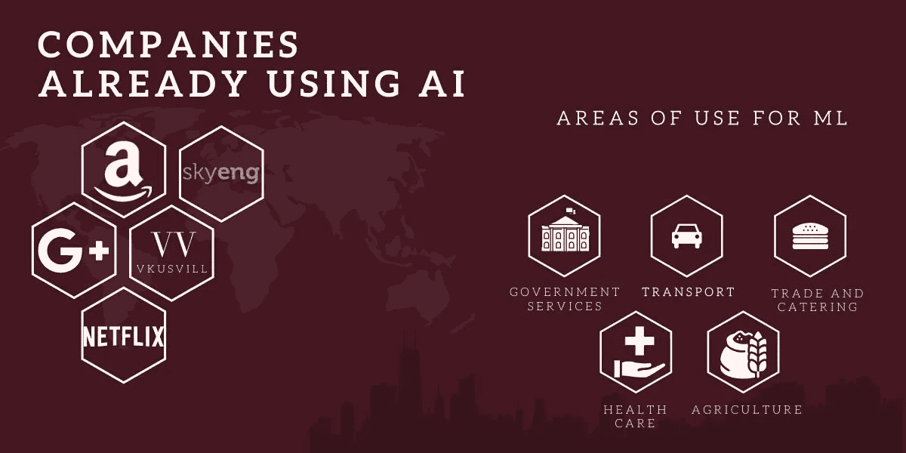
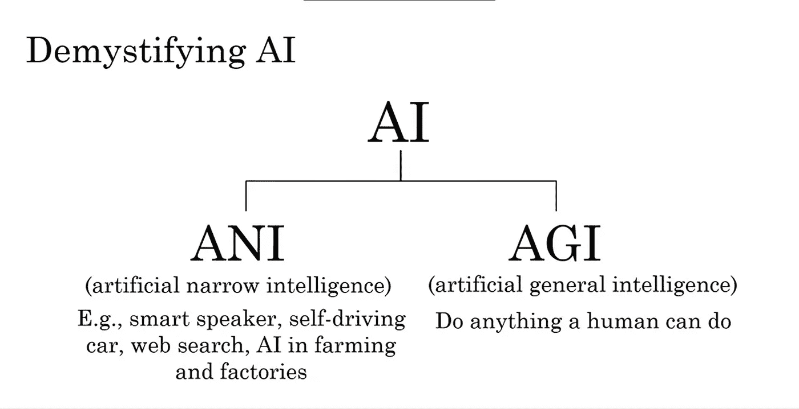
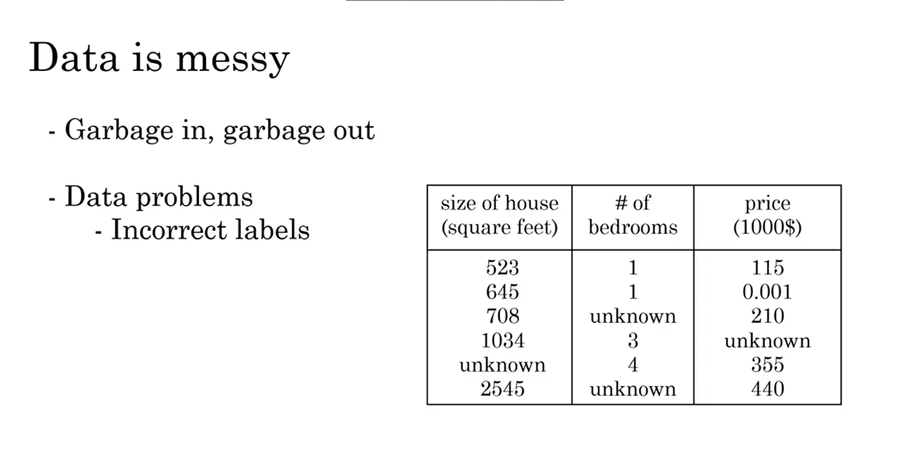
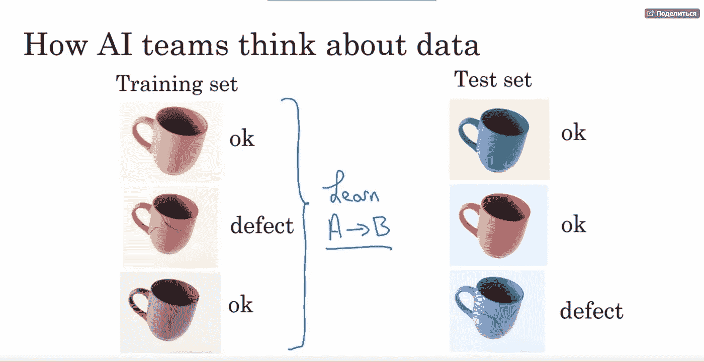
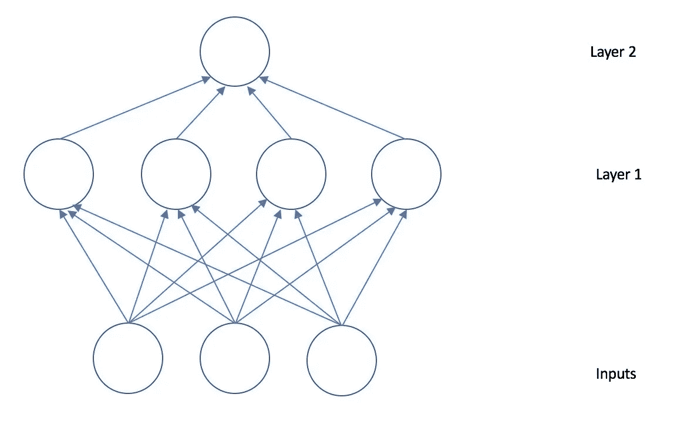
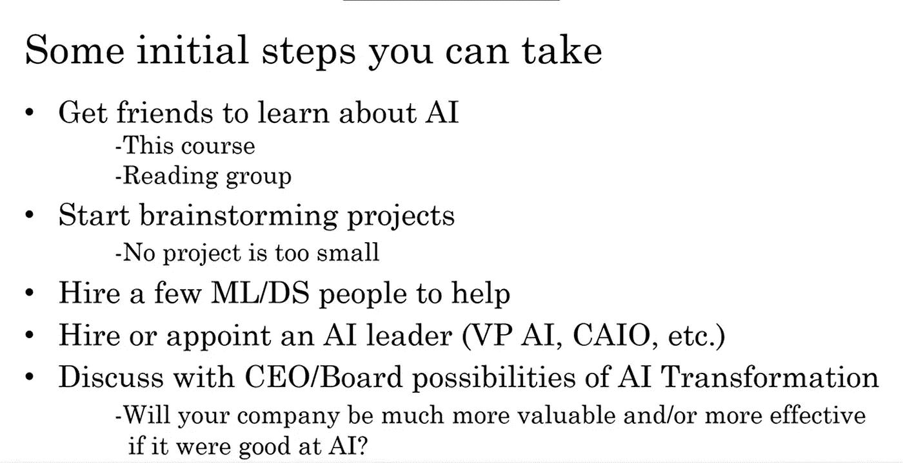
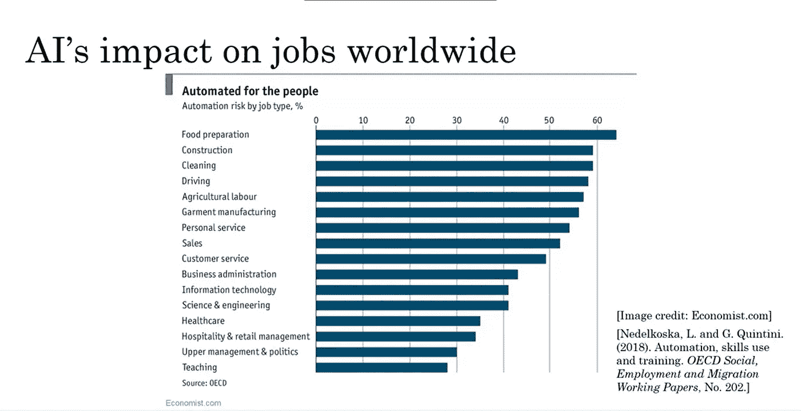

# 你口袋里的 Coursera:谷歌大脑联合创始人 10 分钟内的最佳课程

> 原文：<https://medium.com/nerd-for-tech/coursera-in-your-pocket-the-best-course-from-google-brain-co-founder-in-10-minutes-c14f1e886470?source=collection_archive---------14----------------------->

# 10 分钟的机器学习基础:吴恩达的课程总结——斯坦福大学教授，Coursera 平台的联合创始人，Google Brain 的联合创始人，来自 VisionSystems developers 的百度副总裁。

> 如何在 10 分钟内完成一个月的人工智能(AI)课程？

我的名字是马克西姆·萨夫琴科，我是计算机视觉公司的创始人。我们基于机器学习创造完整的产品，因此坐在两把能力的椅子上:产品和技术。对我们来说，重要的是客户也了解 ML 的全部价值和所有限制。要做到这一点，阅读我们来自吴恩达的关于机器学习的每月课程的简短版本就足够了。我们已经自己完成了本课程，建议您完全在 Coursera 平台上完成。我们不保证在这个课程之后你会开始开发 ML 项目，但是你会理解的。

## 第 1 部分:什么是机器学习？

人工智能(AI)的兴起在很大程度上是由机器学习推动的。使用中最常见的人工智能类型是学习 A-B 或输入输出(A)映射的人工智能。这就是所谓的监督学习。也就是所有的机器学习都是基于输入输出的原理。你有 A 和 B，这些是你的数据。而你如何确定什么是 A，什么是 B，会训练你的智力。

例如，你有一只猫。更准确地说，是他的照片。或者更准确地说，很多照片。这是输入端的数据“A”。然后当我们给它一张它还没看过的新图时，还有 AI 反应(这些是 B AI 反应)。经过适当训练的人工智能将正确地分析图像，并告诉你猫是否在上面。但是可能会有更多的错误。

***人工智能分为两种:***

*   **人工狭义智能** (ANI)是一种人工智能，旨在解决特定的任务，如猜测图片或下棋。
*   **通用(人工通用智能，AGI)** 是一种通用的人工智能，与人类不相上下，能够解决许多不同的任务。

记住猫的例子，智能本身研究数据“A”，分析数据“B”。一方面，从输入到输出(从 A 到 B)的转换似乎相当有限。但是当你为它找到合适的应用场景时，它会变得非常有价值。监督学习的想法已经存在了几十年。但在过去的几年里，进步变得如此明显。

为了让你的人工智能工作并产生结果，你需要大量人工智能可以分析的数据。在这种情况下，质量和数量一样重要:这完全取决于你的目标，比如说，如果你想教会智力去判断自行车和汽车在哪里，那么关于猫长什么样的数据不太可能帮到你。

# 数据

数据在机器学习中起着极其重要的作用。人工智能就是在它们身上学习，然后给出结果。数据有几种类型:非结构化和结构化。第一类是非常容易解释的数据类型:图像、声音或文本。某些类型的人工智能技术可以处理:

*   识别猫的图像；
*   音频识别语音；
*   文本——理解电子邮件是垃圾邮件；

结构化数据是存在于一个巨大的电子表格中的数据，处理非结构化数据的方法与处理结构化数据的方法略有不同。

要正确使用数据，最好带一个专门研究机器学习的团队。人工智能团队将向您展示您需要输入什么数据，以便智能在所有狗中正确识别猫。如果相当简单，那么你需要一个猫的肖像，但是一只爪子按在表面上的力度不是。

## 什么是机器学习？

总共有 3 种类型:

*   有老师(监督机器学习)。
*   **没有老师(无监督机器学习)。**
*   **深度学习。**

## 和老师在一起

老师给计算机一个数据集:介绍性信息(房间数量、期望价格、房屋面积等。)，然后立即给它关于房子的最佳选择的数据。介绍性的越多，分析就越准确。

这就是识别照片中物体的程序的工作方式——该程序扫描数百万张带有描述的图像，找到共同特征，并已经学会给图像本身赋予描述。

训练结束后，老师给她一张没有描述物体的照片，程序问“这是一棵树吗？”。如果老师回答“是”，那么程序就明白它得出了正确的结论。

对象识别系统几乎可以用于任何行业:无论是使用该技术避开障碍物的自动驾驶汽车，还是监控动物或其安全的农业。

## 没有老师(无监督的机器学习)

这里有一个更简单的例子——游戏“蛇”，程序根据一些物体离它有多远的数据来选择轨迹。而且，如果程序得到更多的分数，它会认为这是一个肯定的答案，并在相同的方向上学习

在没有明显解决方案的情况下，这种方法很好。一个很好的例子是营销:人工智能不理解向一个不需要它的人提供类似的产品是不合逻辑的，即使它能赚钱。

神经网络也可以成对训练。这就是生成-对抗网络的工作原理。它由网络 G 和 D 组成——第一个基于真实图像生成样本，第二个试图区分真实样本和生成的样本。

这项技术用于恢复图像质量或图像上丢失的物体。还记得你从照片上去掉了不必要的细节吗——就是这个。顺便说一下，使用 GAN 的公司之一是脸书。

## 深度学习

深度学习可以在有老师和没有老师的情况下进行，但它意味着对大数据的分析——如此多的信息以至于一台计算机不够用。因此，深度学习使用神经网络来工作。

神经网络允许你将一个大任务分成几个小任务，并将它们委托给其他设备。例如，一个处理器收集信息并将其传输到另外两个处理器。这些处理器依次对其进行分析，并将其传递给另外四个处理器，这四个处理器执行更多的任务，并将其传递给下一个处理器。

**在人工智能的帮助下，您需要做些什么来转变您的企业:**

*   完成试点项目，快速取得成效。
*   打造自己的 AI 团队。
*   提供广泛的人工智能培训。
*   发展人工智能战略。
*   发展内部和外部交流。

**1。开展试点项目，快速见效**

对于你的第一个人工智能项目，完成它们比它们特别有价值更重要。项目需要非常重要，这样第一次成功将有助于你的公司熟悉人工智能，并说服你公司的其他人投资更多的人工智能项目。它们不应该小到别人会觉得微不足道。飞轮必须旋转，你的 AI 团队才能获得动力。

*对于第一个人工智能项目，您可以提供以下特征::*

理想情况下，一个新的或外部的人工智能团队(可能对你的业务没有深入的了解)应该能够与你的内部团队(拥有业务知识)合作，并创造出在 6-12 个月内交付成果的人工智能解决方案。

这个项目必须在技术上可行。太多公司正在启动无法用现代人工智能技术实施的项目。信任人工智能工程师在项目开始前检查项目，这将增加你对其可行性的信心。

> 你需要有一个明确的、可衡量的目标，为企业创造价值。

**2。创建你自己的或者雇佣一个人工智能团队**

虽然拥有广泛人工智能技术专业知识的外包合作伙伴可以帮助你更快地获得初始提升，但从长远来看，与你自己的人工智能团队一起运行一些项目会更有效率。什么离你更近——只有你自己的选择

在互联网影响力日益增强的时代，聘用 IT 主管(CIO)已成为许多公司制定统一互联网使用战略的重要时刻。相比之下，那些已经进行了许多独立实验的公司——从数字营销和数据科学实验到推出新网站——在这些小型试点项目未能扩大规模以转变公司其余部分时，未能利用互联网的力量。

> 人工智能部门的主要职责是创建人工智能能力，以支持整个公司。

启动最初的跨职能人工智能项目，以支持不同的部门。一旦初始项目完成，就建立循环过程来持续交付有价值的 AI 项目。

为征聘和保留工作人员制定商定的标准。

开发适用于不同部门的全公司平台，而不太可能由一个单独的部门开发。例如，与首席技术官/首席信息官/ CDO 合作开发通用数据仓库标准。

许多公司的部门向总经理(CEO)报告。通过新的人工智能部门(AI)，您将能够将人工智能人才应用到不同的部门，以实施跨职能项目。

目前，人工智能专家正在进行一场战争，不幸的是，大多数公司将很难迅速聘请到一名优秀的专家。然而，培训你现有的团队也是一个很好的方法，可以在内部获得很多新的专家。

**3。提供广泛的人工智能培训。**

随着数字内容的增长，包括 Coursera、电子书和 YouTube 视频等 MOOCs(大规模在线开放课程)，培训大量员工变得更具成本效益。

AI 会改变很多活动。你需要教每个人他们将需要什么来适应人工智能时代的新角色。咨询专家可以让你为你的团队制定个人训练计划。

**4。开发人工智能战略**

人工智能战略将引导你的公司既创造价值又建立防御。一旦团队开始看到初始人工智能项目的成功，并对人工智能有了更深入的理解，你就可以确定人工智能可以创造最大价值的地方，并在这些地方集中资源。

一些高管会认为开发人工智能战略应该是第一步。但是，大多数公司将无法制定一个经过深思熟虑的人工智能战略，除非他们有一些基本的人工智能经验，可以在步骤 1-3 中获得。你建造防御的方式也随着人工智能而进化。

*这里有一个方法:*

利用人工智能创造特定于你所在行业的优势:与其试图在人工智能方面与谷歌等领先的技术公司“普遍”竞争，我建议成为你所在行业的领先人工智能公司，在那里开发独特的人工智能能力将让你获得竞争优势。AI 如何影响你公司的战略，取决于具体的行业和情况。

## AI 转型计划:AI 时代如何经营公司？

例如，谷歌、百度、必应和 Yandex 等领先的网络搜索引擎拥有庞大的数据资源，显示用户在各种搜索查询后点击了哪些链接。这些数据帮助公司创建更准确的搜索引擎，这反过来又帮助他们吸引更多的用户，并导致更多的用户数据。

数据是人工智能系统的关键资产。因此，最大的人工智能公司也有复杂的数据战略。您的数据策略的关键要素可能包括:

数据的收集。是的，你可以在少量数据的基础上建立训练，但是最好比你需要的多一点。AI 团队使用非常复杂的多年策略来收集数据，收集数据的具体策略取决于行业和情况。例如，谷歌和百度有各种各样的免费产品，这些产品没有货币化，但允许他们在其他地方获取数据以盈利。

统一数据仓库:不要将不同的数据库分散在不同的部门，考虑将它们集中在一个或少数几个存储库中。

**5。发展内部和外部交流**

人工智能将对你的业务产生重大影响。你应该让所有关键的利益相关者了解人工智能技术，因为它会影响他们的利益。以下是您应该为每个受众考虑的内容:

投资者关系:像谷歌和百度这样的领先公司现在是更昂贵的公司，部分原因是它们的人工智能能力以及人工智能对其收益的影响。解释人工智能如何为你的公司创造价值，描述你不断增长的人工智能能力，以及经过深思熟虑的人工智能战略，将有助于投资者正确评估你的公司。

与政府的关系:在高度监管的行业(无人驾驶汽车、医疗保健)中，公司面临着遵守法律的独特挑战。开发一个可信和令人信服的叙事，解释你的人工智能项目可以给行业或社会带来的价值和好处，是建立信任和善意的重要一步。在项目实施过程中，这应该与与监管机构的直接沟通和持续对话相结合。

客户和用户培训:人工智能可能会给你的客户带来显著的好处。确保分发适当的营销材料和产品路线图。

专家/招聘:由于人工智能专家的缺乏，一个好的雇主品牌对吸引和留住这类专家的能力有着重大影响。人工智能工程师希望从事有趣和有意义的项目。适度的努力展示你最初的成功会有很大的不同。

公司正在各个领域积极使用人工智能开发。我们刚刚告诉了您使用机器学习的主要方面，以及如何评估它在您的特定情况下的相关性。

## 一般来说，不同的业务适合与 AI 合作:

*   那些明白他们想在输出端得到什么，但不完全明白在输入端应该得到什么的人；
*   他们非常清楚应该给 AI 输入什么数据，但是不确定他们想要得到什么；
*   那些处于十字路口的人，不完全明白什么是入口，什么是出口。

但在所有情况下，人们都缺乏对人工智能在特定情况下有多大用处的认识，以获得更多利润或降低成本。也许分配预算来测试假设甚至没有意义，因为它不适用于他们的业务。

无论如何，这种问题都是通过咨询开发团队来解决的，开发团队会告诉你是否值得开始在你的业务中实施 AI，或者是否值得等待这种技术。

我们认为，专门做 ML 的公司，首先应该开发市场，负责任。例如，我们的集思广益过程是基于已经实施的项目的经验，考虑来自行业的已经实施的例子，并理解现实中特定案例的适用性。这种工作方法对于了解市场的需求和案件的扩大是必要的。

机器学习市场需要发展，以便人们自己能够理解它可以带来什么价值，以及何时，相反，还不值得进入它。作为一个例子，我们试图分享最佳实践，并在第一步或如何开发已经工作的人工智能产品中，在专家的帮助下进行案例分析。例如，你需要第三种意见或帮助测试新的假设。