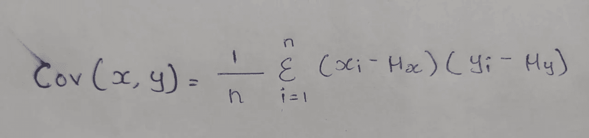
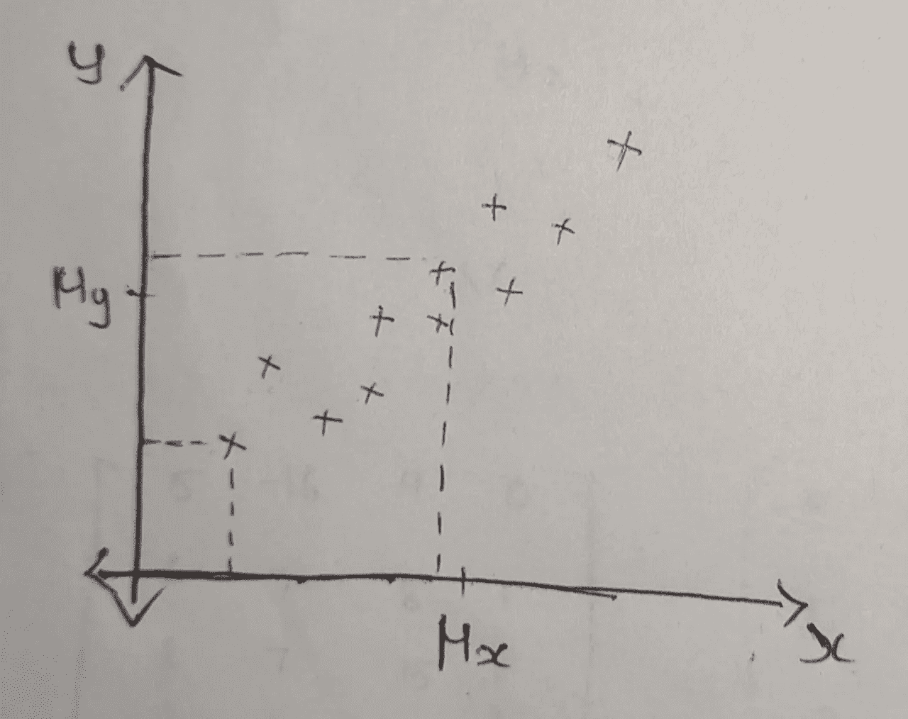
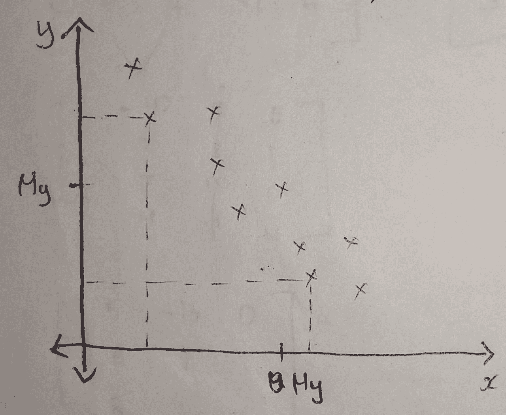

# 协方差

> 原文：<https://medium.com/nerd-for-tech/covariance-59d4075c530e?source=collection_archive---------21----------------------->

两个变量之间**方向关系**(无论是+ve 还是-ve)的度量

Co(二)+方差=协方差

**方差**:一个**单变量**变化多少

**协方差:**两个随机变量**一起变化的多少**

两个变量 x 和 y 之间的协方差如果由下式给出，

协方差方程

在哪里，

n——观察次数

μ——x 和 y 的总体平均值

两个变量的协方差只说**正或负**但没说多少正或负。

**正协方差:**

正协方差

这里很明显，当 x 增加时，y 也增加。

**负协方差:**

负协方差

这里我们可以看到，当 x 增加时，y 减少。

## **范围:**

许多人过去常常混淆协方差和相关性的范围。

**-无穷大到+无穷大**是协方差的范围

协方差公式将得到范围从-无穷大到+无穷大的值。这个数量级(数值)没有给出有用的解释，所以我们必须只考虑结果的方向(符号+或-)。