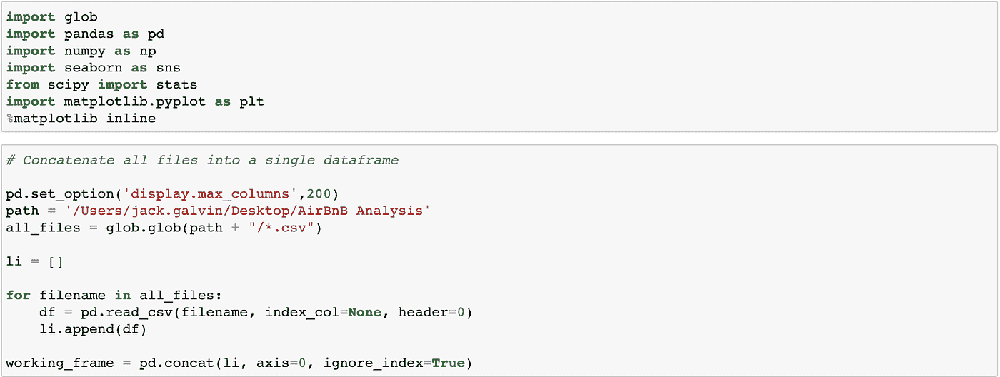
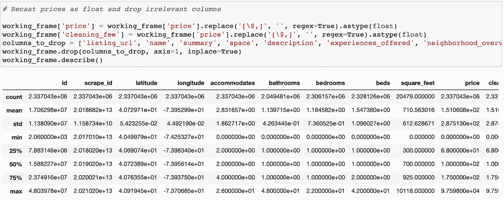
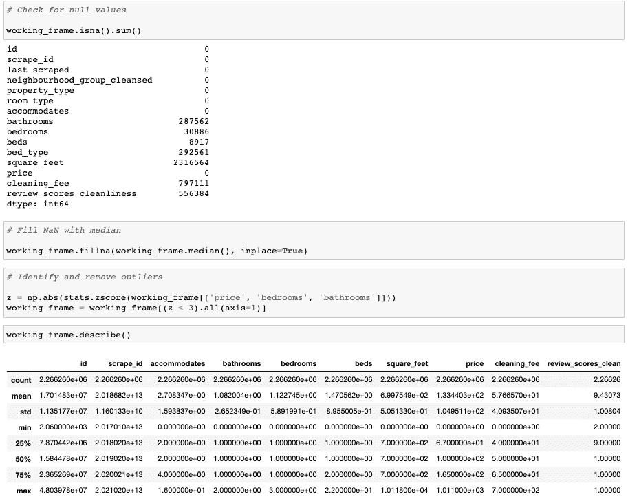
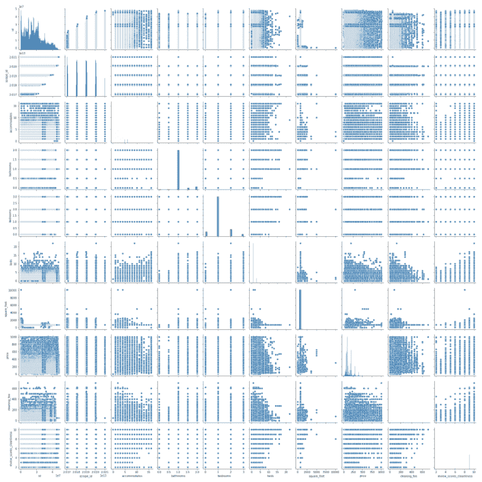
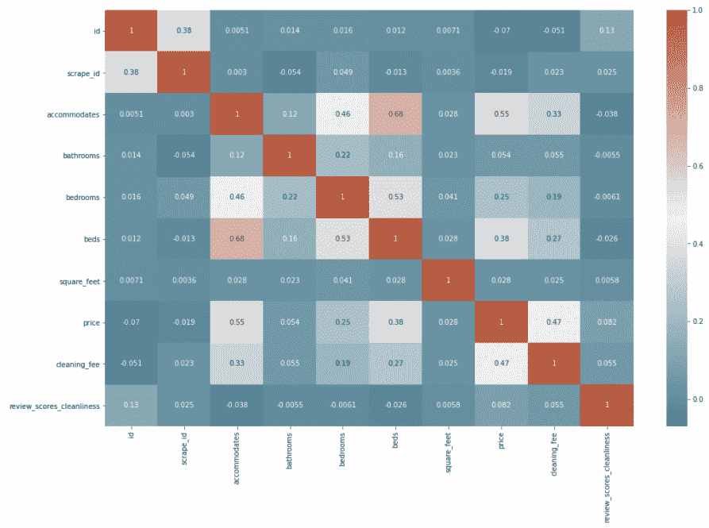
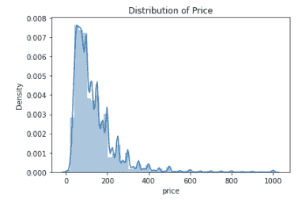
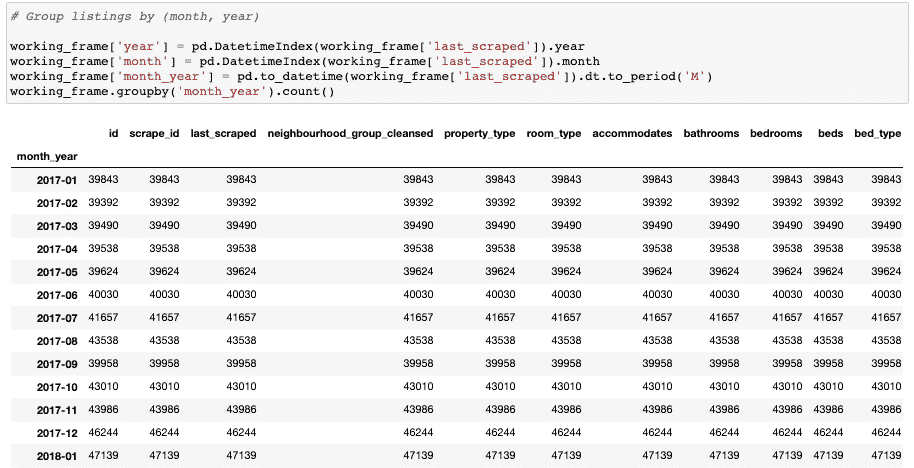
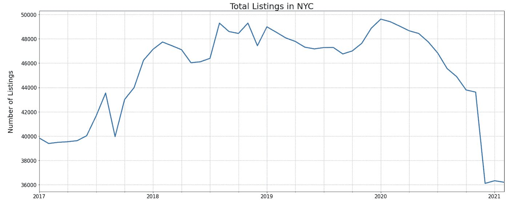
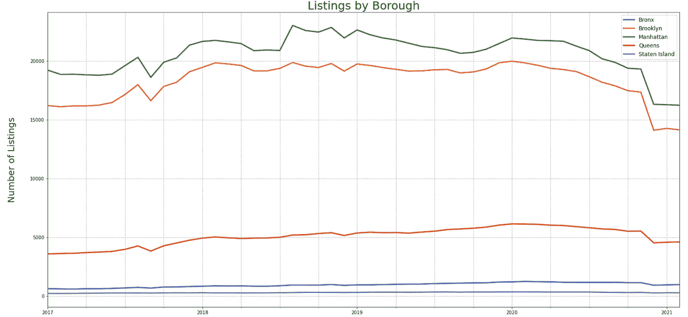
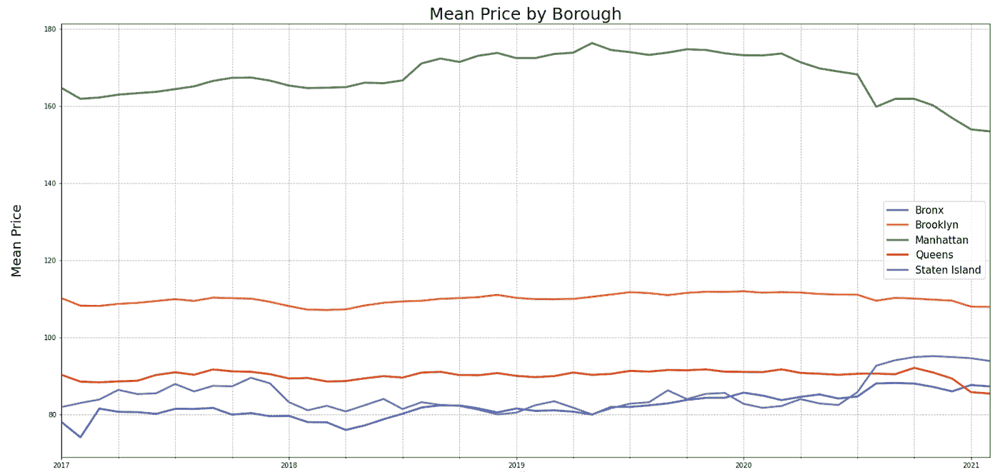

# 新冠肺炎和纽约市的对等住房市场

> 原文：<https://medium.com/nerd-for-tech/covid-19-and-new-york-citys-peer-to-peer-housing-market-295f23579169?source=collection_archive---------16----------------------->

Airbnb 房源数据的探索性数据分析

***简介***

大约一年前，当新冠肺炎开始强制实施大规模全城封锁时，我的生活和其他 65 亿人的生活被颠覆了。可以说，主要城市受到的冲击最大，纽约也不例外。曾经繁华的大都市很快变成了后世界末日时代的鬼城。像许多其他人一样，我逃离了家乡，现在居住在阳光明媚的加利福尼亚，尽管我很钦佩那些留下来的人。

由于我的雇主制定了灵活的在家工作政策，从技术上讲，我可以在美国的任何地方住在*。我并不孤单——全国各地的其他公司都实施了类似的政策。有这么多的选择，很难决定在一个特定的地方。那么，为什么不在选择获胜者之前先试驾几个地方呢？*

我的几个朋友和家人都成了游牧民族。在摆脱了纽约市的公寓后，他们现在使用 Airbnb 探索他们会考虑搬迁的新城镇和城市。这使我提出了以下问题:

1.  纽约市的租赁市场受到了沉重打击——点对点(P2P)住房市场表现如何？

为了回答上面的问题，我使用 Airbnb 内部的[数据，对 2017 年初以来的所有房源进行探索性数据分析。请注意，上述问题的答案依赖于 Airbnb 数据代表纽约市 P2P 住房市场的假设(在我看来，这是一个安全的假设，至少对于探索性数据分析来说是如此)。](http://insideairbnb.com/get-the-data.html)

***数据准备和清理***

如上所述，我从 Airbnb 下载 2017 年以来的所有房源文件。我使用一个简单的 for 循环将每个单独的文件放入一个合并的数据帧中。我立即注意到数据集需要清理。

每晚的价格值和清洁费都存储为字符串，所以我将它们都转换为浮点数。此外，我删除了几个与我的分析无关的列。

该数据集包含超过 230 万个房源，其中大部分都是一床一卫的配置，面积中位数为 700 平方英尺，对于纽约市来说，这似乎是正确的。151 美元的平均每夜价格也是合理的，但是 97，598 美元的最高每夜价格表明存在需要剔除的异常值。现在似乎也是检查空值的好时机。

我注意到 price 没有空值，但是其他变量有几个空值。我决定用该特定列的中值填充 NaN 值。接下来，我使用 *z* 分数来标准化价格、卧室和浴室列，并移除任何 *z* 分数大于 3 的异常值。这从数据集中削减了大约 100，000 条记录，留下了一个更现实的最高价格。

***探索性数据分析与可视化***

现在我已经清理了数据集，我使用 Seaborn 的 pairplot 开始分析变量之间的关系。床位数和一个列表可以容纳的客人数之间似乎存在正相关关系，但考虑到 pairplot 的分辨率和大小，其他关系就更难解读了。

为了更深入地挖掘，我创建了一个热图来量化每个变量之间的关系。我使用 Spearman 等级顺序相关，因为它没有对数据集中变量的分布做任何假设。正如所料，列表中可以容纳的客人数量和床位数量之间存在正相关关系。毫不奇怪，卧室和价格也与房源能容纳的客人数量成正相关。

接下来，我确定所有列表的夜间价格是否是正态分布的(如果是，我可以使用它来执行回归，以尝试预测未来的价格)。我可以看出价格显然不是正态分布的，虽然我可以对数据集进行对数转换以使其更为正态，但我决定不这样做，因为其他人已经创建了一个算法来预测 Airbnb 纽约市的价格，与此分析无关。

该数据集目前的结构是，从 Airbnb 网站上抓取的每个房源都有一个相应的“last_scraped”日期——但这个日期不利于绘制一段时间内房源的数量和价格。因此，我使用 Pandas 的 DatetimeIndex 来分离月和年方面，并将它们连接到一个新的字段中，称为“month_year”。

终于！我能想象出我要策划的事情。从 2017 年 1 月到 2020 年 1 月，上市总数稳步上升，但一旦第一个正式的新冠肺炎病例在纽约市宣布(2020 年 2 月)，上市总数就会急剧下降。然而，这种从 2017 年 1 月到 2020 年 1 月的上升趋势并不令人惊讶，因为[房源随着租金](https://hbr.org/2019/04/research-when-airbnb-listings-in-a-city-increase-so-do-rent-prices)上涨(我经历过这种上涨，对此并不陌生！).虽然我可以提取公开的房源数据，将其与 Airbnb 数据相关联，但我决定不这样做，因为这已经在上面的超链接中完成了。我质疑每个行政区在多大程度上成比例地受到影响。

新冠肺炎似乎对皇后区、布朗克斯区和斯塔滕岛的挂牌总数没有什么影响。曼哈顿和布鲁克林的挂牌数量下降的速度大致相等，这表明新冠肺炎对这两个区的挂牌数量有类似的影响。

最后，我们来看看价格。曼哈顿每晚的平均房价大幅下跌( *t = -15.14，p < 0.01* )，受影响的程度比其他任何一个区都要大。有趣的是，尽管房源总数的下降幅度与曼哈顿大致相当，但布鲁克林的平均房价几乎没有受到影响。事实上，布鲁克林的每晚房价明显低于曼哈顿( *t = -36.29，p < 0.01* )。也许对更大空间和更低租金的需求帮助了布鲁克林的 P2P 住房市场，无论风暴如何。

***结论***

回到原来的问题。在新冠肺炎期间，纽约市的 P2P 住房市场显然受到了影响，这可以通过总房源和夜间价格的大幅下降来衡量。后续分析可以将这些影响与其他几个城市(如旧金山、波士顿、西雅图等)进行比较。)和更小、更乡村的城镇(如特拉基、波兹曼等。)来衡量这些结果在多大程度上是纽约市独有的，并解释在越来越受欢迎的地区是否可以观察到相反的趋势。

***关于我***

我的名字是杰克·高尔文，这是我的第一篇文章。我在普华永道做了将近四年的管理顾问，跳槽去了一家情感人工智能公司，现在是一家分析软件公司的客户经理。

构建商业案例所需的技能汇集在一起，为财富 500 强公司的战略决策和高科技初创公司的第一手经验提供了信息，这些高科技初创公司的整个商业模式都建立在数据和分析的基础上，这启发了我灵活运用自己大脑的分析部分。

我希望你喜欢这篇文章，并欢迎对这篇文章和以后文章的任何反馈。