# Covid 19:印度的检测和疫苗接种

> 原文：<https://medium.com/nerd-for-tech/covid-19-testing-and-vaccination-of-india-6d4c8f687133?source=collection_archive---------19----------------------->

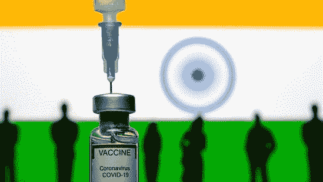

被称为“黑天鹅”的 ovid-19 事件质疑政府在这个现代科技时代处理全球医疗危机的效率。新冠肺炎抛出了一个很少有政府能够躲开的曲线球。印度是全球最大的民主国家之一，却未能阻止病毒的第二波浪潮。处于疫苗生产前沿的印度突然发现自己在第二波传染性病毒中缺少疫苗。印度如何从大规模疫苗出口国转变为进口国是一个令人担忧的问题。

我们试着借助数据来分析一下全国各州的疫苗接种详情。我们可以从分析各州的考试趋势开始。我使用来自 [***Kaggle***](https://www.kaggle.com/sudalairajkumar/covid19-in-india?select=covid_vaccine_statewise.csv) 的 Covid_19 数据集进行分析。您可以从提到的链接下载数据集并开始编码

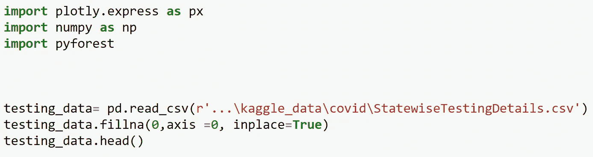

使用的数据集 StatewiseTestingDetails.csv

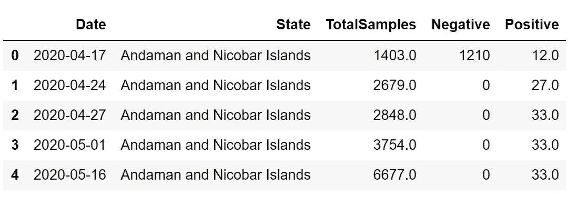

现在让我们计算在所有州收集的测试样本总数

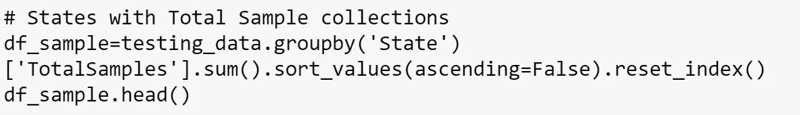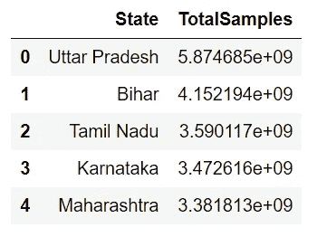

现在让我们用条形图来绘制这些数据

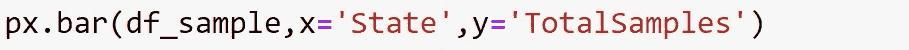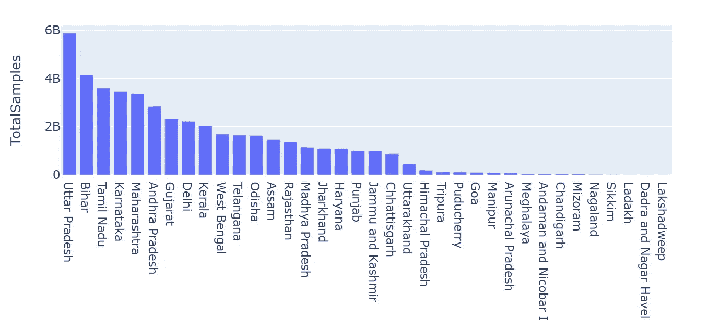

观察:正如我们所见，北方邦在测试人数上领先，其次是比哈尔邦、泰米尔纳德邦、卡纳塔克邦和马哈拉施特拉邦。

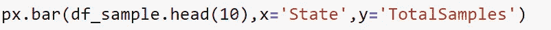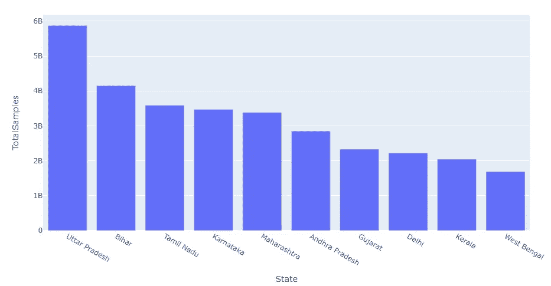

根据数据，这是在测试个人方面领先的前十个州

现在让我们试着找出在各州检测的所有样本中记录的阳性患者的数量。

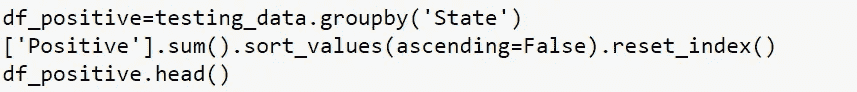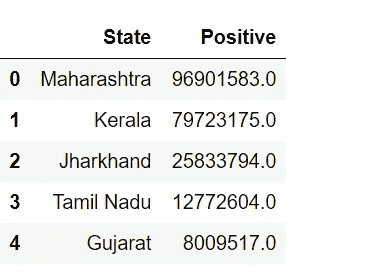

现在绘制这些记录并分析该州有最大阳性 covid 的情况

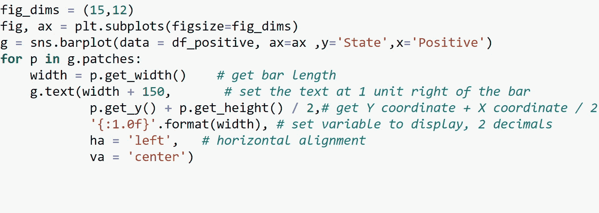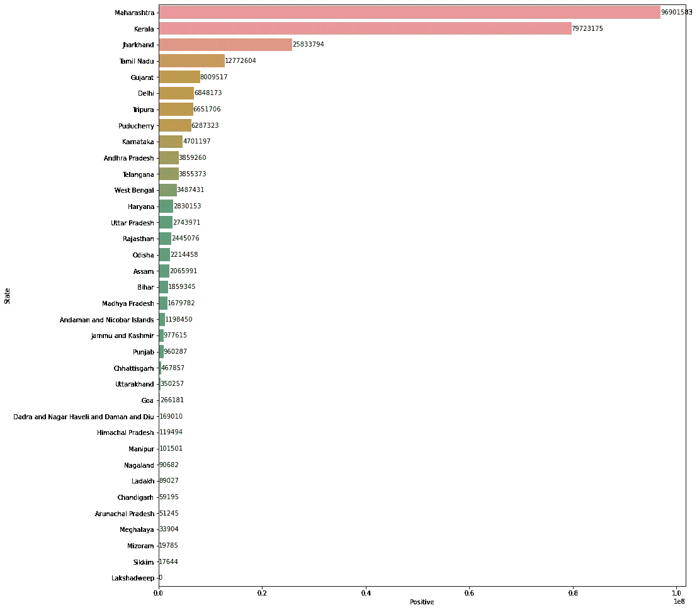

我们可以清楚地看到，马哈拉施特拉邦和喀拉拉邦是受电晕影响最严重的邦。

现在让我们试着分析一下印度的疫苗接种进度。印度一直在使用两种疫苗——牛津-阿斯利康联合疫苗(当地称为 Covishield)和另一种由印度公司 Bharat Biotech 制造的疫苗(Covaxin)。

让我们从 [**Kaggle**](https://www.kaggle.com/sudalairajkumar/covid19-in-india?select=covid_19_india.csv) 下载 covid_vaccine_statewise 数据库并开始编码

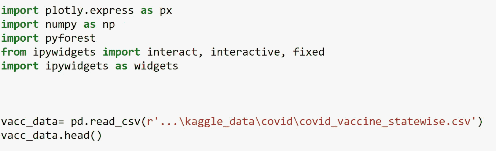

从文件位置读取 CSV 文件

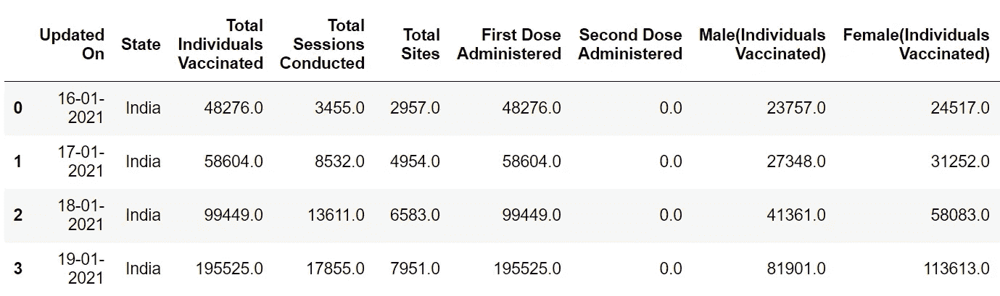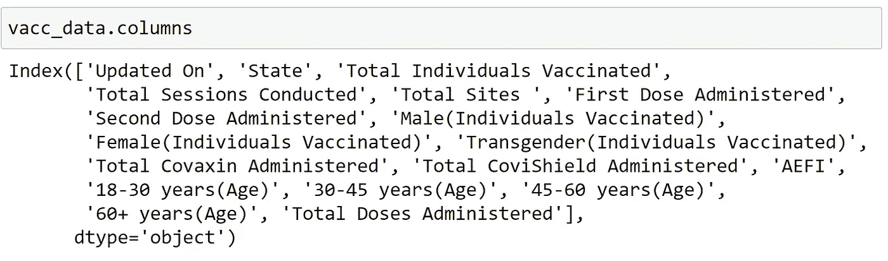

我们可以用饼状图分析到目前为止接种疫苗的男女比例。

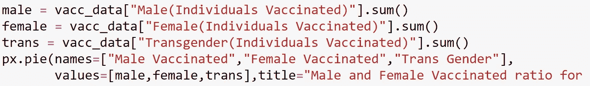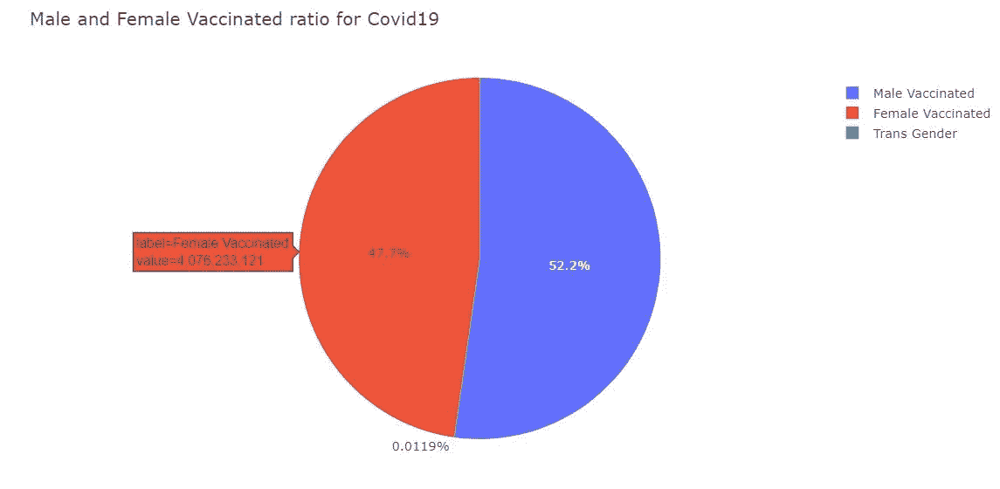

同样，我们也可以使用饼图来比较使用的 covaxin 和 covisheild 剂量的数量。

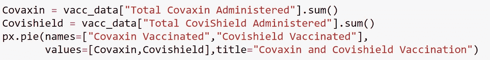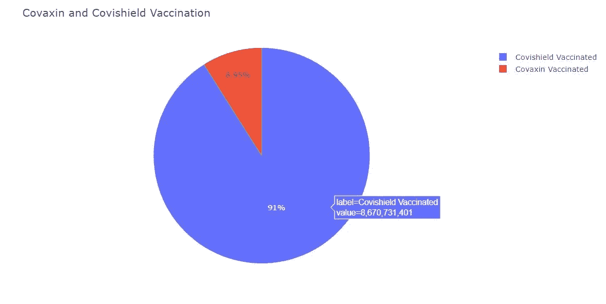

观察:在接种的总剂量中，约 91%是 Covisheild，其余是 Covaxin。我们肯定需要提高 covaxin 的产量。

数据过滤

我们可以删除不必要的空列，并用 0 填充空值。

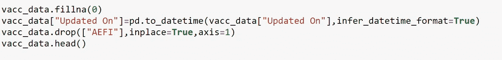

我将使用交互功能来选择要查看数据的状态。默认情况下，它被设置为“印度”，但用户可以选择他们想要的国家。

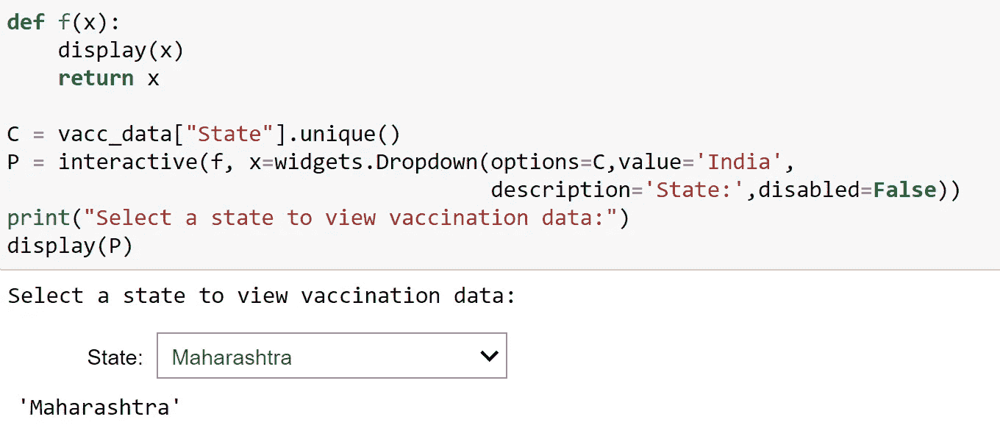

选择所需的州并检查疫苗接种数据

现在使用状态值，让我们检查在该特定状态下施用的剂量。

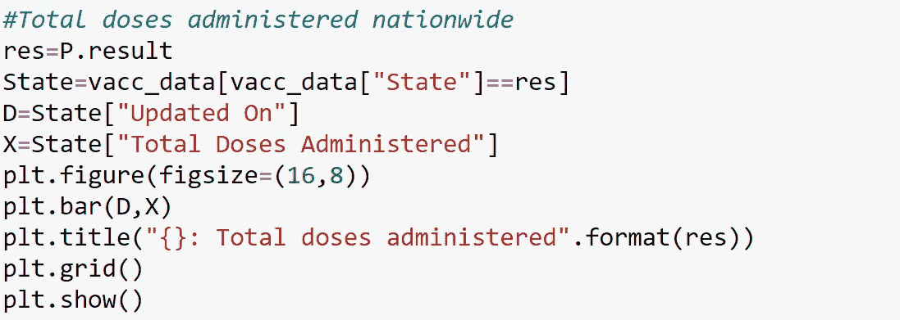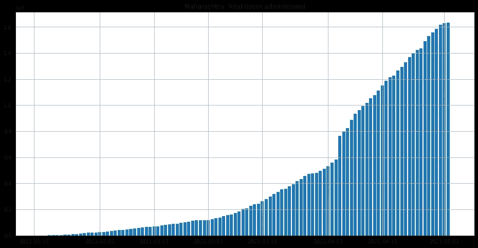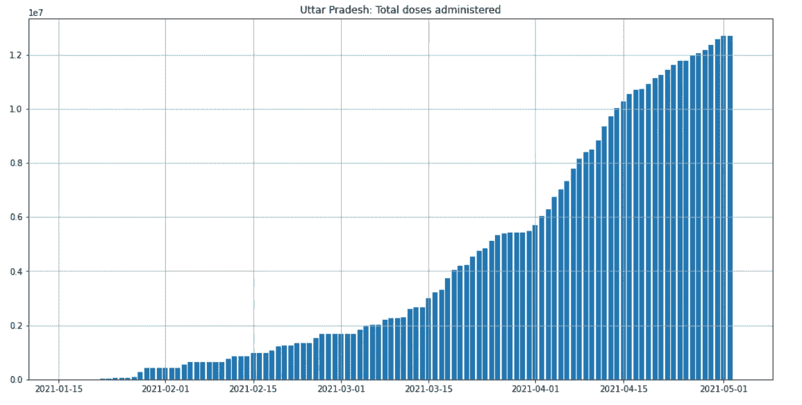

# ***首次接种 vs 完全接种***

正如我们所知，我们需要两剂疫苗才能发挥最大效力，获得两剂更好的疫苗不仅可以防止感染新冠肺炎，还可以防止严重疾病和住院。
我们可以分析印度第一剂和第二剂疫苗的接种率。

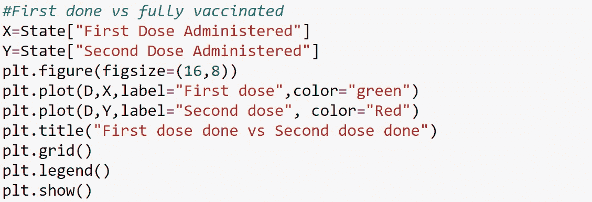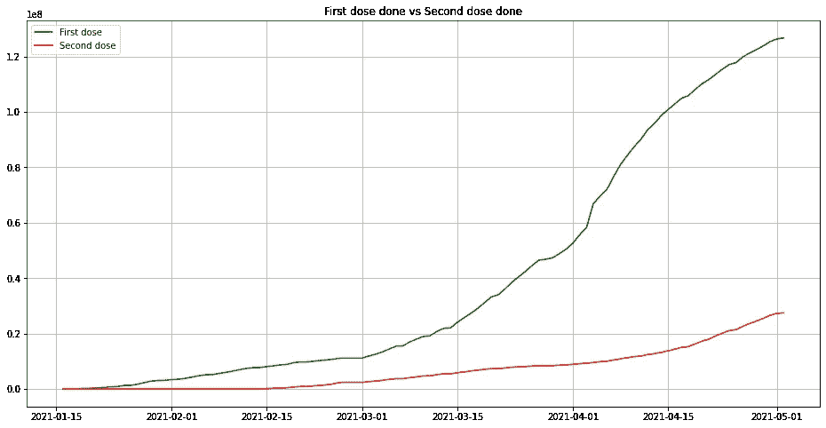

我们可以清楚地看到，两个图之间越来越大的差距表明，人们正在推迟他们的第二次注射，这可能是由于疫苗不可用和病例突然激增。印度需要在高传播和阳性病例地区加强疫苗接种计划。