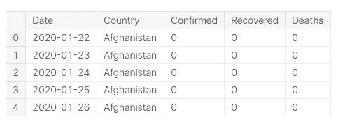
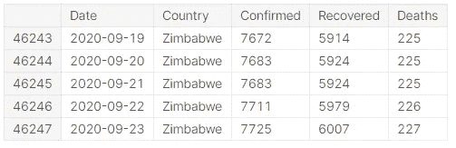
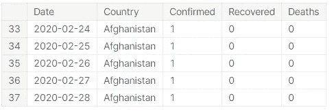
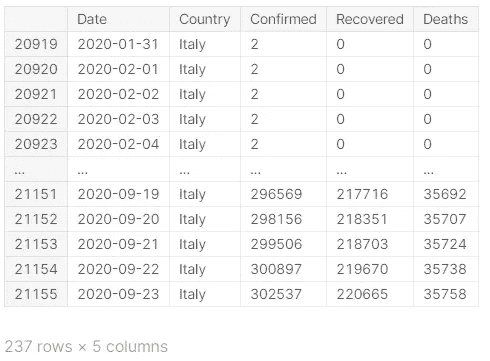
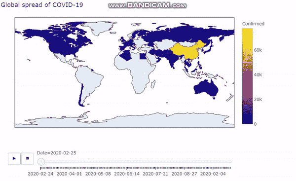
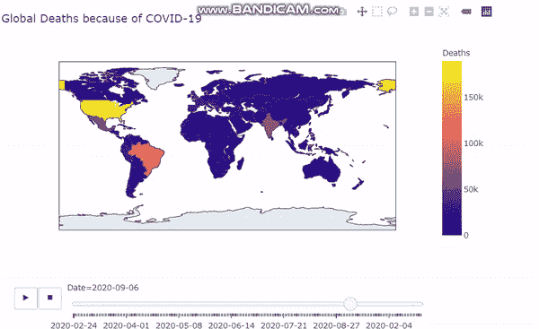
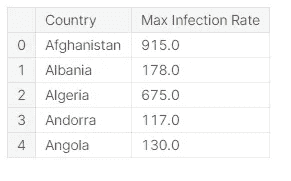
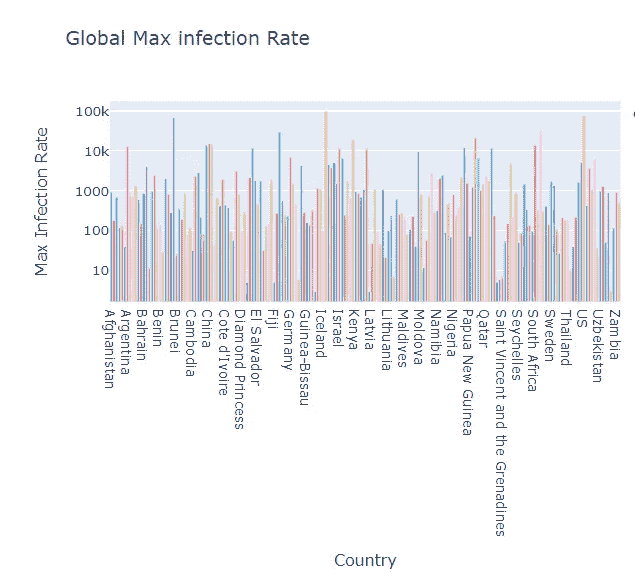
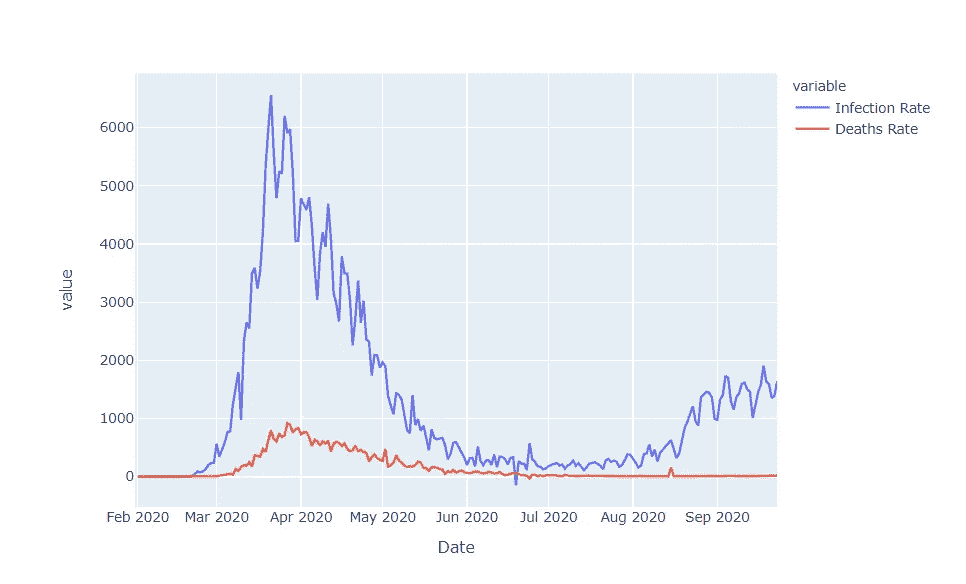

# 新冠肺炎可视化:第 1 部分

> 原文：<https://medium.com/nerd-for-tech/covid-19-visualization-part-1-9f897a04d389?source=collection_archive---------1----------------------->


自大多数国家报道首例新冠肺炎病例以来，已经过去了大约 8 个月。这对我们所有人来说都是一个非常不幸的时刻，在这种情况下，我们应该支持我们的朋友、亲戚和家人。在本文中，我们将对每天更新的新冠肺炎实时数据进行数据分析。

***先决条件:熟悉 Python 中级水平，对 pandas、NumPy、plotly、seaborn、matplotlib 和 jupyter notebook 有一定的基础知识。***

数据集:这里使用的数据集是由约翰·霍普斯金大学提供的，我不主张对这个数据集的任何权利。该数据集包含包括印度在内的大多数国家的详细信息，并且每天都在更新。

让我们开始工作:

1.  导入所需的库:

```
import pandas as pd
import numpy as np
import plotly.express as px
import matplotlib.pyplot as plt 
```

2.正在加载数据集:

```
dataset_url='https://raw.githubusercontent.com/datasets/covid-19/master/data/countries-aggregated.csv'
df=pd.read_csv(dataset_url)
```

3.看一下数据:

```
df.head()
```



这是我们数据集的前五行的样子

```
df.tail()
```



这是我们最后五行数据的样子。

注意: ***df.tail()*** 显示了数据集的最后几行。最后几行将显示数据集加载的日期(记住数据集每天都在更新)。例如:我在 2020 年 9 月 23 日加载了这个数据集，因此最后一行包含日期为 2020 年 9 月 23 日的数据。

4:执行一些预处理:

我们将从该数据集中的每个国家都报告了首例病例的日期开始分析。

```
df=df[df['Confirmed']>0]
df.head()
```



快速浏览我们将要处理的数据

5:查看一些国家的数据:

```
df[df.Country=='Italy']
```



来自意大利的数据

意大利在 2020 年 1 月 31 日报告了第一例病例，自那以后，302，537 人被检测出新冠肺炎阳性，大约 220，665 人已经康复。迄今为止，约有 35，758 人死亡。

6:在世界地图上绘制新冠肺炎教的全球分布图:

```
fig=px.choropleth(df,locations='Country',locationmode='country names',color='Confirmed',animation_frame='Date')fig.update_layout(title_text="Global spread of COVID-19")fig.show()
```



显示新冠肺炎全球分布的交互式地图

我们可以看到，到 2020 年 2 月，中国报告了大约 80，000 例病例。我们也可以在美国、印度、巴西和印度观察到报道的病例。从上面的地图中我们可以清楚地得出结论，印度在所有病例中排名第二，美国排名第一。迄今为止，美国已报告超过 600 万例，印度已报告约 500 万例。

7.在世界地图上标出新冠肺炎造成的死亡人数:

```
fig=px.choropleth(df,locations="Country",locationmode='country names',color='Deaths', animation_frame='Date')
fig.update_layout(title_text='Global Deaths because of COVID-19')
fig.show()
```



新冠肺炎造成的全球死亡

我们可以清楚地看到，印度报告的病例数确实是第二高的，但考虑到每百万人的死亡人数、印度的人口和报告的病例数，死亡人数仍然很低。

8.计算所有国家的最大感染率:

```
countries=list(df["Country"].unique())
max_infection_rates=[]
for c in countries:
    max_infected=df[df.Country==c].Confirmed.diff().max()
    max_infection_rates.append(max_infected)df_MIR=pd.DataFrame()
df_MIR["Country"]=countries
df_MIR['Max Infection Rate']=max_infection_rates
df_MIR.head()
```



不同国家的最高感染率

9.绘制所有国家的最大感染率:

```
px.bar(df_MIR,x='Country',y='Max Infection Rate',color='Country',title='Global Max infection Rate',log_y=True)
```



显示最高感染率的柱状图

10.现在，让我们来看看意大利封锁的影响

2020 年 3 月 9 日，朱塞佩·孔戴总理领导下的意大利政府实施了全国隔离，限制除必要、工作和健康情况外的人口流动，以应对该国日益增长的新冠肺炎疫情。([来源](https://en.wikipedia.org/wiki/COVID-19_pandemic_lockdown_in_Italy#:~:text=On%209%20March%202020%2C%20the,COVID%2D19%20in%20the%20country.))

```
italy_lockdown_start_date = '2020-03-09'
italy_lockdown_a_month_later = '2020-04-09'
```

获取与意大利相关的数据:

```
df_italy=df[df.Country=='Italy']
```

计算感染率:

```
df_italy["Infection Rate"]=df_italy["Confirmed"].diff()
```

现在，我们将形象化该图:

```
fig=px.line(df_italy,x='Date',y='Infection Rate',title="Before and After Lockdown")fig.add_shape(dict( type ='line',x0=italy_lockdown_start_date,y0=0,
x1=italy_lockdown_start_date,y1=df_italy["Infection Rate"].max(), 
line=dict(color='red',width=2)))fig.show()fig.add_annotation(dict(x=italy_lockdown_start_date,y=df_italy["Infection Rate"].max(),text='starting date of the lockdown'))
```


显示感染率与日期关系的线图。

我们可以清楚地看到，在意大利实施封锁后，感染率在几天后开始逐渐下降。因此，我们可以说封锁在意大利是成功的。

11.现在，我们将观察意大利的感染率和死亡率。

```
fig=px.line(df_italy,x='Date',y=["Infection Rate","Deaths Rate"])
fig.show()
```



感染率和死亡率与日期有关。

此外，我们可以清楚地观察到，在意大利实施封锁后，死亡人数也开始下降。

这篇文章是关于新冠肺炎数据的基本可视化，以及我们如何通过查看图表就可以很容易地得出基本结论。

新冠肺炎分析:第 2 部分即将推出。在第二部分，我们将检查和分析印度在新冠肺炎疫情期间的表现。

敬请关注，继续分析！