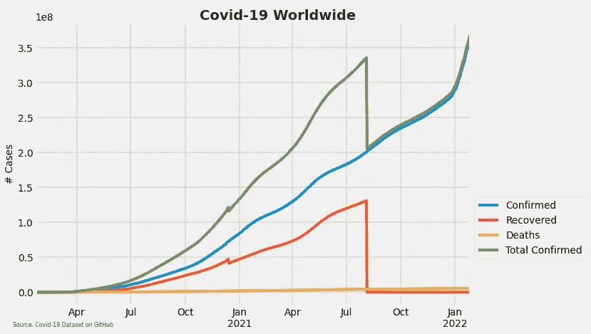
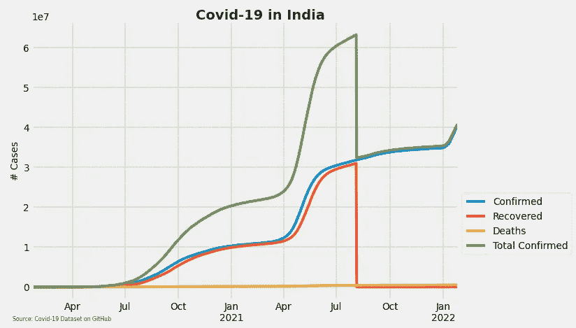
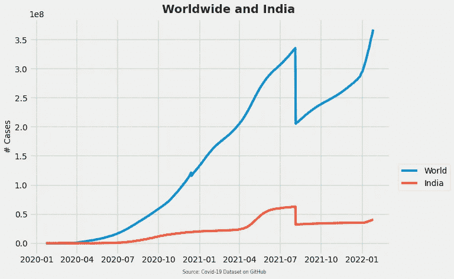
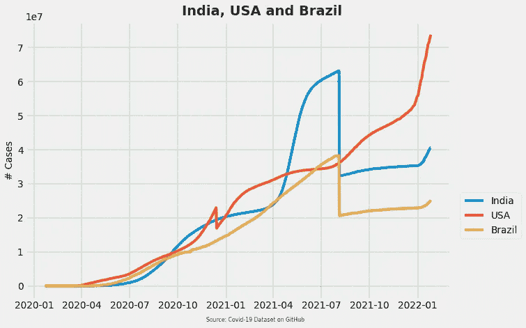

# 新冠肺炎（新型冠状病毒肺炎）📈用 Matplotlib 可视化

> 原文：<https://medium.com/nerd-for-tech/covid-19-visualization-with-matplotlib-27f31bc7a952?source=collection_archive---------5----------------------->

## 不喜欢算术？（🤐x ^ 2)。代码已经覆盖了你

## 绘制印度的病例总数🐍计算机编程语言


来源: [Freepik](https://www.freepik.com/free-vector/fight-virus-concept_7965260.htm?query=covid&collectionId=674671&&position=2&from_view=collections)

新冠肺炎接管地球已经一年了。这种病毒以这样或那样的方式影响了每个国家。在某些情况下，与其他国家相比，🧟‍♀️的传染病传播速度更快。

是时候了🐦直奔主题。让我们用`matplotlib`来想象一下全世界和印度的病例总数。

> 请注意，这篇文章是*📰*仅供参考。

## **全球新冠肺炎数据集**

新冠肺炎数据集来源于 GitHub。本文末尾提供了数据链接，您也可以🔎在谷歌上搜索它们。该数据集包括 2020 年至 2022 年全球 110 个国家和地区的确诊病例汇总(正在进行中)。

首先，让我们在 Jupyter 笔记本中加载所需的库和数据集。

日期是一种对象类型。

我们首先要做的👀请注意，日期列属于对象类型。它必须被转换成一个`datetime`格式。我们可以用`parse_dates`函数来做这件事。我们还注意到，原始数据集是报告病例的集合，是确诊病例的累计数。

让我们将日期转换成日期时间📅用 Python 格式化。

日期到日期时间的转换。

这👩‍🏫转换成`datetime` 格式的目的是确保`matplotlib`正确读取`y-axis`，因为案例将在一段时间内绘制；在我们的情况下；几个月。

## **全球**🗺️ **新冠肺炎案件**

首先，我们将在`covid1`数据框中创建一个名为 Total Confirmed 的新列，它将包含确认、康复和死亡的总数；各自国家的病例总数。

```
covid1[‘Total Confirmed’] = covid1[[‘Confirmed’, ‘Recovered’, ‘Deaths’]].sum(axis = 1)
covid1.head()
```

用我们新的📊专栏。

`plt.style.use()`让您为可视化创建特定的颜色模式。

`figzize()`决定了情节的大小。

谢谢你，罗伯特·里兹。



`1e8`是标准的科学概念，这里表示 y 轴的整体比例因子。也就是说，如果 y 轴上有一个`2`，顶部有一个`1e8`，那么`2`处的值实际上表示的是`2*1e8 = 2e8 = 2 * 10^8 = 200,000,000`。

在上图中，我们根据日期进行分组；因此，它被标记为一个月。

我们能🔢从 2020 年 6 月开始，全球新冠肺炎确诊病例总数大幅上升。这可能是因为这些国家在最初的疫情爆发后进行了积极的检测；因此，发现病例的速度比以前更快。在 2020 年 12 月至 2021 年 1 月期间，康复和确诊病例总数突然下降，随后呈上升趋势。

从 2021 年 8 月起，由于严重的💯疫苗接种运动遍及世界各国。

对于上面的陈述，我只是做一个假设。每个国家都实施了自己的一套锁定协议和对策，以应对⚔️与新冠肺炎的战斗。

## **印度的新冠肺炎病例**

原始数据集包含全球各国的信息。由于我居住在印度，我决定创建一系列印度特有的可视化。我们正在创建一个新变量，并根据印度的日期对其进行分组。

```
India = covid1[covid1['Country'] =='India'].groupby(['Date']).sum()
India.head()
```

印度代码。



2020 年 6 月后，确诊和痊愈的病例数量大幅上升。在恢复/确诊病例方面，印度呈现出积极的趋势。

## **全球**🆚**印度**

让我们绘制一个图表，显示上面两个图表的比较。为此，我们可以利用函数`add_subplot()`创建一个支线剧情。

111 表示它是一个 1x1 和 1️⃣支线剧情。

世界代码。



就印度而言，与世界其他地区相比，确诊病例数量一直在缓慢但稳定地上升。

## **最高** 3️⃣ **病例最多的国家**

让我们看看美国、印度和巴西的确诊病例总数。

最高案件的代码。



2020 年 11 月至 2021 年 1 月，美国的总病例数大幅下降，随后呈上升趋势。上涨趋势可能是因为美国大选后禁售措施减少；因此，人们可以聚集到一个有限的数量。这减少了社会距离的机会，反过来，增加了案件数量。

印度的病例仍在稳步增长。另一方面，巴西从 2020 年 5 月到 2021 年 3 月呈现线性趋势。

## 简单地说🙂

> *可视化🌠本文只是对如何使用新冠肺炎数据集进行实验的一个大概介绍。它是探索性数据分析的一小部分。了解有关在索引上创建酷数据可视化的更多信息。*

## **消息来源**

得到完整的😶‍🌫这里的️️代码:[https://github.com/kashamcrash/MattyPlotty](https://github.com/kashamcrash/MattyPlotty)

堆栈🧱溢出:[https://stack overflow . com/questions/25715333/in-python-plots-1 E8-mean-in-reference-to-y 轴](https://stackoverflow.com/questions/25715333/in-python-plots-what-does-1e8-mean-in-reference-to-the-y-axis)

冠状病毒肺炎💾数据:[https://raw . githubusercontent . com/datasets/新冠肺炎/main/data/countries-aggregated . CSV](https://raw.githubusercontent.com/datasets/covid-19/main/data/countries-aggregated.csv)

在 https://github.com/datasets/covid-19 的🕹️ GitHub 上查看:

听起来像是你😎比如？在这里查看我的工作场所:[https://bit.ly/3388GiE](https://bit.ly/3388GiE)

了解更多关于我的😀作品:[https://bit.ly/3PbofrZ](https://bit.ly/3PbofrZ)

了解更多关于😇梅子:[https://bit.ly/3IlQimp](https://bit.ly/3IlQimp)