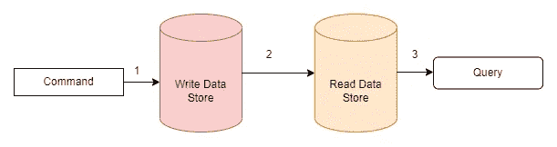
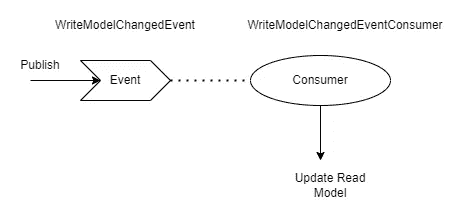
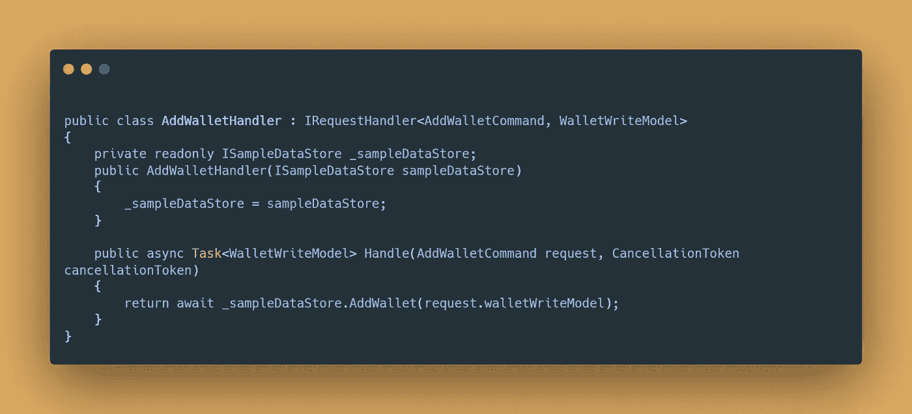
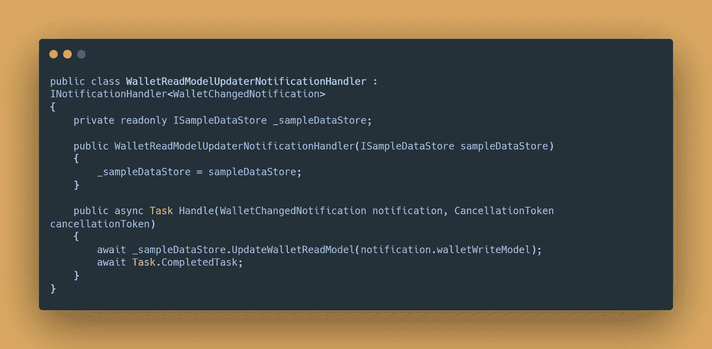

# CQRS 模式实现

> 原文：<https://medium.com/nerd-for-tech/cqrs-pattern-implementation-64fd88b96720?source=collection_archive---------1----------------------->

我们假设你有一个加密的股票市场平台。你有很多客户，你存储他们所有的交易。您使用相同的数据库表进行读取和写入。这是传统方法。但在这种情况下，这可能不是一个好的解决方案。因为写作是一个详细的操作，当你阅读人们当前的股票价值时，你不需要小细节。好吧，你可以用同一张桌子。大家猜猜，用同一个数据库表，会看到什么样的问题？我可以用一句话解释。你的数据库表将有很多数据，你会慢慢地读取数据。好吧，也许你可以等几秒钟来获得当前值，但是客户不喜欢这种事情。别担心。你不会失去你的客户。你可以把写作和阅读模式分开。

照片由[玛丽莎&埃里克](https://unsplash.com/@emtm17?utm_source=medium&utm_medium=referral)在 [Unsplash](https://unsplash.com?utm_source=medium&utm_medium=referral) 上拍摄

CQRS(命令和查询责任分离)是一种分离数据库读写操作的模式。在 CQRS 你会读到两种不同的东西。命令和查询。

*   命令在数据库中写入写模型表。
*   查询从数据库的读取模型表中读取数据。

您可以查看此图表。如果你什么都不懂，不用担心。我们会一步一步解释。

CQRS

1.  命令写入数据存储。考虑对数据库表的插入操作。
2.  更改写模型表后，我们必须更新读模型表以保持一致性。我们可以发布关于数据更改的事件，并且可以更新订阅服务器中的读取模型。如果你不理解这个事件或订户，你可以研究事件驱动架构。你也可以阅读这篇[文章](https://levelup.gitconnected.com/event-driven-architectures-in-software-design-757d92b85df5)。另外，我们简单解释一下。

事件是携带信息的消息。当你需要通知什么的时候，你发布事件。

订户(消费者)正在读取事件。当您发布消息时，订阅者会收到该消息。你可以在阅读事件后做你想做的事情。您可以查看此图表。看完这个图表后，你可能会清楚地理解第 2 步。

3.它正在从读取模型数据库表中获取数据。

我们为 CQRS 准备了一个简单的项目。你会学到项目的一些部分。这里可以看到项目[。您可以在新标签页中打开项目。当然，你会在这里看到这个项目的细节，但不是每个细节。](https://github.com/emreerkoca/article-samples/tree/master/ArticleSamples/DotnetCoreCqrsMediatR)

是 Dotnet 核心应用。它包含了[mediator](https://github.com/jbogard/MediatR)库。mediator 库正在实现**中介模式**。我们将简单解释一下这个项目。

项目中没有真正的数据库连接。您不需要安装新的数据库来运行项目。我们有一个假的数据存储和假的数据。您可以查看下面的代码块。

**方法:**

**AddWallet(…)** :添加一个新的 WalletWriteModel 来写模型数据库表。

**GetWalletReadModels(…):从读取模型数据库表中读取** WalletReadModel。

**SetPublishedEvent(…):** 当一条新记录添加到写数据库表时，会发布一条消息来通知消费者。在此示例中，消息名为 **WalletChangedNotification。**我们将在下面看到这一点。发布新消息后，此方法将 WalletWriteModel 标记为已发布。在这个方法之后，我们可以确定关于消息的发布是为了一个新的写操作。

**UpdateWalletReadModel(…):**项目中有**WalletReadModelUpdaterNotificationHandler**类。这是一个消费者。我们将在下面看到这个。当消费者收到消息时，它通过**UpdateWalletReadModel(…)**方法更新读取的模型数据库表。

我们现在可以回顾控制器动作方法。

Post 方法发送 **AddWalletCommand。**发送命令后，它发布**WalletChangedNotification**并调用 **SetPublishedEvent(…)** 方法。您可以在这里看到该命令。

项目中有一个命令处理程序( **AddWalletHandler** )。它处理 **AddWalletCommand** 命令，调用 **AddWallet(…)** 方法，并写入写模型表。

**Get(…)** action 方法发送 **GetWalletQuery。GetWalletHandler** 处理 **GetWalletQuery** 。它调用 **GetWalletReadModel(…)** 方法，并返回读取模型表的结果。您可以在项目存储库中看到这一点。

您可能会想，在改变写模型之后，我们如何更新读模型表。发布动作方法**WalletChangedNotification**(消息，事件)和**WalletReadModelUpdaterNotificationHandler**(消费者)处理消息并更新读取的模型表。你可以看到下面的消费者。

这是一个简单的场景。如果你在这篇文章中看到任何错误，你可以告诉我。希望能有所帮助。