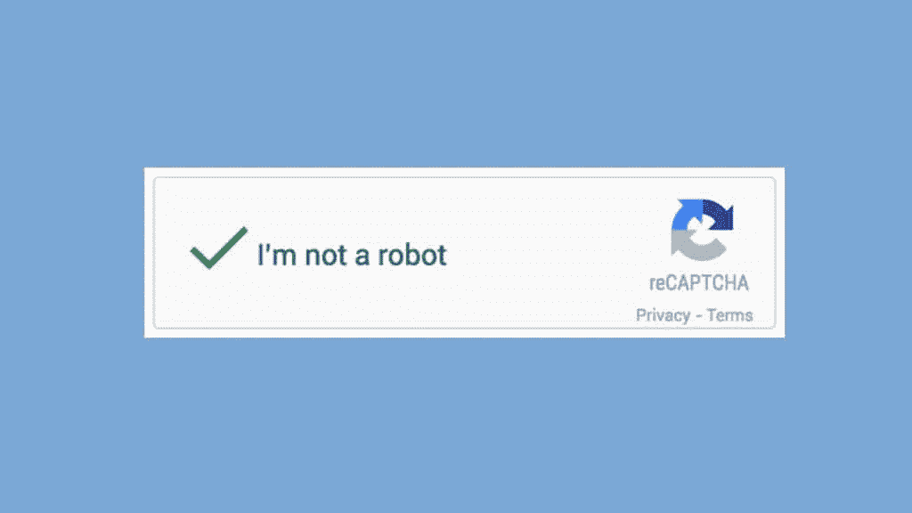
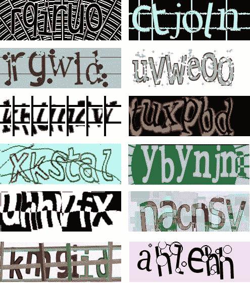
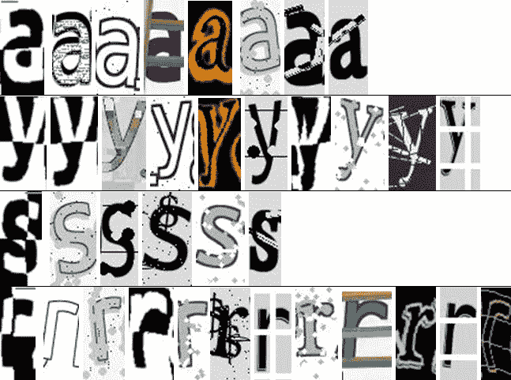
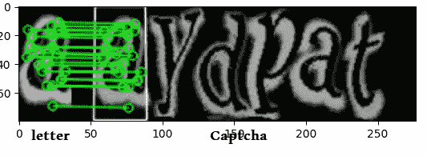
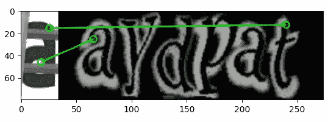

# 用 opencv 和 python 破解这些验证码(第 1 部分)

> 原文：<https://medium.com/nerd-for-tech/crack-those-captchas-with-opencv-and-python-a7736063f3?source=collection_archive---------0----------------------->

你有没有在验证码失败后感觉自己像个机器人？因为我有！

验证码有时候很烦人****浪费**很多时间。所以，我一直在考虑自动解一个验证码。第一个想到的就是用**深度学习**。然而，我没有找到一个足够大的**数据集**来训练像 CNN 这样的模型，这需要大量的数据。所以，我决定用 **OpenCV** 配合 **python** 来解决这个问题。以下是我们将要解决的一些验证码示例:**

****

# **1.准备环境**

**为了能够遵循本教程的步骤，你需要在你的机器上安装 python 和 opencv-python。您可以通过运行以下命令来安装后者:**

**此外，我将在本教程中使用 cv2，更多详情请访问:**

** [## OpenCV-Python 教程- OpenCV-Python 教程 1 文档

### 了解如何在您的计算机上设置 OpenCV-Python！

opencv-python-tutro als . readthedocs . io](https://opencv-python-tutroals.readthedocs.io/en/latest/py_tutorials/py_tutorials.html) 

我们还需要 **numpy** 和 **matplotlib** ，所以请安装它们！！！

# 2.从一个简单的例子开始

为了能够破解我之前给你看的验证码类型，我收集了一些，并把它们分成字母。因此，对于每一封信我都得到了一堆图片，下面是一个例子:

当然，我把每封信的每张照片都放在一个单独的文件里。通过这样做，我将能够使用 **OpenCV 特性匹配**。例如，我可以用这个验证码来寻找与其字母相匹配的字母。

让我们尝试将字母“a”的两个变体与之前的验证码的字母进行匹配，结果如下图所示:

我们在左边寻找匹配的字母，注意在这个验证码中有两个匹配，但它只取了最近的一个。

在这个例子中，左边的字母和验证码的字母之间没有很强的匹配。某一点的匹配不足以得出整体匹配的结论。

因此，基本上我们将使用这种技术来寻找验证码中的字母，匹配度最高的字母将获胜。

# 3.履行

是时候写点代码了。首先，导入需要的库:

OpenCV 使用不同的算法来检测对象的边缘、曲线和临界点。这些被称为特征。在计算了字母和验证码中的物体的特征后，该算法匹配相似的特征。有关这方面的更多细节，请访问 OpenCV 的文档页面:

 [## 特征检测和描述- OpenCV-Python 教程 1 文档

### SIFT 使用具有 128 个浮点数的特征描述符。考虑数以千计的这样的特征。这需要很多…

opencv-python-tutro als . readthedocs . io](https://opencv-python-tutroals.readthedocs.io/en/latest/py_tutorials/py_feature2d/py_table_of_contents_feature2d/py_table_of_contents_feature2d.html) 

对于我们的例子，我们将使用一种称为 SIFT 的算法，我们将寻找特定字母和完整验证码之间的所有匹配，然后只保留那些具有比我们固定的最小值更重要的一些匹配特征的匹配。下面的代码恢复了所有这些步骤。

代码可能看起来很复杂，但这是一个非常典型的代码，每次执行此任务时都会用到。这样，你就可以重现我们在例子中所做的所有实验。

# 4.下一步是什么？

在这第一部分，我们已经看到了如何匹配一个字母与不同的验证码字母。这个策略看起来很简单，但是要创建一个有效的验证码求解器还有很多工作要做。我们需要寻找**所有可能的字母**，处理**旋转**和**缩放**，处理**多个匹配**或**完全不匹配**的情况，这将是下一部分的目标。

## **第 2 部分再见，我们将对此进行改进和进一步发展！****