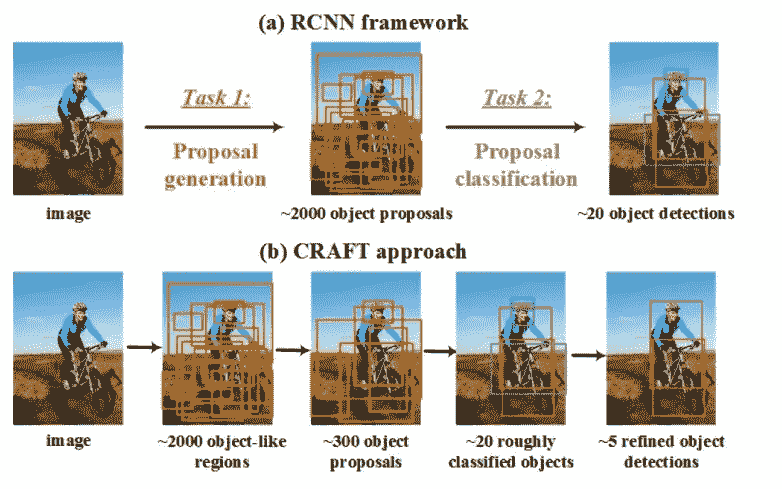
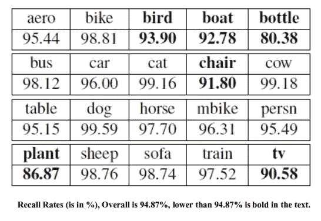
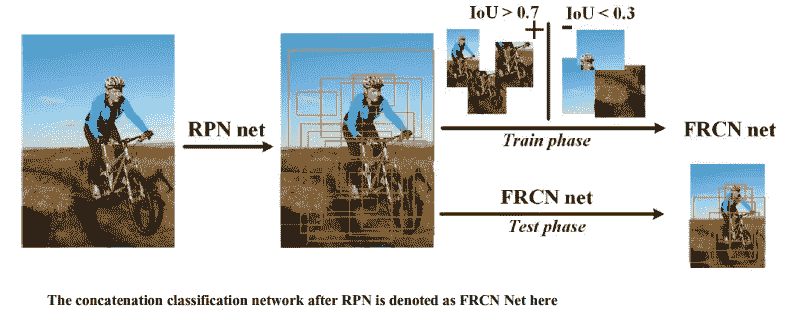

# 物体探测

> 原文：<https://medium.com/nerd-for-tech/craft-object-detection-eb454d2aa8aa?source=collection_archive---------8----------------------->

**CRAFT** 代表**C**as cade**R**region-propose-network**A**d**F**as**T**R-CNN。由中科院和清华大学评审。在更快的 R-CNN 中，区域提议网络用于生成提议。在投资回报汇集之后，这些提案将通过网络进行分类。

然而，克拉夫特发现在更快的 R-CNN 中有一个核心问题:

在提案生成过程中，仍有很大比例的背景区域。许多背景样本的存在导致许多假阳性。

在 CRAFT(Cascade Region-proposal-network)中，如上图所示，在 RPN 之后增加另一个 CNN(卷积神经网络)来生成更少的提议(即这里的 300 个)。然后，对 300 个建议进行分类，并输出大约 20 个第一检测结果。对于每个原始结果，使用一对其余分类来执行细化的对象检测。级联建议生成基线 RPN

*   一个理想的建议生成器应该在覆盖几乎所有对象实例的同时生成尽可能少的建议。由于 CNN 池操作导致的分辨率损失和滑动窗口的固定纵横比，RPN 在覆盖具有极端形状或尺度的对象方面较弱。

*   以上结果是基于 VGG M 的基线 RPN，使用 PASCAL VOC 2007 train+val 训练，并在测试集上测试。
*   每个对象类别的召回率差异很大。具有极端纵横比和比例的对象很难被检测到，例如船和瓶子。

**提议的级联结构**

*   RPN 之后是一个附加的分类网络。
*   附加网络是 2 类检测网络，在上图中表示为 FRCN 网络。它使用 RPN 的输出作为训练数据。
*   在 RPN 网络被训练之后，每个训练图像的 2000 个第一建议被用作 FRCN 网络的训练数据。
*   在训练期间，+ve 和-ve 采样分别基于 0.7 IoU 的负值和低于 0.3 IoU 的负值。

**有 2 个优点:**

1)首先，附加的 FRCN 网进一步提高了目标提议的质量，并且缩小了更多的背景区域，使得提议更好地符合任务要求。

2)第二，来自多个来源的建议可以合并为 FRCN 网络的输入，以便可以使用互补的信息。