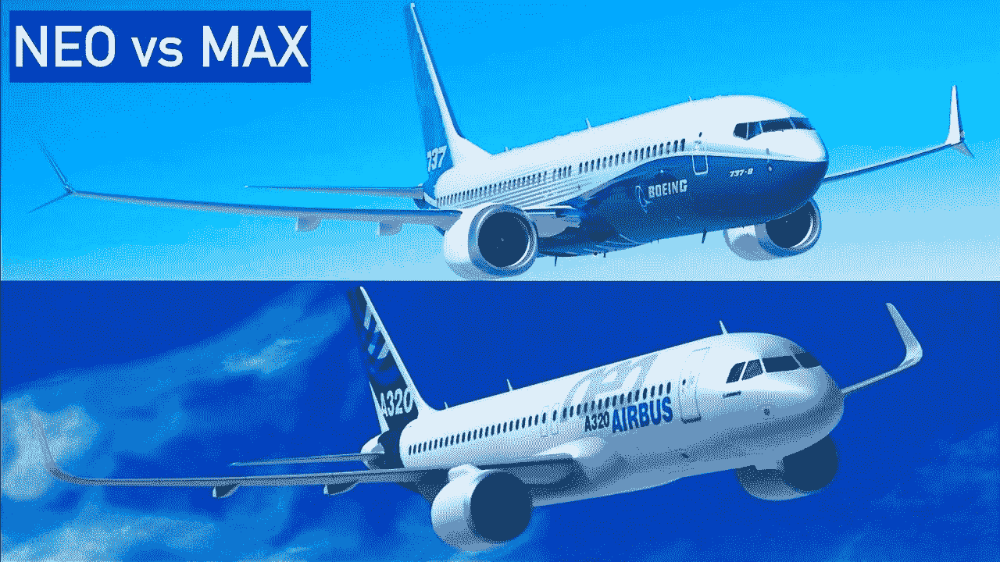
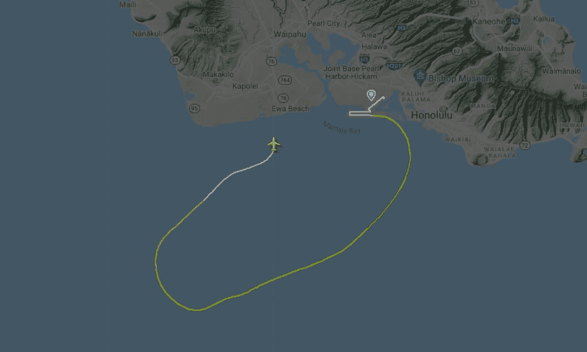
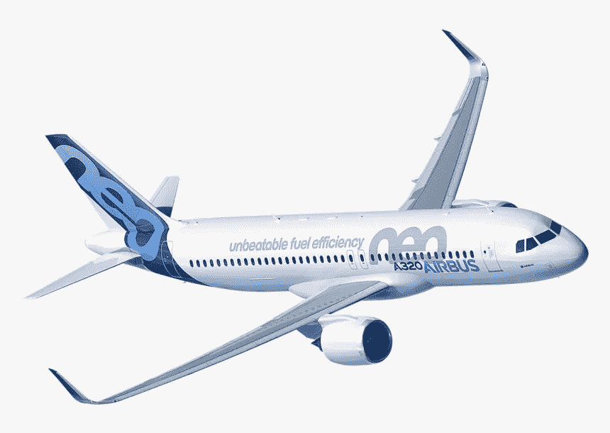
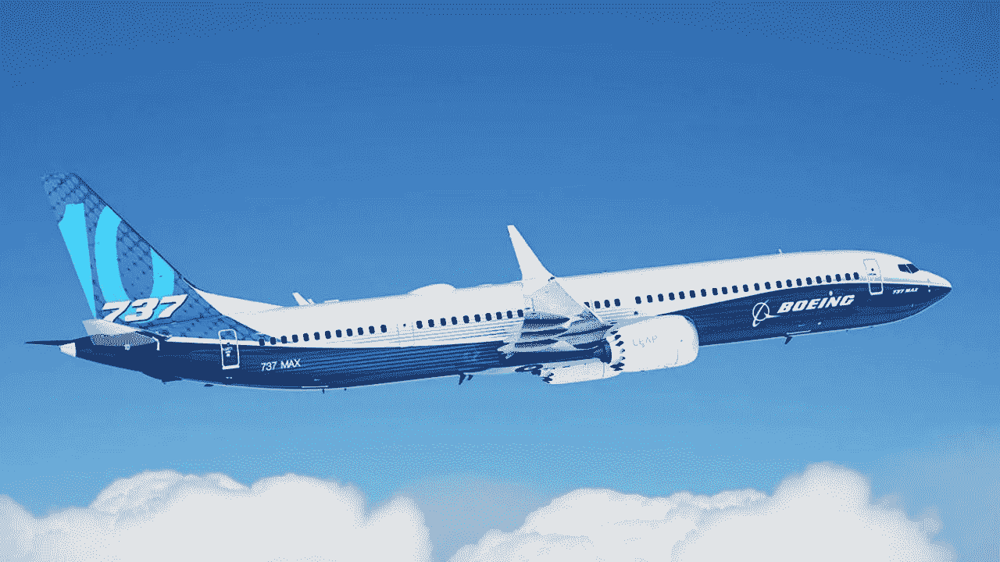

# 旧 737 坠毁会伤害 737 Max

> 原文：<https://medium.com/nerd-for-tech/crashes-of-old-737-can-hurt-737-max-6f2c5d8bea22?source=collection_archive---------9----------------------->

## A320 NEO 也是如此，为你的技术产品或服务命名很重要

一架 737 飞机上个月迫降入海，准确时间是 2021 年 7 月 2 日，在檀香山附近。当我昨天第一次知道这起事件时，我自动将其与 737 Max 联系起来，该飞机在 2019 年 3 月至 2020 年 12 月期间经历了一系列坠机事件，导致所有飞机停飞，导致飞机制造商波音公司进入了一个非常关键的时期。当我看到绘制的飞机路径图时，我的观点变得更加坚定，因为这是一条短曲线，因为 737 飞机在起飞后不久就遇到了麻烦，因为大多数 737 飞机都是在着陆或起飞阶段坠毁的，当时没有足够的时间来纠正 MCAS 的不当行为

这架波音 737 货机于 2021 年 7 月 2 日坠毁——图片来自[此处](https://bnonews.com/index.php/2021/07/boeing-737-cargo-plane-crashes-off-hawaii/)

我的观点是，波音公司试图从一架在商业和技术上成功的旧飞机的升级版本中获利，决定通过在型号上增加 MAX 来命名这款升级飞机，你可以看到[空客](https://www.airbus.com/)对其设计的与波音升级版竞争的飞机也做了同样的事情，只是在他们为回应[波音](https://www.boeing.com/)而提供的升级飞机上增加 NEO。

空客 A320 NEO

波音 737 MAX

但我认为，这两家伟大的飞机制造商犯了一个命名错误，他们给这些升级后的飞机起了与处理器相同的名字，只是添加了一个可识别的标记，如 NEO 和 MAX。当然，命名法对于工业产品名称和工业流程非常重要，因为它有助于分类和组织事物，对于这两架飞机来说，如果一切顺利，新命名法肯定会受益于旧命名法的成功，但这比采用新命名法风险更大。如果波音 737 MAX 有另一个名字，那么它和旧版本 737 的坠毁就不会混淆，我认为这种飞机足够不同，每个都有自己的型号名称。但这是我的一个科学观点，我没有明确的数据来支持它，可能是波音和空客选择的这个术语使 737 Max 和 A320 在商业上受益。这可能是一个很好的练习，以收集数据并进行全面的数据支持研究，了解这一命名决定对飞机成功的影响，以及坠机等故障对具有相同命名的新飞机(如 A 320 NEO 或 737 MAX)的品牌形象的影响。

**PS:** 我正在进行我在[这篇文章](/predict/from-new-york-to-london-e7aa852d6b02)中写的关于航空公司年龄的研究。我会在网上分享我的发现，比如我写的这篇文章，更多的是关于事件对品牌认知度的影响。