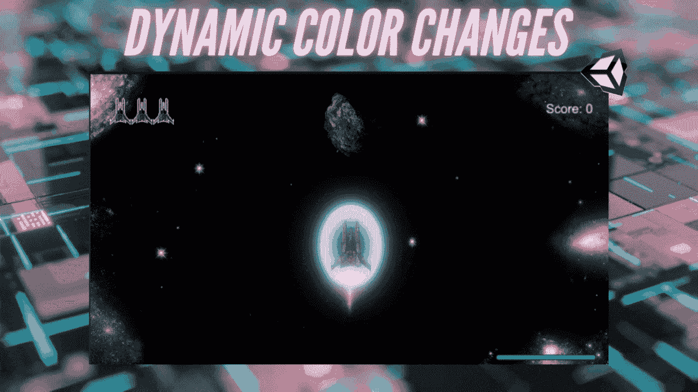
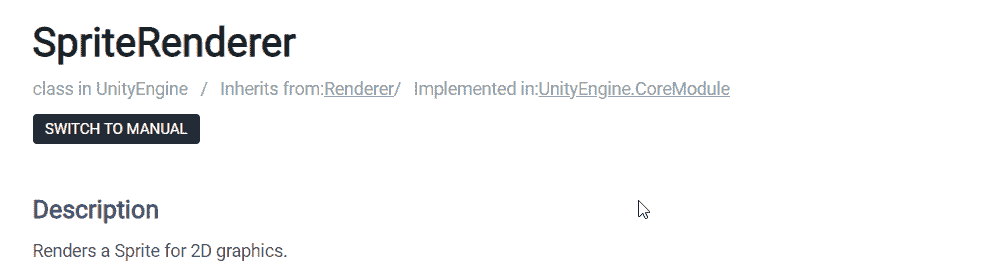
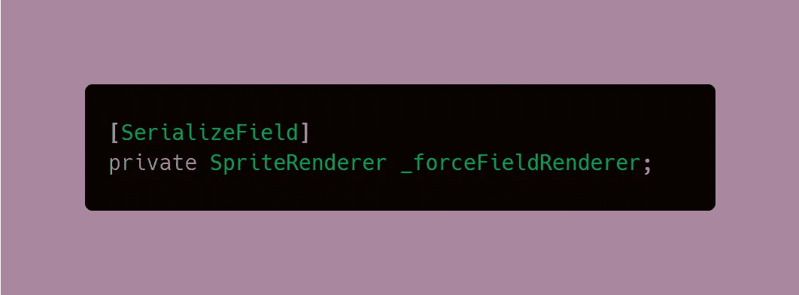
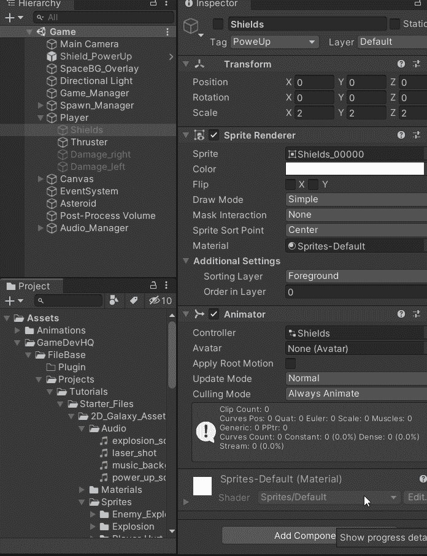
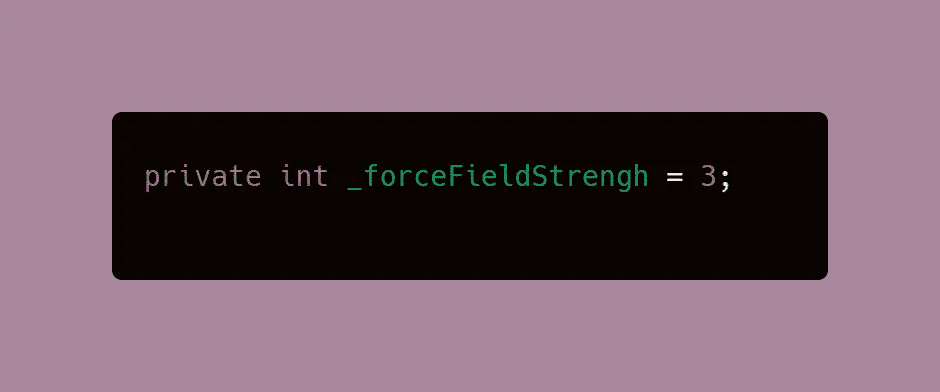
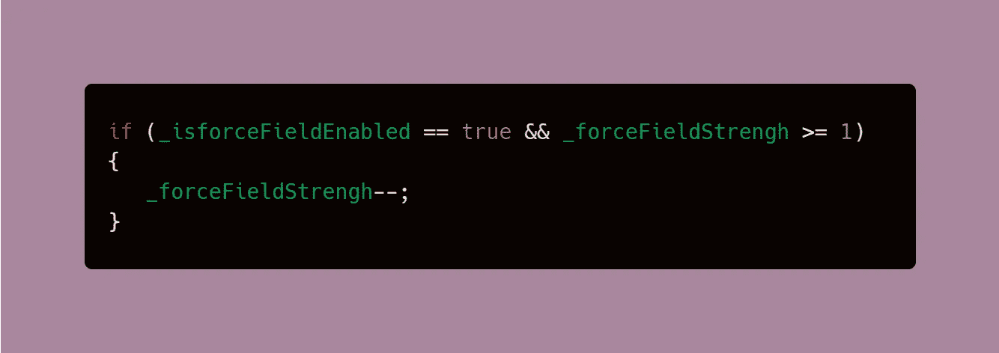
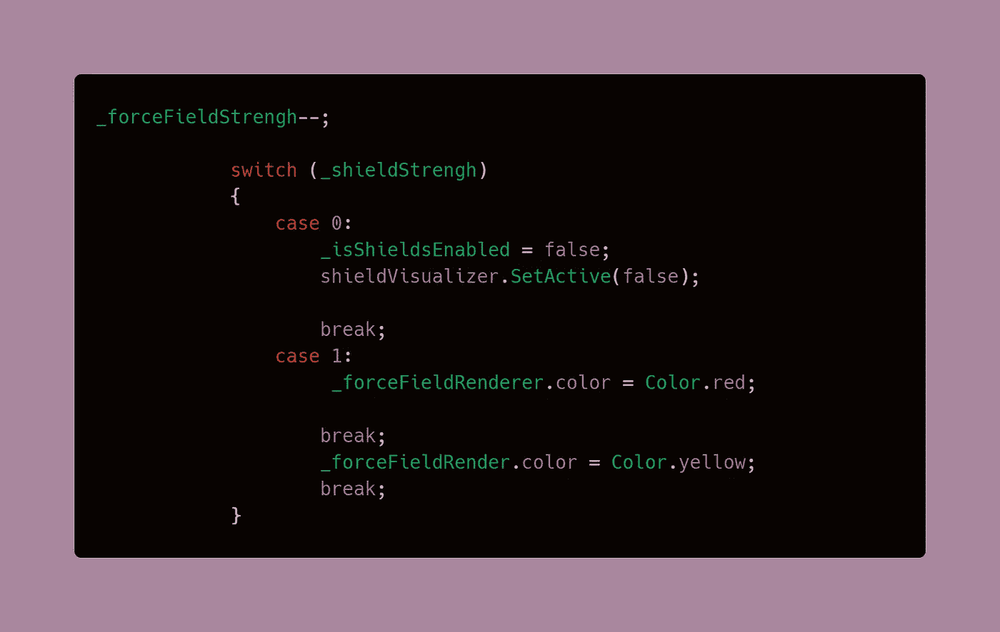
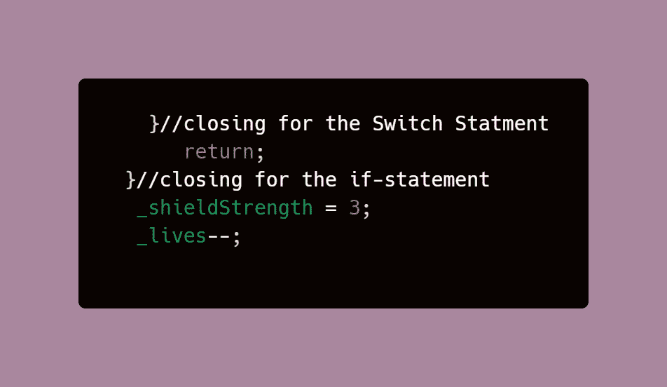
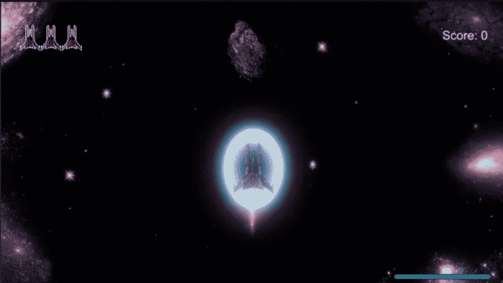

# 创建一个统一的动态颜色变化的 2D 力场

> 原文：<https://medium.com/nerd-for-tech/create-a-2d-force-field-with-dynamic-color-changes-in-unity-2a22900b23c0?source=collection_archive---------26----------------------->

谁不爱力场？它们让你刀枪不入，它们看起来很酷，科幻小说自 1931 年以来一直在炒作它们！导致暂时不可战胜的元素或能量在电子游戏中已经存在多年了——作为一个好的游戏设计原则，它们在视觉上或听觉上都是为玩家呈现的。

**目标**:在这篇文章中，你将学习如何制造一个在失效前可以吸收三次攻击的力场。每一击都会破坏力场，力场会随着盾失去能量而改变颜色。

# 设置精灵渲染器

[精灵渲染器](https://docs.unity3d.com/ScriptReference/SpriteRenderer.html)包含我们需要在代码中访问的颜色属性。在这个例子中，我把我的力场逻辑放在玩家代码中，因为在那里我有一个计算玩家伤害的方法。

> **注意**:这段代码应该理想地放在一个方法中，在那里你可以访问从你的玩家身上减去生命值或生命值的逻辑。

1.  为 Sprite 渲染器创建一个全局变量，以便我们的代码可以访问它。这将是一个 SerializeField，以便我们可以直接在检查器中分配 Sprite 对象。

> **注意**:关于力场精灵动画的更多信息，点击[这里](/codex/animating-a-sprite-with-unitys-animation-window-b049493f69a1)。要了解更多关于如何进行可收集的加电的信息，请点击[此处](https://levelup.gitconnected.com/adding-power-ups-e4af4ccbd7cb)。

2.创建一个全局变量来确定力场的强度。这可以是你认为合适的任何数字。

3.创建一个 if 语句，当力场剩余强度时执行该语句。如果力场强度大于或等于 1，则力场强度应该减小。理想情况下，这应该放在你从玩家生命中扣除之前。

> **注意**:你在 if 中看到的布尔值并不是获得颜色变化所必需的。然而，在我的代码中，当[加电被拾取](https://levelup.gitconnected.com/adding-power-ups-e4af4ccbd7cb)时，力场变得活跃，并且 bool 变量在那里跟踪加电是否被使能。

4.在 if 语句中，创建一个[切换语句](https://levelup.gitconnected.com/switch-statements-to-the-rescue-277cb924c312)来*切换*颜色，这取决于盾牌剩余的强度。

颜色切换是通过使用我们之前为渲染器创建的变量搜索渲染器来完成的。一旦我们得到了颜色，我们可以按照下面的正确语法设置新的颜色。

> **注意:**情况 0 包含来自我的 shield 加电逻辑的代码，该代码对于颜色变化是不必要的。在这里，我简单地[取消了](https://docs.unity3d.com/ScriptReference/GameObject.SetActive.html)精灵对象的视觉表现，这样力场在它不活动的时候就会消失。

5.在关闭开关声明后，我们添加了一个[返回声明](https://docs.microsoft.com/en-us/dotnet/csharp/language-reference/keywords/return#:~:text=return%20(C%23%20Reference)&text=The%20return%20statement%20terminates%20execution,return%20statement%20can%20be%20omitted.)，如果力场有强度，玩家将不会受到伤害。这样做的原因是我的代码被放在一个 damagePlayer 方法中，玩家的生命被减去。通过在玩家生命被减去之前用返回来终止 damagePlayer 方法的执行，它防止玩家失去生命。这就是为什么生命减法在 if 语句之外的原因。一旦 if 条件不再有效(当力场耗尽力量时)，damagePlayer 方法将继续正常执行，玩家将失去生命。

力场强度被设置回最大强度，这样下次玩家拿起盾牌时，强度会被补充。

**结果:**

这是我在 GameDevHQ 实习期间遇到的第二个编码挑战，接下来的文章将会有更多的介绍。