# 创建一个可以在 Linux 中生成多个默认用户名的 Bash 脚本

> 原文：<https://medium.com/nerd-for-tech/create-a-bash-script-that-can-generate-multiple-default-usernames-in-linux-1cb3cb7477fd?source=collection_archive---------2----------------------->


> -这需要在 Linux 终端上完成

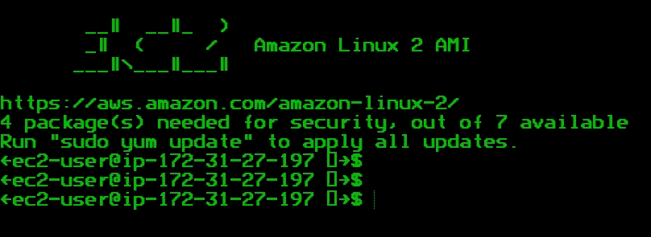

**我在 AWS 中使用一个预配的 EC2 实例**

📝让我们创建一个文件夹来存储所有内容。

```
$ mkdir namescript
```

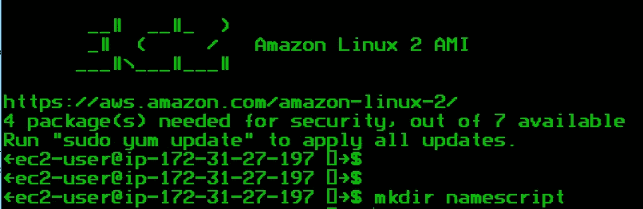

📝访问您的新文件夹

```
$ cd namescript
```

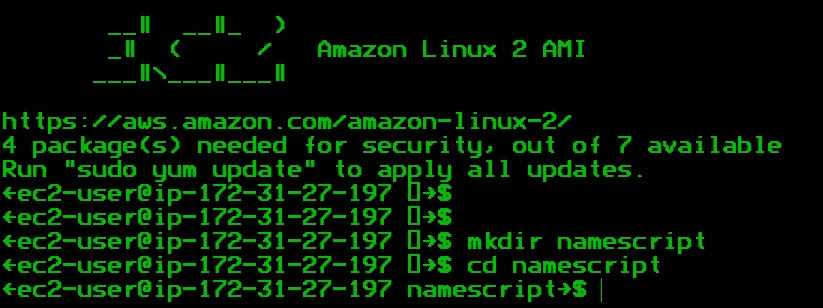

📝创建一个 shell 文件，并使用 vim 编辑该文件

```
namescript$ vim usernames.sh
```

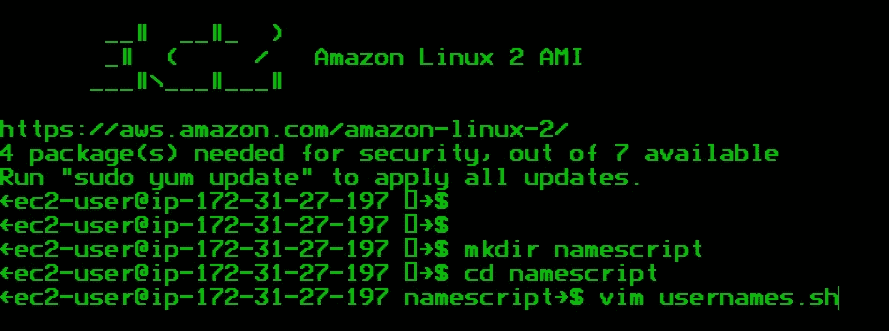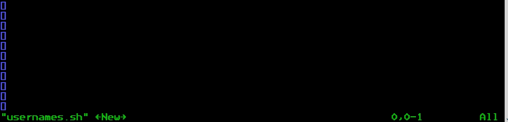

输入 VIM 命令后，您应该会看到这个屏幕

📝按下 Insert 键，确认您的 VIM 已准备好进行编辑。


📝从输入一个 shebang 开始

```
#!/bin/bash
```

> **什么是舍邦？**
> 
> shebang 是脚本文件中的一个特殊字符序列，它指定应该调用哪个程序来运行脚本。shebang 总是在文件的第一行，由字符 **#！**后跟解释程序的路径。

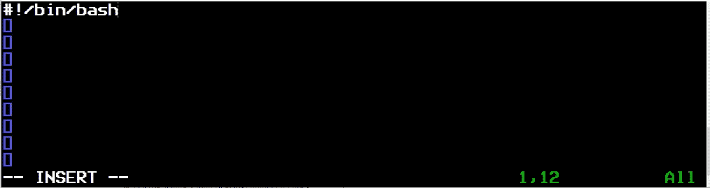

📝显示带有提示输入的消息

```
echo "Please input a new user below:"
read -p 'Username: ' usrname
```

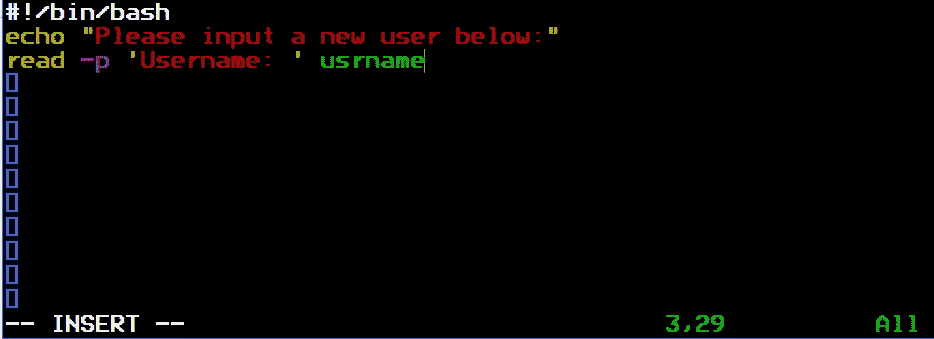

> echo 命令将显示消息，read 命令和 will '-p '将提供输入提示。usrname 是代表输入的变量。

📝如果用户名存在，创建一个拒绝条件，否则继续添加用户名。

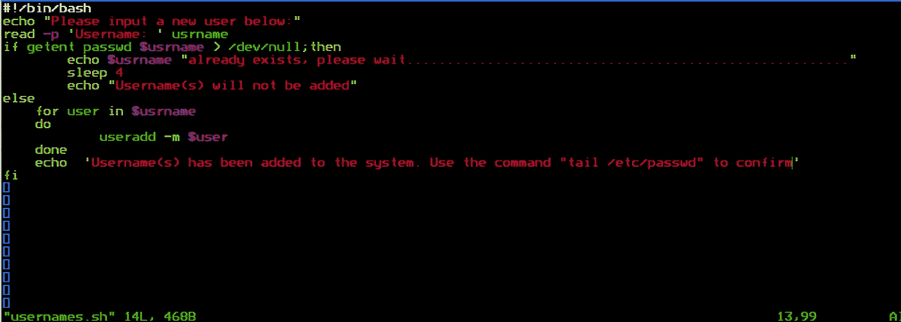

📝按 ESC 键并键入“:wq”

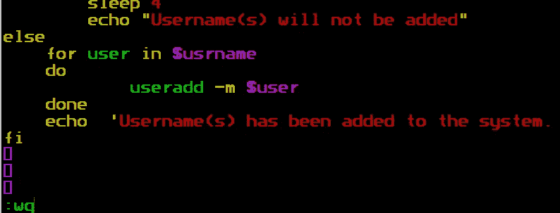

> “w”将写入更改,“q”将退出 VIM


📝使 usernames.sh 成为可执行文件

```
namescript$ sudo chmod +x usernames.sh
```


> 要运行 usernames.sh，它需要是一个可执行文件

📝运行代码

```
namescript$ sudo ./usernames.sh
```

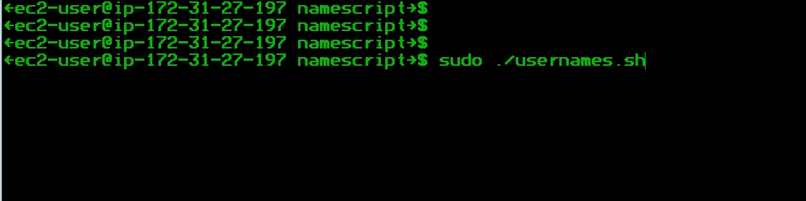

📝创建两个用户名并按回车键

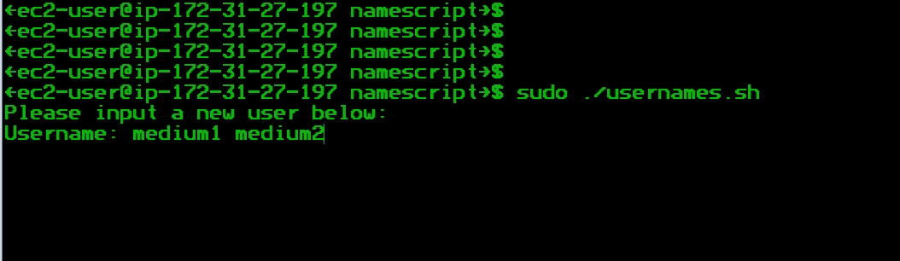

📝让我们确认用户名已经创建

```
namescript$ tail /etc/passwd
```

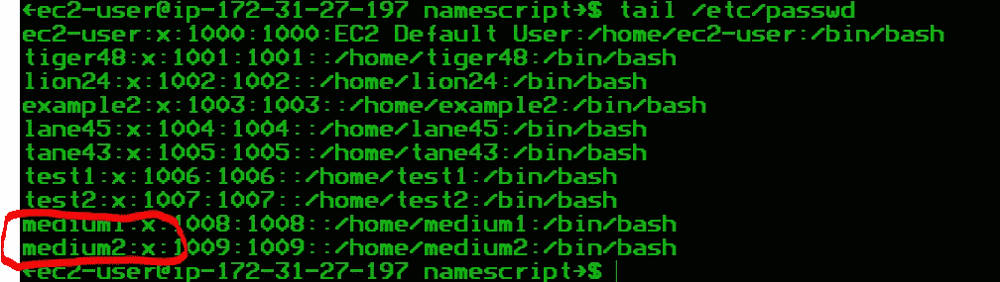

让我们试一试我们是否能输入相同的用户名

📝运行代码并输入相同的用户名


正如你所见，代码不会输入相同的用户名超过一次。

我希望您喜欢这个 bash 脚本教程

[点击这里获取 Github 中 Bash 脚本的副本](https://github.com/HerbyJ3/Mybashscripts/blob/main/multipleusernamescript.sh)

让我们保持联系
[https://www.linkedin/in/herby-jeanty](https://www.linkedin/in/herby-jeanty)