# 使用 java 套接字创建聊天应用程序

> 原文：<https://medium.com/nerd-for-tech/create-a-chat-app-with-java-sockets-8449fdaa933?source=collection_archive---------0----------------------->

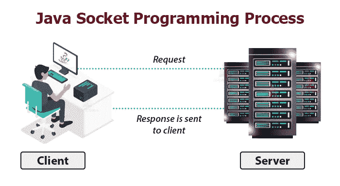

在本文中，我们将使用 Java 套接字实现一个客户端/服务器聊天应用程序。本教程是关于使用线程的聊天应用的后端实现。我们将一步一步地解释概念和实现。

# 基本概念

服务器:

为了与客户端通信，服务器使用两种类型的套接字

**ServerSocket** :这个类被服务器用来声明一个 ServerSocket 对象，服务器需要这个对象来监听来自客户端的连接请求

**Socket** :这个类被服务器用来声明一个 Socket 对象，服务器用它来发送和接收来自客户端的数据

客户:

为了与服务器通信，客户端使用一个套接字(来自**套接字**类的对象)来发送和接收来自服务器的数据

= >服务器和客户端中的 **Socket** 类的**实例化**是不同的，尽管它是相同的类，但是它在客户端和服务器之间是不同的

# 履行

使用 IntelliJ IDEA，我创建了一个名为“chat”的项目，然后在 src 文件夹下创建了两个 Java 类:Server.java 和 Client.java

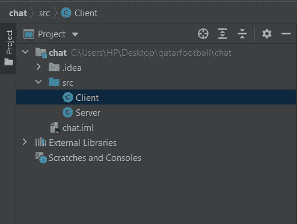

项目创建

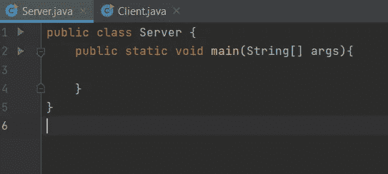

Server.java

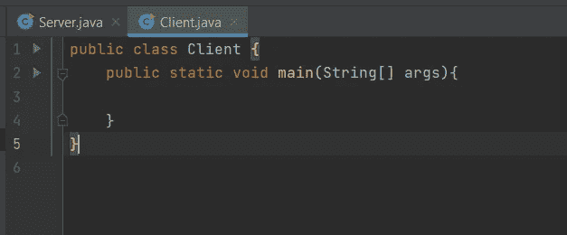

Client.java

现在让我们实现 Server.java 类:

**1-Server.java**

首先，我们声明 5 个对象:

*   final**ServerSocket**serversocket:这一行意味着我们声明了一个名为“server socket”的对象，它是 server socket 类的一个对象。它被声明为“最终”，这意味着它是一个常数
*   final**Socket**clientSocket:这一行意味着我们声明了一个名为“client Socket”的对象，它是 Socket 类的一个对象。它被声明为“最终”，这意味着它是一个常数
*   final BufferedReader in:这一行意味着我们声明了一个名为“in”的对象，它是 BufferedReader 类的一个对象。**用于从 clientSocket 对象中读取数据**
*   final PrintWriter out:这一行意味着我们声明了一个名为“out”的对象，它是 PrintWriter 类的一个对象。**用于将数据写入 clientsocket 对象**

= >在上面所有的代码中，我们只是声明了对象，我们仍然没有实例化它们。

*   final Scanner sc = new Scanner(system . in):这一行代码意味着我们从名为“sc”的类 Scanner 中创建了一个对象，以便能够从用户的键盘上读取数据

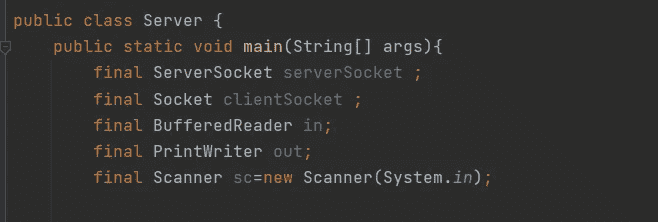

现在让我们实例化 serversocket 对象:

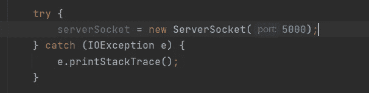

如您所见，ServerSocket 类的构造函数必须接受一个端口号，服务器将使用该端口号来监听客户端的请求，而且实例化应该在 try/catch 中进行

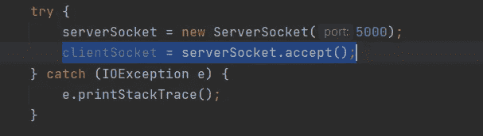

如前所述，服务器使用 serversocket 来监听来自客户端的连接请求，它使用方法 **accept()** 来等待来自客户端的请求，一旦接收到请求，它就接受它并创建一个 **Socket** 类的实例，在我们的例子中它将是“clientsocket”对象。

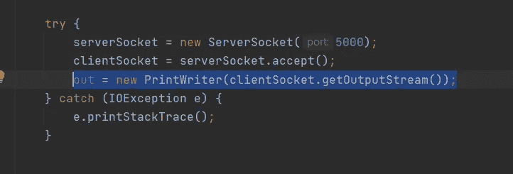

为了实例化“out”，我们使用了 **PrintWriter** 类的构造函数，这个构造函数接受一个参数，这是套接字的输出流，注意这里使用的套接字是 **clientSocket** ，因为它负责向客户端发送数据。

现在“out”准备将数据写入“clientsocket”！

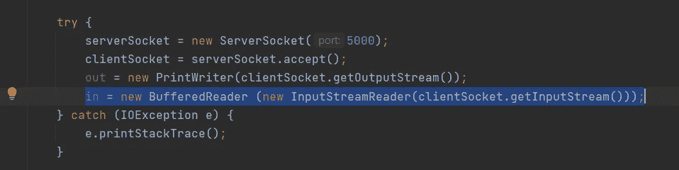

在这一部分中，我们实例化“In”对象，我们将使用它从 clientSocket 中读取数据。这里的构造函数将调用另一个构造函数作为参数

**new InputStreamReader(client socket . getinputstream())**:为套接字创建一个流读取器。然而，这个流读取器只读取字节形式的数据，因此必须将其传递给 BufferedReader 以转换为字符。

既然我们将使用的所有对象都已创建，我们将开始实现两个线程:

*发送线程*:它包含服务器将用来向客户端发送消息的代码

*接收线程*:它包含了服务器用来从客户端接收消息的代码

**发送线程**

在这一部分中，我们将从用户处读取数据，并将这些数据发送给客户端。

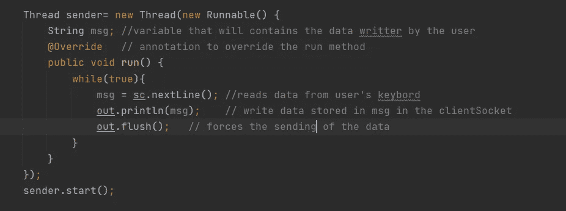

Java 中的类 Thread 有自己默认的 run()方法，该方法应该包含线程将要执行的代码。然而它不能被执行，除非你在那个线程上调用方法 **start()** 。此外，由于在每个不同的线程中我们有不同的代码要实现，我们使用了 **@Override** 注释。

**接收线程**

在这一部分，我们实现了接收线程。

我们使用方法 **readLine()** 使用与 clientSocket 关联的“in”对象读取从客户端发送的数据。

该方法逐行读取客户端发送的消息，如果该方法返回空值，则意味着客户端不再连接。这并不意味着客户端没有发送任何东西，因为客户端可以连接到服务器，仍然没有发送任何东西。

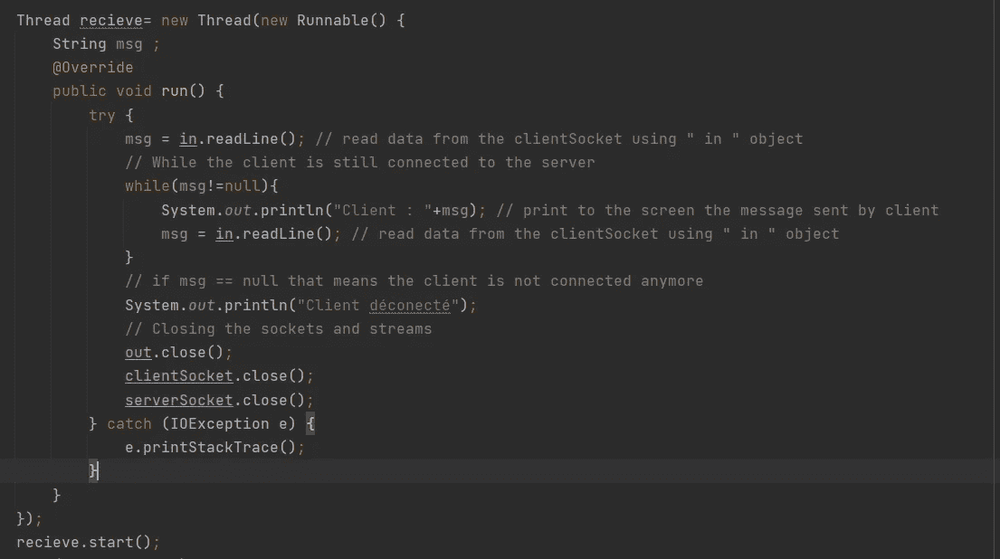

当客户端不再连接到服务器时，我们应该使用方法 **close()** 关闭我们使用的所有套接字和流。此外，我们将所有代码放在 try/catch 中，这样我们可以打印任何与读取数据或关闭套接字和流相关的错误。

服务器现在可以通信了！

这是完整的代码

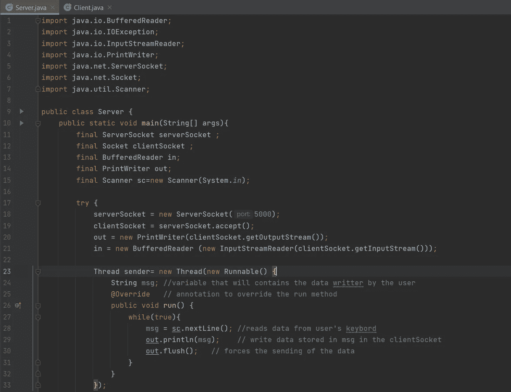

现在让我们实现 Client.java 类:

**2-Client.java**

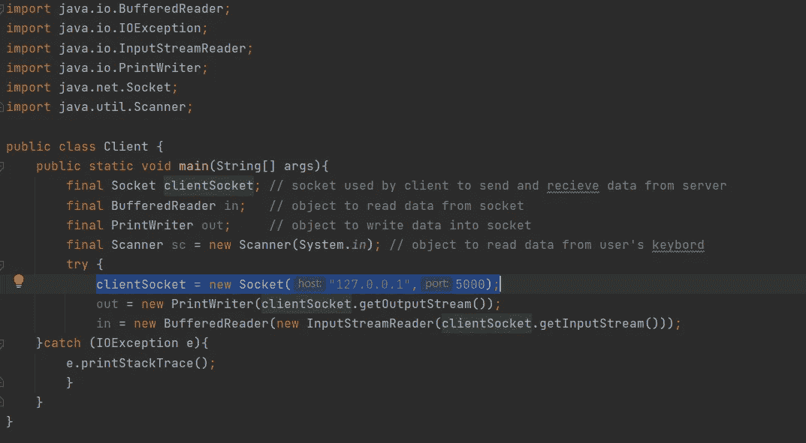

正如你所看到的，客户端的大部分代码与服务器端的是一样的，所以我将只解释在客户端不同的代码行。

当我们声明客户机将用来与服务器通信的套接字时，套接字类的构造函数接受两个参数:

**host** :这是服务器的 IP 地址，在我们的例子中，服务器和客户端都是在同一台机器上实现的，所以我们使用地址 localhost:127 . 0 . 0 . 1

**端口**:端口号，是 Server.java 服务器定义的端口号

现在，客户端也有两个线程，一个用于发送数据，另一个用于接收数据，它们的实现方式与服务器的线程相同

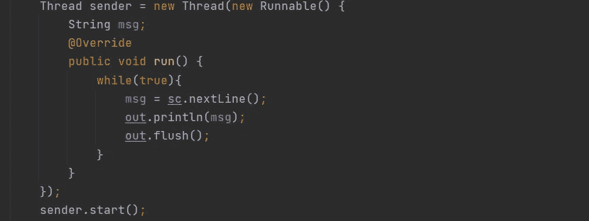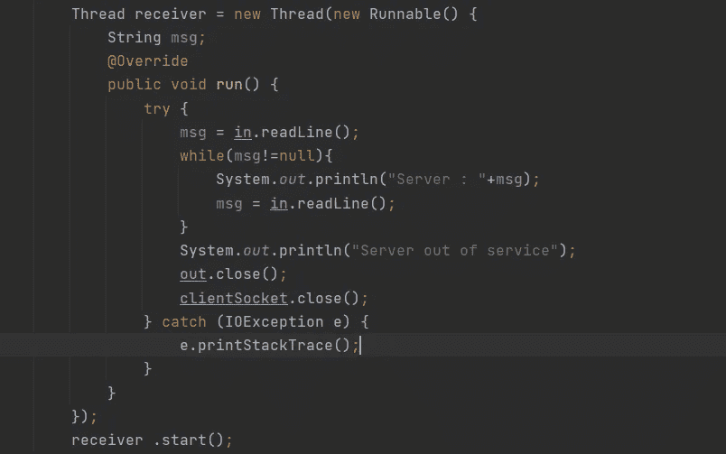

现在，客户端已经准备好进行通信了

以下是完整的代码:

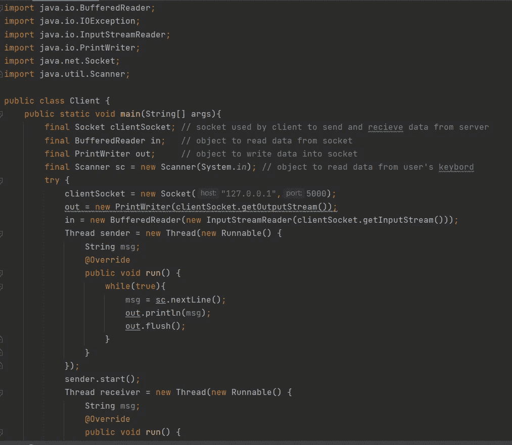

**3-执行**

让我们看看这是如何工作的

先办 Server.java 班，再办 Client.java 班

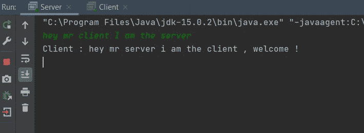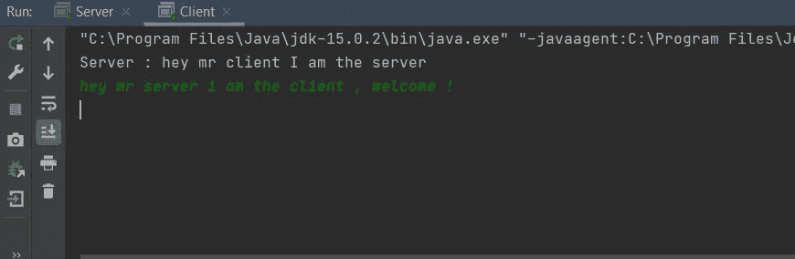

您可以使用以下链接从我的 github 资源库下载项目:

 [## JiheneBarhoumi/ChatApp

### 在 GitHub 上创建一个帐户，为 JiheneBarhoumi/ChatApp 的开发做出贡献。

github.com](https://github.com/JiheneBarhoumi/ChatApp)