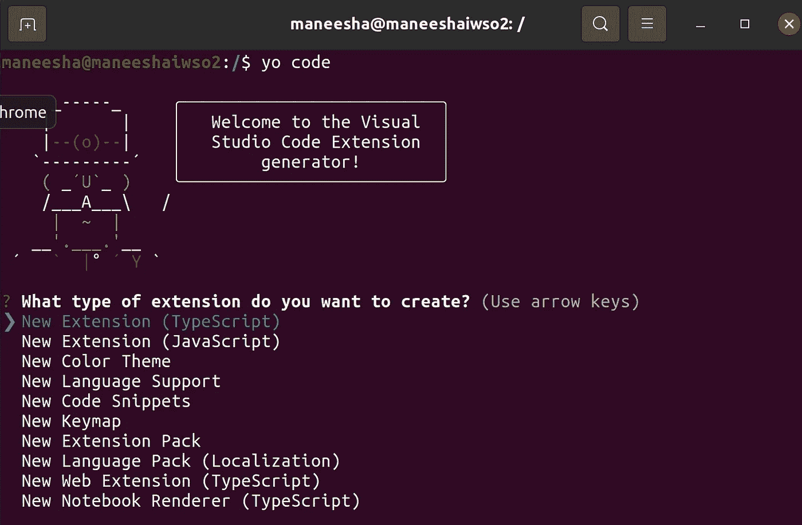
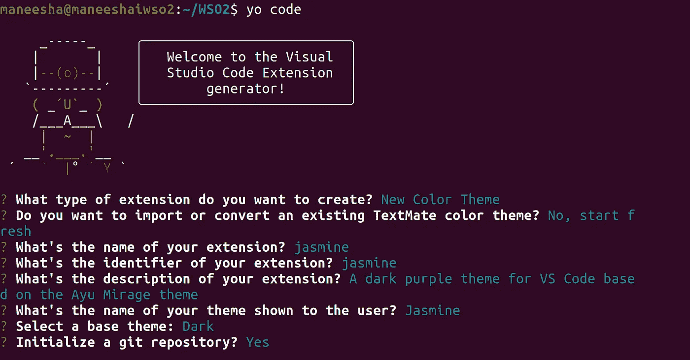
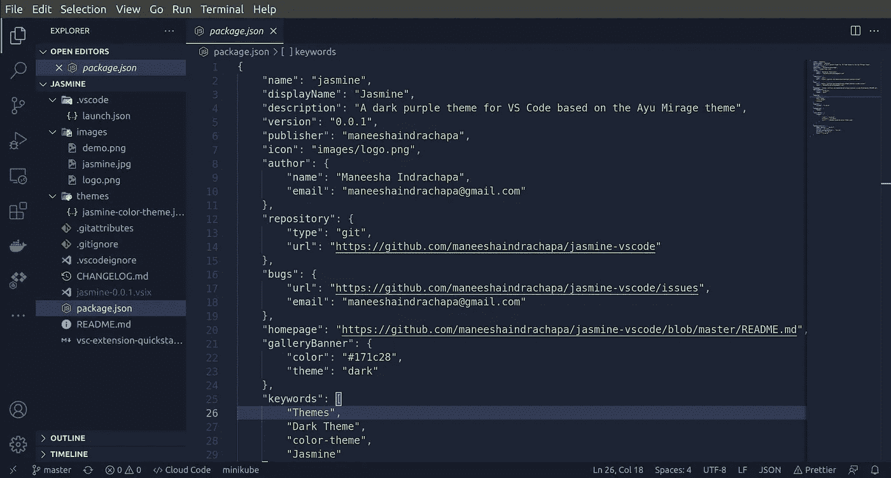
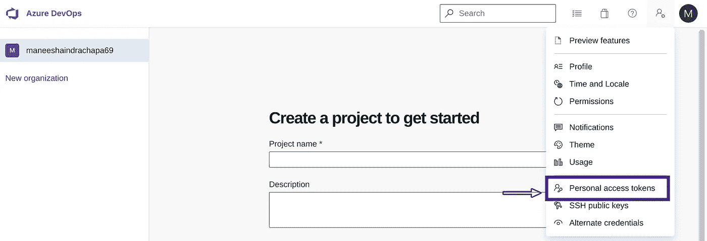
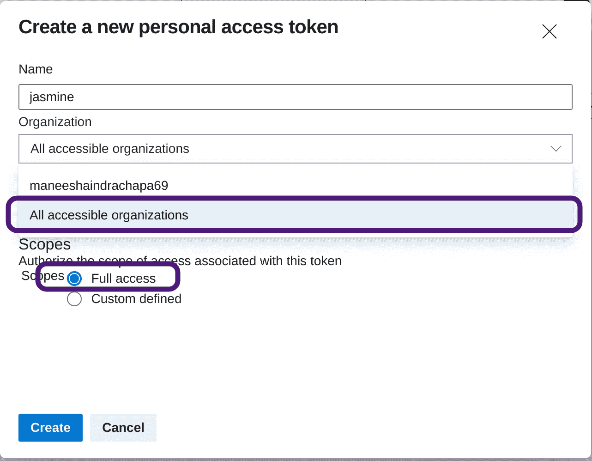
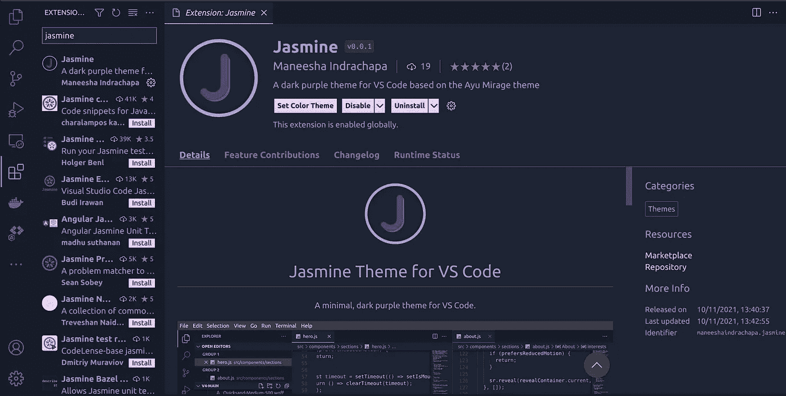

# 为 Visual Studio 代码创建自定义主题扩展

> 原文：<https://medium.com/nerd-for-tech/create-a-custom-theme-extension-for-vscode-d6418feea917?source=collection_archive---------1----------------------->


我使用 Visual Studio 代码(VSCode)已经有一段时间了，当我编码时，我觉得 VSCode 中的默认主题很无聊。所以我在市场上尝试了一些主题，有些不错，但有些不符合我的风格。因此，我想为 VSCode 创建自己的主题，这篇文章是关于为 VSCode 创建的新主题，我将其命名为 [***茉莉***](https://marketplace.visualstudio.com/items?itemName=maneeshaindrachapa.jasmine) 。

在 VSCode 中创建主题扩展相当容易。为此，首先你需要安装[***Node . js***](https://nodejs.org/en/)， ***npm*** (节点包管理器)和[***Git***](https://git-scm.com/)，以便能够安装必要的包。

## 创建主题

1.  要在 VSCode 中创建一个扩展，你需要安装一个 *npm* 包名[***yo***](https://github.com/Microsoft/vscode-generator-code)***。*** *(这个其实代表约曼)*我们可以使用下面的命令全局安装。

```
npm i -g yo generator-code
```

2.打开一个终端，引导到您想要创建主题扩展的目录，并运行下面的命令

```
yo code
```

这将运行 *Visual Studio 代码扩展(vsce)生成器*，然后你会在终端上看到如下内容，使用上下箭头键，你需要在那里选择 ***【新颜色主题】*** 选项。



在代码生成器中选择颜色主题

3.然后它会问你一些问题，并为你创建一个项目目录。



*   选择 ***新建颜色主题***
*   选择 ***否，重新开始***
*   输入您的分机名称
*   输入您的分机标识符(例如标识符是什么:{publisher-name}。{标识符} |只需按回车键并使用默认设置)
*   写一篇简短的描述主题代表什么或者主题背后的想法是什么。
*   输入您希望在市场中显示的名称(区分大小写)(这是扩展显示名称)
*   选择一个基本主题作为起点
*   初始化 git 存储库

您已经成功创建了一个主题项目，现在运行下面的命令来打开它并开始工作！

```
cd {theme-name}
code .
```

4.对于您的主题扩展文件夹，您的文件夹结构将如下所示

```
jasmine/ 
├─ .vscode/ 
│  ├─ launch.json 
├─ themes/ 
│  ├─ Jasmine-color-theme.json 
├─ .vscodeignore 
├─ .gitattributes 
├─ .gitignore 
├─ CHANGELOG.md 
├─ package.json 
├─ README.md 
├─ vsc-extension-quickstart.md
```

您的 ***package.json*** 文件将如下所示

香草包

您需要添加以下属性以将扩展添加到 VSCode marketplace。

*   ***作者***——指定了这个扩展的作者是谁
*   ***资源库***——这将显示你的主题的 GitHub 资源库
*   ***bug***-如果主题有问题或 bug，这将显示在哪里放置问题。
*   ***主页***——每当有人想了解主题的时候，这里就会成为主题的主页。
*   ***gallery Banner-***这是 VSCode 市场上的横幅
*   ***关键词-*** 这是用于 SEO 的。

另外，你需要在根目录下创建一个名为 ***图片*** 的新文件夹，并添加你的主题扩展的*。*

*更新的 package.json*

*5.**里面的*。/themes*** 文件夹你会发现一个名为`{extension-name}-color-theme.json`的`json`文件，这是你需要更新来定制主题的文件。有关这方面的进一步指导，请参考以下链接*

*   *[***VS 代码主题颜色参考***](https://code.visualstudio.com/docs/getstarted/theme-color-reference)*
*   *[***VS 代码主题文档***](https://code.visualstudio.com/docs/extensions/themes-snippets-colorizers)*

*6.你可以通过按下`f5`键在 VSCode 中运行扩展调试器来检查应用到你的主题的颜色。*

## ***发布主题***

*一旦你完成并创建了你的主题，是时候发布并将其添加到市场中了。可以用[***vsce***](https://code.visualstudio.com/api/working-with-extensions/publishing-extension)(**V**isual**S**tudio**C**ode**E**xtensions)来做。要安装 *vsce* ，运行以下命令。*

```
*npm i -g vsce*
```

*为您的项目创建一个 git 存储库(为了避免问题，使用[***GitHub***](https://github.com/))并连接它。用更新后的 ***package.json*** 文件推送你的整个主题。*

**

*更新的 package.json 文件*

*最后，**包装**和**发布**主题使用 ***vsce* :***

1.  *前往 ***Azure DevOps*** 并创建您的组织，您将在该组织下发布您的扩展[https://dev.azure.com/](https://dev.azure.com/)。完成后，您需要为该组织创建自己的*个人访问令牌(PAT)* 。*

****

*但是，您需要小心生成个人访问令牌，否则，您将最终得到一个 401 未授权错误。( *vsce 401 错误*)。当您创建您的 **PAT** 时，您**必须**选择 ***所有可访问的组织*** ，并确保选择 ***“完全访问”。*** 复制个人访问令牌并将其保存在安全的地方，因为我们在后面的部分会用到它。*

*2.接下来，转到 VSCode marketplace，并使用您的 outlook 帐户登录 marketplace。然后你需要创建一个发布者。您可以使用下面的链接创建一个发布者，[https://marketplace.visualstudio.com/manage/createpublisher](https://marketplace.visualstudio.com/manage/createpublisher)*

*3.转到您的终端，使用下面的命令登录到您新创建的发布者，使用生成的个人访问令牌。*

```
*vsce login (publisher name)*
```

*3.使用下面的命令打包你创建的主题，它会生成一个扩展名为`vsix`的文件。*

```
*vsce package*
```

*4.要发布主题，您可以使用下面的命令*

```
*vsce publish*
```

*或者你可以使用这个[链接](https://marketplace.visualstudio.com/manage/publishers)，选择发布者点击 ***新建扩展→VSCode*** 拖拽打包好的`{extension-name}-{version}.vsix`文件。*

***就是这样！** **你刚刚发布了自己的 VSCode 主题。🚀 🎨**您可以通过搜索在 VSCode 扩展中看到您的扩展。*

**

*你可以从这里试试主题 ***【茉莉】*** 。*

*[](https://marketplace.visualstudio.com/items?itemName=maneeshaindrachapa.jasmine) [## Jasmine - Visual Studio 市场

### VS 代码的一个最小的深紫色主题。在 VS 代码中打开扩展侧边栏面板。

marketplace.visualstudio.com](https://marketplace.visualstudio.com/items?itemName=maneeshaindrachapa.jasmine) 

如果有任何问题或需要改进的地方，请在这里创建一个问题。

[](https://github.com/maneeshaindrachapa/jasmine-vscode) [## GitHub-maneeshaindrachapa/jasmine-VS Code:VS 代码的最小深紫色主题，基于…

### VS 代码的一个最小的深紫色主题。在 VS 代码中打开扩展侧边栏面板。

github.com](https://github.com/maneeshaindrachapa/jasmine-vscode)*