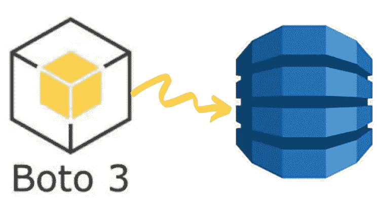
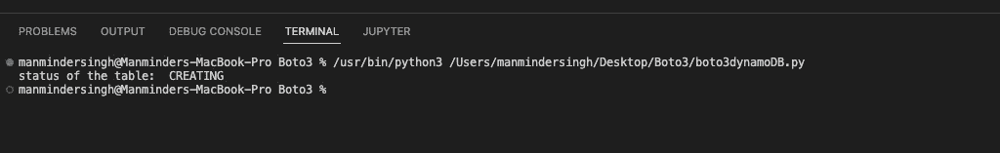
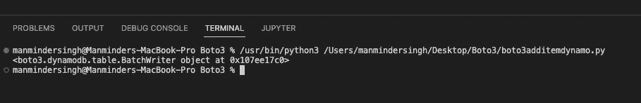
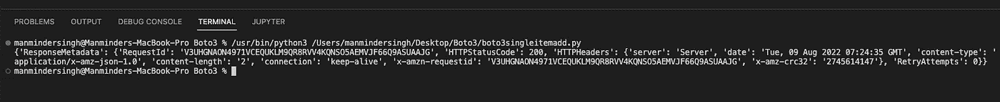
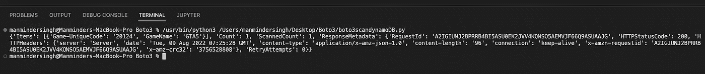
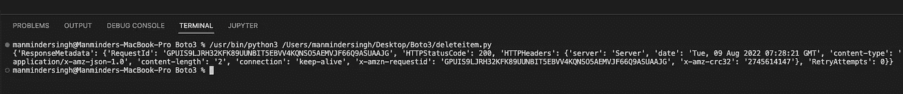
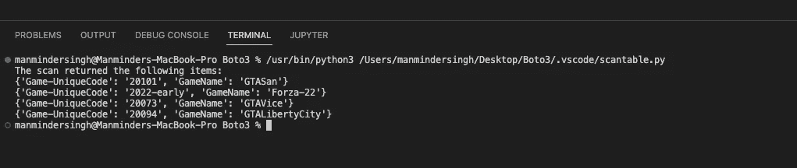

# 使用 Python 库(boto3)创建一个 DynamoDB 表

> 原文：<https://medium.com/nerd-for-tech/create-a-dynamodb-table-using-the-python-library-boto3-b00934ba2b2d?source=collection_archive---------0----------------------->

使用 boto3 进行 dynamo DB 操作！

本文旨在使用 boto3 库创建 DynamoDB 表。为了实现目标，我们将做不同的工作。

**先决条件** 1。AWS 帐户，IAM 用户，拥有 Cloud9 和 DynamoDB 的权限。
2。Cloud9 IDE，配置了 AWS 凭证。
3。Github 账户。

**任务 1:创建 DynamoDB 表** 我们将使用 boto3 库通过 python 代码创建 DynamoDb 表。我们希望创建一个具有两个属性的表，这两个属性分别是排序键和主键。

终端中的输出

**任务 2:将值添加到 DynamoDB 表** 让我们将值添加到我们在上一个任务中创建的属性中。我们将使用下面的代码来添加值。

向表中添加项目后在终端中的输出

将单个值只添加到 DynamoDB 表的另一种方法是:我们将使用下面的代码。

增加了一项

**任务 3:查询 DynamoDB 表** 由于我们已经将多个值添加到 DynamoDB 表中，所以让我们通过 python 代码查询一些值。

作为查询操作的结果，返回值将是 GTA5。

GTA5 是对表运行查询的结果

**任务 4:从 DynamoDB 表中删除值** 让我们从 DynamoDB 表中删除一个值，我们将使用下面的代码执行相同的操作。

既然我们已经从 DynamoDB 表中删除了 GTA5，那么让我们继续扫描这个表，验证删除代码是否有效。

因此，将显示除 GTA5 之外的所有值。

我们现在已经完成了所有要求的任务。感谢阅读！☁️✌️