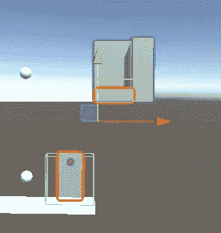
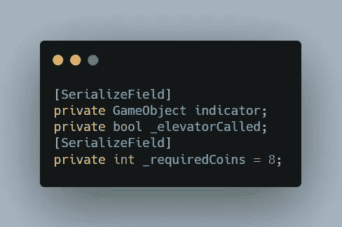
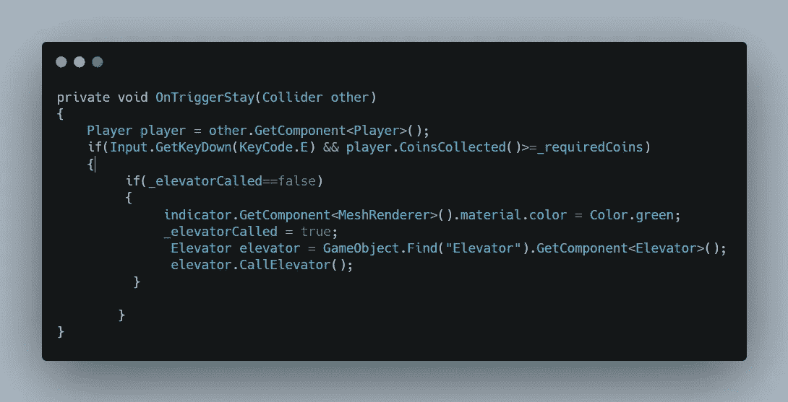
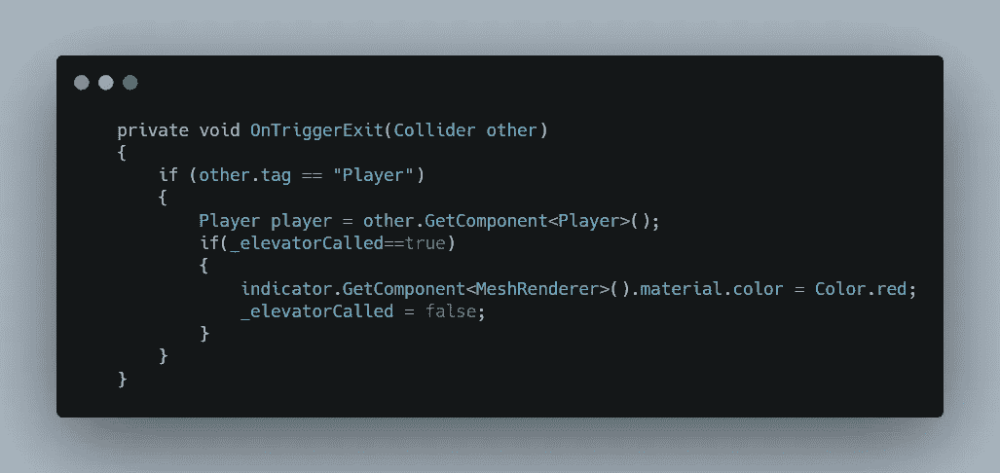
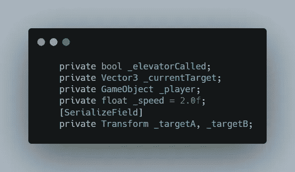
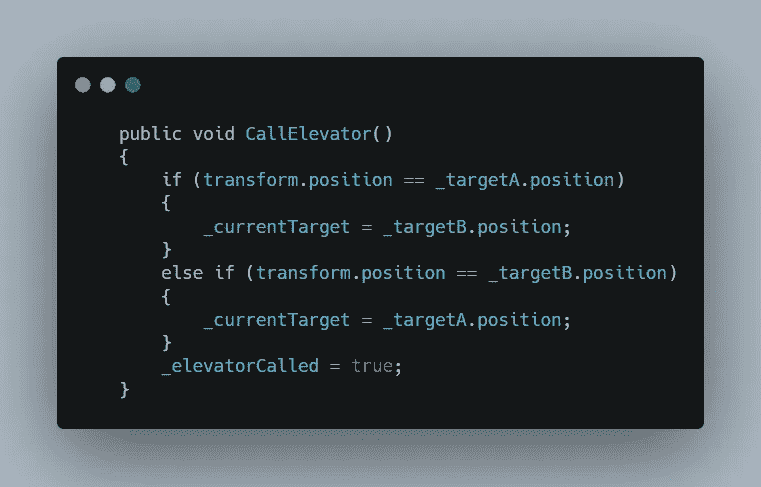
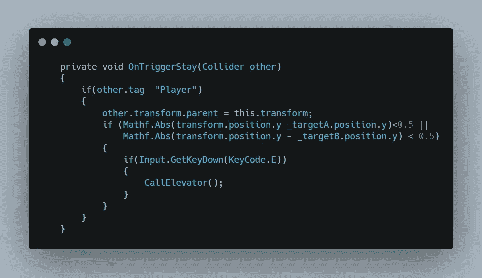
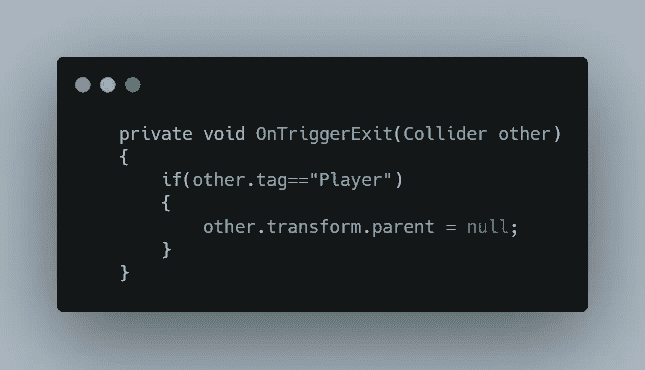
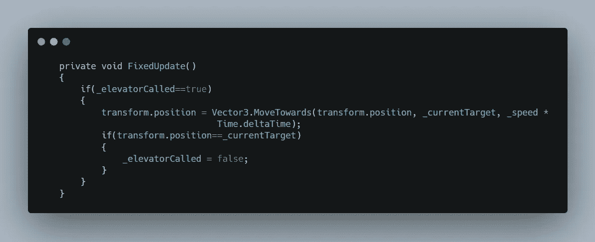
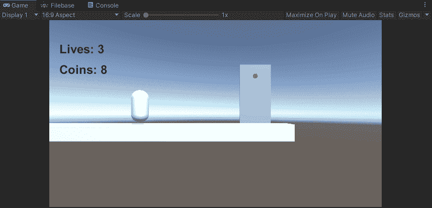

# 在统一中创造一部电梯

> 原文：<https://medium.com/nerd-for-tech/create-a-elevator-in-unity-8bfb6e7d4bb6?source=collection_archive---------19----------------------->

2.5D 游戏开发

**目标:**创建一个让 gameobject 上下移动的调用系统。

这是我们的场景，每当玩家收集到所需的数量，并站在电梯呼叫方附近，即看起来像门的游戏对象，当我们按下“E”键时，红色指示器将变成绿色，电梯下降。

让我们首先在电梯调用者内部的 ElevatorPanel 脚本中创建一些变量。指示器变量引用红色指示器，bool 变量用于检查电梯是否被调用，required coins int 变量用于检查玩家在调用电梯并进入下一阶段之前是否收集了足够的硬币。

现在在玩家进入触发器后，检查是否是玩家，然后检查是否按下了“E”键，并且玩家已经收集了所需数量的硬币。现在两者都返回 true，检查电梯是否已经被调用。如果不是，那么将指示器改为绿色表示肯定，并将电梯呼叫设置为真，这样玩家就不能一次又一次地呼叫它。

然后找到电梯游戏对象，调用 CallElevator 函数。

在玩家退出电梯呼叫范围后，将一切设置为默认。

现在创建另一个脚本电梯，并将其添加到电梯游戏对象。在那里，创建一个 bool 来检查是否调用了电梯，创建 vector3 变量来存储目的地，创建 gameobject 变量来存储玩家，创建 speed 来定义移动速度，创建 Transform 变量来存储起点和目标的位置值。

现在每次电梯被呼叫时，检查它的位置。如果电梯在原点，则移动到目标，即 TargetB，如果电梯在目标，则移动到原点，即 TargetA，并将名为 bool 的电梯设置为 true。

然后，在玩家进入电梯后，移动玩家游戏对象，使电梯成为其父级，这样玩家就可以随着电梯一起移动。然后检查电梯是否接近目的地，以确保目的地不会在中途改变。

然后，如果玩家按下“E”键，调用呼叫电梯功能，改变目的地并启动电梯。

玩家退出电梯后，将其父级设置为 null，这样玩家就不会相对于电梯移动。

最后，当电梯被叫向目的地时，移动电梯。电梯到达目的地后，将电梯呼叫设置为假。

这就是结果。

检查[这里](https://github.com/ZeusK10/2.5D-Platformer-puzzle)的完整脚本。