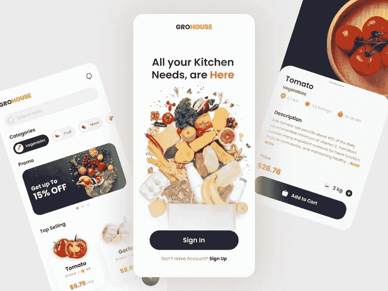
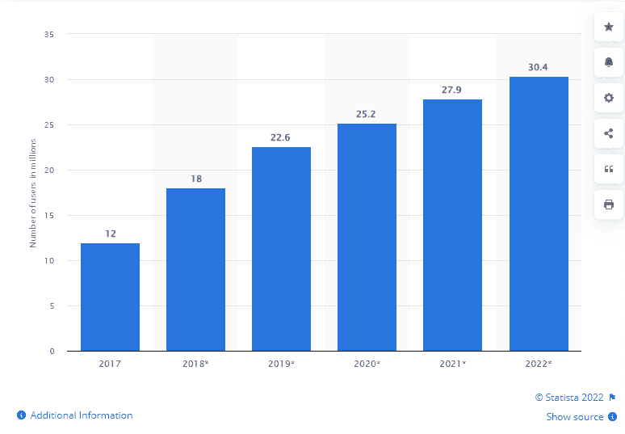
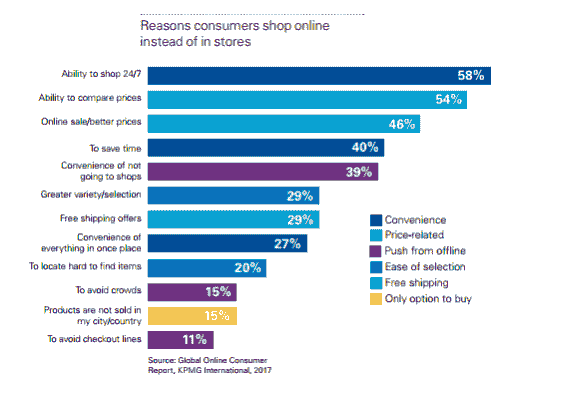

# 创建一个杂货交付应用程序:其成本、功能、商业模式和技术栈)

> 原文：<https://medium.com/nerd-for-tech/create-a-grocery-delivery-app-its-cost-features-business-model-and-tech-stack-97e00ec7ac1c?source=collection_archive---------0----------------------->

## 开发杂货交付应用程序:其成本、功能、商业模式和技术栈)

[图像来源](https://dribbble.com/shots/17892022-Grohouse-Grocery-App)

你有没有从事过食品杂货生意，并且正在寻找潜在的机会让它更上一层楼？如果是的话，那么这是一个将你的传统杂货业务转移到数字平台的令人担忧的时刻。在这个快速变化的世界中，为您的企业开发一款按需杂货配送 app 已经成为一小时内的迫切需求。

**话虽如此，你一定很想知道这几个问题的答案:**

*   *为什么构建杂货交付应用对您的企业变得如此重要？*
*   *杂货递送应用程序是如何工作的？*
*   *你应该开发什么类型的杂货配送应用？*
*   *开发一个杂货类 app 一般有哪些特点？*
*   *开发成功的杂货交付应用程序的一些高级功能*
*   *你如何从你的杂货递送应用中赚钱？*
*   *做一个杂货配送 App 要多少钱？*
*   *结论:如何在 2022 年为你的企业打造一个成功的杂货配送 App！*

近年来，移动技术表现出色，推动了购物领域的发展。消费者比以往任何时候都更希望通过移动应用来购买服装、支付账单、学习新技能或购买食品。随着时间的推移，这种趋势似乎只会越来越流行。因此，各行各业的企业都在向前迈进，以增加他们在这个数字世界中的存在，以杂货店为基础的企业也不例外。

将您的实体企业迁移到数字平台从来都不是一件容易的事情。这里面涉及到多重因素，比如风险，市场竞争，更重要的是开发一个 app 的资金和精力。但是你不需要担心。这篇博客指南在这里解释了你需要知道的关于在 2022 年开发一个杂货递送应用程序的一切。

> 让我们深入探讨上面提出的每个问题，以帮助您做出更好的决策:

## **1。为什么为您的企业构建杂货交付应用变得如此重要？**

在疫情之后，事情彻底改变了。人们列购物清单的日子一去不复返了。随着时间的推移，所有这些普通商店都已经转变为超市，现在正在快速形成在线杂货购物和送货应用程序的形状。

总而言之，随着疫情冠状病毒在各国蔓延，导致许多行业停止生产，在线杂货行业获得了冲击市场的机会。随着社交距离和隔离的增加，对在线杂货配送的需求也在增加。随着通过应用程序购买的杂货销售额的飙升，人们比以往任何时候都更依赖这些程序。

你不必相信我们的话。以下是代表食品杂货配送市场发展状况的市场统计数据:

**在线食品杂货市场预测和未来预测:2022 年食品杂货配送应用蓬勃发展**

以下是一些重要的统计数据和事实，描述了杂货交付应用和在线杂货店购物的惊人增长。

*   *据 Statista 统计，成人杂货应用用户数量持续增长，预计 2022 年* [*将达到 304 亿*](https://www.statista.com/statistics/1013928/number-of-grocery-app-users-us/) *。*

[图像来源](https://www.statista.com/statistics/1013928/number-of-grocery-app-users-us/)

*   [*根据研究，*](https://www.elluminatiinc.com/grocery-delivery-statistics/) *预计未来几年，三分之一以数字方式订购杂货的消费者将增加 60%。*

[图像来源](https://www.elluminatiinc.com/grocery-delivery-statistics/)

*   根据最近的一份调查报告，对杂货交付应用的需求正在持续增长，并将很快以高达 1338 亿美元的估值接管传统的杂货业务。

**一言以蔽之:**购物趋势的这种变化带来了商机的增加。杂货店可以通过投资和雇佣一个移动应用程序开发者来开发他们的移动应用程序，在这个行业里茁壮成长。初创公司、其他杂货店和科技公司都为那些选择不通过应用程序以传统方式购物的人提供了更多便利。

因此，如果你最终决定开发一个杂货交付移动应用，那么你可能需要知道它是如何工作的。

# **2。杂货递送应用程序是如何工作的？**

杂货递送应用程序的机制相对简单。它提供了几乎所有你能想到的食物，并允许你使用不同的标准来过滤你的搜索。一旦你找到了某样东西，你可以把它放在你的购物车里，然后结账，他们会在你方便的时候给你送货上门。

> **为了让这款应用无缝运行，我们需要遵循一些简单的步骤:**

*   注册帐户后，用户可以使用他们的电子邮件地址或电话号码和密码登录。
*   然后他们会搜索他们想买的产品。
*   一旦他们选择了想要的商品，他们在提交订单之前输入他们的运输信息。
*   商店经理接收来自管理员的请求，并在审查后接受或拒绝它。
*   如果接受，他生成一个订单，然后通过快递服务交付给客户，快递服务通过通知管理员和客户来报告产品的成功交付。

通过投资杂货应用程序开发，您可以无缝地简化管理杂货交付订单的流程，并跟踪成功。这个应用的成功很大程度上取决于你为这个项目雇佣的移动应用开发公司。但在你继续下一步之前，决定你想要开发什么类型的杂货交付应用程序是至关重要的。应用程序的功能进一步基于应用程序模块。

# **3。你应该开发什么类型的杂货交付应用？**

在线杂货交付移动应用市场的竞争非常激烈。有许多竞争对手，他们有不同程度的理解和经验，所以在确定一个概念之前，知道你想创建什么类型的应用程序是很重要的。

例如，如果你正在为你自己的杂货生意开发一个应用程序，并且正在考虑一个印度的应用程序开发者，有很多选择可以寻找。虽然乍一看它们听起来都很棒。但是请记住，根据你想开发什么样的应用程序，每一项资源都投入到了开发中。

从运营成本到赚钱，每件事都会受到很大的影响，所以在做任何事情之前，一定要彻底调查清楚！

> 一般来说，你可以用三种方式开发一个杂货递送应用程序:

*   **基于电子商务的杂货配送手机 App**

基于电子商务的杂货应用是用户必须从第三方平台搜索商品的应用。这种应用模块的完美例子是亚马逊，用户必须在线购买食品杂货，并确保送货上门。

*   **专用个人杂货配送手机 App**

送货服务有自己的商店，有需要送货的产品。商店本身负责管理杂货交付产品。

*   **面向初创公司的聚合杂货配送移动应用模型**

如果你正在考虑开发一个基于聚合器模型的杂货交付应用，那么简单的方法就是与当地的杂货店合作。这种模式通常被那些拥有自己的杂货店和供应链的人所偏爱。在这个模型中，用户可以从一个食品供应商列表中进行选择，然后整个责任都落在服务商身上。

一言以蔽之，无论你选择哪种移动 app 开发模式来创建一个杂货配送 app。要构建一个成功的杂货交付移动应用，你需要 [**雇佣一个跨平台的应用开发者**](https://www.appsdevpro.com/hire-developers/hire-cross-platform-app-developers.html) ，他可以很容易地把你的想法变成一个成功的应用。但是，这里涉及到决定你想在你的杂货交付应用程序中提供什么功能。

# **4。开发一款杂货配送移动 App，一般有哪些特点？**

无论杂货交付应用程序模型如何，都有一组基本的特性和功能需要包含在您的杂货交付应用程序中。为了让它完美地工作，确保你的杂货交付应用程序包含以下 3 个面板:客户、店主和管理员。

以下是各自的功能:

> **为杂货交付应用创建客户面板的功能**

*   **注册:**要创建一个账户，客户只需填写他们的基本信息，如姓名、电子邮件地址、电话号码和街道地址。
*   **浏览产品:**这里有许多食品和杂货，顾客可以选择浏览他们想要的产品。
*   **高级搜索过滤器:**确保你的杂货交付应用程序具有高级搜索过滤器，通过根据用户的选择对产品进行排序，帮助用户快速轻松地找到他们想要的东西。
*   **安排产品交付:**允许客户在首选时间提前安排产品交付。
*   **应用内支付方式:**提供通过 PayPal、Google Wallet、UPI 等多种支付方式进行支付的便利。
*   **实时订单跟踪:**客户可以通过电子邮件和短信跟踪他们的订单，提供他们交付状态的实时更新。
*   **个人资料设置:**在杂货配送 app 中，您可以为用户提供更改 app 设置的完全权限。您可以雇用移动应用程序开发人员来自定义应用程序设置，并允许用户设置他们的信息，如联系详细信息、电子邮件地址、送货地址等。
*   **分享评论&评级:**根据应用程序上的购物体验，允许用户分享他们的反馈并提供评级。

> **创建杂货交付应用的店主面板的功能**

*   **所有者登录:**要访问应用程序，所有者必须使用管理员获得或批准的相同凭据。
*   **更改商店位置:**商店老板可以在地图上更改其商店的位置，以便客户可以使用它来找到最近的商店进行订购。
*   **店内取货:**这是宁愿在店内取货的顾客的一个选择。它将增强客户的线下杂货业务。
*   **管理个人资料:**店主有完全的自由来管理他的店铺个人资料。所有者可以修改或更新他们的详细信息，包括姓名、电子邮件地址、电话号码等。，随时随地。
*   **实时跟踪路径:**使用 GPS 跟踪或谷歌地图跟踪整个路线，店主应该能够监控快递服务的当前状态。

> **为杂货交付移动应用程序创建管理面板的功能**

*   **商店管理**:管理员可以从一个位置管理商店的各个方面。有了这个功能，管理团队就能同时监管多个商店。
*   **与店主的协调:**确保你的应用程序中有一个功能，可以让管理员轻松地与经理即时沟通，并保持事情顺利进行。
*   **商品列表管理**:管理员可以管理和调节可供销售的商品列表，并根据市场标准和店主的需求调整价格。
*   **订单跟踪:**有了这个功能，你可以让管理员监控每一个订单的每一步，确保它们得到系统的处理，没有延误。
*   客户管理:行政将被要求管理客户，并定期向他们提供有关最新情况的更新。此外，他们还应该不时地发送通知，以便客户可以跟踪正在发生的事情。
*   **反馈:**通过此功能，管理员可以收集所有评论并管理杂货店店主的评分，以改善客户体验。
*   **支付管理:**在线杂货解决方案的管理面板也处理支付模型。

这些是创建杂货交付应用程序的几个基本功能，但如果你希望与 Instacart 或沃尔玛等流行的杂货交付应用程序竞争，那么你需要集成一些高级功能。

那么，你可以考虑在应用程序中包含哪些最佳的高级功能呢？

> 让我们来了解一下！

# **5。开发一个成功的杂货交付应用程序的一些高级功能**

在实现了杂货交付应用程序的一般功能后，是时候加入那些使该应用程序与众不同的功能了。考虑一下这些高级功能，它们将使你的应用在竞争中保持领先地位。

*   **推送通知:**人们喜欢便利，杂货递送应用程序正好提供了这一点。用户可以获得关于他们订单状态的推送通知，这是让他们了解最新情况的好方法。该特征还允许顾客和杂货店之间的透明和信任。
*   **实时跟踪:**实时跟踪是任何杂货交付应用程序最重要的功能之一。毕竟，你希望能够跟踪你的杂货从他们离开商店的时间，直到他们到达你的门口。这个特性允许你这样做。此外，它还有助于客户服务。如果您的订单出现问题，您可以轻松找到并解决。
*   **GPS 跟踪:**杂货递送应用程序中的这一高级功能将允许客户实时跟踪他们的订单，并准确知道订单何时到达。它使企业能够优化其交付路线以提高效率。GPS 跟踪还可以用于根据客户的位置向他们提供折扣或促销。
*   **应用内通话/聊天:**如果没有应用内通话或聊天，一个杂货店送货应用就不完整。该功能将允许客户直接从应用程序联系客户服务或他们的送货司机。应用内呼叫还允许客户查看订单状态，或者在必要时进行修改。
*   **忠诚度计划:**一个杂货递送应用应该有一个忠诚度计划，以鼓励客户继续使用该应用。通过 [**雇佣一个移动应用开发者**](https://www.appsdevpro.com/hire-developers/hire-mobile-app-developers.html) ，你可以很容易地将这个功能集成到你的应用中。忠诚计划可以为每一次购买提供积分，积分可以兑换成折扣或免费物品。
*   **实时分析:**通过该功能，您将能够看到已经完成了多少订单，订购了哪些产品以及其他可以帮助您实时调整和适应的重要数据。
*   **号码屏蔽:**电话号码屏蔽是一项技术，通过在不暴露客户真实电话号码的情况下将他们与快递员联系起来，来帮助保护客户的隐私。
*   **产品重新订购:**顾客只需点击几下鼠标，就可以重新订购他们喜欢的商品。对于时间紧迫或知道自己想要什么的客户来说，这是一个很好的功能。此外，它可以节省你的送货费。
*   **视觉搜索:**许多杂货递送应用程序的一个关键功能是视觉搜索，用户可以拍摄他们想要的物品的照片，并在应用程序中进行搜索。对于寻找特定商品或想要比较不同商店价格的人来说，这是一个有用的功能。
*   **语音搜索:**这一功能将允许用户通过对着手机说话来搜索商品，而不是打字。语音搜索变得越来越流行，因为它比打字更快更容易。

## **6。你如何从你的杂货递送应用程序中赚钱？**

有几种方法可以将你的杂货递送应用货币化。您可以收取订阅费、送货费或每笔订单的佣金。你也可以提供应用内购买，如高级功能或无广告使用。

你也可以与杂货店和其他企业合作，为应用程序用户提供折扣和优惠券。无论你选择什么样的盈利策略，都要确保它符合你的整体商业目标。

例如，如果你的目标是创建领先的移动杂货应用程序，你可能希望专注于订阅或佣金。如果你希望从客户那里获得更多的下载和参与，那么应用内购买可能是你最好的选择。

另一方面，如果你想快速轻松地创收，与提供免费产品或服务的公司合作可能是一条出路。

## **7。搭建一个杂货配送 App 要多少钱？**

现在我们已经学习了基础知识，你也知道了如何创建一个杂货递送应用程序，让我们试着估算一下开发的成本。确切的价格取决于几个因素——从应用程序的复杂性到你选择的开发者——但这个粗略的估计可以让你知道应用程序开发成本的确切构成。

因此，在你陷入任何营销陷阱之前，你需要了解影响杂货交付应用开发成本的这些因素:

*   **市场研究和项目发现:**许多企业犯了一个严重的错误，没有首先分析市场需求就直接进入应用程序开发流程。因此，这是您的应用程序开发团队分析市场需求、进行调查以了解用户观点，然后评估您的项目范围的地方。
*   **操作系统的选择:**决定你是要在 Android/iOS 原生平台上推出一个 app，还是针对两个平台。平台的选择会对应用程序开发的成本产生巨大的影响。由于原生应用程序是用平台特定语言编写的，而选择雇佣跨平台应用程序开发人员可以节省高达 40%的应用程序开发成本。这是因为跨平台框架使用基于单个代码，70–80%的代码是可重用的。
*   **应用程序的复杂性:**应用程序的复杂性取决于您为杂货交付应用程序选择的特性和功能。MVP 应用程序开发可能需要 10，000 美元，而一个成熟的应用程序开发每个平台需要 25，000 美元。
*   **app 开发团队:**要创建一个像 Instacart 这样的杂货配送 App，你需要雇佣一个开发团队，包括一个项目经理，一个 App 开发人员，一个 QA 工程师，一个 UI/UX 设计师。雇佣程序员和开发人员的每小时成本取决于他们的技能、经验和知识。

总而言之，在甚至不知道你打算在你的杂货应用程序中包含什么的情况下，用一个直截了当的答案回答上述问题仍然具有挑战性。

尽管如此，如果要根据这些因素得出应用程序开发成本的结论，结果将是:

*   **简单的杂货应用程序开发:**成本在 10，000 美元到 12，000 美元之间，开发可能需要 3 到 4 个月。
*   **中型杂货应用程序开发:**成本在 15，000 美元到 20，000 美元之间，开发可能需要 4 到 7 个月。
*   **高级应用版本:**费用在 20，000 美元到 25，000 美元+之间，可能需要 9 个月以上的开发时间。

## **结论:如何为你的企业打造一款成功的杂货配送 App。**

对于杂货店来说，开发一个杂货配送应用程序不再是一件令人惊讶的事情。但是，如何在这个竞争激烈的市场中取得成功，并创建一个应用程序演示文稿，是一个真正的挑战。所以简单的方法就是 [**雇佣一个移动应用开发者**](https://www.appsdevpro.com/hire-developers/hire-mobile-app-developers.html) 来帮你定制功能齐全的电子商务杂货配送软件，可以在 Android 和 iOS 智能手机上运行。一个专业的外包公司可以帮助你开发一个能够吸引大众注意力的应用程序。

因此，如果您准备将您的业务带到数字平台，并且正在寻找一个团队来帮助您将其转变为一个强大的解决方案，那么您可以 [***联系我们***](https://www.appsdevpro.com/inquiry.html) 或者在下面提出疑问！