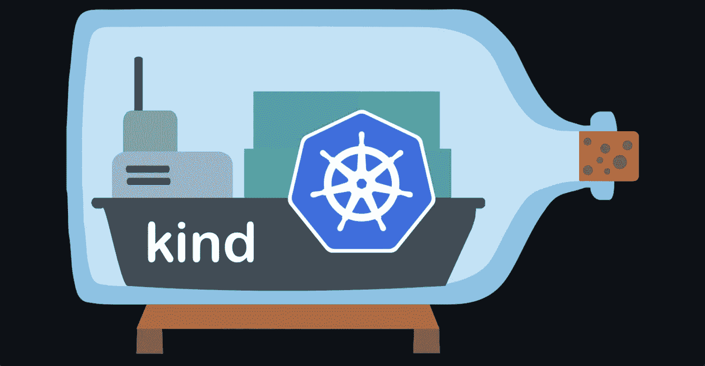
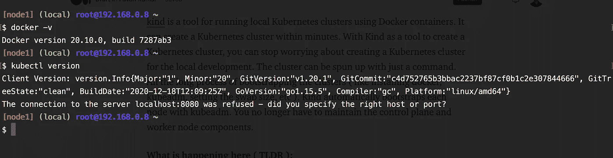
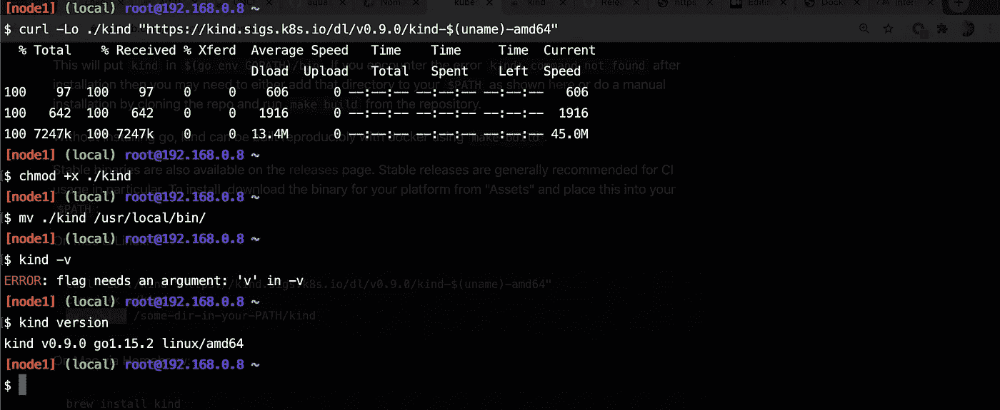
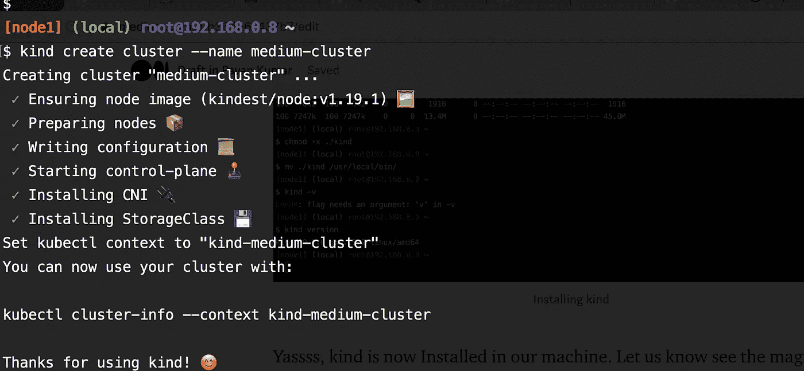
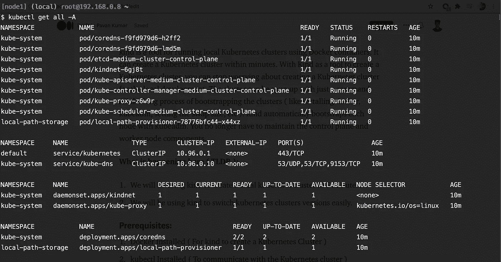
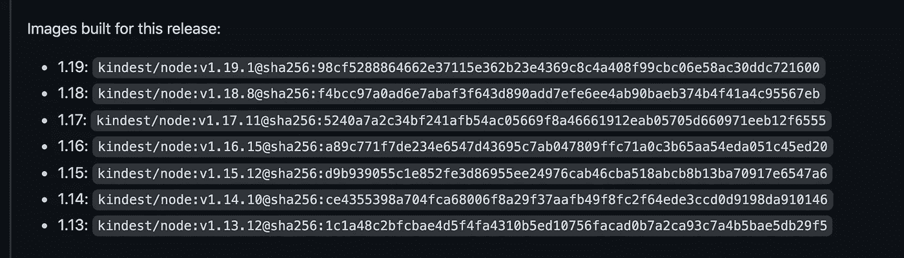
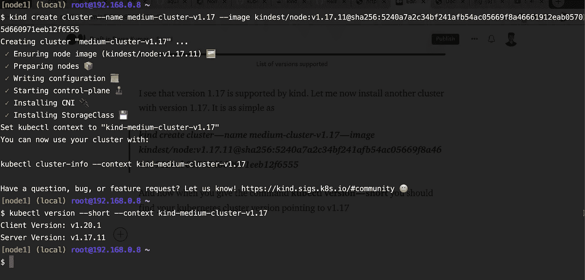
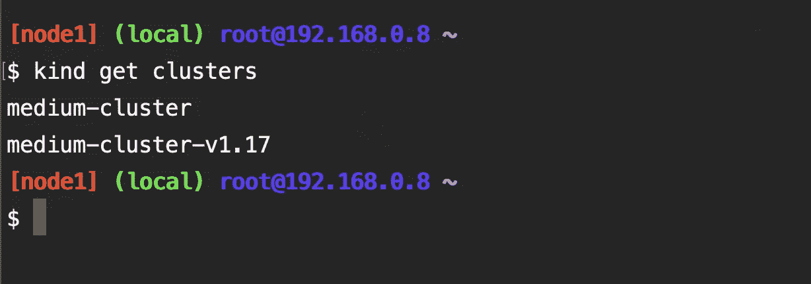
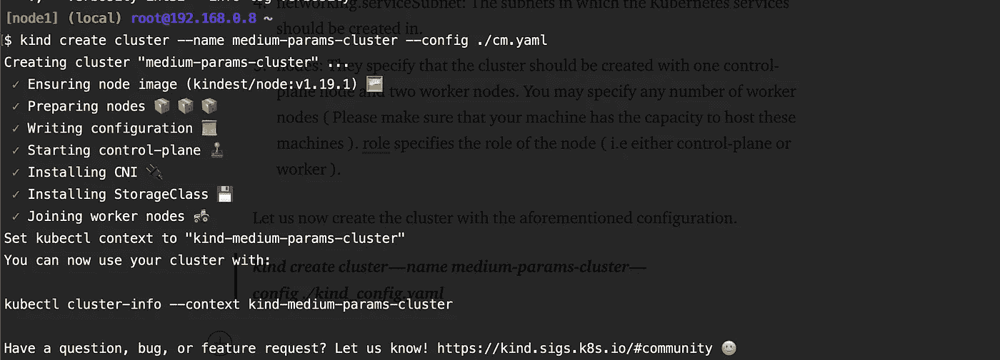
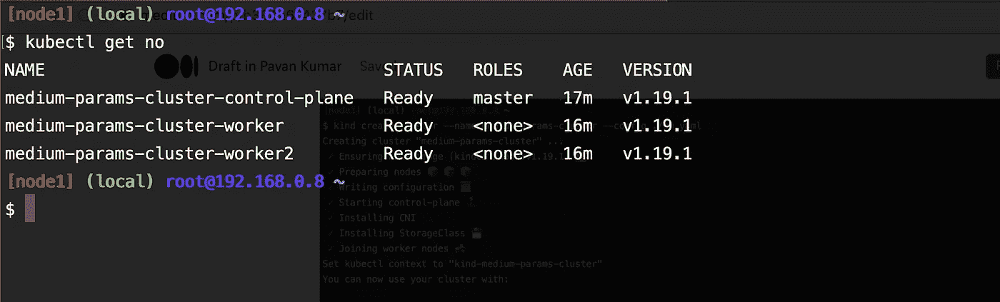

# 使用 Kind 创建一个 Kubernetes 集群

> 原文：<https://medium.com/nerd-for-tech/create-a-kubernetes-cluster-using-kind-b364a67437b7?source=collection_archive---------1----------------------->

如何使用 kind 在 5 分钟内创建一个 Kubernetes 集群？

kind 是一个使用 Docker 容器运行本地 Kubernetes 集群的工具。它可以在几分钟内创建一个 Kubernetes 集群。有了 Kind 作为创建 Kubernetes 集群的工具，您就不用担心为本地开发创建 Kubernetes 集群了。只需一个命令，集群就可以启动。所有引导集群的漫长过程(如安装 kubeadm、设置交换空间、连接三个节点、安装 cni 等)都由 kind 处理。Kind 用 kubeadm 自动引导每个节点。您不再需要维护控制平面和工作节点组件。



种类

这里发生了什么(TLDR ):

1.  我们将在 5 分钟内使用 kind 创建一个本地 Kubernetes 集群。
2.  我们将使用 kind 来轻松切换 Kubernetes 集群版本。

## 先决条件:

1.  Docker 已安装(用于创建 Kubernetes 集群)
2.  kubectl 已安装(与 Kubernetes 集群通信)

## 演示:



Docker 和 Kubectl 已安装

这里是我的节点安装了 docker 和 kubectl 的快照。让我们现在安装。

```
curl -Lo ./kind "https://kind.sigs.k8s.io/dl/v0.9.0/kind-$(uname)-amd64"
chmod +x ./kind
mv ./kind /usr/local/bin/################**You can check the kind version by giving the following command** kind version
```



安装类型

Yassss，kind 现在安装在我们的机器上。现在让我们看看善良的魔力。让我们创建一个简单的集群。这很简单

> **种类创建集群—名称=中型集群**



安装集群

是的，你没看错！！我们的 Kubernetes 集群已经安装完毕，现在已经准备好:)为我们的工作负载提供服务！！默认情况下，它将在我们的集群中安装最新的 Kubernetes 版本。激动吗？？？


耶！！！！！！

让我们检查用集群创建的组件。



组件作为集群创建的一部分

啊！！！我刚刚意识到我们的工作负载与 Kubernetes 版本 1.17 兼容。没问题，我已经搞定了。您可以在(— image)参数中传递 Kubernetes 版本，以选择要创建的 Kubernetes 集群的版本。您可以通过查看发布页面来查看您的同类所支持的所有 Kubernetes 版本。

[](https://github.com/kubernetes-sigs/kind/releases) [## 释放 kubernetes-sigs/kind

### v0.9.0 侧重于稳定性增强继 v0.8.0 / v0.8.1 之后，v0.10.0 将推出一系列新功能…

github.com](https://github.com/kubernetes-sigs/kind/releases) 

支持的版本列表

我看到 1.17 版本支持 kind。现在让我安装另一个版本为 1.17 的集群。这很简单

> **kind create cluster—name medium-cluster-v 1.17—image kindest/node:v 1 . 17 . 11 @ sha 256:5240 a 7a a2 c 34 BF 241 AFB 54 AC 05669 F8 a 46661912 eab 05705d 660971 eeb 12 f 6555**

现在，当您发出命令 **kubectl version — short** 时，您应该会发现您的 Kubernetes 集群版本指向 v1.17



安装 Kubernetes 版本 1.17

您现在应该会发现两个集群。一个版本为 1.19，另一个版本为 1.17。



两个不同版本的不同集群

如果您已经注意到，现在您已经意识到集群只由一个节点创建，即主节点。有没有指定工作节点数量的选项？使用 kubeadm 创建集群时，有没有传递参数的选项？是的，绝对的！！！！我也给你盖了这个。您可以在文件中指定配置，并让 kind 使用文件中指定的相同配置创建集群。

现在让我们看看这个文件实际上做了什么。

1.  networking.podSubnet:应该在其中创建 pod 的子网。
2.  networking.serviceSubnet:应该在其中创建 Kubernetes 服务的子网。
3.  节点:它们指定应该使用一个控制平面节点和两个工作节点来创建集群。您可以指定任意数量的工作节点(请确保您的计算机有能力承载这些计算机)。**角色**指定节点的角色(即控制平面或工作者)。

现在，让我们使用上述配置创建集群。

> **种类创建集群-名称介质-参数-集群-配置。/kind_config.yaml**



多节点集群

您现在应该发现集群有 3 个节点(即 1 个主节点和 2 个工作节点)



多节点集群

# 结论

感谢阅读我的文章。希望你喜欢它。以下是我的一些其他文章，你可能会感兴趣。

# 被推荐的

[](https://pavan1999-kumar.medium.com/deploying-applications-in-kubernetes-using-flux-a9d171b11917) [## 使用 Flux 在 Kubernetes 中部署应用程序

### 通量介绍

pavan1999-kumar.medium.com](https://pavan1999-kumar.medium.com/deploying-applications-in-kubernetes-using-flux-a9d171b11917) [](https://pavan1999-kumar.medium.com/introduction-to-kustomize-97f990dc2f44) [## Kustomize 简介

### 如何使用 Kustomize 有效地管理您的 Kubernetes 清单。

pavan1999-kumar.medium.com](https://pavan1999-kumar.medium.com/introduction-to-kustomize-97f990dc2f44) [](https://pavan1999-kumar.medium.com/introduction-to-istio-service-mesh-2bc68d2ffdac) [## Istio 服务网格简介

### 什么是 Istio 服务网格？

pavan1999-kumar.medium.com](https://pavan1999-kumar.medium.com/introduction-to-istio-service-mesh-2bc68d2ffdac) [](https://pavan1999-kumar.medium.com/deploying-applications-in-kubernetes-using-argo-cd-ab004a8cdb5e) [## 使用 Argo CD 在 Kubernetes 中部署应用程序

### 使用 Argo CD 在 Kubernetes 中部署应用程序

使用 Argo CDpavan1999-kumar.medium.com 在 Kubernetes 中部署应用程序](https://pavan1999-kumar.medium.com/deploying-applications-in-kubernetes-using-argo-cd-ab004a8cdb5e) 

# 参考

[](https://kind.sigs.k8s.io/) [## 种类

### kind 是一个使用 Docker 容器“节点”运行本地 Kubernetes 集群的工具。kind 主要是为…

kind.sigs.k8s.io](https://kind.sigs.k8s.io/) [](https://github.com/kubernetes-sigs/kind) [## kubernetes-sigs/种类

### kind 是一个使用 Docker 容器“节点”运行本地 Kubernetes 集群的工具。kind 主要是为…

github.com](https://github.com/kubernetes-sigs/kind)