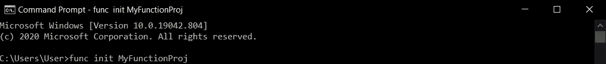
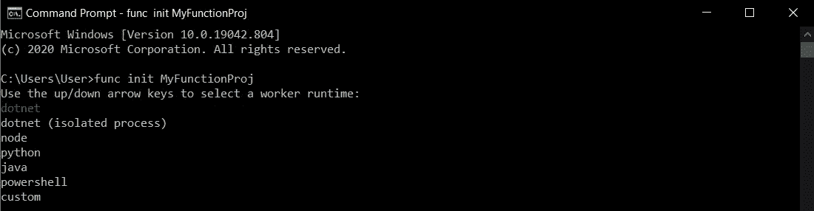
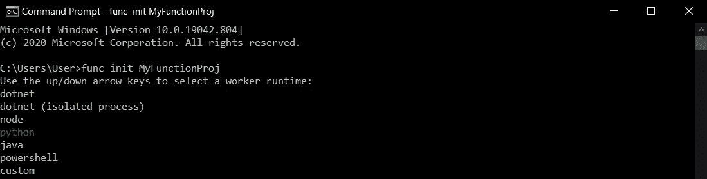
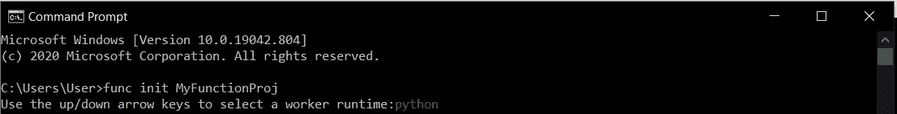
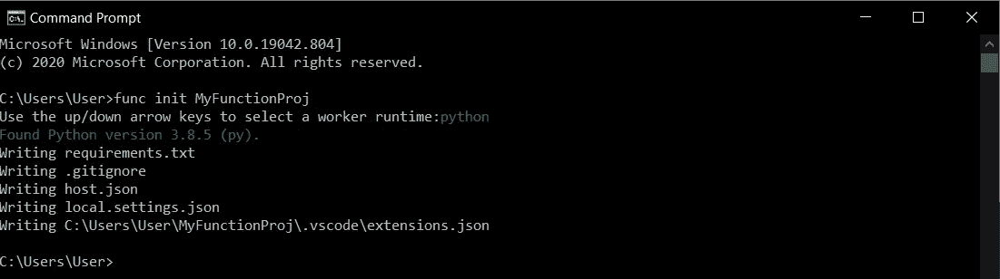
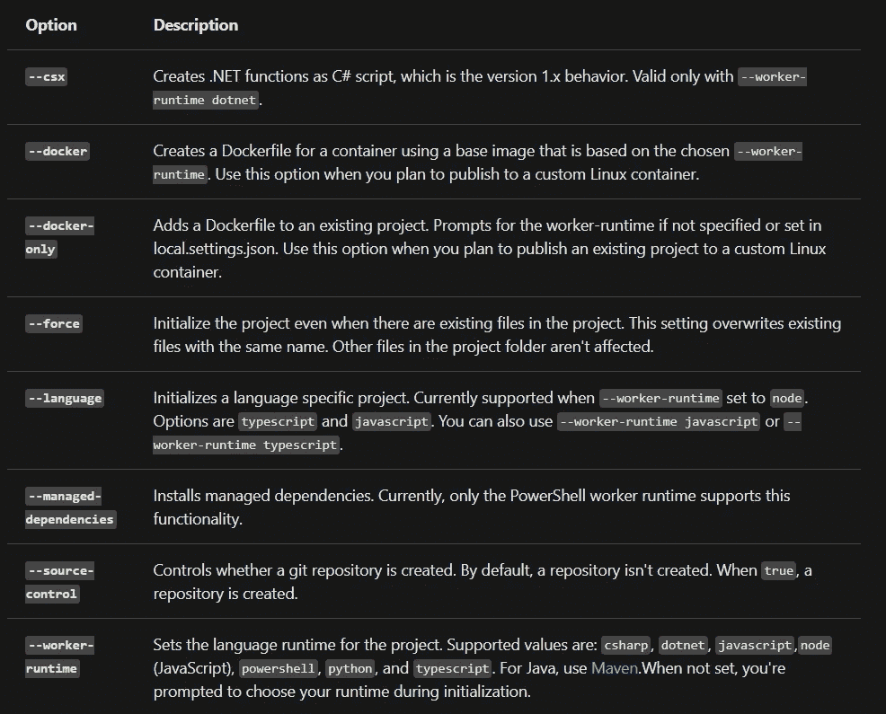

# 创建一个本地函数项目

> 原文：<https://medium.com/nerd-for-tech/create-a-local-functions-project-79a062c0d516?source=collection_archive---------18----------------------->

## 创建一个本地函数项目目录，相当于 Azure 中的一个函数应用程序


丹尼尔·明戈金在 [Unsplash](https://unsplash.com?utm_source=medium&utm_medium=referral) 上的照片

**一个函数项目目录包含文件**[**host . JSON**](https://docs.microsoft.com/en-us/azure/azure-functions/functions-host-json)**和**[**local . settings . JSON**](https://docs.microsoft.com/en-us/azure/azure-functions/functions-run-local?tabs=windows%2Ccsharp%2Cbash#local-settings-file)**，以及包含各个函数代码的子文件夹。这个目录相当于 Azure 中的一个功能 app。**

3.x/2.x 版要求您在初始化项目时选择默认语言。在 3.x/2.x 版本中，所有添加的函数都使用默认语言模板。在 1.x 版中，每次创建函数时都要指定语言。

# 先决条件

*   一个 Microsoft Azure 帐户。

使用此[链接](https://azure.microsoft.com/en-in/free/search/?&ef_id=Cj0KCQiA1pyCBhCtARIsAHaY_5f0sPbdUFAe5Kf2ljdq5RFL4gMXDz-o75fwJRuBq7jMLxnPA3JyXq4aAkL-EALw_wcB:G:s&OCID=AID2100054_SEM_Cj0KCQiA1pyCBhCtARIsAHaY_5f0sPbdUFAe5Kf2ljdq5RFL4gMXDz-o75fwJRuBq7jMLxnPA3JyXq4aAkL-EALw_wcB:G:s)创建一个自由链接。

[](https://azure.microsoft.com/en-in/free/search/?&ef_id=Cj0KCQiA1pyCBhCtARIsAHaY_5f0sPbdUFAe5Kf2ljdq5RFL4gMXDz-o75fwJRuBq7jMLxnPA3JyXq4aAkL-EALw_wcB:G:s&OCID=AID2100054_SEM_Cj0KCQiA1pyCBhCtARIsAHaY_5f0sPbdUFAe5Kf2ljdq5RFL4gMXDz-o75fwJRuBq7jMLxnPA3JyXq4aAkL-EALw_wcB:G:s) [## 立即创建您的 Azure 免费帐户| Microsoft Azure

### 开始享受 12 个月的免费服务和 200 美元的点数。立即使用 Microsoft Azure 创建您的免费帐户。

azure.microsoft.com](https://azure.microsoft.com/en-in/free/search/?&ef_id=Cj0KCQiA1pyCBhCtARIsAHaY_5f0sPbdUFAe5Kf2ljdq5RFL4gMXDz-o75fwJRuBq7jMLxnPA3JyXq4aAkL-EALw_wcB:G:s&OCID=AID2100054_SEM_Cj0KCQiA1pyCBhCtARIsAHaY_5f0sPbdUFAe5Kf2ljdq5RFL4gMXDz-o75fwJRuBq7jMLxnPA3JyXq4aAkL-EALw_wcB:G:s) 

或者使用这个[链接](https://azure.microsoft.com/en-in/account/)来创建一个。

[](https://azure.microsoft.com/en-in/account/) [## 登录 Azure-帐户和计费| Microsoft Azure

### 管理您的 Microsoft Azure 帐户。登录门户以配置您的服务并跟踪使用和计费情况。

azure.microsoft.com](https://azure.microsoft.com/en-in/account/) 

*   安装 [Azure CLI](https://docs.microsoft.com/en-us/cli/azure/install-azure-cli) 或 [Azure PowerShell](https://docs.microsoft.com/en-us/powershell/azure/install-az-ps) 来验证您的 Azure 帐户，以便能够从 Azure Functions Core Tools[发布到 Azure](https://docs.microsoft.com/en-us/azure/azure-functions/functions-run-local?tabs=windows%2Ccsharp%2Cbash#publish) 。

按照此[条](https://akhithababu.medium.com/azure-cli-tools-for-windows-56a45a5ac359)办理同样。

[](https://akhithababu.medium.com/azure-cli-tools-for-windows-56a45a5ac359) [## 用于 Windows 的 Azure CLI 工具

### 安装或更新用于 Windows 的 Azure 命令行界面工具

akhithababu.medium.com](https://akhithababu.medium.com/azure-cli-tools-for-windows-56a45a5ac359) 

*   安装 Azure Functions 核心工具。

遵循此[条](https://akhithababu.medium.com/install-the-azure-functions-core-tools-f99da8b77837)为同。

[](https://akhithababu.medium.com/install-the-azure-functions-core-tools-f99da8b77837) [## 安装 Azure Functions 核心工具

### 在 Windows 10 中安装 Azure 功能核心工具的步骤

akhithababu.medium.com](https://akhithababu.medium.com/install-the-azure-functions-core-tools-f99da8b77837) 

# 如何创建项目？

在终端窗口或命令提示符下，运行以下命令来创建项目和本地 Git 存储库:

```
func init MyFunctionProj
```



> 注意:Java 使用 Maven 原型来创建本地函数项目，以及您的第一个 HTTP 触发函数。使用下面的命令创建您的 Java 项目:`mvn archetype:generate -DarchetypeGroupId=com.microsoft.azure -DarchetypeArtifactId=azure-functions-archetype`。关于使用 Maven 原型的示例，请参见[命令行快速入门](https://docs.microsoft.com/en-us/azure/azure-functions/create-first-function-cli-java)。

当您提供项目名称时，会创建并初始化一个同名的新文件夹。否则，当前文件夹将被初始化。
在 3.x/2.x 版本中，当您运行命令时，您必须为您的项目选择一个运行时。



使用向上/向下箭头键选择一种语言，然后按 Enter 键。

> 注意:如果您计划开发 JavaScript 或 TypeScript 函数，请选择 node，然后选择语言。TypeScript 有[一些附加要求](https://docs.microsoft.com/en-us/azure/azure-functions/functions-reference-node#typescript)。

这里我们用的是`python`。使用向下箭头键选择语言`python.`



然后按`Enter`。



Python 项目的输出如下所示:



`func init`支持以下选项，除非另有说明，否则仅适用于 3.x/2.x 版:



从[链接](https://docs.microsoft.com/en-us/azure/azure-functions/functions-run-local?tabs=windows%2Ccsharp%2Cbash#install-the-azure-functions-core-tools)

> 注意:默认情况下，核心工具的 2.x 版和更高版本为。NET 运行时作为 [C#类项目](https://docs.microsoft.com/en-us/azure/azure-functions/functions-dotnet-class-library)(。csproj)。这些 C#项目可以与 Visual Studio 或 Visual Studio 代码一起使用，在测试期间和发布到 Azure 时编译。如果您想创建并使用相同的 C#脚本(。csx)文件，在创建和部署函数时，必须包含`--csx`参数。

# 延伸阅读:

要了解更多关于函数文件夹结构的信息，请参见 [Azure Functions 开发者指南](https://docs.microsoft.com/en-us/azure/azure-functions/functions-reference#folder-structure)。

[](https://docs.microsoft.com/en-us/azure/azure-functions/functions-reference#folder-structure) [## 开发 Azure 函数的指南

### 在 Azure Functions 中，特定的功能共享一些核心技术概念和组件，不管是什么语言…

docs.microsoft.com](https://docs.microsoft.com/en-us/azure/azure-functions/functions-reference#folder-structure) 

# 参考:

[](https://docs.microsoft.com/en-us/azure/azure-functions/functions-run-local?tabs=windows%2Ccsharp%2Cbash#install-the-azure-functions-core-tools) [## 使用 Azure 功能核心工具

### Azure Functions Core Tools 可以让你在本地计算机上从命令提示符或…

docs.microsoft.com](https://docs.microsoft.com/en-us/azure/azure-functions/functions-run-local?tabs=windows%2Ccsharp%2Cbash#install-the-azure-functions-core-tools)