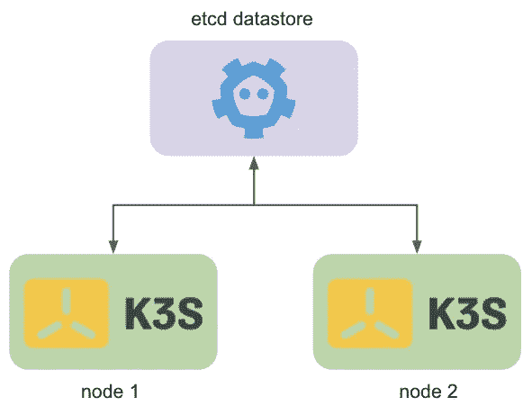
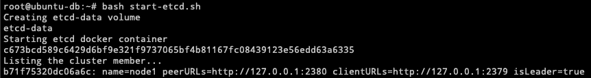
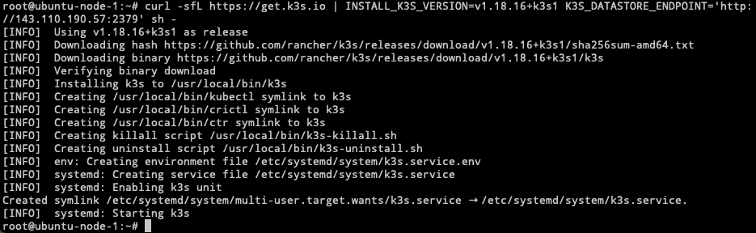
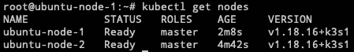
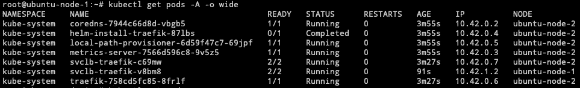

# 使用外部数据库创建多节点 K3S 集群

> 原文：<https://medium.com/nerd-for-tech/create-a-multi-node-k3s-cluster-using-an-external-database-499e75256a6a?source=collection_archive---------7----------------------->


照片由[皮查拜](https://www.pexels.com/@pixabay?utm_content=attributionCopyText&utm_medium=referral&utm_source=pexels)从[派克斯](https://www.pexels.com/photo/view-of-city-at-airport-326410/?utm_content=attributionCopyText&utm_medium=referral&utm_source=pexels)拍摄

kubernetes 的优势之一是它的分布式能力。在 kubernetes 中运行多节点集群使其更具弹性和高可用性。其中一个节点可能出现故障，但应用程序仍应照常提供服务和工作，终端用户不应知道基础架构中发生的任何问题，除非一切都着火了。

正如我之前所写的，K3S 是一个在几秒钟内创建 kubernetes 集群的伟大工具，我个人是这个项目的忠实粉丝，它也得到了 CNCF 的支持，所以它的质量是有保证的。它附带了一个嵌入式 DB 来管理所有的部署和一般状态，但有时您可能需要分离数据库并指示 K3S 使用外部资源。例如，如果您试图建立一个高度可用的 Kubernetes 集群。

在版本`v1.19.1`之前，K3S 与 Dqlite 捆绑在一起，后来他们转而使用 etcd 来实现嵌入式数据库。

因此，在本文中，我将说明如何建立一个独立的 etcd 数据存储，并将 K3S 节点加入其中。

## 什么是 etcd？

Etcd 是一个键值存储，根据他们的网站，它专注于简单和快速，这是一个开源项目，通常在分布式系统中用作关键数据的数据存储。在这种情况下，它将作为我们 kubernetes 集群的唯一真实来源和主数据库，这意味着 K3S 将跟踪其中的部署和应用程序。事实上，K3S 也可以用于其他数据存储，如 MySQL、PostgreSQL 和 MariaDB，你可以在这里选择不同的选项。

## 建筑

这很简单，我将使用三台独立的 ubuntu 机器，一台用于 etcd 数据库，两台用于 kubernetes 节点。这将允许节点相互了解，同时还提供了一个高度可用的集群。



HA Kubernetes 星团

# 那么，我该如何设置呢？

## 启动 etcd

首先，让我们设置数据存储。对于这个例子，我将使用 docker 容器来运行 etcd。

如果还没有，请确保在主机上下载并安装 docker。我正在使用 ubuntu，所以我将使用下面的链接，但是他们也有支持其他 linux 环境的说明。

[](https://docs.docker.com/engine/install/ubuntu/) [## 在 Ubuntu 上安装 Docker 引擎

### 预计阅读时间:11 分钟开始使用 Ubuntu 上的 Docker 引擎，确保满足先决条件…

docs.docker.com](https://docs.docker.com/engine/install/ubuntu/) 

完成后，您可以通过运行以下命令来验证安装。

```
root@ubuntu-db:~# docker --version
Docker version 20.10.4, build d3cb89e
```

好了，现在让我们安装 etcd 客户端工具`etcdctl`，这将允许我们与我们的 etcd docker 容器进行交互。让我们安装使用:

```
sudo apt-get install etcd-client
```

在这里，我将官方的 etcd [文档](https://etcd.io/docs/v3.4.0/op-guide/container/)放入一个小脚本中，它将自动设置一切。它创建并安装必要的卷，并启动容器。

在它完成执行后，您应该会看到类似这样的输出。



etcd 现在准备好接受端口`2379`中的连接。然后让我们设置 K3S 节点。

## 安装和配置 K3S

在另外 2 台 Ubuntu 机器上，我将安装 K3S，为此我将使用以下脚本

```
curl -sfL [https://get.k3s.io](https://get.k3s.io) | INSTALL_K3S_VERSION=v1.18.16+k3s1 K3S_DATASTORE_ENDPOINT='http://etcd-public-ip:2379' sh -
```

我在这里使用的是同一个脚本，但是这次我添加了一个环境变量`K3S_DATASTORE_ENDPOINT`，它的值是我在上一步中设置的 etcd 容器的地址。这将告诉 K3S 它不会使用嵌入式数据库，而是使用该地址中提供的数据库。如果有多个 etcd，您可以将它们添加到同一个环境变量中，并用逗号分隔它们。这还取决于您使用的数据存储，因此请确保查看官方文档[这里](https://rancher.com/docs/k3s/latest/en/installation/datastore/)。



K3S 集群创建

最后，对节点 2 重复相同的过程。完成后，您应该能够在任何 K3S 节点中运行。

```
kubectl get nodes
```

并且输出如下所示



K3S 知道这两个节点，因为它连接到同一个 etcd，并且数据库跟踪它们上发生的事情。

最后，如果您获得群集的 pod，您可以看到它们分布在两个节点上。



现在，您的 kubernetes 集群是分布式的，即使您的一个节点出现故障，另一个节点仍将为应用程序提供服务并处理连接，同时另一个节点恢复在线。