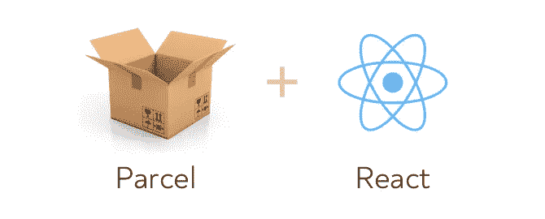
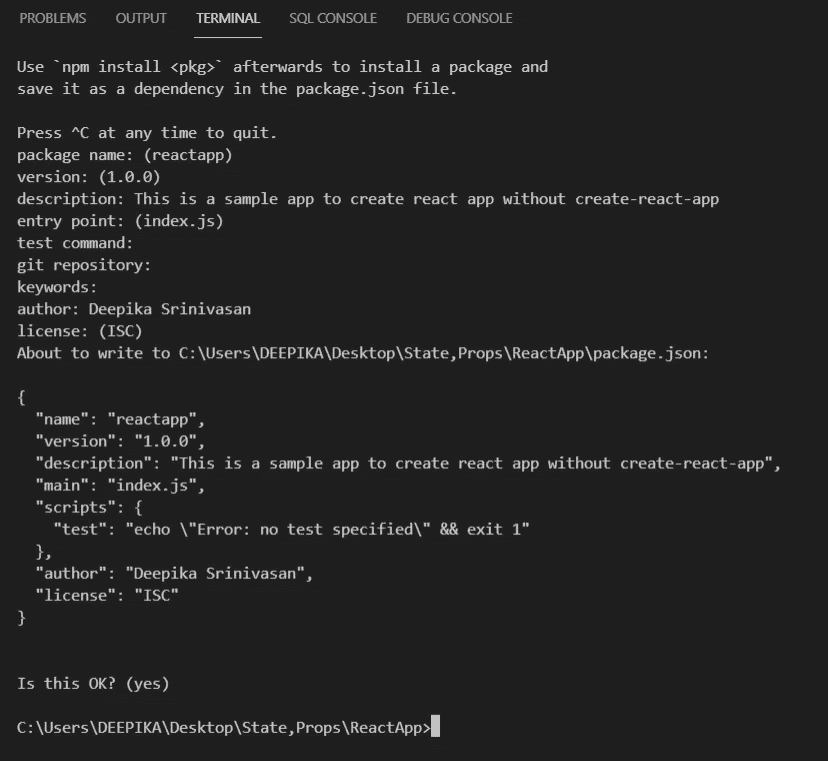
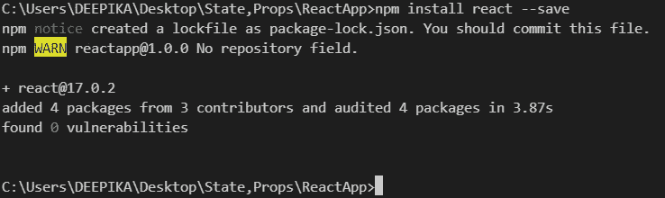
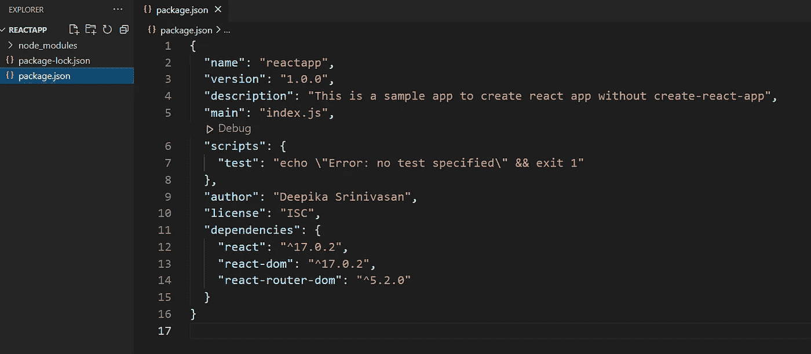
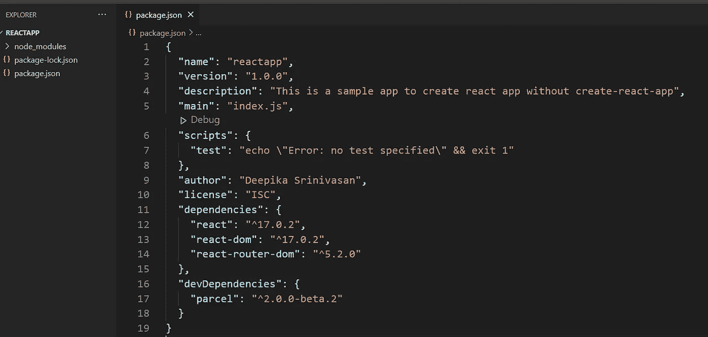
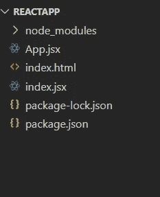
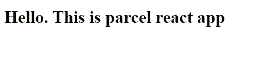

# 创建一个 React 应用程序而不创建 react 应用程序❓😟(使用包裹)

> 原文：<https://medium.com/nerd-for-tech/create-a-react-app-without-create-react-app-using-parcel-ec87787eadd7?source=collection_archive---------5----------------------->



我们都知道如何使用 create-react -app 创建 react 应用程序。但是有些时候我们不需要使用它。因此，今天我们将了解如何在不使用 create-react-app 的情况下创建 react 应用程序。

> 如果你不知道如何使用 create-react-app，请参考我以前的文章。
> 
> [https://medium . com/nerd-for-tech/react-a-simple-beginning-df98c 89066 D2](/nerd-for-tech/react-a-simple-beginning-df98c89066d2)
> 
> [package](https://parceljs.org/)是一个“速度极快、零配置的 web 应用捆绑器”这意味着它为你处理了许多硬捆绑的东西**并且**允许你创建一个相对精简的 React 设置(或者任何其他需要[捆绑](/madhash/understanding-the-concept-of-bundling-for-beginners-f2db1adad724)的 web 项目)。——[www.freecodecamp.org](http://www.freecodecamp.org)

# **步骤 1 -创建文件夹**

我正在创建一个文件夹作为 ReactApp。然后打开该文件夹中的任何 IDE。(我使用的是 VSCode)

# 第二步

在 IDE 中打开终端。然后键入`**npm init**`

您可以使用默认值创建 package.json。

# **第三步**

终端将要求您输入有关该项目的一些细节。

包名-如果你没有输入任何东西就输入，它将把文件夹名作为你的包名。

您可以根据自己的喜好更改详细信息并输入，或者如果您想要默认的信息，只需输入即可。



然后你会得到一个 package.json，看起来像这样。


# **步骤 4 -安装依赖关系**

首先让我们安装 react。要安装 react，你需要在终端输入`**npm install react --save**`。



同样安装

*   react-router-dom → `**npm install react-router-dom --save**`
*   react-dom → `**npm install react-dom --save**`

安装完所有这些之后，package.json 将如下所示。您还将拥有另一个文件名 package-lock.json



# **步骤 5——安装 DevDependencies**

和上面的方法一样，让我们安装包裹

*   `**npm install parcel --save-dev**`

使用-dev 将其保存为 devDependencies。

安装完所有这些之后，您的 package.json 将如下所示。



# **第六步**

将 package.json 中的脚本更改如下

```
**"scripts": {
    "start": "parcel index.html"
}**,
```

# 第七步

在根文件夹中创建 index.jsx，index.jsx，App.jsx



# **第八步**

将以下代码添加到相关文件中

*   **index.html**

```
**<!DOCTYPE html>
<html lang="en">
<head>
    <meta charset="UTF-8">
    <meta http-equiv="X-UA-Compatible" content="IE=edge">
    <meta name="viewport" content="width=device-width, initial-scale=1.0">
    <title>React project with parcel</title>
</head>
<body>
    <div id="app"></div>
    <script src="index.jsx"></script>
</body>
</html>**
```

*   **index.jsx**

```
**import React from 'react';
import {render} from 'react-dom';
import App from './App';****render (<App/>,document.getElementById('app'))**;
```

*   **App.jsx**

```
**import React from 'react';****export default class App extends React.Component{
    render() {
        return ( 
            <div>
                <h1>Hello. This is parcel react app</h1>**
            **</div>
        )
    }
}**
```

# **第 8 步**

在终端中键入`**npm start**` ，你可以看到字母“Hello。这是包裹反应应用程序。



这是所有的乡亲😄现在，您可以将它用作普通的 react 应用程序，但需要创建多个组件，并在 App.jsx 文件中添加路由器、路由和交换机。这将作为一个普通的 react 应用程序工作，但是重量较轻(因为有受管理的节点模块)。

App.jsx 文件中的路由器、路由和交换机示例👇

```
**render() {
    return (
        <Router>
            <Switch>
                <Route exact path='/'><Login/></Route>
                <Route exact path='/home'><Home/></Route>
                <Route exact path='/about'><About/></Route>
                <Route exact path='/contact'><Contact/></Route
            </Switch>
        </Router>
    )
}**
```

# 参考🙏

*   [https://www . freecodecamp . org/news/how-to-up-a-react-app-with-parcel/](https://www.freecodecamp.org/news/how-to-up-a-react-app-with-parcel/)