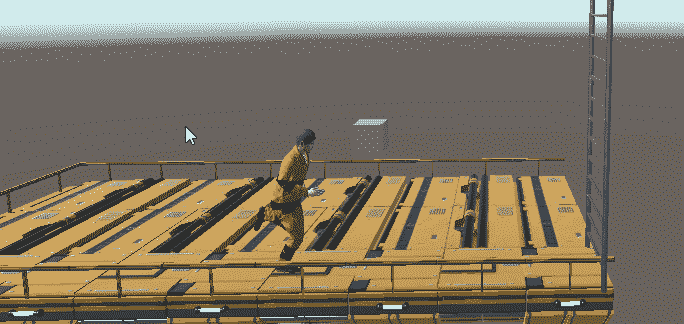

# 在 Unity 中创建滚动动画

> 原文：<https://medium.com/nerd-for-tech/create-a-rolling-animation-in-unity-ae53cb980835?source=collection_archive---------10----------------------->

//在这个上面撞了我几次头。

这比你想象的时间要长一点。

用角色控制器创建一个滚动动画有点棘手。我以前在抓岩架和爬梯时使用的一些技巧并不符合要求。这里有一个梯子和壁架抓取如何在幕后工作的偷偷高峰。

*   梯子:梯子攀爬系统将玩家角色控制器扣在…