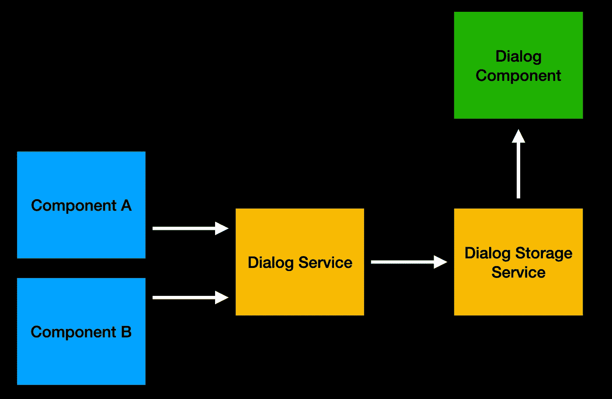
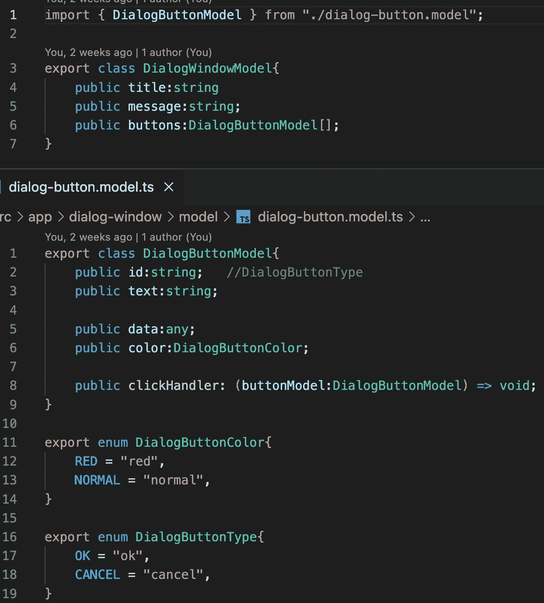
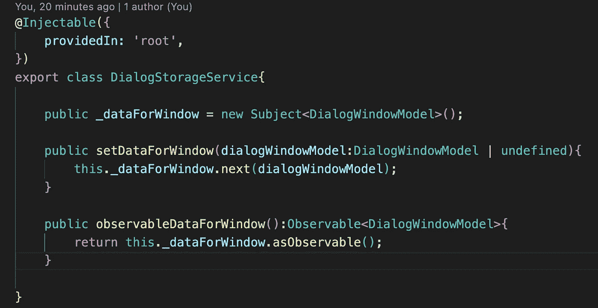
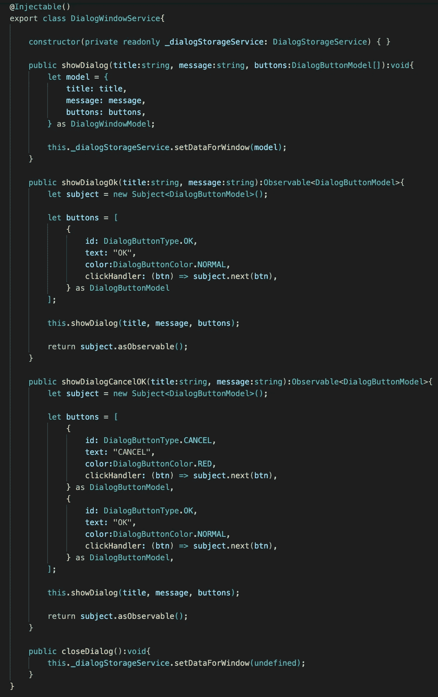
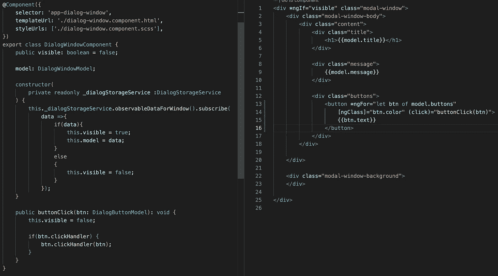
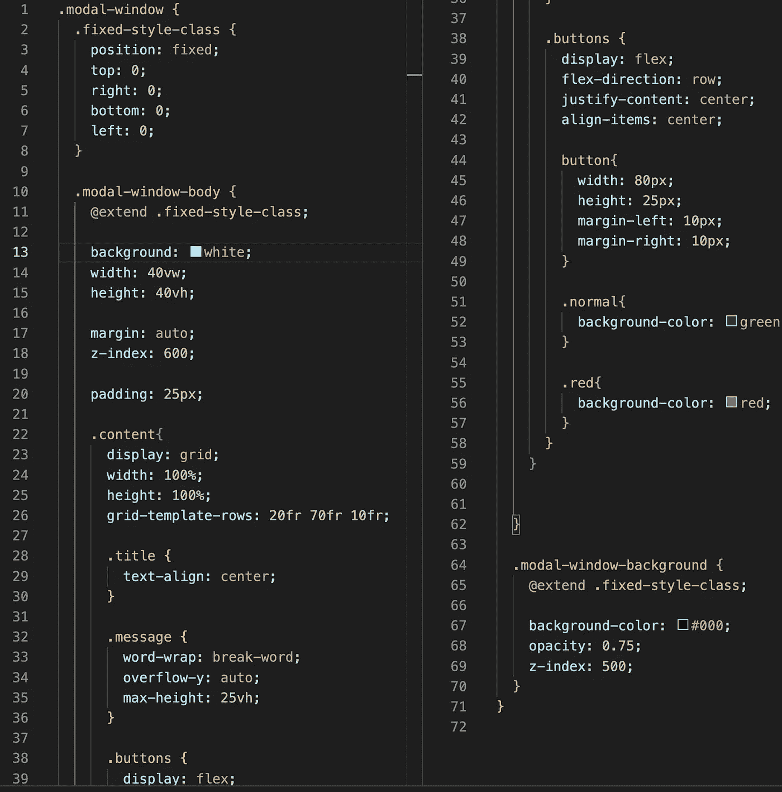
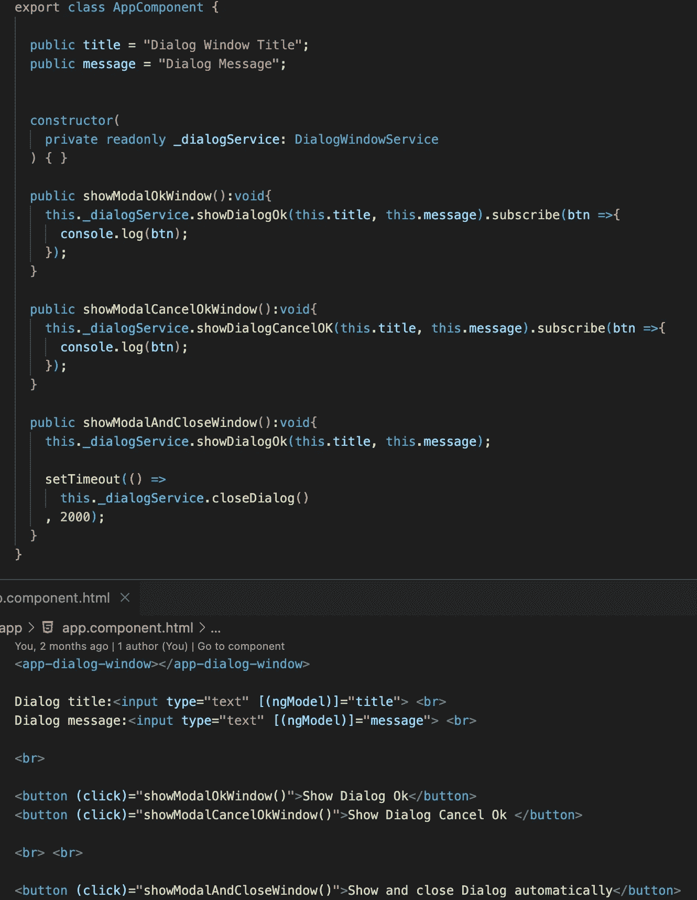
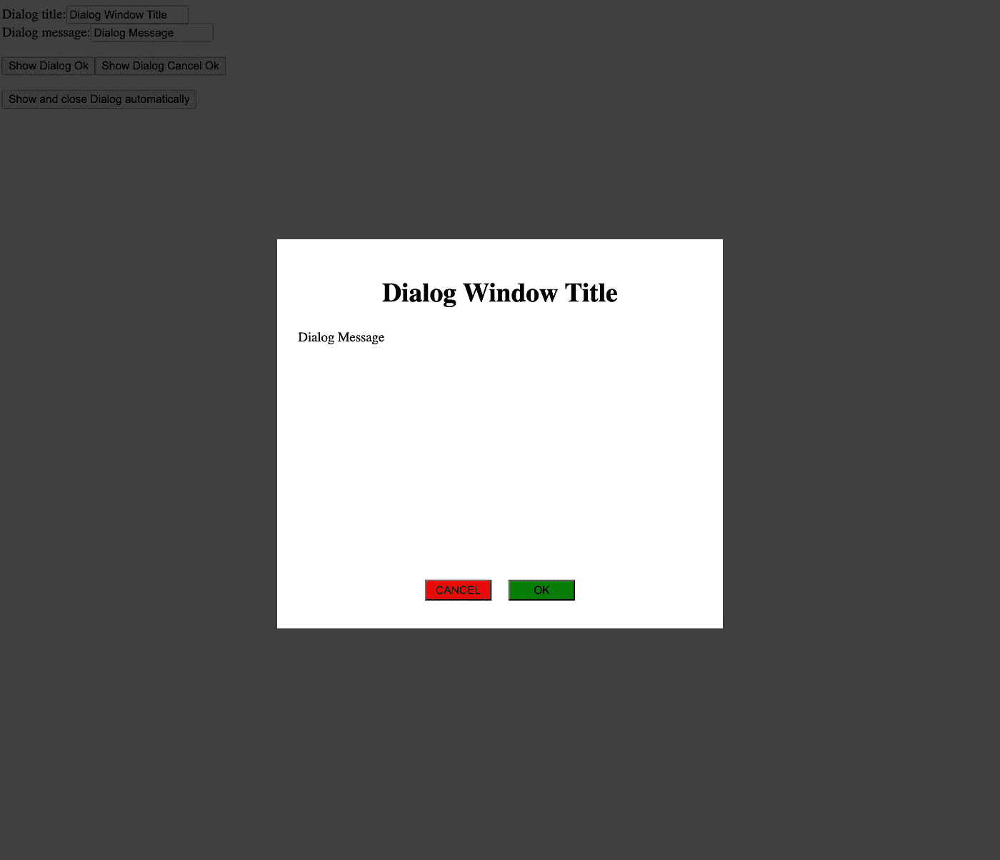

# 在 Angular 中创建一个简单的模态窗口

> 原文：<https://medium.com/nerd-for-tech/create-a-simple-modal-window-in-angular-4f4433cd042f?source=collection_archive---------0----------------------->

很难想象没有模态窗口的应用程序。如果你想问一个是/否的问题或者只是给出一个简短的信息，窗口是非常重要的。

在本文中，我将展示如何创建我们自己的模态窗口，并在必要时根据您的需要扩展它。

我们需要为我们的模态窗口系统创建一个模态窗口组件和几个服务。

我们有两个对话服务。我们只能使用一个，但这两个服务在未来给了我们空间。我们可以有不同的模式窗口，包括图表、表格或表单。所有这些对话窗口将使用具有不同数据类型的不同组件。对话服务给了我们扩展自己和使用不同模态窗口组件的空间。对话存储服务只是向模式窗口组件发送数据。第一个服务为模式窗口准备数据，第二个服务将准备好的数据发送给模式窗口组件。

在本文中，我们将创建一个简单的模态窗口。这个窗户的模型是这样的。

这里最有趣的是按钮模型。这个模型有一个点击处理程序和数据属性。基本上，当用户点击这个按钮时，它将返回这个按钮和来自模态窗口的数据。

对话存储服务是一个简单的服务，主题是为模式窗口发送数据。

如前所述，对话服务为对话组件准备一个对话模型，并通过对话存储服务发送该信息。在函数 showDialogCancelOk 和 showDialogOk 中，我们创建了一个带有主题的处理程序。这就是我们如何进行订阅并将结果发送给使用我们的对话服务的组件。

现在我们可以制作一个模态对话框组件。在这个组件中，我们订阅了一个对话存储服务来接收数据并发送用户选择的结果。

所有关于模态窗口的有趣的东西都写在一个 SCSS 文件中。在这里，我们使用 z-index 来控制一切。在 HTML 中，我们有一个模态背景。这个背景占据了浏览器窗口的整个空间。我们将模态主体设置在浏览器窗口的中心。

模态窗口基础设施已经准备好了，是时候检查它是如何工作的了。当然，我们将所有服务和组件放在主模块中。下一步是在我们的应用程序组件中添加一个模态窗口 CSS 选择器。

我们的模态窗口已经准备好了。

如果你需要仔细看看这个项目[，这里有链接](https://github.com/8Tesla8/dialog-window-angular)。

*原载于 2022 年 10 月 26 日 http://tomorrowmeannever.wordpress.com**[*。*](https://tomorrowmeannever.wordpress.com/2022/10/26/create-a-simple-modal-window-in-angular/)*