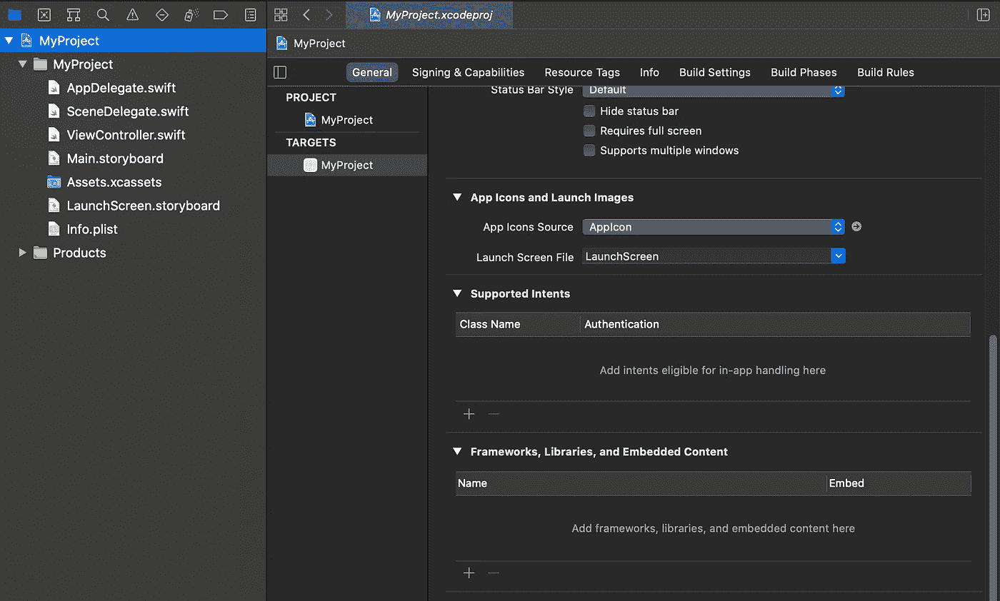
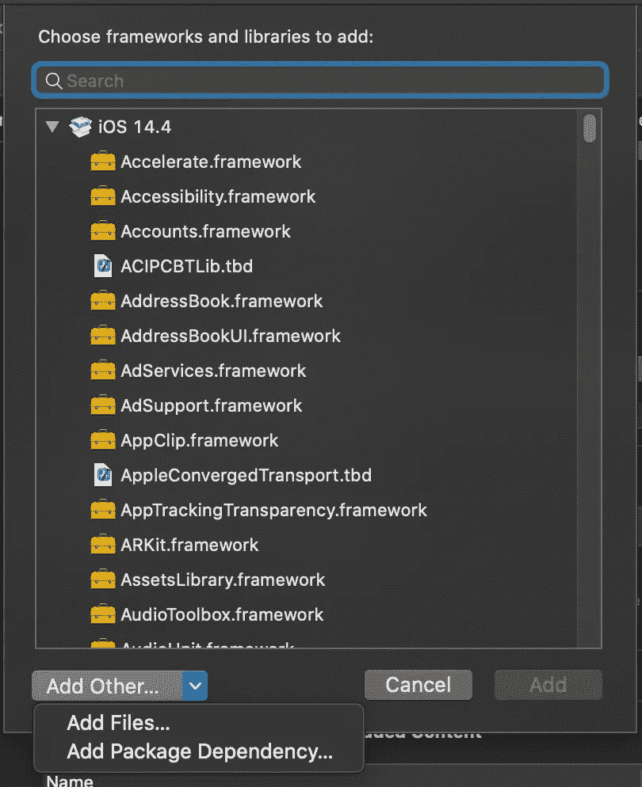
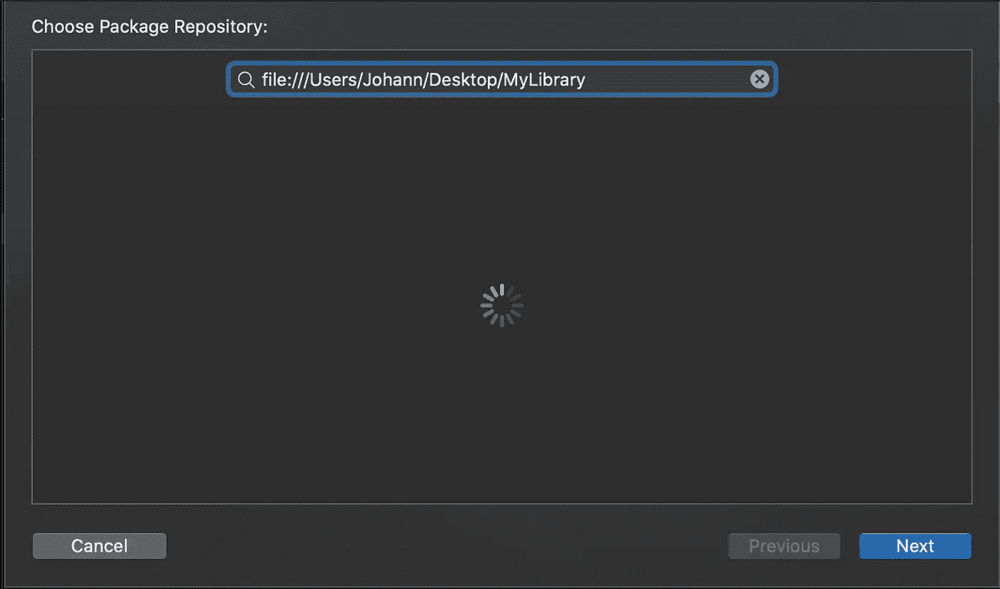
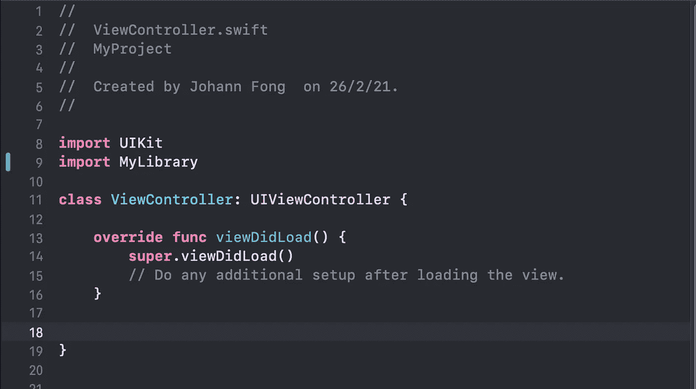

# 创建一个 Swift 包并在本地 Xcode 项目中使用它

> 原文：<https://medium.com/nerd-for-tech/create-a-swift-package-and-import-it-into-an-xcode-project-locally-520cc34a49c8?source=collection_archive---------4----------------------->

## 在本地创建并导入 Swift 包

在您的 swift 旅程中的某个时间点，您可能想要创建自己的 Swift 包。如果你和我一样，喜欢在把东西推到远程存储库之前先在本地回购上工作，这是给你的一个指南。

我用的是 Xcode 12.4，但是如果你用的是 11 或更高版本，这个概念应该也适用。

# 食谱

1.  创建一个 Swift 包
2.  把包裹装起来
3.  导入您的包并构建！

# **1。创建一个 Swift 包**

要创建 swift 包，请启动 Xcode。进入*文件>新建> Swift 包…* 或者，您可以使用键盘快捷键⌘⌃⇧N.

导航到您的“*桌面”，n* 命名您的包并点击“创建”。在这种情况下，我将我的包命名为默认名称' *MyLibrary* '。

# 2.把包裹装起来

Swift 包管理器在运行时和构建时都需要 Git。

所以我们现在要做的是 Git 初始化我们的包并用一个版本标记它，这样我们就可以把它导入到我们的项目中。

```
cd Desktop/MyLibrary
git init
git add .
git commit -m "Initial Commit"
git tag 1.0.0
```

记得将' *MyLibrary* '更改为您为包命名的名称。

我们现在已经把包装“弄好”了！

# **3。导入包并构建！**

我们已经到了最后一步！我们现在可以导入并使用这个包了。

为此，请打开您想要在其中使用软件包的 Xcode 项目。

在*项目导航器*中，选择带有您的项目名称的*蓝色图标*。

在主视图中，选择*白色图标*，在*“目标”*下显示您的项目名称，并向下滚动，直到您看到“框架、库和嵌入内容”。

点击“+”。



接下来单击“添加其他...”>选择“添加包依赖项...”。



在搜索栏中输入您的包的位置。在我的例子中，“MyLibrary”仍然在我的桌面上，所以我将使用下面的代码。

```
file:///Users/Johann/Desktop/MyLibrary
```



点击“下一步”>再次点击“下一步”>点击“完成”

按⌘+B 来构建您的项目。之后您可以导入您的包



就是这样！

在下一篇文章中，我将分享如何在单个工作空间中用一个演示项目创建一个 Swift 包！小心点！

同时，如果您有任何问题，请随时在下面发表评论。

感谢阅读！

# 参考

*   [https://github.com/apple/swift-package-manager](https://github.com/apple/swift-package-manager)