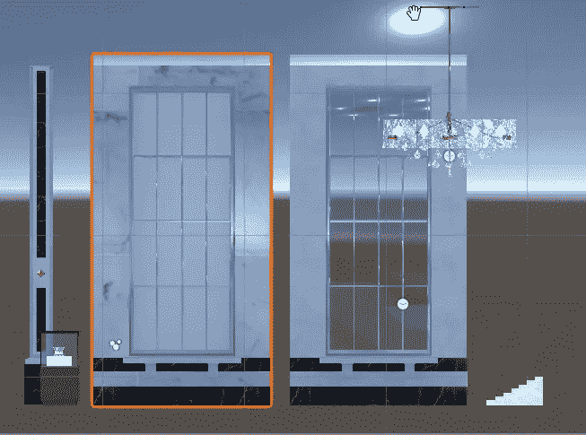
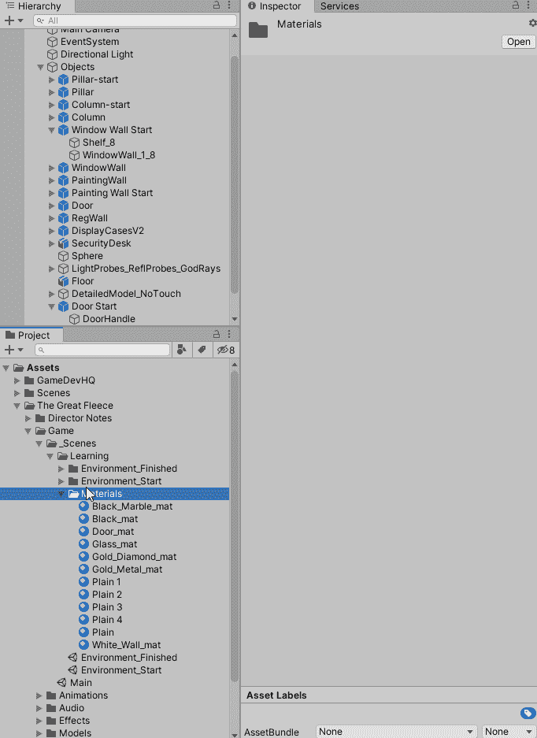
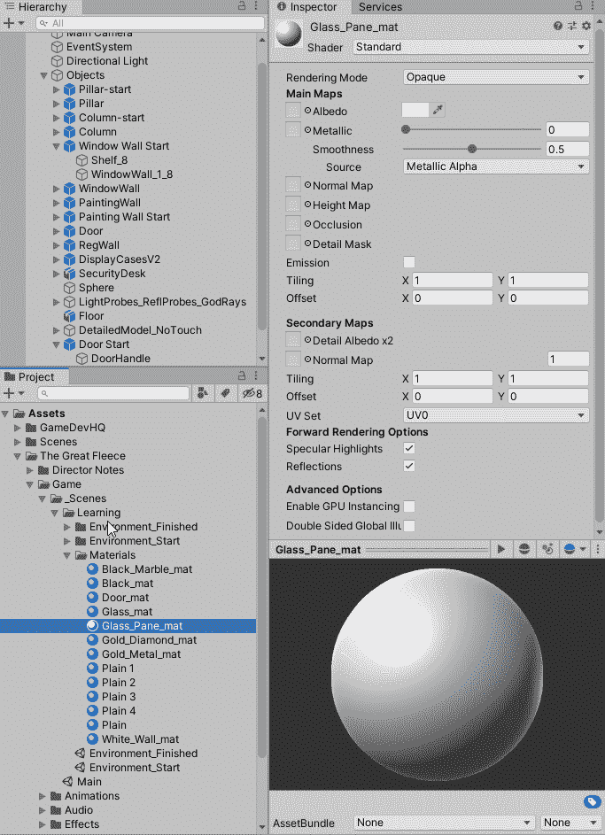
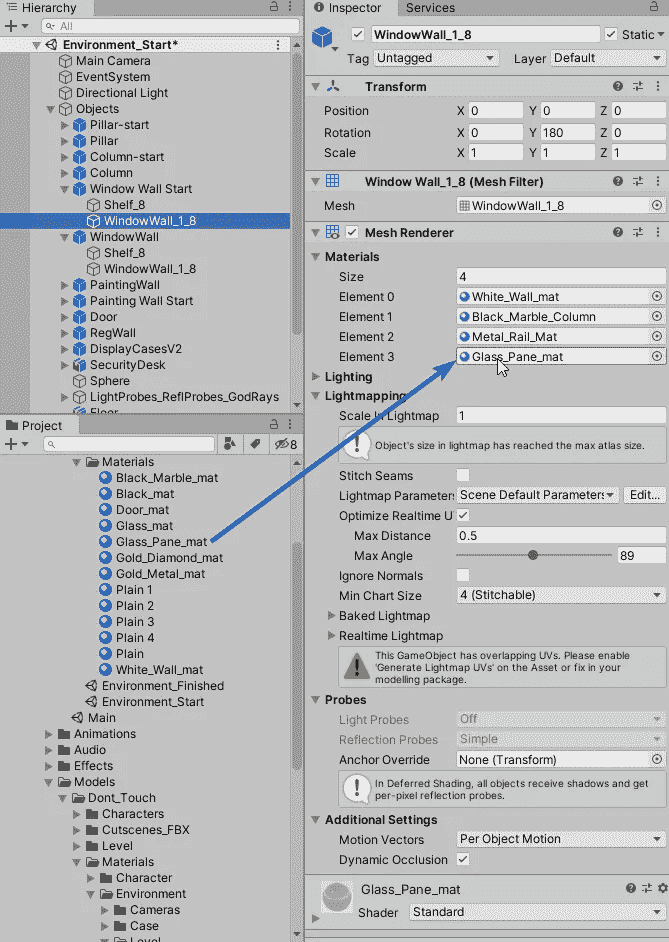
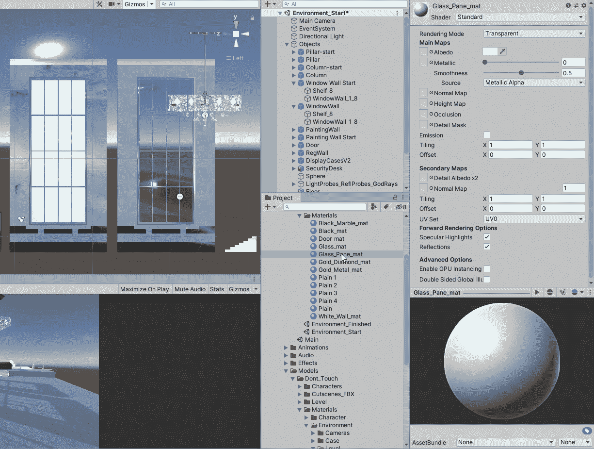

# 在 Unity 中创建透明窗口效果

> 原文：<https://medium.com/nerd-for-tech/create-a-transparent-window-effect-in-unity-e44121fa0fc0?source=collection_archive---------11----------------------->

**目标:**创造一个透明的窗格来复制一个真实的窗户

之前的窗口

这篇文章将介绍创建一个窗口的步骤，如上图右边所示。

第一步是创建一个材质来表示窗格。

创建窗格材质

接下来要做的是将材质设置为透明。

将材质设置为透明模式

现在材质已经设置好了，我们可以把它分配给检查器中窗口对象上的元素。

分配材料

接下来，我们可以实时调整窗格的透明度。我将调整反照率通道的颜色和透明度。

调整颜色和透明度

好了，现在让我们看看最终产品。

后窗

编码快乐！！！！