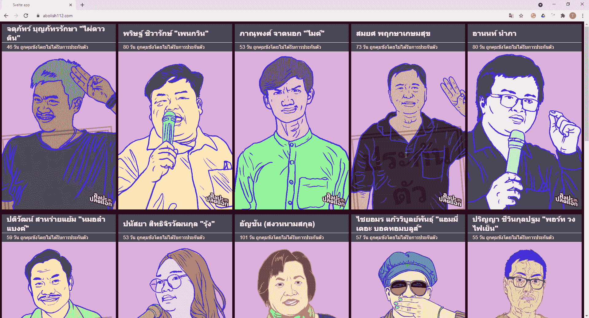

# 创建一个网站，用苗条和蔚蓝的静态网络应用呼吁泰国的民主

> 原文：<https://medium.com/nerd-for-tech/create-a-website-calling-for-releasing-pro-democratic-leaders-detained-in-thailand-with-svelte-and-ff4e2527f046?source=collection_archive---------18----------------------->

> 据泰国人权律师称，自去年 7 月以来，至少有 581 人因与抗议活动有关的政治活动而被起诉，如参加集会或在社交媒体上发表支持性评论。
> 
> 至少 **82 人面临泰国冒犯君主法**的指控，该法规定任何“诽谤、侮辱或威胁国王、王后、法定继承人或摄政王”的人每项指控都可能面临长达 15 年的监禁。**联合国人权专家此前曾表示，这样的法律“在一个民主国家没有立足之地”。(《卫报》，2021 年)**

去年曼谷的抗议活动吸引了数十万人走上街头。(《纽约时报》记者亚当·迪恩)

> 两名泰国学生因领导要求改革君主制的大规模抗议活动而被监禁，他们的律师称，在长达六周的绝食抗议后，他们的健康状况日益恶化。
> 
> Parit **，**于 3 月 15 日**开始绝食抗议他的审前拘留，**面临《亵渎女王法》下的 20 项指控**，这可能导致 300 年的**刑期**。自从 4 月 2 日以来，Panusaya 一直在绝食抗议，根据法律，他面临九起案件，如果罪名成立，可能会被判 135 年徒刑。(《卫报》，2021 年)**

# **工作应用**

**查看直播应用->[https://www.abolish112.com](https://www.abolish112.com)**

****

**网址:[www.abolish112.com](https://www.abolish112.com)**

# **技术堆栈**

*   **骨架:[苗条](https://svelte.dev/)**
*   **CI/CD: [Azure 静态 Web 应用](https://azure.microsoft.com/en-us/services/app-service/static/?cdn=disable#features)**

# **然后**

**你会看到这篇博文包含了以下子主题。我会不断地创建和更新这些博客文章，请经常查看更新🙏。**

*   **[创建一个苗条的应用程序](https://totsawin-jangprasert.medium.com/create-an-application-with-svelte-5c83dc72a882)**
*   **[使用第 2 部分](https://totsawin-jangprasert.medium.com/create-an-application-with-svelte-part2-855c1dee1051)创建一个应用程序**
*   **[将 JS 日期对象转换为时态](https://totsawin-jangprasert.medium.com/convert-js-date-objects-to-temporal-4acd8a8612ab)**
*   **[用 CSS 网格布局布局页面](https://totsawin-jangprasert.medium.com/layout-a-page-with-css-grid-layout-a30d82c63e74)**
*   **[使用 Github 动作和 Azure 静态 Web 应用自动部署应用](/nerd-for-tech/automatically-deploy-application-with-github-actions-and-azure-static-web-apps-a2d11198361a)**
*   **[用 Azure 静态 Web 应用创建无服务器 APIs】](https://totsawin-jangprasert.medium.com/add-an-api-to-azure-static-web-apps-with-azure-functions-dbf0dd3fce0a)**
*   **[将 Azure 函数连接到 Azure Cosmos DB SQL API](/@totsawin-jangprasert/connect-azure-functions-to-azure-cosmos-db-sql-api-18ce6192a807)**