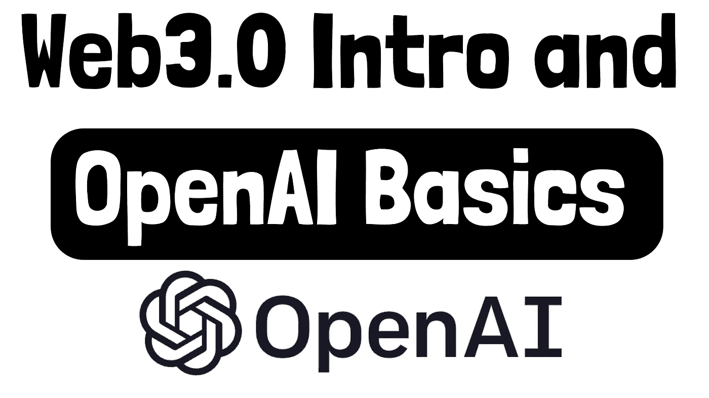
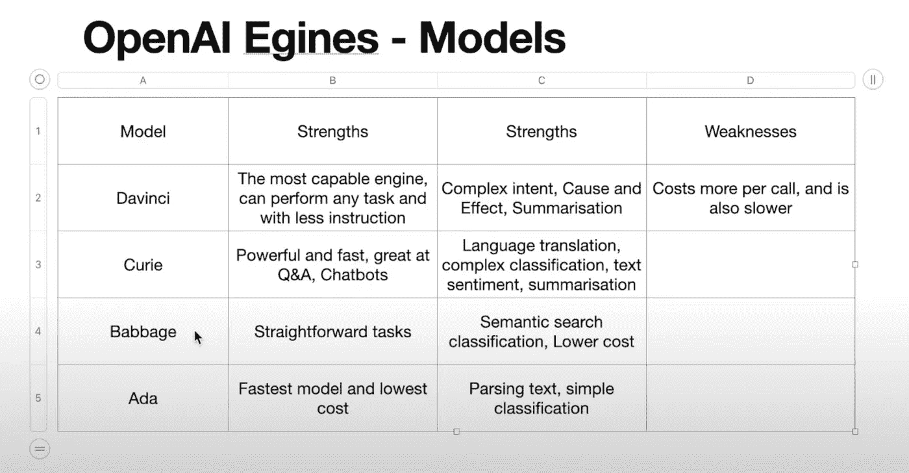
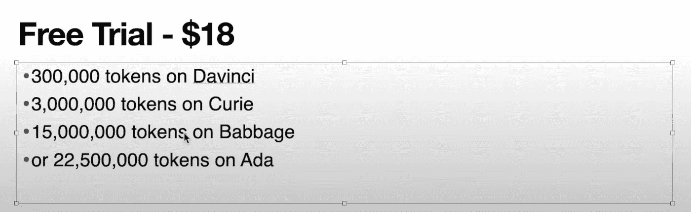

# 使用 OpenAI API 在几分钟内创建 AI 应用程序

> 原文：<https://medium.com/nerd-for-tech/create-ai-application-in-minutes-with-openai-api-5e84bd3ec5d0?source=collection_archive---------0----------------------->

在本教程中，我们将通过 OpenAI API 在几分钟内创建一个人工智能驱动的应用程序，而不需要了解人工智能编程，模型或数学。

OpenAI 曾经有一个审查和批准的过程，我从来没有时间去完成它——所以我会推迟尝试它。他们没有改变这一点，今天你可以去他们的网站，立即注册一个帐户，获得你的 API 密钥，并开始免费试用。

开始:[https://openai.com/blog/openai-api/](https://openai.com/blog/openai-api/)



OpenAI API 简介和基础知识

# 什么是 OpenAI

[OpenAI](https://en.wikipedia.org/wiki/OpenAI) 是由 Elon Musk 和其他投资者在 2015 年创建和资助的一个非盈利组织，旨在使人工智能工具的访问和使用更加容易和开源。该公司后来在 2019 年改为营利性，并与微软合作。

2020 年，OpenAI 宣布了 GPT-3，这是一种能够生成文本、分类文本、总结信息等更多内容的语言模型——当前 open AI AI AI 背后的核心模型——我们将在本教程中探讨。

OpenAI 将自己描述为一个商业人工智能(AI) API，提供通用的“文本输入，文本输出”工具。因此，任何人都可以在他们的网站上注册，并开始访问强大的已经训练过的(来自互联网的数万亿文本数据)人工智能模型，这些模型可以做以下事情:

*   自动文本完成(博客写作、内容制作的用例)
*   文本翻译
*   文本分类
*   创意产生(针对在线内容)

# OpenAI API 的当前用例

## 内容创作

您可以使用 OpenAI GPT-3 API 创建营销内容制作网站，如 [Ryter](https://rytr.me/) 和 [Peppertyp](https://www.peppertype.ai/) e。

## 市场洞察分析

你也可以建立实时的 tweet 分类引擎，实时跟踪趋势和市场洞察。

# OpenAI 模型和免费试用

当您开始使用 OpenAI 时，您将获得 18 美元的积分和一个 API 密钥，这样您就可以立即开始使用该 API。在开始之前，理解 API 提供的不同模型是很重要的——因为它们具有不同的功能、响应时间和相关的成本。



OpenAI 模型的优点和缺点

达芬奇模型是最有能力和最昂贵的，随着你往下看，这些模型更便宜，更快，但能力不如它。请注意，每个型号都可以满足您的所有需求。例如，最便宜的 Ada-不能生成文本想法，它的分类任务很大。例如，如果你想基于一些描述“产生博客想法”，你需要使用达芬奇。



OpenAI 免费试用

上图让你更好地了解基于你的信用或他们所谓的代币的成本。

# OpenAI 的 Hello World 生成博客主题

现在，您已经有了 API 密匙并了解了价格，您已经为您的第一个 API 调用做好了准备，为此我们将使用 Python。

从在虚拟环境中安装库开始:

```
pip install openai
```

用您的 API 键创建一个配置文件，或者将它们存储在 ENV。

代码将类似于:

```
import osimport openaiimport configopenai.api_key = config.OPENAI_API_KEYresponse = openai.Completion.create(engine="davinci",prompt="Blog topics dealing with daily life living on Mars\n\n1.",temperature=0.3,max_tokens=64,top_p=1,frequency_penalty=0.5,presence_penalty=0)print(response)
```

这个调用要求 API 返回关于这个主题的博客主题:“处理生活在火星上的日常生活”，并提供要返回的 max_tokens。它使用达芬奇引擎模型。

运行这段代码并检查响应。

# Youtube 视频 OpenAI API 应用程序

查看 Youtube 上的完整视频: