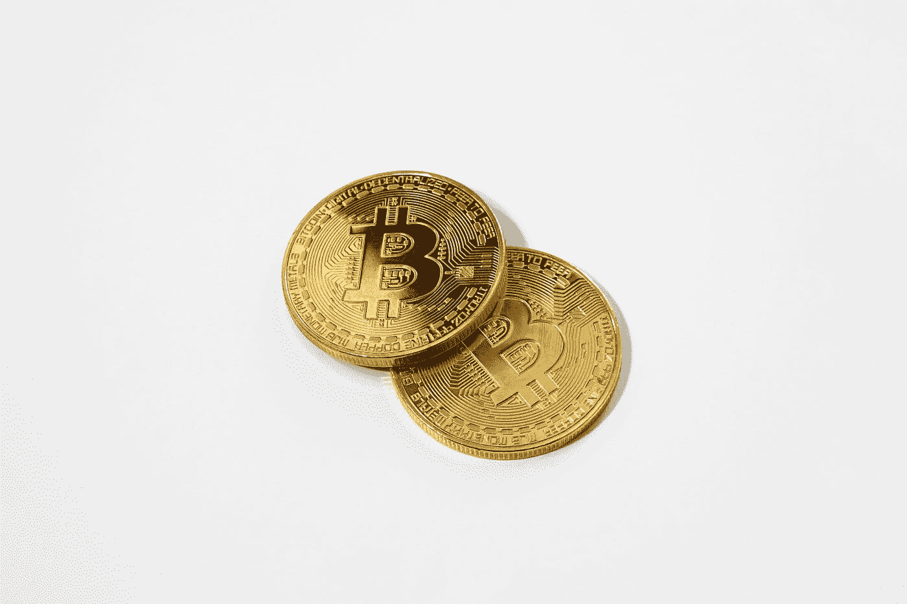

# 创建一个像 Uniswap 这样的应用程序，并建立您的分散式金融(DeFi)企业

> 原文：<https://medium.com/nerd-for-tech/create-an-app-like-uniswap-and-build-your-decentralized-finance-defi-venture-1caaed2129aa?source=collection_archive---------3----------------------->

投资者现在可以以分散的方式买卖资产。他们不需要依赖中介机构进行加工贸易。同样，宇宙中的买方和卖方可以通过使用交换和高产农业等选择来增加他们的回报。您是否是希望在区块链以太网上创建分散式金融(DeFi)平台的企业家？现在就创建一个 Uniswap 克隆应用程序。

[杰里米·贝赞格](https://unsplash.com/@jeremybezanger?utm_source=medium&utm_medium=referral)在[号航天飞机](https://unsplash.com?utm_source=medium&utm_medium=referral)上拍摄的照片

# **像 Uniswap 这样的应用有哪些亮点？**

**治理令牌—** 投资者在像 Uniswap 这样的 [**分散应用(d App)上获得决策权和投票权。他们需要拥有 UNI 本地令牌，并分享他们对重要提案的意见。除此之外，投资者还可以访问最先进的门户网站。**](https://www.appdupe.com/uniswap-clone)

他们可以查看已执行、已失败和已取消的提案列表。他们的投票份额取决于他们持有的 UNI 令牌总数。此外，即使是个人也可以提出建议。

他们应输入建议措施的相关信息(批准和转移令牌)、电子钱包地址或 Ethereum 域名服务(ENS)的名称、建议的标题、总结、方法和结论。

**获得广泛的流动性池—** 分散金融(DeFi)交易所的持续运营取决于流动性水平。一大笔资金被锁定在 Ethereum 智能合同中。它基于自动做市商(AMM)机制。

流动性提供者也得到有吸引力的激励。一般来说，投资者在区块链以太网上进行对等(P2P)交易，交换 ERC 20 令牌。

这与集中交易所的订单大不相同(CEX)。买入和卖出指令被两种不同资产的流动性池所取代。可获得关于交易对以及密码货币、DeFi 令牌和稳定货币的市场动向的全面信息。因此，购买者可以直接与开源协议交互，并选择购买、出售和交换等选项。

**保证快速增长—** 根据 DeFi 的脉搏，投资者已经锁定了 82.9 亿美元的 Uniswap。除此之外，基于以太网的分散式交易所(DEX)到目前为止已经处理了超过 8000 万笔交易。

交易额已经超过了 6450 亿美元的交易额。除了以太坊，投资者还在 Uniswap DeFi 平台上存放了 192，300 个比特币(BTC)。

锁定的总价值(TVL)从 2021 年 9 月到 10 月稳步增加了 3.1742 亿美元，从今年 10 月到 11 月增加了 5.042 亿美元。因此，你也可以通过 Uniswap 这样的应用积累财富。

杰里米·贝赞格在 [Unsplash](https://unsplash.com?utm_source=medium&utm_medium=referral) 上的照片

# **在 Uniswap 这样的应用上，交换功能是如何实现的？**

*   用户需要在基于以太坊的分散式交易所(DEX)上创建一个账户。
*   之后，他们需要连接比特币基地钱包、Fortmatic、MetaMask 和 Portis 等软件钱包。而且，投资者也可以使用 WalletConnect 开源协议。
*   此外，投资者必须选择特定的代币。他们可以输入名称或粘贴智能合同地址。
*   用户可以按下公共基础部分，选择戴(Dai)、美元币(USDC)、系绳(USDT)、包装比特币(WBTC)和包装以太(WETH)等选项。
*   随后，投资者可以选择特定的代币来交换资产。他们可以选择 Aave、1Inch、Balancer、Band Protocol (BAND)、Compound、DAI、、Gemini Dollar (GUSD)、ANA、KyberNetwork (KNC)、SAND(沙盒)、Synthetix (SNX)、earn 等选项。金融(YFI)和 0x 协议。
*   此外，他们可以同步他们的数字钱包来处理交易。整个机制是如何运作的？用户可以搜索利润丰厚的流动性池和提供高回报的代币。
*   他们将收到关于交易量(每日)、锁定的总价值(TVL)以及加密货币和稳定货币价格的实时信息。
*   稍后，投资者可以点击流动性池部分。他们可以看到关于不同交易对的数据(例如/ ETH、/ETH、/ETH、戴/ETH 等)。用户可以查看每日和每周交易量的市场运动，以及 24 小时内锁定的总价值(TVL)和交易费用。
*   此外，用户可以单击交换、添加和删除等选项。生成关于代币金额、总价值、投资者的公共钱包地址和时间戳的结果。
*   基于市场运动和他们的投资组合目标，用户可以在看到各种加密令牌的性能后执行交易。
*   流动性提供者有哪些选择？他们可以按下“增加流动性”选项。此外，他们可以选择交易对，设置价格范围，费用等级和存款金额。
*   过一会儿，它们在去中心化生态系统中的位置就出现了。它包含有关 ETH 中最低和最高价格的信息。流动性提供者(LP)也可以使用+和-选项来有效地管理他们的财务状况。
*   此外，他们可以点击交易设置仪表板。它包括控制滑点水平(百分比)和交易截止时间(分钟)的选项。
*   因此，像 Uniswap 这样的 [**应用上的流动性提供者(LP)可以体验到一个无忧无虑的投资过程。他们可以按下界面设置，打开或关闭自动路由器和专家模式。**](https://www.appdupe.com/uniswap-clone)

# **像 Uniswap 这样的应用提供的不同优势是**

**没有中介机构—** 很长一段时间，代理商和经纪人主宰着金融服务行业。然而，Uniswap 克隆将改变这种情况。投资者可以在不寻求任何外部援助的情况下管理自己的资金。他们可以全天候买卖和交换 ERC 20 代币。最终，这将降低您的运营成本，并提高您的目标受众的信任度。

抵制交易审查——政府和银行等中央集权机构严密监视着全球金融体系。由于像 Uniswap 这样的应用程序在以太坊区块链上运行，因此任何个人都不能对分散的网络进行更改。因此，整个 DeFi 协议是不可升级的，可以抵抗任何形式的审查。

**自动创建流动性池—** 像 Uniswap 这样的分散式交易所(DEX)通过自动做市商(AMM)机制运行。流动性池密切关注整个储备。

重要的是，流动性提供者可以事先确定定价策略。这取决于投资者的目标和他们的风险承受能力。因此，投资者必须建立空头和多头头寸来执行交易。他们可以买卖代币，而无需将资金交给托管人。

# **包装**

投资者已经锁定了全球 1005.7 亿美元的 DeFi 项目。同样，您现在也可以启动一个强大的分散式交易所(DEX)。与 DeFi 开发公司携手构建 Uniswap 克隆应用。