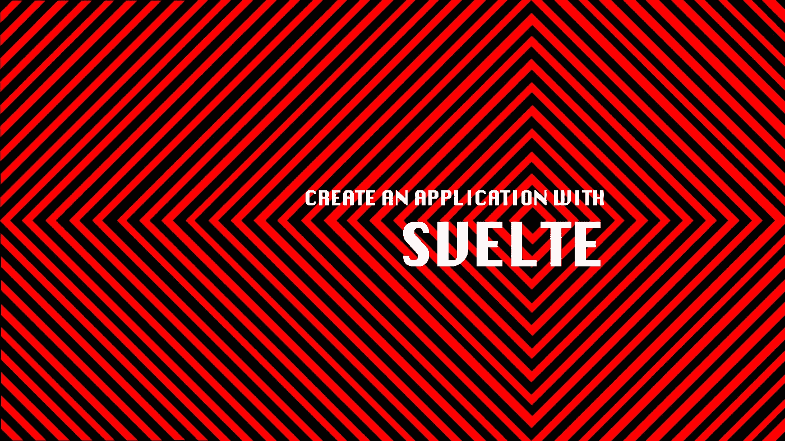
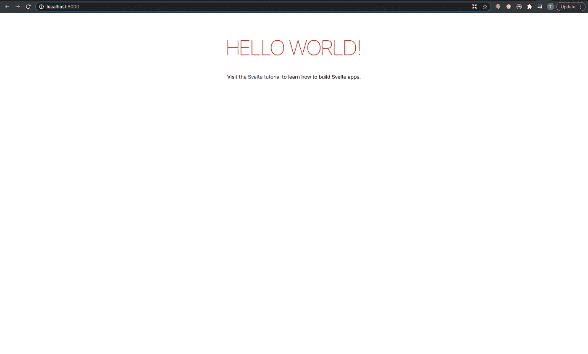
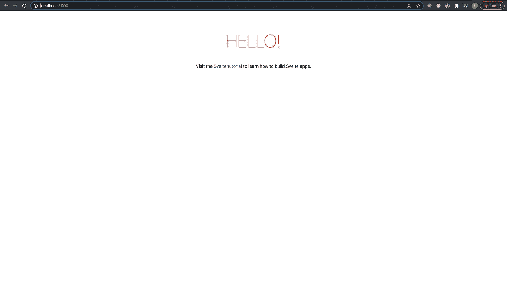
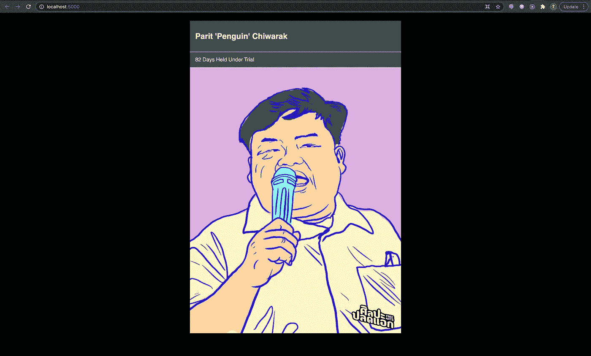
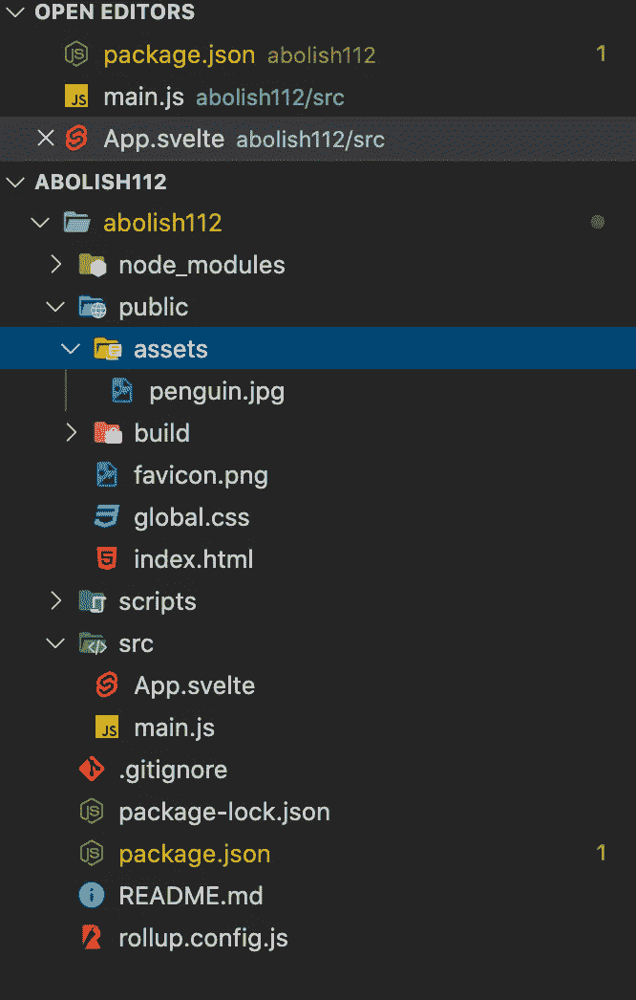

# 创建一个苗条的应用程序

> 原文：<https://medium.com/nerd-for-tech/create-an-application-with-svelte-5c83dc72a882?source=collection_archive---------8----------------------->



我正在使用 Svelte 构建 web 应用程序。

# 苗条和苗条套装

## 什么是苗条？

苗条是一个组件框架——就像 React、Vue 或 Angular——但正是这些差异让苗条大放异彩。

*   [编写更少的代码](https://svelte.dev/blog/write-less-code):根据本文中的一个例子，要创建接收两个用户输入并打印这些输入的总和的组件，React 和 Vue 分别需要 442 和 263 个字符，而在 Svelte 中只需要 145 个字符就可以完成。
*   [没有虚拟 Dom](https://svelte.dev/blog/virtual-dom-is-pure-overhead) : Svelte 在更新用户界面上采取了不同的方法。Svelte 没有使用像虚拟 DOM diffing 这样的著名技术，而是编写代码，当应用程序的状态改变时，直接外科手术式地更新 DOM。这可以消除在虚拟 DOM 区分技术中完成的*将新的虚拟 DOM 与先前的快照*进行比较的任务。
*   [真实反应](https://svelte.dev/blog/svelte-3-rethinking-reactivity):在下面的例子中，Svelte 使用标签 *$* 来声明两个变量*字符*和*单词*的值依赖于变量*文本*的值，当*文本*变量的值改变时，它们会自动重新计算。

> 由于 RxJS 和 observables，Angular 支持反应式编程，Vue.js 允许用计算的属性反应式重新计算值。至于 Svelte，它利用了一个不太为人所知的 JavaScript 特性 labels，允许反应式声明和反应式陈述。这意味着当某些其他值发生变化时，您可以让某些值自动重新计算。这真的很强大，正如你将看到的，苗条使它像馅饼一样容易。(Alligator.io，2019)

```
<script>
  let text = '';

  $: characters = text.length;
  $: words = text.split(' ').length;
</script>

<style>
  textarea {
    width: 100%;
    background: aliceblue;
    font-size: 2rem;
  }
</style>

<textarea bind:value={text} rows="10" />

<p>Character Count: {characters}</p>
<p>Word Count: {words}</p>
```

我真的推荐你看《苗条身材》的创作者 Rich Harris 的《反思反应》，我喜欢它，直到我说如果你能挑选一个视频来看，我会推荐你看这个。它让你**重新思考**前端框架的当前状态，并最终理解苗条背后的驱动力。

里奇·哈里斯的《反思反应》，来自《你会爱上前台》

## 什么是 SvelteKit，为什么不用它？

SvelteKit 是一个用于构建苗条网络应用的框架。SvelteKit 为构建现代的网络应用程序带来了很多特性——代码分割、离线支持、带有客户端水合作用的服务器渲染视图。

因为我的目标是构建一个简单的页面苗条应用程序，为了简单起见，我不会使用苗条工具包。当我开始向这个应用程序添加新特性时，我可能会考虑迁移到它。因此，我将遵循官方指南，[最简单的苗条入门](https://svelte.dev/blog/the-easiest-way-to-get-started)，开发苗条的 web 应用。

# 履行

1.  从 git 中取出下面的库，sveltejs/template——由 Svelte 团队创建的项目模板，并将其放在本地硬盘上一个名为 abolish112 的文件夹中——我将用它作为项目名称。

注意:Degit 类似于克隆存储库，但是没有 git 历史。

```
npx degit sveltejs/template abolish112 
```

2.进入项目文件夹

```
cd abolish112
```

3.安装依赖项

```
npm install
```

4.在本地启动应用程序

```
npm run dev
```

您将看到应用程序在本地启动并运行。



在 [http://localhost:5000/](http://localhost:5000/) 上，这个苗条的应用程序在本地启动并运行

5.查看 */src* 文件夹，你会看到只有两个文件，即 **main.js** 和 **App.svelte** 。

先看 **main.js**

*   `target` 是一个要渲染到的`HTMLElement`，
*   `props` 是被传递给组件的属性

```
import App from './App.svelte';const app = new App({
  target: document.body,
  props: {
    name: 'world'
  }
});export default app;
```

您可以尝试将 name 属性更改为其他属性，并在保存后注意 UI 中的变化。

其次，看看 App.svelte. 你会注意到它由 3 个主要模块组成

*   `<script>`块包含创建组件实例时运行的 JavaScript。在顶层声明(或导入)的变量在组件的标记中是“可见的”。
*   `<main>`或其他 HTML 标签
*   `<style>`块包含将作用于该组件的 CSS。

```
<script>
  export let name;
</script><main>
  <h1>Hello {name}!</h1>
  <p>Visit the <a href="https://svelte.dev/tutorial">Svelte tutorial</a> to learn how to build Svelte apps.
  </p>
</main><style>
main {
  text-align: center;
  padding: 1em;
  max-width: 240px;
  margin: 0 auto;
}h1 {
  color: #ff3e00;
  text-transform: uppercase;
  font-size: 4em;
  font-weight: 100;
}@media (min-width: 640px) {
  main {
    max-width: none;
  }
}
</style>
```

6.在我的例子中，我将去掉`props`,因为在我的应用程序中没有必要将属性从父组件传递到组件。最终结果是 **main.js** 和 **App.svelte** 会是这样的:

**main.js** : 删除`props`

```
import App from './App.svelte';const app = new App({
  target: document.body
});export default app;
```

**App.svelte** : 从`<script>`和`<main>`中删除`name`变量

```
<script>

</script><main>
  <h1>Hello!</h1>
  <p>Visit the <a href="https://svelte.dev/tutorial">Svelte tutorial</a> to learn how to build Svelte apps.
  </p>
</main><style>...
```

当前用户界面将是:



7.实际的实现将从这里开始。在下面，我想展示一个已经被拘留近 3 个月的泰国民主活动家的图像。这由 3 部分组成，即名称、标题和图像。



7.1 从 google drive 下载图片开始:[https://drive . Google . com/drive/mobile/folders/15 smpo 5 aqkhhzylsdewdfh 0 jj 7 z 1 o 87 f？usp =分享](https://drive.google.com/drive/mobile/folders/15SmPO5AQKhHzylszDeWDFH0JJ7z1O87f?usp=sharing)

7.2 在 */public* 文件夹中创建 */assets* 文件夹，并将图片放入该文件夹中。



项目文件夹结构

7.3 返回到 **App.svelte.** 从`<script>`块开始，我创建了 3 个常量变量和 1 个函数——它们将在下一步绑定到标记。

```
<script>
const todayDate = new Date();
const DAYS_IN_MS = 24 * 60 * 60 * 1000;
const person = {
  name: `Parit 'Penguin' Chiwarak`,
  detainedDate: new Date(2021, 1, 9)
}function getNumberOfDaysUnderDetained(detainedDate) {
  return Math.floor((todayDate - detainedDate) / DAYS_IN_MS);
}
</script><main>...<style>...
```

7.4 在`<main>`块中，`person`对象和`getNumberOfDaysUnderDetained`函数被用插值语法`{}`绑定在标记内部。

```
<script>...<main>
  <div class="individual">
    <div class="individual__name">{ person.name }</div>
    <div class="individual__caption">
      <span>
        {getNumberOfDaysUnderDetained(person.detainedDate)}Days Held Under Trial
      </span>
    </div>
    <div class="individual__image">
      
    </div>
  </div>
</main><style>...
```

7.5 最后，我装饰如下。如果你对 CSS 网格感兴趣，我会有另一篇关于这个的博文。

```
<script>...<main>...<style>
:global(body) {
  /* this will apply to <body> */
  background-color: black;
  margin: 0;
}main {
  text-align: center;
  padding: 1em;
  max-width: 640px;
  margin: 0 auto;
}.individual {
  position: relative;
  width: 100%;
  margin: 0 auto;
  background-color: #4a4a4a;
  color: #fff;
  box-shadow: 0 0 20px rgba(0, 0, 0, 0.2);
  display: grid;
  font-family: "helvetica", "arial", sans-serif;
  grid-template-rows: 10% 5% auto;
}.individual__name {
  align-items: center;
  display: grid;
  font-size: 1.5em;
  font-weight: bold;
  padding-left: 1rem;
  border-bottom: 1px solid;
}.individual__caption {
  color: #f9f2e2;
  align-items: center;
  display: grid;
  font-size: 1em;
  padding-left: 1rem;
  border-bottom: 1px solid;
}.individual__image {
  position: relative;
  background-color: #98d6f7;
  overflow: hidden;
}img {
  width: 100%;
  height: 100%;
}
</style>
```

由于这篇博文似乎太长，我将在下一篇博文中进一步演示如何使用`{#if...}`表达式和`{#each...}`表达式在数组上进行循环以创建图库，并使用条件语句相应地显示覆盖戳。

# 脚注

* *112* 在项目名称中*指的是《泰国刑法典》第 112 条，目前规定如下:"任何人诽谤、侮辱或威胁国王、王后、法定继承人或摄政王，应处以 3 至 15 年监禁。

# **参考**

1.  [苗条的](https://svelte.dev/)
2.  [苗条套装](https://kit.svelte.dev/)
3.  [介绍约翰爸爸的苗条身材](https://www.youtube.com/watch?v=l38uRsg81ok&t=3172s)