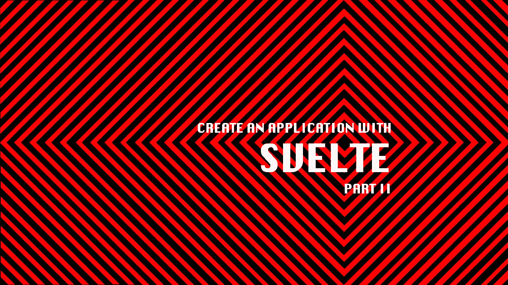
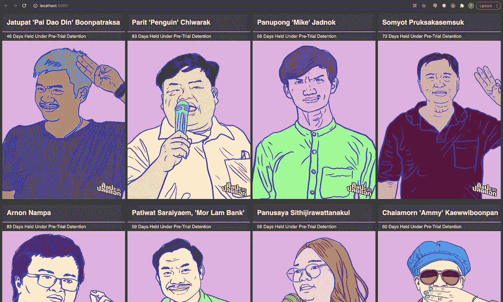

# 创建一个带有细长部件 2 的应用程序

> 原文：<https://medium.com/nerd-for-tech/create-an-application-with-svelte-part2-855c1dee1051?source=collection_archive---------26----------------------->



在这篇博客中，我将向你展示如何使用`{#if...}`表情和`{#each...}`表情来展示每个泰国民运人士的形象。



泰国民主积极分子的图像

1.  从[https://drive . Google . com/drive/mobile/folders/15 smpo 5 aqkhhzylszdewdfh 0 jj 7 z 1 o 87 f 下载图片？usp=sharing](https://drive.google.com/drive/mobile/folders/15SmPO5AQKhHzylszDeWDFH0JJ7z1O87f?usp=sharing) 并把它放到 */public/assets* 文件夹中。将图像文件名重命名为人物昵称，如 pai.jpg、ammy.jpg、penguin.jpg。稍后，我将使用 person 昵称在标记中动态引用图像文件。
2.  用 person 对象的数组替换`person`对象，并将其命名为`people`。请注意，我向这些对象添加了两个属性，即`nickname`，我将用来指代图像名称的活动家的昵称，以及`releasedDate`，该活动家获得保释的日期；如果他/她仍被拘留，则该财产不存在。

```
<script>
...
const people = [
{
  name: `Jatupat 'Pai Dao Din' Boonpatraksa`,
  nickname: 'pai',
  detainedDate: new Date(2021, 2, 8),
  releasedDate: new Date(2021, 3, 23),
},
{
  name: `Parit 'Penguin' Chiwarak`,
  nickname: 'penguin',
  detainedDate: new Date(2021, 1, 9),
},
{
  name: `Panupong 'Mike' Jadnok`,
  nickname: 'mike',
  detainedDate: new Date(2021, 2, 8),
},
{
  name: `Somyot Pruksakasemsuk`,
  nickname: 'somyot',
  detainedDate: new Date(2021, 1, 9),
  releasedDate: new Date(2021, 3, 23),
},
{
  name: `Arnon Nampa`,
  nickname: 'arnon',
  detainedDate: new Date(2021, 1, 9),
},
{
  name: `Patiwat Saraiyaem, 'Mor Lam Bank'`,
  nickname: 'bank',
  detainedDate: new Date(2021, 1, 9),
  releasedDate: new Date(2021, 3, 9),
},
{
  name: `Panusaya Sithijirawattanakul`,
  nickname: 'rung',
  detainedDate: new Date(2021, 2, 8),
},
{
  name: `Chaiamorn 'Ammy' Kaewwiboonpan`,
  nickname: 'ammy',
  detainedDate: new Date(2021, 2, 4),
},
{
  name: `Parinya Cheewin Kulpathom aka 'Port Faiyen'`,
  nickname: 'port',
  detainedDate: new Date(2021, 2, 6),
},
{
  name: `Piyarat 'Toto' Jongthep`,
  nickname: 'toto',
  detainedDate: new Date(2021, 2, 6),
},
{
  name: `Promsorn 'Fah' Veerathamjaree`,
  nickname: 'fah',
  detainedDate: new Date(2021, 2, 17),
},
{
  name: `Chookiat 'Justin' Saengwong`,
  nickname: 'justin',
  detainedDate: new Date(2021, 2, 23),
}];...
</script><main>...<style>...
```

3.修改函数—计算审前拘留的持续时间—以接收两个参数`detainedDate`和`releasedDate`。这两个参数用于计算活动家被拘留的天数。由于大多数活动家仍然被拘留，不得保释，`releasedDate`值将通过与`undefined`值。我使用 [Javascript 默认参数](https://developer.mozilla.org/en-US/docs/Web/JavaScript/Reference/Functions/Default_parameters)用默认值初始化`undefined`值，本例中为`todayDate`。

```
<script>
...
function getNumberOfDaysUnderDetained(
  detainedDate,
  releasedDate = todayDate
) {
  return Math.floor((releasedDate - detainedDate) / DAYS_IN_MS);
}</script><main>...<style>...
```

4.使用`{#each...}`表达式对`people`变量进行循环，在每次迭代中，将每一项分配给`person`变量。这与上一篇博客相似，除了:

*   函数参数:传递两个参数，即`person.detainedDate`和`person.releasedDate`
*   image src 属性:通过`person.nickname`引用同名图像

```
<script>...<main class="people">
{#each people as person}
  <div class="individual">
    <div class="individual__name">
      { person.name }
    </div>
    <div class="individual__caption">
      <span>
        {getNumberOfDaysUnderDetained(person.detainedDate, person.releasedDate)} Days Held Under Pre-Trial Detention
      </span>
    </div>
    <div class="individual__image">
      
    </div>
  </div>
{/each}
</main><style>...
```

5.更新 css 如下。注意，我替换了在`main`元素选择器中应用的样式，而使用了类选择器`.people`。如果你对 CSS 网格感兴趣，我会有另一篇关于这个的博文。

```
<script>...<main>...<style>
...
.people {
  display: grid;
  grid-template-columns: repeat(auto-fit, minmax(350px, 1fr));
  column-gap: 10px;
  row-gap: 20px;
}
...
</style>
```

接下来，我将演示如何使用`{#if...}`表达式为那些获得保释的人显示叠加在图像上的图章。最终结果将如下所示:


泰国民主积极分子的图像

1.  为了显示图章，我将检查这些活动家是否被释放(`person.releasedDate`不是`null`)。如果是，添加块以显示覆盖戳记。

```
<script>...<main class="people">
...
    <div class="individual__image">
                      
      **{#if person.releasedDate}
        <div class="stamp is-bailed">Bailed</div>
      {/if}**
    </div>
...
</main><style>...
```

2.添加下面的 css 类来显示覆盖戳。

```
<script>...<main>...<style>
...
.stamp {
  font-weight: 700;
  text-transform: uppercase;
  mix-blend-mode: multiply;
  position: absolute;
  top: 50%;
  transform: translate(-50%, -50%);
}.is-bailed {
  color: #C4C4C4;
  border: 1rem double #C4C4C4;
  transform: rotate(-5deg);
  font-size: 6rem;
  font-family: "Open sans", Helvetica, Arial, sans-serif;
  border-radius: 0;
  padding: 0.5rem;
}
</style>
```

# 参考

1.  [苗条的](https://svelte.dev/)
2.  [超薄套装](https://kit.svelte.dev/)
3.  [介绍约翰爸爸的苗条身材](https://www.youtube.com/watch?v=l38uRsg81ok&t=3172s)