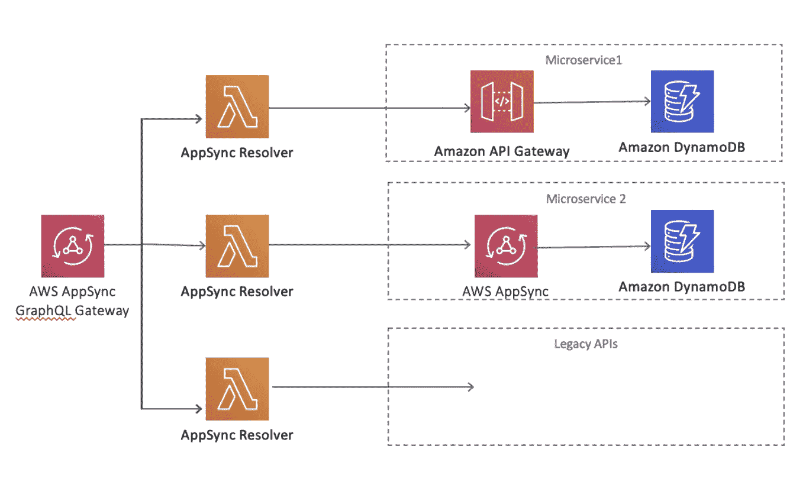
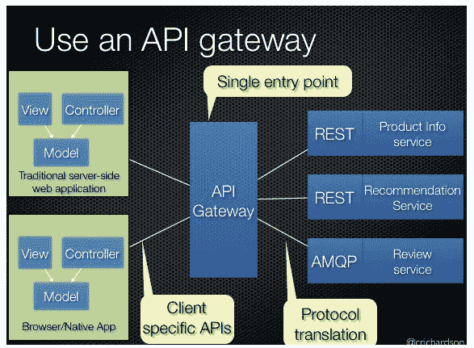
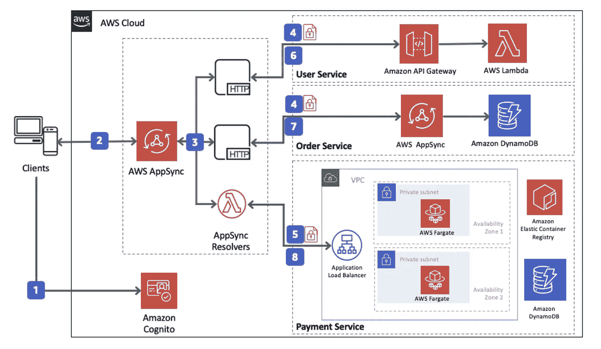
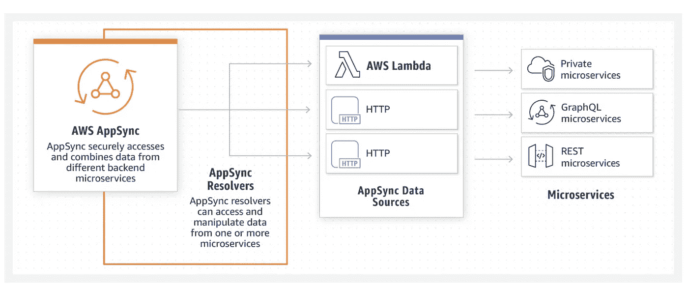
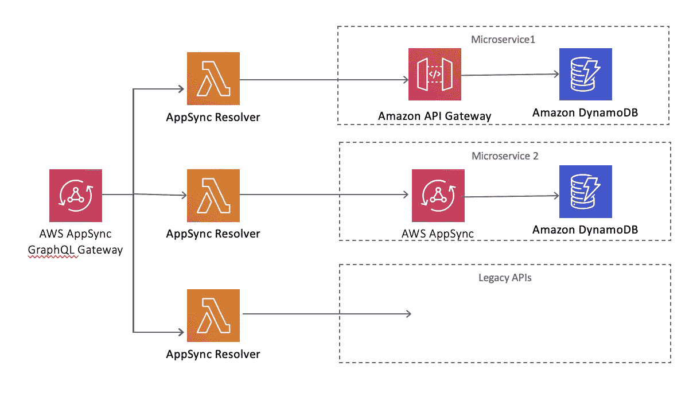

# AppSync GraphQL 网关作为网关设计模式和扼杀者模式中的路由器，从整体服务迁移到微服务

> 原文：<https://medium.com/nerd-for-tech/create-an-appsync-graphql-gateway-as-a-router-in-gateway-design-pattern-and-strangler-pattern-to-b92d2a2ad5b9?source=collection_archive---------1----------------------->

两个著名的微服务设计模式是“API 网关设计模式”和“扼杀者模式”。在本文中，我提出了一个设计，它将使用 AWS 无服务器方法将两种模式融合在一起。

## 扼杀者模式

扼杀者模式用于从遗留系统(例如:单片系统)迁移到现代系统(例如:微服务)。它在微软设计模式中定义于[https://docs . Microsoft . com/en-us/azure/architecture/patterns/stranger](https://docs.microsoft.com/en-us/azure/architecture/patterns/strangler)。

如上图所示，有一个“扼杀者外观”，它会将迁移的调用路由到现代系统，并继续扼制旧系统，直到最终删除外观，只调用现代系统。

## API 网关模式

正如在 https://microservices.io/patterns/apigateway.html[的定义，API 网关用于拥有一个单一的系统网关](https://microservices.io/patterns/apigateway.html)

## AppSync 作为 API 网关和扼杀者门面

在本文中，下面的设计使用 AWS AppSync 作为 API 网关和扼杀者 Facade，正如在 https://aws.amazon.com/blogs/mobile/appsync-microservices/的[的 AWS 文档中所解释的。](https://aws.amazon.com/blogs/mobile/appsync-microservices/)

这是最终的设计:

谢谢

兰尼·埃尔豪斯尼

[https://www.linkedin.com/in/ranyelhousieny/](https://eur05.safelinks.protection.outlook.com/?url=https%3A%2F%2Fwww.linkedin.com%2Fin%2Franyelhousieny%2F&data=04%7C01%7C%7C908ea6dcab0a41047a4b08d89acaa17f%7C84df9e7fe9f640afb435aaaaaaaaaaaa%7C1%7C0%7C637429542376455645%7CUnknown%7CTWFpbGZsb3d8eyJWIjoiMC4wLjAwMDAiLCJQIjoiV2luMzIiLCJBTiI6Ik1haWwiLCJXVCI6Mn0%3D%7C1000&sdata=0Y6AohJuroaNF2%2BjN1XN8AK43UnY8nlYIFgnKSfq6h0%3D&reserved=0)

[https://rany.elhousieny.com/](https://eur05.safelinks.protection.outlook.com/?url=https%3A%2F%2Frany.elhousieny.com%2F&data=04%7C01%7C%7C908ea6dcab0a41047a4b08d89acaa17f%7C84df9e7fe9f640afb435aaaaaaaaaaaa%7C1%7C0%7C637429542376465641%7CUnknown%7CTWFpbGZsb3d8eyJWIjoiMC4wLjAwMDAiLCJQIjoiV2luMzIiLCJBTiI6Ik1haWwiLCJXVCI6Mn0%3D%7C1000&sdata=E0KUccdu6bz8EERxaWg7ZX7FTyRr9Nlvua75Rtk6oFA%3D&reserved=0)

[https://resume.rany.elhousieny.com](https://eur05.safelinks.protection.outlook.com/?url=https%3A%2F%2Fresume.rany.elhousieny.com%2F&data=04%7C01%7C%7C908ea6dcab0a41047a4b08d89acaa17f%7C84df9e7fe9f640afb435aaaaaaaaaaaa%7C1%7C0%7C637429542376465641%7CUnknown%7CTWFpbGZsb3d8eyJWIjoiMC4wLjAwMDAiLCJQIjoiV2luMzIiLCJBTiI6Ik1haWwiLCJXVCI6Mn0%3D%7C1000&sdata=Hms%2FFGhmX%2FfFx7EUlsgS2oL3y8MaLcKSbFKpu7IRuyA%3D&reserved=0)

https://ranyel.medium.com/

【https://ranyelhousieny.tk/ 

[https://rany.tk](https://eur05.safelinks.protection.outlook.com/?url=https%3A%2F%2Frany.tk%2F&data=04%7C01%7C%7C908ea6dcab0a41047a4b08d89acaa17f%7C84df9e7fe9f640afb435aaaaaaaaaaaa%7C1%7C0%7C637429542376475634%7CUnknown%7CTWFpbGZsb3d8eyJWIjoiMC4wLjAwMDAiLCJQIjoiV2luMzIiLCJBTiI6Ik1haWwiLCJXVCI6Mn0%3D%7C1000&sdata=FjRYnScf9vJio9UH%2Foqni7G6iAnWZFif8zcOMFveXs4%3D&reserved=0)

# 参考资料:

 [## 使用 AWS AppSync 和 Amplify 构建 GraphQL 微服务

### 由于我们创建了 REST 微服务，我想创建一个 GraphQL 微服务。AWS Amplify 和 AppSync 使它…

www.linkedin.com](https://www.linkedin.com/pulse/building-appsync-graphql-using-aws-amplify-rany-elhousieny/)  [## 从 REST 进行无服务器 GraphQL(AppSync)渐进式迁移

### 本周，我提出了一个使用 AWS AppSync 迁移到无服务器 GraphQL 系统的架构

www.linkedin.com](https://www.linkedin.com/pulse/from-rest-serverless-graphqlappsync-progressive-rany-elhousieny/)  [## 微服务架构和微服务的设计模式

### 微服务可以对你的企业产生积极的影响。因此，值得知道的是，如何处理…

medium.com](/@madhukaudantha/microservice-architecture-and-design-patterns-for-microservices-e0e5013fd58a)  [## AWS 上的无服务器扼杀者模式

### 如何使用 Lambda@Edge 和基于区域的 API 网关端点在 AWS 上实现无服务器扼杀者

medium.com](/@rmmeans/serverless-strangler-pattern-on-aws-31c88191268d)  [## 微服务模式:API 网关模式

### 让我们假设您正在构建一个使用微服务架构模式的在线商店，并且您…

微服务. io](https://microservices.io/patterns/apigateway.html)  [## 通过 AWS AppSync 和 AWS Amplify 简化对多个微服务的访问|亚马逊网络服务

### 本文由云架构师 Faraz Masood 撰写，AWS 的现代应用程序和架构是用…

aws.amazon.com](https://aws.amazon.com/blogs/mobile/appsync-microservices/)  [## AWS AppSync |托管 GraphQL APIs | Amazon Web Services

### 使用可伸缩的 GraphQL APIs 加速应用程序开发组织选择使用 GraphQL 构建 API 是因为…

aws.amazon.com](https://aws.amazon.com/appsync/)