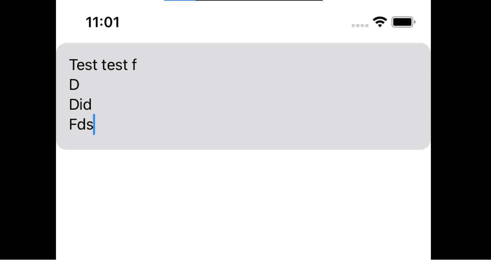
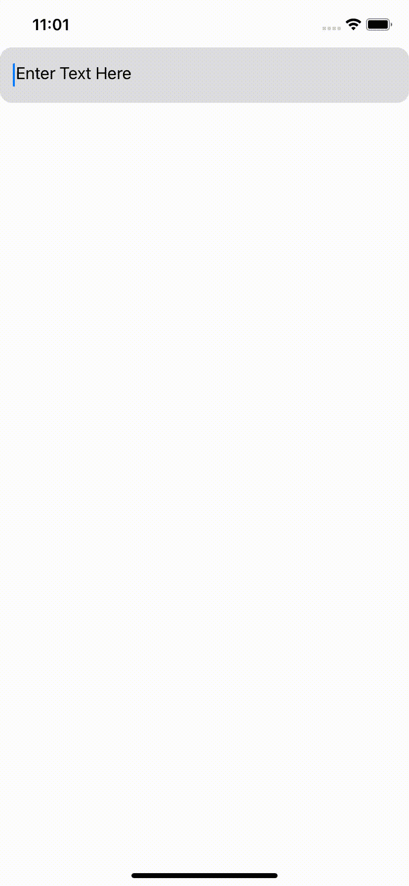

# 在 SwiftUI 中创建一个带有占位符的自动扩展 TextEditor

> 原文：<https://medium.com/nerd-for-tech/create-an-automatically-expanding-texteditor-with-a-placeholder-in-swiftui-6f4792c1ba19?source=collection_archive---------1----------------------->

关于这一点，我已经有一段时间没碰过桌子了，网上也有不少关于这方面的漏洞，但这里是我的(相对干净的)方法，在 SwiftUI 中有一个自动扩展的文本编辑器，甚至还有一个占位符！

展开文本编辑器

这里的技巧是在同一个 Z 堆栈中有一个 TextEditor 和一个 text view，Text view 镜像 TextEditor 的所有文本，但是不透明度为 0。这样，当您键入文本时，TextEditor 会根据文本视图自行调整大小。

在 init()语句中，我们还添加了一个属性，这样 TextEditor 的背景就清晰了。这样，我们可以使用 Z 堆栈中的一个对象来改变它的外观——在本例中，是带有 clipShape 的 Color.gray。

我们还添加了一个扩展，这样我们就可以在文本中有一个占位符，每当文本为 nil 时，占位符就会出现在文本视图中，当文本有一个字符串值时，占位符就会消失。

就是这样！下面是完整的代码:

感谢阅读！请在 twitter 上关注我，地址是@SaladZombie

 [## 萨拉宗比

### 跟我来。twitter.com](https://twitter.com/saladzombie)