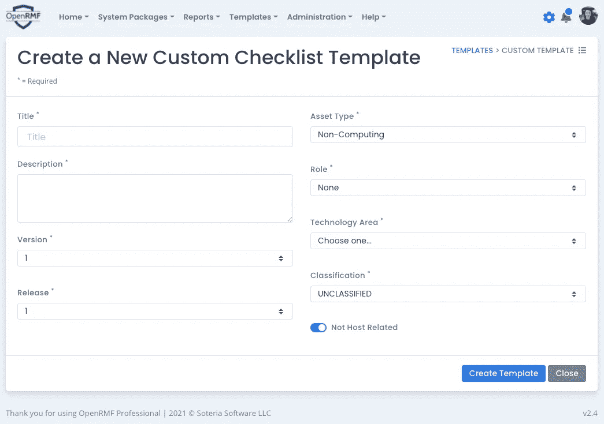
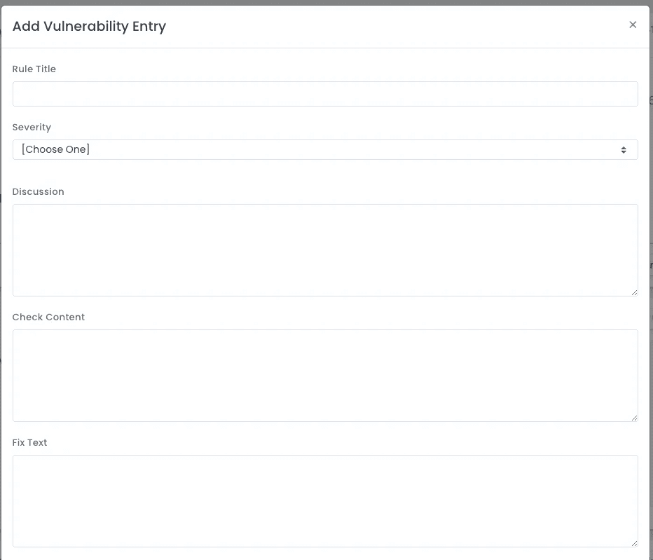
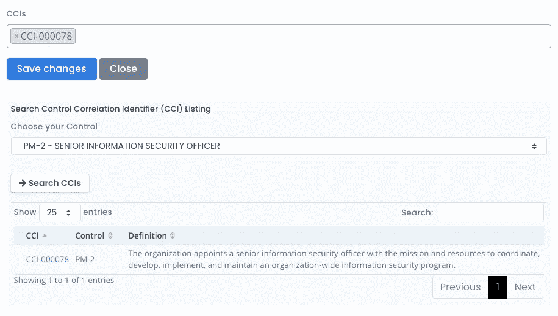

# 在 OpenRMF Professional 2.4 中创建自定义清单模板

> 原文：<https://medium.com/nerd-for-tech/create-custom-checklist-templates-in-openrmf-professional-2-4-4d9899ca40a?source=collection_archive---------18----------------------->

您是否曾经需要 DISA 清单来跟踪特定的软件或硬件，但该清单并不存在？有没有想过使用这些相同的清单以一种简单的方式跟踪 RMF 或 FedRAMP 手动流程和/或与 NIST 800.53 控制(PM、IR、AT、PL、PE)相关的程序？现在，您可以在 [OpenRMF Professional v2.4](https://www.soteriasoft.com/products/openrmf-professional.html) 中使用新的自定义清单创建器！

OpenRMF Professional v2.4 中的自定义清单创建器

# 为什么要制作自定义清单模板？

使用自定义核对清单模板创建器为自定义核对清单创建模板有几个原因:

*   制作一份与人工控制相匹配的清单，如项目管理、意识和培训、事故响应等
*   制作一份与云计算服务相匹配的清单，如 S3、AKS、EKS、EBS Volumes、Lambda 和其他没有 DISA 提供的特定清单的在线数据库
*   制作一份调查问卷，询问与 NIST 800.53 控制相匹配的文档、流程和程序方面的具体问题，以实现完全合规
*   制作一份专门针对 CMMC 相关问题的调查问卷并进行跟踪

# 创建自定义核对清单模板

要在 OpenRMF Professional 中创建自定义清单模板，您需要以管理员身份登录。然后选择在模板菜单选项下创建一个。一个易于使用的表单(如上所示)允许您创建顶级信息。单击创建后，您将转到允许您添加漏洞条目的页面。

你可以称之为清单、问卷、调查，随便你怎么称呼。弱点列表可以是弱点。它们可以是要求特定答案的问题，也可以是出于文档目的的项目。他们可以是你想让他们成为的任何人。这就是“习俗”的含义！

# 添加漏洞、问题

要添加自定义漏洞条目或问题，请单击添加漏洞条目按钮。出现如下图所示的屏幕，让您填写信息。这看起来与当前的清单非常相似。这是这一过程的自然延伸。我们只是将它自动化，并帮助进入下一个发展阶段。

在 OpenRMF Professional 2.4 中创建自定义清单模板漏洞条目

# 将漏洞与 NIST 控制相匹配

要将此漏洞链接到一个 CCI，它会为您提供相应 NIST 800.53 控制的链接，您可以搜索控制并选择相应的 CCI。完成后，单击保存。

就是这样！简单明了。K.I.S.S .现在在点击 OpenRMF Professional 中的“生成合规性”按钮时，使用它来帮助捕获更多信息(甚至是 [OpenRMF OSS](https://www.openrmf.io/) )。

通过 CCIs 将自定义清单模板漏洞与 NIST 控制相匹配

添加和编辑漏洞时，您会看到漏洞列表出现在表格中。在这里，您可以编辑字段数据，也可以像在其他模板上一样编辑普通数据，如状态、注释和详细信息。

您也可以选择在填写详细信息和评论后锁定该漏洞，该条目将被默认锁定。根据该模板创建的任何清单也将自动填写并锁定清单上的漏洞。在 [OpenRMF Professional 2.4](https://www.soteriasoft.com/products/openrmf-professional.html) 中也引入了漏洞锁定。

# 版本控制清单模板

如果您要对自定义模板进行重大更改或添加/删除漏洞，您应该更新清单的发布和/或版本。您可以通过单击自定义模板主页上的“更新详细信息”按钮来完成此操作。在这里，您可以选择清单的下一个版本。

与 OpenRMF Professional 的其他区域一样，旧的模板信息被保存并通过历史按钮可用。

这让您可以像 DISA 一样对模板进行版本控制并发布更新。从这个模板派生的任何模板(组织或系统包特定的模板)将显示“可用升级”，就像 OpenRMF Professional 中的检查表一样。

# 制作清单、样板模板等等

如果您在列表中选择了一个或多个模板，您可以将它们全部下载到本地的一个 ZIP 文件中。您选择的所有 CKL 文件都将在该 ZIP 文件中。如果您想要共享 CKL 文件或将其添加到 OpenRMF Professional 的其他安装中，请使用此选项。

您的自定义模板也可以复制到其他组织的其他模板甚至系统包模板中。系统包模板要求您在该系统中拥有“创建模板”组权限，否则您将看不到复制到系统模板的选项。一旦被复制，它们就是独立的，可以被更新和编辑。您可能希望这样做来定制模板，并根据您的特定组织需求或系统包要求对其进行定制。

您也可以使用自定义模板在系统包中创建清单。并对其进行编辑、版本控制、报告、升级，并用于法规遵从性生成。您需要更新任何信息，如主机名、FQDN、角色等。查看系统列表中的清单。

# OpenRMF 专业人士来拯救

OpenRMF Professional 自动化了大部分 RMF 和 FedRAMP 流程，有助于将 ATO 或批准时间减少 40–50%。OpenRMF 的协作环境消除了在调整 NIST 控制和子控制、清单、补丁扫描、POA & Ms 和合规生成中涉及的大量人工劳动和孤立工作，然后在一个安全的中央数据库结构中管理所有信息。这允许自动生成和更新 POA & M、测试计划概要以及各种其他安全和 RMF 或 FedRAMP 报告。

为所有网络安全合规性数据建立一个基于网络的中央存储库，为每个系统包提供基于角色的安全保护，使用单一的事实来源简化 RMF 和 FedRAMP 流程，并消除错误、大量手动个人跟踪和返工。它还为领导层提供了对所有系统包安全和风险信息状态的直接洞察，从而消除了实施 RMF 和 FedRAMP 流程的神秘感。

一旦达到 ATO 或批准级别，OpenRMF 将持续监控和跟踪 POA&M 项目、系统和应用的整体风险，并在系统包的整个生命周期内跟踪更新的扫描和清单。

看看这里的。求一个 [30 天无义务评估](https://www.soteriasoft.com/contact.html#contactform)自己试试吧！