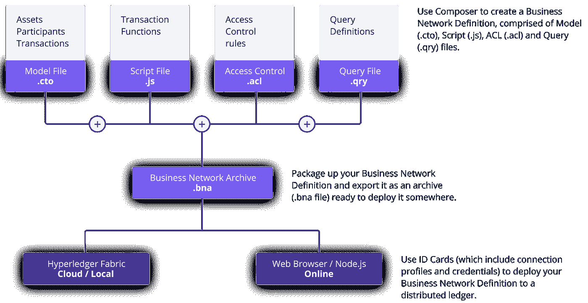
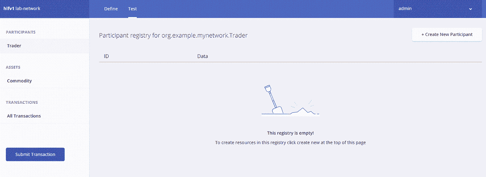

# 在 Google Cloud 上部署带有 Hyperledger Fabric 的私有区块链🚀

> 原文：<https://medium.com/nerd-for-tech/create-deploy-a-business-network-on-blockchain-using-hyperledger-on-gcp-95d582b53c7d?source=collection_archive---------1----------------------->

创建和启动安全🛡️区块链网络的分步指南


图片来源: [Launchpresso](https://unsplash.com/@launchpresso)

Hyperledger Fabric 是一个许可的区块链平台，用于构建和部署分散的应用程序和解决方案。使用 Hyperledger Composer 这一开发工具集和框架，构建区块链应用程序变得更加容易。在本教程中，您将学习如何使用 Hyperledger Fabric 和 Composer 在 Google 云平台上创建和部署私有区块链。从从 Google Cloud Marketplace 启动解决方案到访问 Hyperledger Composer Playground，您将被引导完成建立业务网络、定义资产、参与者和交易以及测试网络的过程。本教程将为希望深入区块链开发世界的开发人员和区块链爱好者提供一个全面的指南。

# 概述

1.  从 Google Cloud Marketplace 启动 Hyperledger Fabric 和 Composer
2.  在虚拟机上启用防火墙访问
3.  部署和访问 Hyperledger Composer 游乐场
4.  创建并连接到新的企业网络
5.  添加模型文件

# 启动 Hyperledger 结构和 Composer

在本节中，您将启动 Google Cloud Marketplace 上提供的 Hyperledger Fabric 和 Composer 解决方案。

1.  打开**谷歌云平台控制台**。
2.  从**导航菜单**中选择**市场**。
3.  搜索 **Hyperledger** 并选择 **Hyperledger Fabric 和 Composer** 。
4.  点击**启动**。
5.  现在，您将看到部署属性设置。
6.  对于**部署名称**，键入`hyperledger-fabric-and-composer`。
7.  选中该框以接受服务条款。
8.  保持其余设置的默认值，并点击**部署**。
9.  一旦部署了解决方案，从**导航菜单**中，选择**计算引擎**。您应该看到一个作为部署的一部分创建的 VM 实例。
10.  点击实例名称，打开**虚拟机实例详细信息**页面。
11.  点击顶部的**编辑**。
12.  向下滚动到**网络标签**并在字段中输入`hyperledger`。这将允许您在已使用网络标记— `hyperledger`进行标记的实例上配置特定的防火墙规则。您将在下一节对此进行配置。
13.  点击**保存**。

# 在虚拟机上启用防火墙访问

要使用 Playground，需要在已经部署的虚拟机上激活端口 8080。为了安全起见，将建立一个防火墙规则，限制对端口 8080 的访问只能来自您的浏览器的 IP 地址。

1.  打开一个新的浏览器选项卡，导航到[http://www.whatismyip.com](http://www.whatismyip.com/)。
2.  复制公共 IPv4 地址。
3.  在控制台中，进入**导航菜单** > **VPC 网络** > **防火墙**。
4.  点击**创建防火墙规则**。
5.  防火墙规则的名称`hyperleger-firewall-rule`并添加可选描述。
6.  在**目标**下，确保选择了**指定目标标签**选项。
7.  对于**目标标签**，输入您在上一节`hyperledger`中创建的**网络标签**名称。
8.  在**源过滤器**下，选择 **IP 范围**。
9.  对于**源 IP 范围**，输入带有掩码/32 的公共 IPv4 地址。例如，如果您的公共 IPv4 地址是 104.132.25.98，请输入 104.132.25.98/32.
10.  在**协议和端口**下，选择**指定协议和端口**选项。

a.勾选 **TCP** 复选框

b.在 **TCP** 框中输入端口号 8080。

*注意:这是 Hyperledger Composer 默认监听的端口号。*

11.点击**创建**。请等待防火墙规则创建完成后再继续。

# 部署和访问 Hyperledger Composer 游乐场

1.  从**导航菜单**中选择**计算引擎**。
2.  点击 Hyperledger 虚拟机的 **SSH** 按钮。
3.  在 SSH 会话中，运行以下命令以 root 用户身份运行:

```
sudo su
```

4.通过运行以下命令部署 Composer Playground:

```
composer-playground
```

> 默认情况下，这将部署 Playground 解决方案并在端口 8080 上运行它。

5.回到控制台，复制 Hyperledger 虚拟机的**外部 IP** 。

6.打开新的浏览器选项卡，导航至`http://<ExternalIP>:8080`访问 Hyperledger Composer Playground。

7.点击**咱们区块链！**按钮开始使用。

# 与操场一起工作

在本节中，您将建立一个业务网络，并概述资产、参与者和交易。然后，您将通过创建参与者和资产，并提交交易以将资产的所有权从一个实体转移到另一个实体来验证网络。

# 使用 Playground 建立业务网络

本节将指导您建立业务网络，并定义其资产、参与者和交易。您还将有机会通过创建参与者和资产，以及提交将资产所有权从一个参与者转移到另一个参与者的交易来测试网络:



商用通信网

对于典型的解决方案架构，请参考此[链接](https://hyperledger.github.io/composer/latest/introduction/solution-architecture.html)。

1.  点击**网页浏览器**标题下的**部署新业务网络**开始。
2.  注意:不要点击标题**连接:hlfv1** 下的**部署新业务网络**。
3.  在基本信息中，命名网络`tutorial-network`并选择性地添加描述。
4.  在模型网络启动器模板中，选择**空业务网络**卡。你将从零开始建立一个商业网络。
5.  保持其余的默认设置并点击**部署**。

你应该会在你的钱包里看到一张新的商业网络卡，名为 **admin** ，用于商业网络`tutorial-network`。钱包可以包含业务网卡，以连接到多个部署的业务网络。

当连接到外部区块链时，业务网卡代表了连接到业务网络所需的一切。它们包括连接详细信息、认证材料和元数据。

6.现在业务网络已经部署完毕，点击`tutorial-network`上的**立即连接**。

# 添加模型文件

你现在在**定义**选项卡上。这是您创建和编辑构成业务网络定义的文件的地方。

由于您选择了一个空的业务网络模板，您需要修改提供的默认模板文件。第一步是更新模型文件。模型文件定义了业务网络中的资产、参与者、交易和事件。

1.  点击**模型文件**查看。
2.  删除模型文件中的现有代码行，并替换为:

```
/**
 * My commodity trading network
 */
namespace org.example.mynetwork
asset Commodity identified by tradingSymbol {
    o String tradingSymbol
    o String description
    o String mainExchange
    o Double quantity
    --> Trader owner
}
participant Trader identified by tradeId {
    o String tradeId
    o String firstName
    o String lastName
}
transaction Trade {
    --> Commodity commodity
    --> Trader newOwner
}
```

该域模型定义了单个资产类型`Commodity`和单个参与者类型`Trader`以及单个交易类型`Trade`，用于修改商品的所有者。

# 添加事务处理器脚本文件

现在，您可以为业务网络定义事务逻辑。Composer 使用 JavaScript 函数表达业务网络的逻辑。当提交交易进行处理时，这些功能会自动执行。

1.  在左下角，点击**添加文件**链接。
2.  点击**脚本文件**单选按钮，然后**添加**。
3.  删除脚本文件中的代码行，并替换为以下代码:

```
/**
 * Track the trade of a commodity from one trader to another
 * @param {org.example.mynetwork.Trade} trade - the trade to be processed
 * @transaction
 */
async function tradeCommodity(trade) {
    trade.commodity.owner = trade.newOwner;
    let assetRegistry = await getAssetRegistry('org.example.mynetwork.Commodity');
    await assetRegistry.update(trade.commodity);
}
```

这个函数根据一个进来的贸易交易的`newOwner`属性改变商品的`owner`属性。然后，它将修改后的`Commodity`持久化回资产注册，用于存储商品实例。

# 部署更新的业务网络

现在您已经有了模型、脚本和访问控制文件，您可以部署和测试您的业务网络了。

点击**部署变更**升级业务网络。

# 测试业务网络定义

接下来，通过创建一些参与者(在本例中是交易者)，创建一项资产(一种商品)，然后使用您的交易事务来更改商品的所有权，来测试您的业务网络。

点击**测试**选项卡开始测试。

# 创建参与者

1.  确保您选择了左侧的**交易者**标签，并点击右上角的**创建新参与者**。



1.  你能看到的是一个交易者参与者的数据结构。我们需要一些容易识别的数据，所以删除那里的代码，然后粘贴下面的代码:

```
{
  "$class": "org.example.mynetwork.Trader",
  "tradeId": "TRADER1",
  "firstName": "Jenny",
  "lastName": "Jones"
}
```

1.  点击**新建**创建参与者。
2.  您应该可以看到您创建的新交易者参与者。您将需要另一个交易者来测试您的交易，所以创建另一个交易者，但是这一次，使用以下数据:

```
{
  "$class": "org.example.mynetwork.Trader",
  "tradeId": "TRADER2",
  "firstName": "Amy",
  "lastName": "Williams"
}
```

在继续之前，确保两个参与者都存在于交易者视图中。

# 创建资产

建立了两个交易者后，你需要一个商品供他们交易。创建资产的过程类似于创建参与者。您正在创建的商品将具有一个`owner`属性，该属性将指定它属于具有 TRADER1 的`tradeId`的交易商。

1.  点击资产下的**商品**，点击**创建新资产**。
2.  删除资产数据，并替换为以下内容:

```
{
  "$class": "org.example.mynetwork.Commodity",
  "tradingSymbol": "ABC",
  "description": "Test commodity",
  "mainExchange": "Euronext",
  "quantity": 72.297,
  "owner": "resource:org.example.mynetwork.Trader#TRADER1"
}
```

创建该资产后，您应该能够在商品页面上看到它。

# 在参与者之间转移商品

有两个交易者和一个商品在他们之间交易，你可以测试你的交易。交易是 Hyperledger Composer 业务网络中所有变更的基础。

1.  点击左下方的**提交交易**按钮。
2.  确保交易类型为“交易”。
3.  用以下内容替换交易数据，或者只更改详细信息:

```
{
  "$class": "org.example.mynetwork.Trade",
  "commodity": "resource:org.example.mynetwork.Commodity#ABC",
  "newOwner": "resource:org.example.mynetwork.Trader#TRADER2"
}
```

4.点击**提交**。

5.通过展开资产的数据部分，检查资产的所有权是否已从 TRADER1 更改为 TRADER2。您应该看到所有者被列为:`org.example.mynetwork.Trader#TRADER2`。

点击左侧的**所有交易**查看业务网络的全部交易历史。

您将获得提交的每笔交易的列表。您可以看到，使用 UI 执行的某些操作，如创建交易者参与者和商品资产，被记录为事务，即使它们在业务网络模型中没有被定义为事务。这些事务被称为**系统事务**，在所有业务网络中通用，并在 Hyperledger Composer 运行时中定义。

在本实验中，您从头开始创建了一个业务网络，并在其中定义了一个模型文件。或者，您可以部署 Hyperledger 提供的[示例网络](https://github.com/hyperledger/composer-sample-networks/tree/master/packages)中的一个。

# 与现有应用程序集成

Hyperledger Composer 可以使用回送 API 与现有系统集成。这允许您从当前的业务系统中引入数据，并将其转化为 Composer 业务网络中的资产或参与者。更多详情请参考此[链接](https://hyperledger.github.io/composer/latest/integrating/integrating-index)。

# 🎉干得好！

您已经使用 Hyperledger Composer Playground 成功创建、部署和测试了一个业务网络。