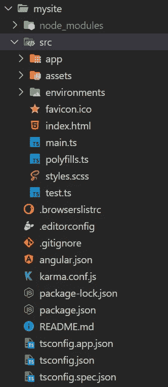
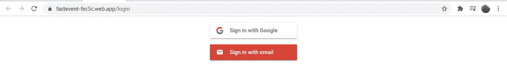
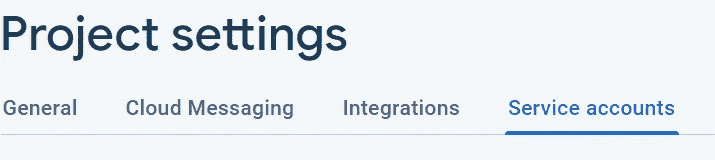
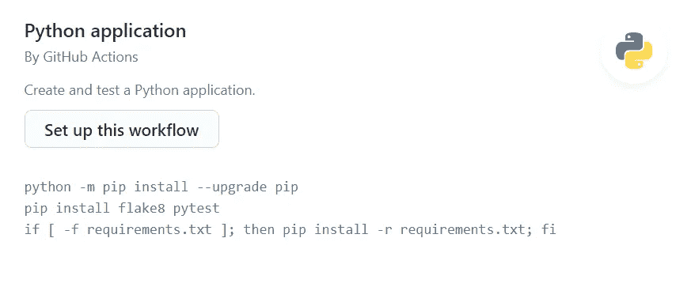
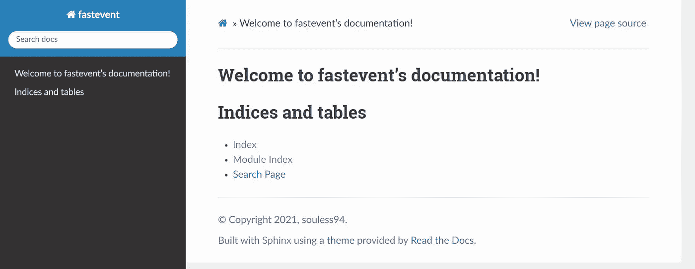
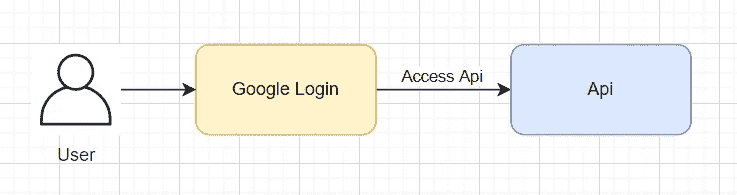

# 用谷歌登录创建 FastApi-Angular 网站

> 原文：<https://medium.com/nerd-for-tech/create-fastapi-angular-website-with-google-login-796e4f9da60f?source=collection_archive---------5----------------------->


你可能使用谷歌登录来轻松访问网站，而不需要记住密码。我至少有:)

我在想，谷歌登录可能很难实现。也许在过去。但是现在有了 https://firebase.google.com/基地。假设事情发生了变化。

> 演示站点 url(可能不工作)

https://fastevent-fec5c.web.app/login

**本文结束时，你将能够:**

*   创建一个简单的 angular 应用程序供用户登录。
*   创建一个简单的 FastApi 将您的应用程序连接到 angular，这样您就可以实现定制的业务逻辑
*   使用谷歌认证保护你的 API。
*   利用自动化的力量

您可以单击下面的链接来获取该应用程序的代码。

[1][https://github.com/kaiwork/fastevent-site](https://github.com/kaiwork/fastevent-site)(角度应用)

[2][https://github.com/kaiwork/fastevent-server](https://github.com/kaiwork/fastevent-server)(快速 Api 服务器)

> **请注意，这只是出于教育目的。并用作*参考*。**
> 
> **我会假设你会有一些基本的**
> 
> **【1】Angular、【2】Fast API、【3】Heroku 和【4】Github 知识在尝试这个之前。**

[1][https://angular.io/](https://angular.io/)(Angular 网站)

https://fastapi.tiangolo.com/(快速 Api)

[https://www.heroku.com](https://www.heroku.com/)(Heroku)

[https://github.com/](https://github.com/)(Github)

# 我们为什么要用谷歌登录？

[1]我们不需要存储密码

[2]用户不需要记住密码

[3]谷歌将管理登录的安全方面。

# 步骤 1:创建 angular 网站。

[1]转到[https://angular.io/](https://angular.io/)并遵循入门指南

[2]创建你的网站… ng new <app name="">你应该会看到这样的东西。</app>



[3]我找到了一个有用的库[https://github.com/RaphaelJenni/firebaseui-angular](https://github.com/RaphaelJenni/firebaseui-angular)。你可以按照说明来安装它。

在 environment.ts 中添加 firebase 配置。要获得 firebase 配置，请转到项目设置


去创建一个 web 应用程序，你应该得到 firebase 配置。它应该看起来像这样

```
firebaseConfig: { 
 apiKey: “<your web api key>”, 
 authDomain: “{projectId}.firebaseapp.com”, 
 projectId: “{projectId}”,
 storageBucket: “{projectId}.appspot.com”,
 messagingSenderId: “000000000000”, 
 appId: “some id” 
}
```

[4]遵循[fire basei-angular](https://github.com/RaphaelJenni/firebaseui-angular)的文件。去你的<组件>。html 并在下面添加。

```
<firebase-ui(signInSuccessWithAuthResult)="successCallback($event)"(signInFailure)="errorCallback($event)"></firebase-ui>
```

[5]你应该看看这个



[6]您可以实现您的登录函数来获取我们将用于快速 API 认证的令牌。我使用本地存储来存储令牌，但是您可以使用另一种存储。

```
successCallback(signInSuccessData: FirebaseUISignInSuccessWithAuthResult) {signInSuccessData.authResult.user?.getIdToken().then(function(idToken){localStorage.setItem(“auth_token”,idToken);});this.router.navigate([‘main’]); // optionalthis.toastr.success(“Sign in successful”); // optional}
```

[7]就这样，我们完成了 web 应用程序。

# 步骤 2:创建快速 API 网站。

[1]前往 https://fastapi.tiangolo.com/并遵循入门指南

[2]我找到了一个有用的库【https://github.com/tokusumi/fastapi-cloudauth 。你可以按照说明来安装它。

写到这个时候，出现了一个 bug。只需执行以下命令来解决这个问题

```
pip install 'python-jose[cryptography]' - (1)
pip install python-jose[cryptography] #if (1) doesn't work
```

[3]要设置有几件事要做。

您将需要来自 firebase(另一个)的凭证文件。进入 firebase 控制台中的**项目设置**，选择**服务账户**。转到 **Firebase Admin SDK** 和**生成新的私钥**



您应该会看到类似这样的内容。

```
{
 “type”: “service_account”,
 “project_id”: “<project id>”,
 “private_key_id”: “<your key id>”,
 “private_key”: “ <your private key>”,
 “client_email”: “your firebase sdk email”,
 “client_id”: “<your client id> ”,
 “auth_uri”: “some url",
 “token_uri”: “some url",
 “auth_provider_x509_cert_url”: “some url",
 “client_x509_cert_url”: “some url"
}
```

[4]您可以按照指南进行设置。为**GOOGLE _ APPLICATION _ CREDENTIALS**设置 os 环境变量，可以参考[https://firebase.google.com/docs/admin/setup](https://firebase.google.com/docs/admin/setup)

```
os.environ[‘GOOGLE_APPLICATION_CREDENTIALS’] = your cred fileapp = FastAPI()get_current_user = FirebaseCurrentUser(project_id=”<your project id>”)@app.get(“/user/”)def get_user(current_user: FirebaseClaims = Depends(get_current_user)):“””An api to get current user data.Args:Valid ID TokenReturns:A json response containing the user id of the current user“””# ID token is valid and getting user info from ID tokenreturn {“id”: current_user.user_id}
```

[5]就是这样。我们将继续部署。

# 第三步:托管 Angular 网站。

[1]为此，我通过 firebase 托管来托管网站。

[2]你可以按照 firebase 的步骤来托管你的网站

# 步骤 4:托管 Fast API 网站。

[1]为此，我在 Heroku 上托管了 Fast Api 网站。

[2]您可以按照 Heroku 中的步骤部署 python 应用程序。

[3]以下是供参考的 Procfile

```
web: gunicorn -w 4 -k uvicorn.workers.UvicornWorker main:app
```

# 奖励:使用 Github 的 CI

[1]对于 Fast API 网站。我利用了 python 应用程序工作流程。

你可以将它与 https://snyk.io/的[、](https://snyk.io/)[https://www.codacy.com/的](https://www.codacy.com/)联系起来，这样工作流程会更好:)



[1]为 Angular 网站。我只是使用了默认的 firebase 工作流。

```
firebase init
```

一定要注意在 angular.json 中设置目录

```
“architect”: {“build”: {“builder”: “@angular-devkit/build-angular:browser”,“options”: {“outputPath”: “public/”, # here need to edit to the directory “index”: “src/index.html”,“main”: “src/main.ts”,“polyfills”: “src/polyfills.ts”,“tsConfig”: “tsconfig.app.json”,“inlineStyleLanguage”: “scss”,“assets”: [“src/favicon.ico”,“src/assets”],
```

# 额外收获:自动化文档

对于这个项目，我使用 sphinx 来自动生成 API 的文档。我使用了 *sphinx-rtd-theme* 作为文档。在 https://kaiwork.github.io/fastevent-server 的[使用 GitHub 页面托管文档。](https://kaiwork.github.io/fastevent-server)

```
pip install sphinx-rtd-theme
mkdir sphinx-docs
cd sphinx-docs
sphinx-quickstart
sphinx-apidoc -o source source/files # your source code
make html
echo "" > build/html/[.nojekyll](https://github.com/kaiwork/fastevent-server/blob/main/docs/.nojekyll) # create empty nojekyll file to load css for gh pages
```

之后，我将输出文件夹中的文件复制到 docs 文件夹，并为其设置 GitHub 页面。



# 继续前进

这只是一个示例，只是如何使用谷歌登录您的网络应用程序的开始。如果我们想转移到现实生活中的生产 web 应用程序，还有很多事情要做。

# **图**

这是一个设置如何工作的图表



# 谢谢

这个谷歌登录网站使用了一些有用的库。

[1][https://github.com/tokusumi/fastapi-cloudauth](https://github.com/tokusumi/fastapi-cloudauth)

[https://github.com/RaphaelJenni/firebaseui-angular](https://github.com/RaphaelJenni/firebaseui-angular)